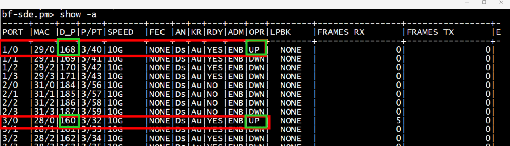
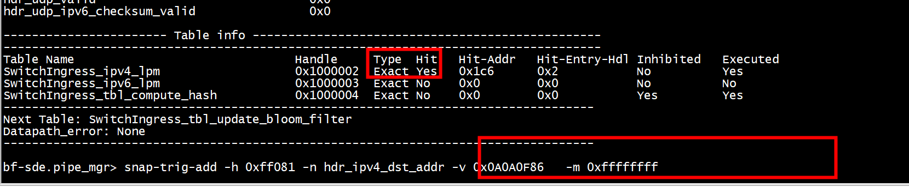
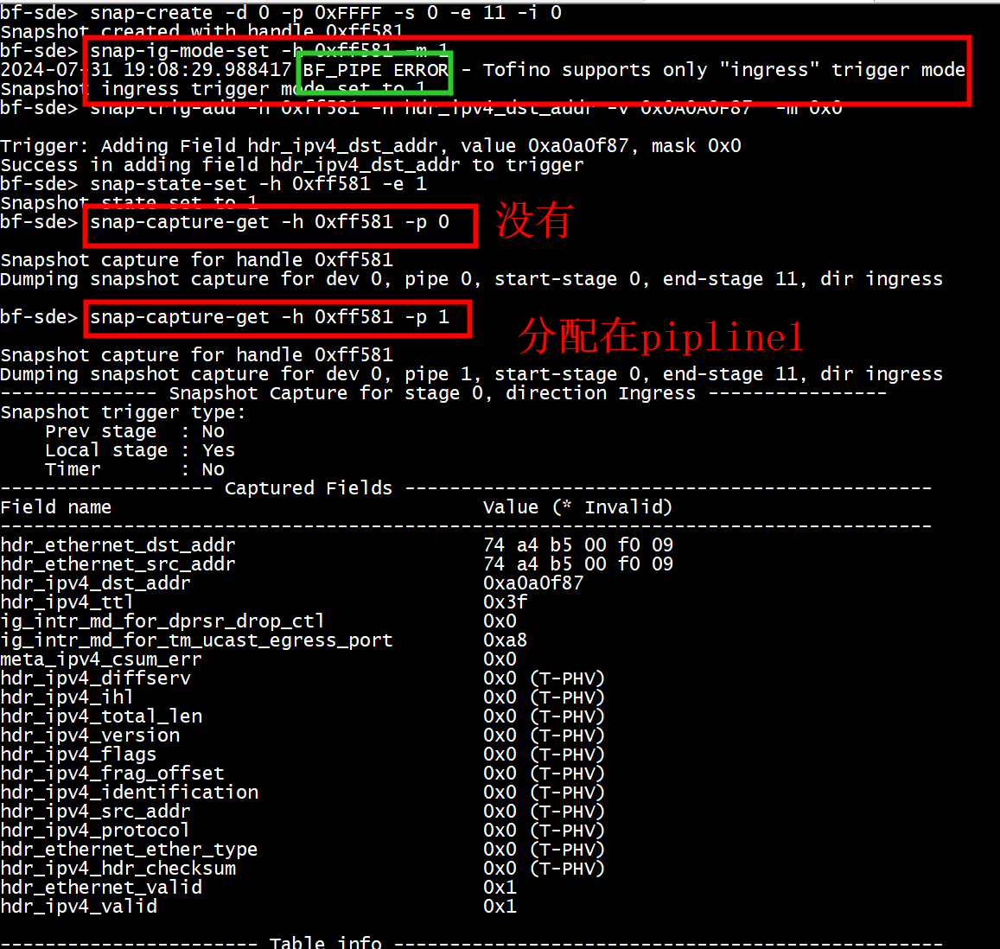
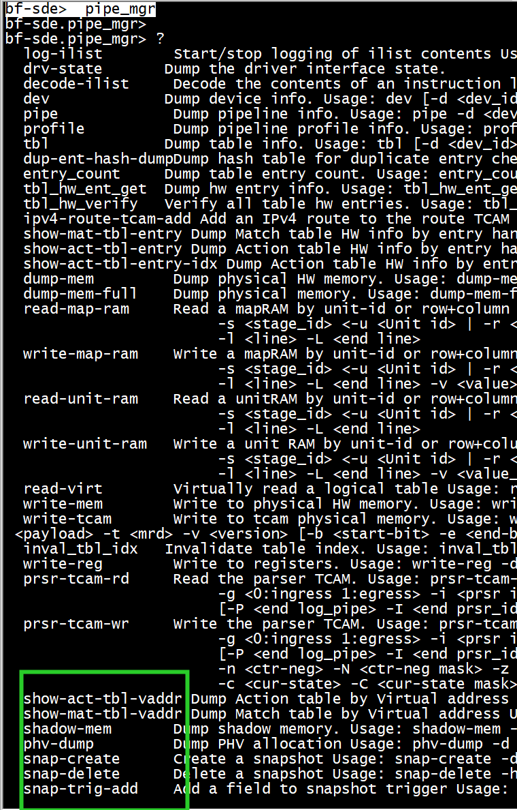
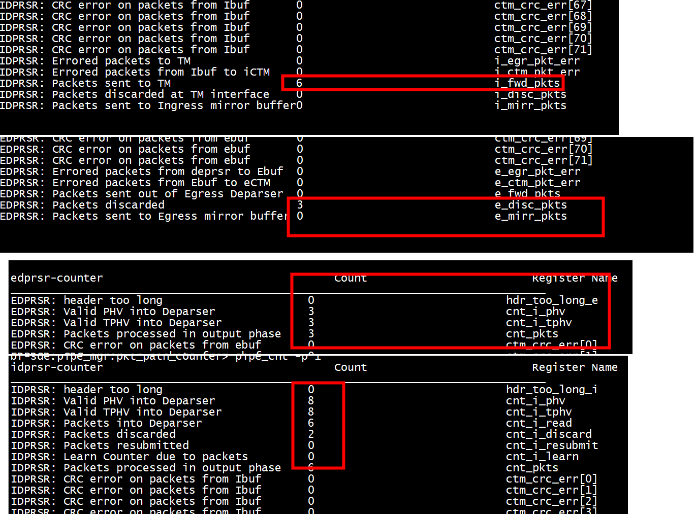
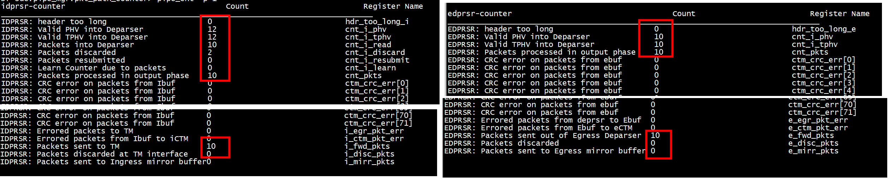

# 交换机配置

```
bf-sde.pm> port-add -/-  10G NONE
bf-sde.pm> show -a   
bf-sde.pm> an-set -/- 2
bf-sde.pm> port-enb -/-
```

   

# 流表配置   

```
./run_switchd.sh  -p simple_l3
```


```
from ipaddress import ip_address
bfrt.simple_l3.pipe.Ingress.ipv4_lpm> add_with_l3_switch(ip_address('10.10.15.134'), 32, port=160, new_mac_da=0x74a4b500eee5)

bfrt.simple_l3.pipe.Ingress.ipv4_lpm> add_with_l3_switch(ip_address('10.10.15.135'), 32, port=168, new_mac_da=0x74a4b500f009)

bfrt.simple_l3.pipe.Ingress.ipv4_lpm> dump
------------------------------------> dump()
----- ipv4_lpm Dump Start -----
Default Entry:
Entry data (action : Ingress.drop):

Entry 0:
Entry key:
    hdr.ipv4.dst_addr              : ('0x0A0A0F86', '0x00000020')
Entry data (action : Ingress.l3_switch):
    port                           : 0xA0
    new_mac_da                     : 0x74A4B500EEE5

Entry 1:
Entry key:
    hdr.ipv4.dst_addr              : ('0x0A0A0F87', '0x00000020')
Entry data (action : Ingress.l3_switch):
    port                           : 0xA8
    new_mac_da                     : 0x74A4B500F009

----- ipv4_lpm Dump End -----


bfrt.simple_l3.pipe.Ingress.ipv4_lpm> 
```

# ping

```
root@134node:~# ping 10.10.15.135
PING 10.10.15.135 (10.10.15.135) 56(84) bytes of data.
64 bytes from 10.10.15.135: icmp_seq=1 ttl=63 time=0.200 ms
64 bytes from 10.10.15.135: icmp_seq=2 ttl=63 time=0.220 ms
64 bytes from 10.10.15.135: icmp_seq=3 ttl=63 time=0.198 ms
^C
--- 10.10.15.135 ping statistics ---
3 packets transmitted, 3 received, 0% packet loss, time 2037ms
rtt min/avg/max/mdev = 0.198/0.206/0.220/0.009 ms
root@134node:~#
```

# snapshot

```
bfrt.simple_l3.pipe.snapshot> 
```

```Text

能够在交换机控制面装多个”钩子“，并且打印符合”钩子“要求的第一个数据包经 过的时候的stage信息；  
进入ucli    
创建快照并获取它的句柄。在这种情况下。我们创造
   设备 0 ( -d 0 )、管道 0 ( -p 0 ) 上的快照，阶段 0 到 5 ( -s 0 -e 5 )，在入口管道中（将其设置为
   -i 0 用于入口，或至 -i 1 用于出口）：
   
snap-create -d 0 -p 0xFFFF -s 0 -e 11 -i 0
-s 0 -e 11表示从第0个stage到第11个stage的信息
snap-ig-mode-set -h 0xff581 -m 1
这里的0xff581来自于第一条的输出；相当于一个handler
snap-trig-add -h 0xff581 -n hdr_ipv4_dstAddr -v 0 -m 0
这是用于匹配的规则；这里表示监视hdr_ipv4_dstAddr这个信息，-v表示 值,-m表示掩码；值掩码符合要求的时候发生命中
这种规则可以有多条
snap-state-set -h 0xff581 -e 1
表示启用0xff581这个监视器
snap-capture-get -h 0xff581 -p 0
打印信息；这个时候直接打印是啥都没有的；只有符合条件的第一个包经 过交换机才能抓到东西（可以打印每一个stage的匹配情况）
```

```
snap-create -d 0 -p 0 -s 0 -e 11 -i 0      
snap-trig-add -h 0x581 -n hdr_ipv4_valid -v 0x1 -m 0x1   
snap-state-set -h 0x581 -e 1 
snap-capture-get -h 0x581 
pipe_mgr snap-delete -h 0x581 
```

## ingress    
```
Usage: -d <dev_id> -p <pipe_id: all-pipes=0xFFFF> -s <start_stage> -e <end_stage> -i <direction 0:ingress 1:egress>
```
+ 方法一  进入pipe_mgr  
```

bfshell> ucli 
Cannot read termcap database;
using dumb terminal settings.
bf-sde> pip
bf-sde> pipe_mgr
bf-sde.pipe_mgr> 
bf-sde.pipe_mgr> snap-create -d 0 -p 0xFFFF -s 0 -e 11 -i 0
Snapshot created with handle 0xff581 
bf-sde.pipe_mgr> snap-ig-mode-set -h 0xff581 -m 1
Snapshot ingress trigger mode set to 1 

bf-sde.pipe_mgr>  snap-trig-add -h 0xff581 -n hdr_ethernet_ether_type -v 0x800   -m 0xffff 

Trigger: Adding Field hdr_ethernet_ether_type, value 0x800, mask 0xffff
Success in adding field hdr_ethernet_ether_type to trigger 
bf-sde.pipe_mgr> snap-state-set -h 0xff581 -e 1
Snapshot state set to 1 
bf-sde.pipe_mgr> 
bf-sde.pipe_mgr> snap-capture-get -h 0xff581 -p 0

Snapshot capture for handle 0xff581 
Dumping snapshot capture for dev 0, pipe 0, start-stage 0, end-stage 11, dir ingress 

bf-sde.pipe_mgr> 
```


```
bf-sde.pipe_mgr> snap-trig-clr -h 0xff081    
bf-sde.pipe_mgr>  snap-trig-add -h 0xff081 -n hdr_ipv4_dst_addr -v 0x0A0A0F86   -m 0xffffffff
```
  


```
snap-trig-add -h 0xff581 -n  hdr_tcp_ipv4_checksum_valid -v 0x1   -m 0x1
```

```
bf-sde.pipe_mgr> snap-create -d 0 -p 0xFFFF -s 0 -e 1 -i 0 
Snapshot created with handle 0xff081 
bf-sde.pipe_mgr> snap-ig-mode-set -h 0xff081 -m 1
Snapshot ingress trigger mode set to 1 
bf-sde.pipe_mgr> snap-state-set -h 0xff081 -e 1
Snapshot state set to 1 
bf-sde.pipe_mgr> snap-capture-get -h 0xff081 -p 1  -s 0 
```

```
snap-trig-add -h 0xff081 -n hdr_ipv6_dst_addr -v 0x20080000000000000000000000000005  -m 0x0
```


+ 方法二  进入ucli   
```
bf-sde> snap-create -d 0 -p 0xFFFF -s 0 -e 11 -i 0
Snapshot created with handle 0xff581 
bf-sde> snap-ig-mode-set -h 0xff581 -m 1
2024-07-31 19:08:29.988417 BF_PIPE ERROR - Tofino supports only "ingress" trigger mode
Snapshot ingress trigger mode set to 1 
bf-sde> snap-trig-add -h 0xff581 -n hdr_ipv4_dst_addr -v 0x0A0A0F87  -m 0xFFFFFFFF

Trigger: Adding Field hdr_ipv4_dst_addr, value 0xa0a0f87, mask 0xFFFFFFFF
Success in adding field hdr_ipv4_dst_addr to trigger 
bf-sde> snap-state-set -h 0xff581 -e 1
Snapshot state set to 1 
bf-sde> snap-capture-get -h 0xff581 -p 0
```

  
```
bf-sde> snap-capture-get -h 0xff581 -p 2
2024-07-31 19:13:10.697975 BF_PIPE ERROR - Invalid pipe 2 


bf-sde> snap-capture-get -h 0xff581 -p 3
2024-07-31 19:13:13.214858 BF_PIPE ERROR - Invalid pipe 3 


bf-sde> 
```

某个stage     

```
bf-sde>  snap-capture-get -h 0xff583 -p 1 -s 1
```


删除   
```
bf-sde> snap-delete -h 0xff581
Snapshot with handle 0xff581 successfuly deleted 
bf-sde> 
```


```
bf-sde> snap-capture-get -h 0xff581 -p 2          
2024-07-31 19:05:48.779468 BF_PIPE ERROR - Handle 0xff581 does not exist 


bf-sde> snap-capture-get -h 0xff581 -p 1
2024-07-31 19:05:51.903673 BF_PIPE ERROR - Handle 0xff581 does not exist 


bf-sde> snap-capture-get -h 0xff581 -p 0
2024-07-31 19:05:54.087038 BF_PIPE ERROR - Handle 0xff581 does not exist 


bf-sde> snap-capture-get -h 0xff581 -p 3
2024-07-31 19:05:56.064508 BF_PIPE ERROR - Handle 0xff581 does not exist 


bf-sde> 
```

+  only stage1   
```
bf-sde.pipe_mgr> snap-capture-get -h 0xff581 -p 1 -s 1

Snapshot capture for handle 0xff581 
Dumping snapshot capture for dev 0, pipe 1, start-stage 0, end-stage 11, dir ingress 
-------------- Snapshot Capture for stage 1, direction Ingress ----------------
```

+ 以太网匹配    

```

bf-sde> snap-trig-add -h 0xff581 -n hdr_ethernet_ether_type -v 0x86DD   -m 0xffff
```

+ trigger删除   

```
snap-trig-del -h 0xff581 -n hdr_ipv4_dst_addr -v 0x0A0A0F87  -m 0x0
```

+ ipv6   

```
snap-trig-add -h 0xff581 -n hdr_ipv6_dst_addr -v 0x20080000000000000000000000000005  -m 0x0
```


+ traffic_mgr   

```
bf-sde.pipe_mgr.pkt_path_counter> ..
bf-sde.pipe_mgr> ..
```

```
bf-sde.traffic_mgr.clr_counter> ..
bf-sde.traffic_mgr> 

bf-sde.pipe_mgr> pkt_path_counter 
bf-sde.pipe_mgr.pkt_path_counter> ?
```

```
eprsr  -d 0  -p 1 -m 168
```


## egress  

```
bf-sde> snap-create -d 0 -p 0xFFFF -s 0 -e 11 -i 1
Snapshot created with handle 0xff583 
bf-sde> snap-ig-mode-set -h 0xff583 -m 1
2024-08-02 14:39:58.188764 BF_PIPE ERROR - Tofino supports only "ingress" trigger mode
Snapshot ingress trigger mode set to 1 
```

```
bf-sde> snap-trig-add -h 0xff583 -n hdr_ethernet_ether_type -v 0x800   -m 0xffff

2024-08-02 14:41:19.510515 BF_PIPE ERROR - Field name hdr_ethernet_ether_type does not exist or not all trigger fields exist in a stage 

Trigger: Adding Field hdr_ethernet_ether_type, value 0x800, mask 0xffff
Failed to add field hdr_ethernet_ether_type to trigger
```

```
bf-sde.pipe_mgr> snap-ig-mode-set -h 0xff583 -m 1
2024-08-02 17:14:52.540391 BF_PIPE ERROR - Tofino supports only "ingress" trigger mode
Snapshot ingress trigger mode set to 1 
bf-sde.pipe_mgr> snap-state-set -h 0xff583 -e 1  
Snapshot state set to 1 
bf-sde.pipe_mgr> snap-capture-get -h 0xff583 -p 1 -s 2     

Snapshot capture for handle 0xff583 
Dumping snapshot capture for dev 0, pipe 1, start-stage 0, end-stage 11, dir egress 

bf-sde.pipe_mgr> snap-capture-get -h 0xff583 -p 1 -s 2

Snapshot capture for handle 0xff583 
Dumping snapshot capture for dev 0, pipe 1, start-stage 0, end-stage 11, dir egress 
-------------- Snapshot Capture for stage 2, direction Egress ----------------
Snapshot trigger type: 
    Prev stage  : Yes 
    Local stage : No 
    Timer       : No 
```

## pipe_mgr


```
bf-sde>  pipe_mgr
bf-sde.pipe_mgr> snap-hdl-dump  -h 0xff581 -d 0

 --- Dumping snapshot hdls for dev 0 ---  
Num of Handles on dev 0 is 1 
Hdl 0xff581 --> dev 0, pipe 65535, start_stage 0, oper-start-stage 0, end_stage 11, dir ingress 

bf-sde.pipe_mgr> 
```

```
bf-sde> pipe_mgr 

bf-sde.pipe_mgr> tbl -d 0

Match-Action Tables:

-----------------------------------------------------------------------|----------|-----|--------|-----|----|---|---|---|---|----|----
Name                                                                   |Handle    |Type |Entries |Keysz|Stgs|Adt|Sel|Sta|Met|Sful|Prof
-----------------------------------------------------------------------|----------|-----|--------|-----|----|---|---|---|---|----|----
SwitchIngressParser.$PORT_METADATA                                     |0x1000001 |exm  |288     |0    |0   |NA |NA |NA |NA |NA  |0   
SwitchIngress.ipv4_lpm                                                 |0x1000002 |exm  |1024    |0    |1   |dir|NA |NA |NA |NA  |0   
SwitchIngress.ipv6_lpm                                                 |0x1000003 |exm  |1024    |0    |1   |dir|NA |NA |NA |NA  |0   
tbl_tofino_nat64l424                                                   |0x1000004 |term |0       |0    |1   |NA |NA |NA |NA |NA  |0   
tbl_tofino_nat64l415                                                   |0x1000005 |term |0       |0    
```
* 对于精确匹配表 (exm)。采用 exm_tbl_mgr 上下文。   
* 对于三元匹配表 (tcam)。使用 tcam_tbl 上下文。   

tbl_info -d 0 -h 0x1000003    

```

bf-sde.pipe_mgr> exm_tbl_mgr
bf-sde.pipe_mgr.exm_tbl_mgr> tbl_info -d 0 -h 0x1000003
-------------------------------------------------
Exact match table info for table 0x1000003 device 0
-------------------------------------------------
```
entry_info -d 0 -h 0x1000003  -e 0x2    
```
bf-sde.pipe_mgr.exm_tbl_mgr> entry_info -d 0 -h 0x1000003  -e 0x2
Info for entry handle 2 for exact match table 16777219
        Match Spec :
        -----------------
        hdr_ipv6_dst_addr :
                Value: 20  08  00  00  00  00  00  00  00  00  00  00  00  00  00  05  
                Mask:  ff  ff  ff  ff  ff  ff  ff  ff  ff  ff  ff  ff  ff  ff  ff  ff  
```

  

+ pkt_path_counter
```
bf-sde> pkt_path_counter
bf-sde.pipe_mgr.pkt_path_counter>  pipe_cnt -p 1
idprsr-counter                                   Count                         Register Name       
_________________________________________________________________________________
IDPRSR: header too long                      0                             hdr_too_long_i                
IDPRSR: Valid PHV into Deparser              124                           cnt_i_phv                     
IDPRSR: Valid TPHV into Deparser             124                           cnt_i_tphv                    
IDPRSR: Packets into Deparser                55                            cnt_i_read                    
IDPRSR: Packets discarded                    69                            cnt_i_discard                 
IDPRSR: Packets resubmitted                  0                             cnt_i_resubmit                
IDPRSR: Learn Counter due to packets         0                             cnt_i_learn                   
IDPRSR: Packets processed in output phase    55                            cnt_pkts   
```


```
IDPRSR: Errored packets to TM                0                             i_egr_pkt_err                 
IDPRSR: Errored packets from Ibuf to iCTM    0                             i_ctm_pkt_err                 
IDPRSR: Packets sent to TM                   55                            i_fwd_pkts                    
IDPRSR: Packets discarded at TM interface    0                             i_disc_pkts                   
IDPRSR: Packets sent to Ingress mirror buffer0                             i_mirr_pkts
```

```
EDPRSR: Errored packets from deprsr to Ebuf  0                             e_egr_pkt_err                 
EDPRSR: Errored packets from Ebuf to eCTM    0                             e_ctm_pkt_err                 
EDPRSR: Packets sent out of Egress Deparser  0                             e_fwd_pkts                    
EDPRSR: Packets discarded                    10                            e_disc_pkts                   
EDPRSR: Packets sent to Egress mirror buffer 0                             e_mirr_pkts 
```

## 丢包


```
control Ingress(
    /* User */
    inout my_ingress_headers_t                       hdr,
    inout my_ingress_metadata_t                      meta,
    /* Intrinsic */
    in    ingress_intrinsic_metadata_t               ig_intr_md,
    in    ingress_intrinsic_metadata_from_parser_t   ig_prsr_md,
    inout ingress_intrinsic_metadata_for_deparser_t  ig_dprsr_md,
    inout ingress_intrinsic_metadata_for_tm_t        ig_tm_md)
{
    action send(PortId_t port) {
        ig_tm_md.ucast_egress_port = port;
    }

    action drop() {
        ig_dprsr_md.drop_ctl = 1;
    }
}
```


```
bf-sde.pm> show -p 2/3 
-----+----+---+----+-------+----+--+--+---+---+---+--------+----------------+----------------+-
PORT |MAC |D_P|P/PT|SPEED  |FEC |AN|KR|RDY|ADM|OPR|LPBK    |FRAMES RX       |FRAMES TX       |E
-----+----+---+----+-------+----+--+--+---+---+---+--------+----------------+----------------+-
2/3  |31/3|187|3/59|10G    |NONE|Ds|Au|NO |ENB|DWN|  NONE  |               0|               0| 
bf-sde.pm> show -p 2/3 -d
================================================================================
             2/3 : Port Identifier
              NO : is port internal
            31/3 : MAC
             187 : Dev Port
            3/59 : Pipe/Port 
         10G     : Speed
            NONE : FEC
             NO  : Ready for Bring Up
              NO : Autoneg eligibility
   FORCE_DISABLE : AN policy set
             ENB : Admin State
```

  


正常工作   

  
