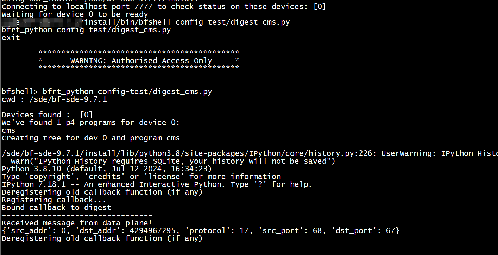
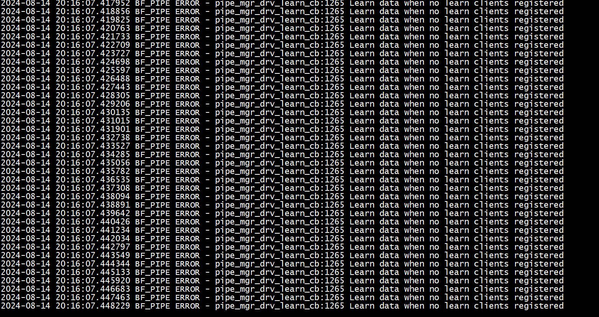

# sketch 评估   
+  关键指标   
sketch的关键指标有3个：准确性(accuracy)、速度(speed)和内存使用(memory usage)    

准确性(accuracy): ARE AAE   

+ 问题  
  + counter 溢出   
  
+ top K问题  
  Count-Min Sketch + Heap    

[Pyramid Sketch a Sketch Framework for Frequency Estimation of Data Streams](https://zhuanlan.zhihu.com/p/640556976)    

[论文阅读笔记-BitSense Universal and Nearly Zero-Error Optimization for Sketch Counters with Compressive](https://blog.csdn.net/m0_54947284/article/details/132946178)   


[Cold Filter: A Meta-Framework for Faster and More Accurate Stream Processing](https://nan01ab.github.io/2019/04/Sketchs.html)  

## Count-Mean-Min Sketch      

Count-Min Sketch算法对于低频的元素，结果不太准确，主要是因为hash冲突比较严重，产生了噪音，例如当m=20时，有1000个数hash到这个20桶，平均每个桶会收到50个数，这50个数的频率重叠在一块了。      

##  BitSense   

[BitSense原型的源代码](https://github.com/N2-Sys/BitSense)   

#  digest    
```
const bit<3> HH_DIGEST = 0x03;
struct hh_digest_t {
    ipv4_addr_t src_addr;
    ipv4_addr_t dst_addr;
    bit<8>  protocol;
    l4_port_t src_port;
    l4_port_t dst_port;
}
control IngressDeparser(packet_out pkt,
    /* User */
    inout my_ingress_headers_t                       hdr,
    in    my_ingress_metadata_t                      meta,
    /* Intrinsic */
    in    ingress_intrinsic_metadata_for_deparser_t  ig_dprsr_md)
{
    Digest <hh_digest_t>() hh_digest;

    apply {
        if(ig_dprsr_md.digest_type == HH_DIGEST) {
            hh_digest.pack({hdr.ipv4.src_addr, hdr.ipv4.dst_addr, hdr.ipv4.protocol, meta.src_port, meta.dst_port});
        }

        pkt.emit(hdr);
    }
}
```


```
def digest_callback(dev_id, pipe_id, direction, parser_id, session, msg):
	global p4, log, Digest
	#smac = p4.Ingress.smac
	log("Received message from data plane!")
	for dig in msg:
		print(dig)
	
	return 0

def bindDigestCallback():
	global digest_callback, log, p4
	
	try:
		p4.SwitchIngressDeparser.debug_digest.callback_deregister()
	except:
		pass
	finally:
		log("Deregistering old callback function (if any)")

	#Register as callback for digests (bind to DMA?)
	log("Registering callback...")
	p4.SwitchIngressDeparser.debug_digest.callback_register(digest_callback)

	log("Bound callback to digest")
```

# cms-debug

./run_bfshell.sh  -b config-test/digest_cms.py -i    


```
./run_bfshell.sh  -b config-test/simple_cms.py 
./run_bfshell.sh  -b config-test/digest_cms.py 
```

```
bfrt.cms.pipe.Ingress.threshold
```


```
2024-08-14 19:17:19.115422 BF_PIPE ERROR - pipe_mgr_lrn_notification_deregister:1685 Learn notify deregister called from a non-learning registered session 3. Learning session 0
2024-08-14 19:17:19.115495 BF_PIPE ERROR - Table update fails "Invalid arguments" (3), session 3 at pipe_mgr_lrn_digest_notification_deregister:8200
bf_rt cli exited normally.

bfshell> 
bfshell> 2024-08-14 19:17:32.809985 BF_BFRT ERROR - bfRtLearnPipeMgrInternalCb:142 Session was destroyed
2024-08-14 19:17:32.810158 BF_PIPE ERROR - pipe_mgr_drv_learn_send_to_client:1054 Error calling the learn client's callback function dev 0 pipe_id 1 lrn_fld_lst_hdl 0x21000000 ret 0x8
2024-08-14 19:17:32.810225 BF_PIPE ERROR - pipe_mgr_drv_learn_cb:1336 Error sending learn messaage to client dev 0, pipe 1 ret 0x8

bfshell> 2024-08-14 19:17:41.294893 BF_BFRT ERROR - bfRtLearnPipeMgrInternalCb:142 Session was destroyed
2024-08-14 19:17:41.295061 BF_PIPE ERROR - pipe_mgr_drv_learn_send_to_client:1054 Error calling the learn client's callback function dev 0 pipe_id 1 lrn_fld_lst_hdl 0x21000000 ret 0x8
2024-08-14 19:17:41.295127 BF_PIPE ERROR - pipe_mgr_drv_learn_cb:1336 Error sending learn messaage to client dev 0, pipe 1 ret 0x8
```



```
bfshell> bfrt_python config-test/digest_cms.py
cwd : /sde/bf-sde-9.7.1

Devices found :  [0]
We've found 1 p4 programs for device 0:
cms
Creating tree for dev 0 and program cms

/sde/bf-sde-9.7.1/install/lib/python3.8/site-packages/IPython/core/history.py:226: UserWarning: IPython History requires SQLite, your history will not be saved
  warn("IPython History requires SQLite, your history will not be saved")
Python 3.8.10 (default, Jul 12 2024, 16:34:23) 
Type 'copyright', 'credits' or 'license' for more information
IPython 7.18.1 -- An enhanced Interactive Python. Type '?' for help.
Deregistering old callback function (if any)
Registering callback...
Bound callback to digest
---------------------------------
Received message from data plane!
{'src_addr': 168431494, 'dst_addr': 168431495, 'protocol': 6, 'src_port': 52520, 'dst_port': 9999}
{'src_addr': 168431494, 'dst_addr': 168431495, 'protocol': 6, 'src_port': 52462, 'dst_port': 9999}
{'src_addr': 168431494, 'dst_addr': 168431495, 'protocol': 6, 'src_port': 52494, 'dst_port': 9999}
{'src_addr': 168431494, 'dst_addr': 168431495, 'protocol': 6, 'src_port': 52474, 'dst_port': 9999}
{'src_addr': 168431494, 'dst_addr': 168431495, 'protocol': 6, 'src_port': 52528, 'dst_port': 9999}
{'src_addr': 168431494, 'dst_addr': 168431495, 'protocol': 6, 'src_port': 52504, 'dst_port': 9999}
{'src_addr': 168431495, 'dst_addr': 168431494, 'protocol': 6, 'src_port': 9999, 'dst_port': 52528}
{'src_addr': 168431495, 'dst_addr': 168431494, 'protocol': 6, 'src_port': 9999, 'dst_port': 52520}
{'src_addr': 168431495, 'dst_addr': 168431494, 'protocol': 6, 'src_port': 9999, 'dst_port': 52494}
{'src_addr': 168431495, 'dst_addr': 168431494, 'protocol': 6, 'src_port': 9999, 'dst_port': 52474}
{'src_addr': 168431495, 'dst_addr': 168431494, 'protocol': 6, 'src_port': 9999, 'dst_port': 52504}
{'src_addr': 168431495, 'dst_addr': 168431494, 'protocol': 6, 'src_port': 9999, 'dst_port': 52506}
{'src_addr': 168431495, 'dst_addr': 168431494, 'protocol': 6, 'src_port': 9999, 'dst_port': 52462}
{'src_addr': 168431494, 'dst_addr': 168431495, 'protocol': 6, 'src_port': 52490, 'dst_port': 9999}
{'src_addr': 168431494, 'dst_addr': 168431495, 'protocol': 6, 'src_port': 52506, 'dst_port': 9999}
{'src_addr': 168431495, 'dst_addr': 168431494, 'protocol': 6, 'src_port': 9999, 'dst_port': 52490}
Deregistering old callback function (if any)
```