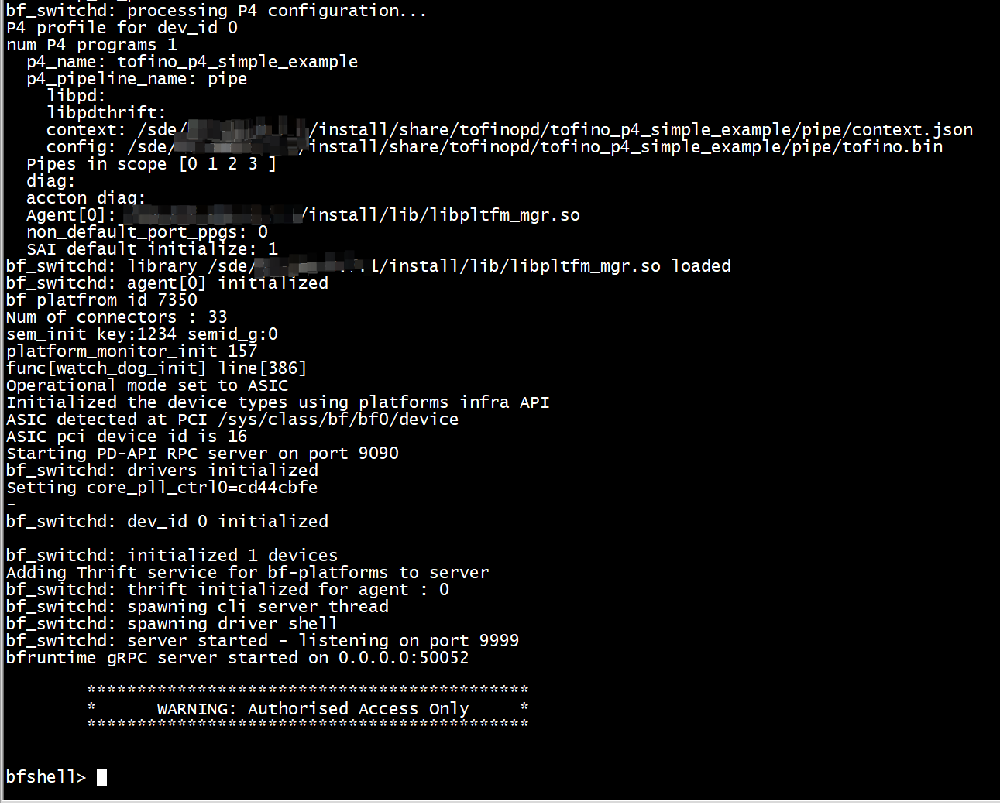

# make（容器内执行）

[参考SwitchML P4 program](https://switchml.readthedocs.io/en/latest/readmes/p4.html)   


```
    cmd="cmake $SDE/p4studio                        \
           -DCMAKE_MODULE_PATH=\"$SDE/cmake\"       \
           -DCMAKE_INSTALL_PREFIX=\"$P4_INSTALL\"   \
           -DP4_PATH=\"$P4_REALPATH\"               \
           -DP4_NAME=\"$P4_NAME\"                   \
           -DP4_LANG=\"${P4_VERSION/_/-}\"          \
           -DP4FLAGS=\"$P4FLAGS\"                   \
           $targets $thrift $pd"
```
 --enable-thrift   --std p4-16 --target tofino --arch tna
 
 + 1 cmake
```

root@localhost:/sde/bf-sde-8.9.1/p4studio# mkdir build-test
root@localhost:/sde/bf-sde-8.9.1/p4studio# cd build-test/
export SDE=/sde/bf-sde-8.9.1
export SDE_INSTALL=$SDE/install
export SOURCE_DIR=$SDE/pkgsrc/p4-examples/p4_16_programs
export PATH=$SDE_INSTALL/bin:$PATH
cmake $SDE/p4studio/ -DCMAKE_INSTALL_PREFIX=$SDE_INSTALL \
                     -DCMAKE_MODULE_PATH=$SDE/cmake \
                     -DP4_NAME=tofino_p4_simple_example \
                     -DP4_PATH=$SOURCE_DIR/tofino_p4_simple_example/prog.p4 
```

```
tofino_p4_simple_example/tofino/manifest.json:178:  "compile_command": "/sde/bf-sde-8.9.1/install/bin/bf-p4c --std p4-16 --target tofino --arch tna --bf-rt-schema tofino_p4_simple_example/tofino/bf-rt.json -o /sde/bf-sde-8.9.1/p4studio/build-test/tofino_p4_simple_example/tofino -g /sde/bf-sde-8.9.1/pkgsrc/p4-examples/p4_16_programs/tofino_p4_simple_example/prog.p4",
```

+ 2 make
```
root@localhost:/sde/bf-sde-8.9.1/p4studio/build-test# make
[  0%] Built target driver
[  0%] Built target bf-p4c
[100%] Generating tofino_p4_simple_example/tofino/bf-rt.json
warning: No size defined for table 'ciL2Fwd_tiWire', setting default size to 512
warning: Parser state min_parse_depth_accept_loop will be unrolled up to 3 times due to @pragma max_loop_depth.
warning: Parser state min_parse_depth_accept_loop will be unrolled up to 3 times due to @pragma max_loop_depth.
warning: egress::hdr.prsr_pad_0[0].$valid is read in egress deparser, however it is never or partially initialized
warning: egress::hdr.prsr_pad_0[0].blob is read in egress deparser, however it is never or partially initialized
warning: egress::hdr.prsr_pad_0[1].blob is read in egress deparser, however it is never or partially initialized
warning: egress::hdr.prsr_pad_0[2].blob is read in egress deparser, however it is never or partially initialized
[100%] Built target tofino_p4_simple_example-tofino
Scanning dependencies of target tofino_p4_simple_example
[100%] Built target tofino_p4_simple_example
```

```
root@localhost:/sde/bf-sde-8.9.1/p4studio/build-test# ls    
CMakeCache.txt  CMakeFiles  Makefile  cmake_install.cmake  tofino_p4_simple_example
root@localhost:/sde/bf-sde-8.9.1/p4studio/build-test# ls tofino_p4_simple_example/tofino/
bf-rt.json  events.json  frontend-ir.json  manifest.json  pipe  prog.conf  prog.p4pp  source.json  tofino_p4_simple_example.conf
root@localhost:/sde/bf-sde-8.9.1/p4studio/build-test# 
```
+ 拷贝bf-rt.json  events.json  frontend-ir.json  pipe  source.json到../../install/share/tofinopd
```
 cp -r  tofino_p4_simple_example/tofino  ../../install/share/tofinopd/tofino_p4_simple_example
```

```
root@localhost:/sde/bf-sde-8.9.1# ./run_switchd.sh   -p tofino_p4_simple_example
Using SDE /sde/bf-sde-8.9.1
Using SDE_INSTALL /sde/bf-sde-8.9.1/install
Setting up DMA Memory Pool
File /sde/bf-sde-8.9.1/install/share/p4/targets/tofino/tofino_p4_simple_example.conf not found
```


+ 拷贝tofino_p4_simple_example.conf  
```
cp tofino_p4_simple_example/tofino/tofino_p4_simple_example.conf  /sde/bf-sde-8.9.1/install/share/p4/targets/tofino
```

+ ./run_switchd.sh   -p tofino_p4_simple_example    





# controller  (tofino   pd forward add_entry)


## ./run_bfshell.sh (容器内执行)

配置流表
```

root@localhost:~/bf-sde-8.9.1# ./run_bfshell.sh -f lvjo40g.txt
```


```
root@localhost:/sde/bf-sde-8.9.1# /sde/bf-sde-8.9.1/install/bin/python3.8 -V
Python 3.8.10
root@localhost:/sde/bf-sde-8.9.1# export SDE=/sde/bf-sde-8.9.1
root@localhost:/sde/bf-sde-8.9.1# export SDE_INSTALL=$SDE/install
root@localhost:/sde/bf-sde-8.9.1# export PATH=$SDE_INSTALL/bin:$PATH
root@localhost:/sde/bf-sde-8.9.1# ./run_bfshell.sh  -f cmd.txt 
Using SDE /sde/bf-sde-8.9.1
Using SDE_INSTALL /sde/bf-sde-8.9.1/install
./run_bfshell.sh: line 81: python3: command not found
root@localhost:/sde/bf-sde-8.9.1# ln -sf /sde/bf-sde-8.9.1/install/bin/python3.8 /sde/bf-sde-8.9.1/install/bin/python3
```
拷贝p4testutils   
```
 cp -r ./install/lib/python3.5/site-packages/p4testutils ./install/lib/python3.8/site-packages/
```

```
root@localhost:/sde/bf-sde-8.9.1# cat cmd.txt 
ucli
pm port-add 1/0 10G NONE
pm port-add 1/1 10G NONE
pm port-enb 1/0
pm port-enb 1/1
pm show
end
ucli
pm show
```

```
root@localhost:/sde/bf-sde-8.9.1# ./run_bfshell.sh  -f cmd.txt 

```


+  ./run_bfshell.sh  -b    


```
root@localhost:/sde/bf-sde-8.9.1# ./run_bfshell.sh  -b  /sde/bf-sde-8.9.1/p4studio/build-test/setup_table/table-setup.py 
Using SDE /sde/bf-sde-8.9.1
Using SDE_INSTALL /sde/bf-sde-8.9.1/install
Connecting to localhost port 7777 to check status on these devices: [0]
Waiting for device 0 to be ready
Timeout or error while waiting for devices to be ready
/sde/bf-sde-8.9.1/install/bin/bfshell /sde/bf-sde-8.9.1/p4studio/build-test/setup_table/table-setup.py
bfrt_python /sde/bf-sde-8.9.1/p4studio/build-test/setup_table/table-setup.py
```

# bfrt_python
```
bfrt.tofino_p4_simple_example.pipe.Ingress.ciL2Fwd.tiWire> add_with_aiOut(out_port=1)

bfrt.tofino_p4_simple_example.pipe.Ingress.ciL2Fwd.tiWire> dump
---------------------------------------------------------> dump()
----- tiWire Dump Start -----
Default Entry:
Entry data (action : Ingress.ciL2Fwd.aiReflect):

Entry 0:
Entry key:
    ig_intr_md.ingress_port        : 0x00
Entry data (action : Ingress.ciL2Fwd.aiOut):
    out_port                       : 0x01

----- tiWire Dump End -----


bfrt.tofino_p4_simple_example.pipe.Ingress.ciL2Fwd.tiWire> 
```
+ from netaddr import IPAddress    
```
bfrt_python
from netaddr import IPAddress
bfrt.single_pass.pipe.MyIngress.ipv4_host
add_with_send(IPAddress('1.1.1.1'), 1)
add_with_send(IPAddress('192.168.5.1'), 141)
add_with_send(IPAddress('192.168.5.2'), 142)
add_with_send(IPAddress('192.168.5.3'), 143)
add_with_send(IPAddress('192.168.5.4'), 144)
add_with_send(IPAddress('192.168.5.5'), 176)
```

+ -i 
```
./run_bfshell.sh -b ~/albert/simple_l3/bfrt_python/setup.py -i 
```
+  exec(cmds)
```
bfrt_python
cmds='''<GENERATED LEO CONTROL PLANE HERE>'''
exec(cmds)
```

+ 定义变量pipe = bfrt.sample_lpm.pipe.MainControlImpl
```
Running bf_swtichd application:
===============================
export SDE=    ////////sde path
export SDE_INSTALL=$SDE/install
export LD_LIBRARY_PATH=$SDE_INSTALL/lib/:$SDE_INSTALL/lib/x86_64-linux-gnu/:$SDE_INSTALL/lib64:$SDE_INSTALL/lib64/pkgconfig
export PYTHONPATH=$SDE_INSTALL/lib/python3.8/:$SDE_INSTALL/lib/python3.8/lib-dynload:$SDE_INSTALL/lib/python3.8/site-packages
export PYTHONHOME=$SDE_INSTALL/lib/python3.8

mkdir -p $SDE_INSTALL/share/examples
cp -rf examples/pna/simple_lpm/ $SDE_INSTALL/share/examples/
cd $SDE_INSTALL/bin

./bf_switchd --install-dir $SDE_INSTALL --conf-file $SDE_INSTALL/share/examples/simple_lpm/simple_lpm.conf --init-mode=cold --status-port 7777

BF_RT commands:
===============
bfrt_python
bfrt.sample_lpm.enable
pipe = bfrt.sample_lpm.pipe.MainControlImpl
from netaddr import IPAddress
pipe.ipv4_da_lpm.add_with_next_hop(dstAddr=IPAddress('192.168.2.0'), dstAddr_p_length=24,vport=2)
pipe.ipv4_da_lpm.get(dstAddr=IPAddress('192.168.2.0'),dstAddr_p_length=24)
pipe.ipv4_da_lpm.dump
pipe.ipv4_da_lpm.delete(dstAddr=IPAddress('192.168.2.0'),dstAddr_p_length=24)
pipe.ipv4_da_lpm.dump
```

> ##  bfrt.mirror

```
bfrt.mirror.cfg.add_with_normal
```


