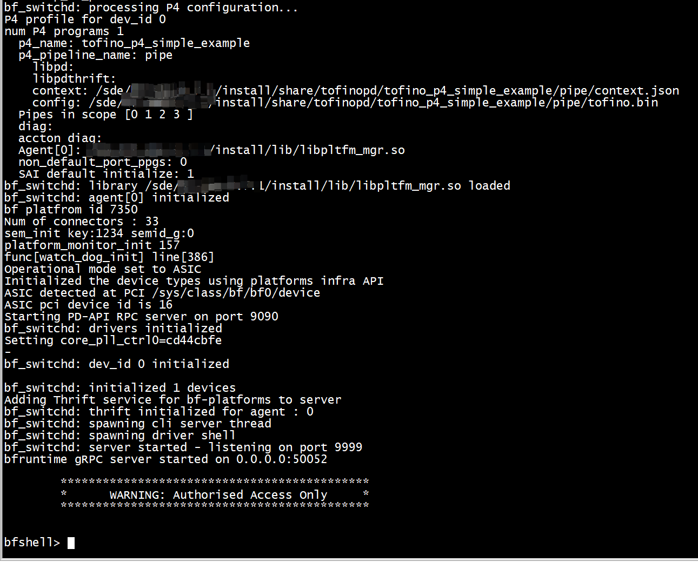

# make

[参考SwitchML P4 program](https://switchml.readthedocs.io/en/latest/readmes/p4.html)   

```
root@localhost:/sde/bf-sde-9.2.0/p4studio# mkdir build-test
root@localhost:/sde/bf-sde-9.2.0/p4studio# cd build-test/
export SDE=/sde/bf-sde-9.2.0
export SDE_INSTALL=$SDE/install
export SOURCE_DIR=$SDE/pkgsrc/p4-examples/p4_16_programs
export PATH=$SDE_INSTALL/bin:$PATH
cmake $SDE/p4studio/ -DCMAKE_INSTALL_PREFIX=$SDE_INSTALL \
                     -DCMAKE_MODULE_PATH=$SDE/cmake \
                     -DP4_NAME=tofino_p4_simple_example \
                     -DP4_PATH=$SOURCE_DIR/tofino_p4_simple_example/prog.p4 
```

```
root@localhost:/sde/bf-sde-9.2.0/p4studio/build-test# make
[  0%] Built target driver
[  0%] Built target bf-p4c
[100%] Generating tofino_p4_simple_example/tofino/bf-rt.json
warning: No size defined for table 'ciL2Fwd_tiWire', setting default size to 512
warning: Parser state min_parse_depth_accept_loop will be unrolled up to 3 times due to @pragma max_loop_depth.
warning: Parser state min_parse_depth_accept_loop will be unrolled up to 3 times due to @pragma max_loop_depth.
warning: egress::hdr.prsr_pad_0[0].$valid is read in egress deparser, however it is never or partially initialized
warning: egress::hdr.prsr_pad_0[0].blob is read in egress deparser, however it is never or partially initialized
warning: egress::hdr.prsr_pad_0[1].blob is read in egress deparser, however it is never or partially initialized
warning: egress::hdr.prsr_pad_0[2].blob is read in egress deparser, however it is never or partially initialized
[100%] Built target tofino_p4_simple_example-tofino
Scanning dependencies of target tofino_p4_simple_example
[100%] Built target tofino_p4_simple_example
```

```
root@localhost:/sde/bf-sde-9.2.0/p4studio/build-test# ls    
CMakeCache.txt  CMakeFiles  Makefile  cmake_install.cmake  tofino_p4_simple_example
root@localhost:/sde/bf-sde-9.2.0/p4studio/build-test# ls tofino_p4_simple_example/tofino/
bf-rt.json  events.json  frontend-ir.json  manifest.json  pipe  prog.conf  prog.p4pp  source.json  tofino_p4_simple_example.conf
root@localhost:/sde/bf-sde-9.2.0/p4studio/build-test# 
```
+ 拷贝bf-rt.json  events.json  frontend-ir.json  pipe  source.json到../../install/share/tofinopd
```
 cp -r  tofino_p4_simple_example/tofino  ../../install/share/tofinopd/tofino_p4_simple_example
```

```
root@localhost:/sde/bf-sde-9.2.0# ./run_switchd.sh   -p tofino_p4_simple_example
Using SDE /sde/bf-sde-9.2.0
Using SDE_INSTALL /sde/bf-sde-9.2.0/install
Setting up DMA Memory Pool
File /sde/bf-sde-9.2.0/install/share/p4/targets/tofino/tofino_p4_simple_example.conf not found
```


+ 拷贝tofino_p4_simple_example.conf  
```
cp tofino_p4_simple_example/tofino/tofino_p4_simple_example.conf  /sde/bf-sde-9.2.0/install/share/p4/targets/tofino
```

+ ./run_switchd.sh   -p tofino_p4_simple_example  
