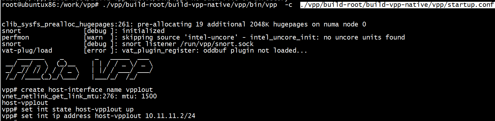
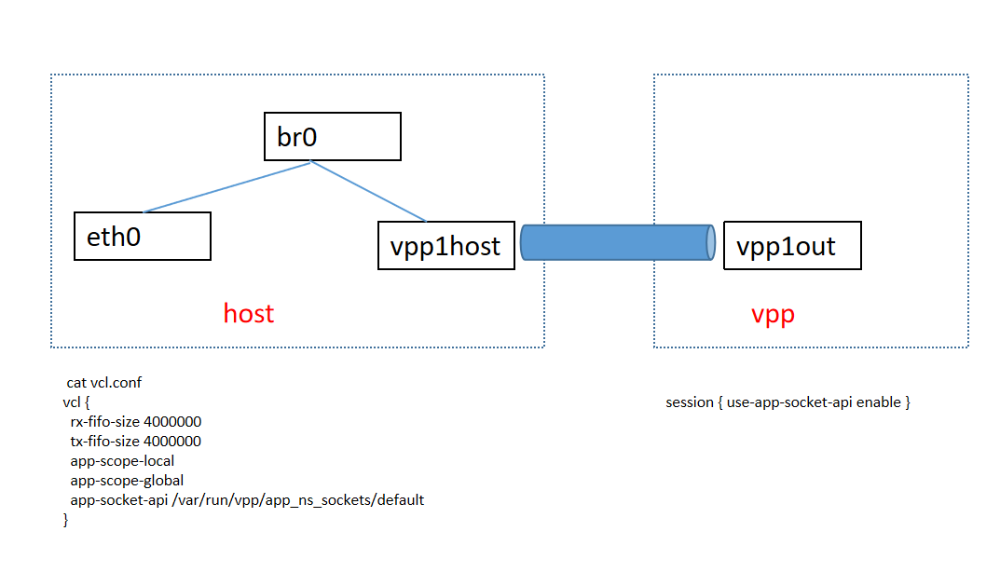
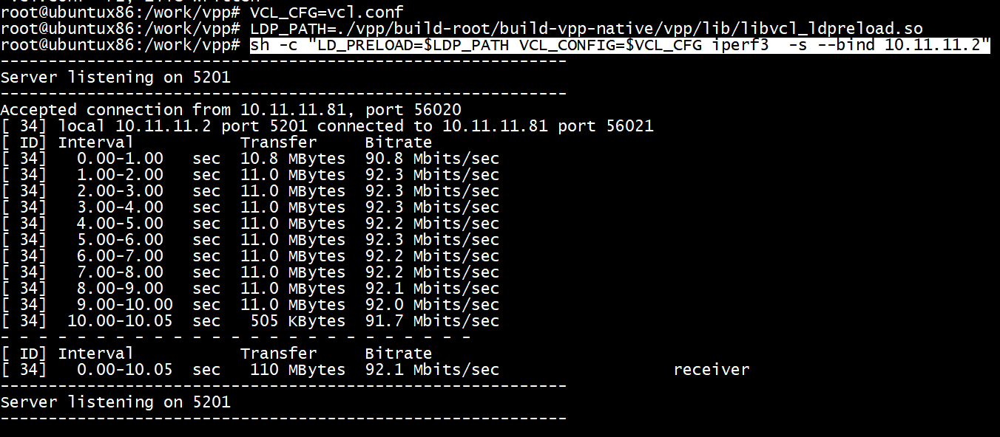
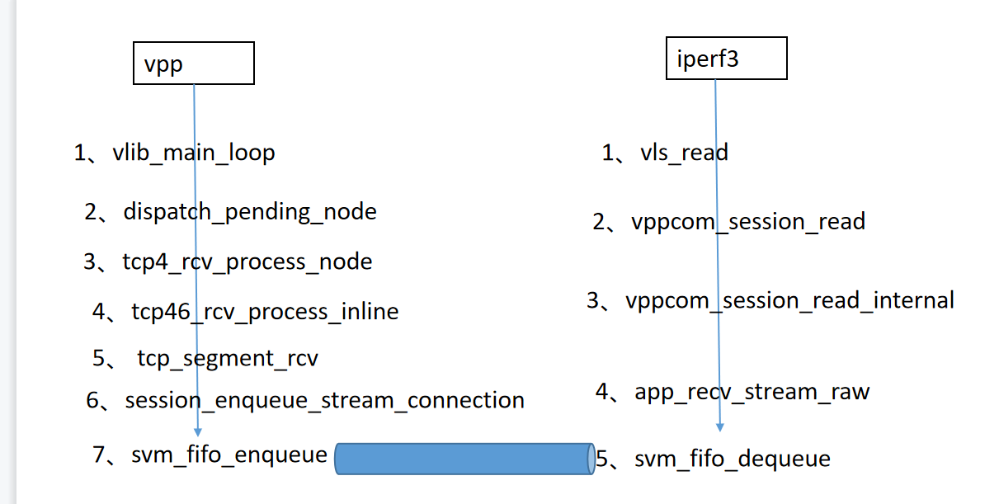

# build

```
ubuntu@ubuntux86:~$ uname -a
Linux ubuntux86 5.13.0-39-generic #44~20.04.1-Ubuntu SMP Thu Mar 24 16:43:35 UTC 2022 x86_64 x86_64 x86_64 GNU/Linux
ubuntu@ubuntux86:~$ 
```

```shell
git clone https://gerrit.fd.io/r/vpp
git checkout -b stable/2110 --track origin/stable/2110
```

```shell
make install-dep
make install-ext-deps
make build        # or `make build-release`
```
编译后在 vpp 目录下生成 dpdk & vpp 相应目录:
```shell
build-root/install-vpp-native/external
build-root/install-vpp-native/vpp
```

## dpdk

build-data/platforms/vpp.mk可以配置dpdk
vpp_uses_dpdk=yes

```
root@ubuntux86:/work/vpp/vpp# ls  build-data/platforms/vpp.mk
build-data/platforms/vpp.mk
root@ubuntux86:/work/vpp/vpp# ls build/external/packages/dpdk.mk
build/external/packages/dpdk.mk
root@ubuntux86:/work/vpp/vpp# 
```


# iperf3


1） 启动vpp



2) 配置vpp网卡



用iperf3跑跑带宽测试为了使用VPP里面提供的网口，iperf3需要加载libvcl_ldpreload.so这个动态链接库，来替换部分网络编程接口。 此外，我们还需要配置一下VCL，具体如下：

```shell
# 添加VCL的配置文件
vcl {
  rx-fifo-size 4000000
  tx-fifo-size 4000000
  app-scope-local
  app-scope-global
  app-socket-api /var/run/vpp/app_ns_sockets/default
}
```

3) 启动iperf3



4) 客户端
 
```
 iperf3.exe -c 10.11.11.2
```

## vpp 和iperf3数据交互



# test

```
 set ip neighbor host-vpp1out 10.11.12.81   00:0e:c6:c6:3d:cd  
```

# refrences
[DPDK-VPP 学习笔记-01](https://blog.csdn.net/force_eagle/article/details/107989217)  

[VPP 2110版本源码编译安装](https://www.cnblogs.com/liqinglucky/p/vpp.html)