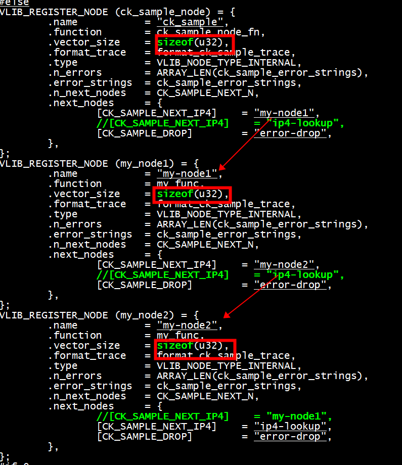
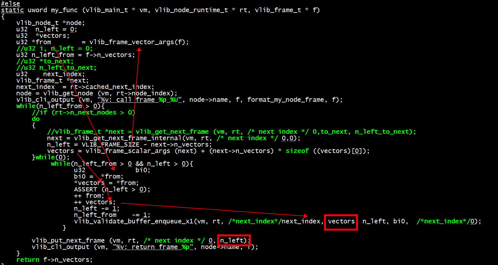
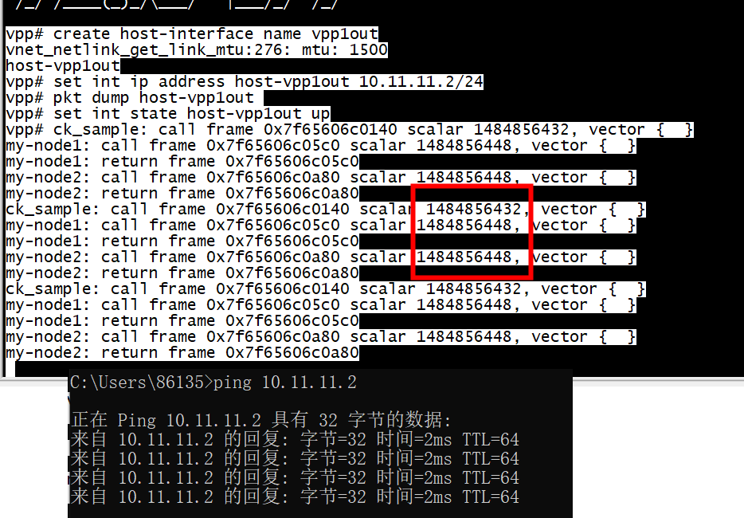

# scalar_size, vector_size

```
  /* Size of scalar and vector arguments in bytes. */
  //这两个成员组合成key，在vlib_node_main_t->frame_size_hash中查找，确定本node相关的frame的内存池
  u16 scalar_size, vector_size;
```

```
#define vlib_get_next_frame_macro(vm,node,next_index,vectors,n_vectors_left,alloc_new_frame) \
do {                                                                    \
  vlib_frame_t * _f                                                     \
    = vlib_get_next_frame_internal ((vm), (node), (next_index),         \
                                    (alloc_new_frame));                 \
  u32 _n = _f->n_vectors;                                               \
  (vectors) = vlib_frame_vector_args (_f) + _n * sizeof ((vectors)[0]); \
  (n_vectors_left) = VLIB_FRAME_SIZE - _n;                              \
} while (0)
```



```C
/*返回数值等于x四舍五入下一个2的次幂（以pow2对齐）*/
always_inline uword round_pow2 (uword x, uword pow2)
{
  return (x + pow2 - 1) & ~(pow2 - 1);
}
/* Byte alignment for vector arguments. 
 * 16字节对齐*/
#define VLIB_FRAME_VECTOR_ALIGN (1 << 4)
always_inline u32 vlib_frame_vector_byte_offset (u32 scalar_size)
{
  return round_pow2 (sizeof (vlib_frame_t) + scalar_size,
             VLIB_FRAME_VECTOR_ALIGN);
}
```

```C
/** \brief Get pointer to frame vector data.
 @param f vlib_frame_t pointer
 @return pointer to first vector element in frame
*/
always_inline void *
vlib_frame_vector_args (vlib_frame_t * f)
{
  return (void *) f + vlib_frame_vector_byte_offset (f->scalar_size);
}

/** \brief Get pointer to frame scalar data.

 @param f vlib_frame_t pointer

 @return arbitrary node scalar data

 @sa vlib_frame_vector_args
*/
always_inline void *
vlib_frame_scalar_args (vlib_frame_t * f)
{
  return vlib_frame_vector_args (f) - f->scalar_size;
}
```



# scalar_size = sizeof (ethernet_input_frame_t)
```C
/* *INDENT-OFF* */
VLIB_REGISTER_NODE (ethernet_input_node) = {
  .name = "ethernet-input",
  /* Takes a vector of packets. */
  .vector_size = sizeof (u32),
  .scalar_size = sizeof (ethernet_input_frame_t),
  .n_errors = ETHERNET_N_ERROR,
  .error_strings = ethernet_error_strings,
  .n_next_nodes = ETHERNET_INPUT_N_NEXT,
  .next_nodes = {
#define _(s,n) [ETHERNET_INPUT_NEXT_##s] = n,
    foreach_ethernet_input_next
#undef _
  },
  .format_buffer = format_ethernet_header_with_length,
  .format_trace = format_ethernet_input_trace,
  .unformat_buffer = unformat_ethernet_header,
};
```

#  运行



```
vpp# create host-interface name vpp1out
vnet_netlink_get_link_mtu:276: mtu: 1500
host-vpp1out
vpp# set int ip address host-vpp1out 10.11.11.2/24
vpp# pkt dump host-vpp1out 
vpp# set int state host-vpp1out up
vpp# ck_sample: call frame 0x7f65606c0140 scalar 1484856432, vector {  }
my-node1: call frame 0x7f65606c05c0 scalar 1484856448, vector {  }
my-node1: return frame 0x7f65606c05c0
my-node2: call frame 0x7f65606c0a80 scalar 1484856448, vector {  }
my-node2: return frame 0x7f65606c0a80
ck_sample: call frame 0x7f65606c0140 scalar 1484856432, vector {  }
my-node1: call frame 0x7f65606c05c0 scalar 1484856448, vector {  }
my-node1: return frame 0x7f65606c05c0
my-node2: call frame 0x7f65606c0a80 scalar 1484856448, vector {  }
my-node2: return frame 0x7f65606c0a80
ck_sample: call frame 0x7f65606c0140 scalar 1484856432, vector {  }
my-node1: call frame 0x7f65606c05c0 scalar 1484856448, vector {  }
my-node1: return frame 0x7f65606c05c0
my-node2: call frame 0x7f65606c0a80 scalar 1484856448, vector {  }
my-node2: return frame 0x7f65606c0a80
```

# vlib_frame_args

```C
tapcli_nopunt_frame (vlib_main_t * vm,
		     vlib_node_runtime_t * node, vlib_frame_t * frame)
{
  u32 *buffers = vlib_frame_args (frame);
  uword n_packets = frame->n_vectors;
  vlib_buffer_free (vm, buffers, n_packets);
  vlib_frame_free (vm, node, frame);
}
```