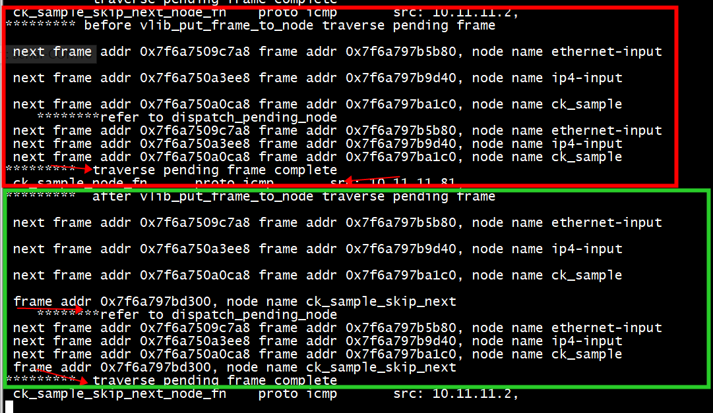

#   获取 pending frame的node
参考 dispatch_node 和dispatch_node
```C
dispatch_pending_node (vlib_main_t * vm, uword pending_frame_index,
                       u64 last_time_stamp)
{
  vlib_node_main_t *nm = &vm->node_main;
  vlib_frame_t *f;
  vlib_next_frame_t *nf, nf_placeholder;
  vlib_node_runtime_t *n;
  vlib_frame_t *restore_frame;
  vlib_pending_frame_t *p;

  /* See comment below about dangling references to nm->pending_frames */
  p = nm->pending_frames + pending_frame_index;

  n = vec_elt_at_index (nm->nodes_by_type[VLIB_NODE_TYPE_INTERNAL],
                        p->node_runtime_index);
```

```C
static_always_inline u64
dispatch_node (vlib_main_t * vm,
               vlib_node_runtime_t * node,
               vlib_node_type_t type,
               vlib_node_state_t dispatch_state,
               vlib_frame_t * frame, u64 last_time_stamp)
{
  uword n, v;
  u64 t;
  vlib_node_main_t *nm = &vm->node_main;
  vlib_next_frame_t *nf;

  if (CLIB_DEBUG > 0)
    {
      vlib_node_t *n = vlib_get_node (vm, node->node_index);
      ASSERT (n->type == type);
    }
```

# 执行



1)frame addr 0x7f6a797be0c0, node name ck_sample_skip_next 没有next frame  
2) after vlib_put_frame_to_node traverse pending frame   新增了一个pending frame ， node name ck_sample_skip_next
 
代码实现

```
static void pending_frame_test(vlib_main_t * vm)
{
     int pending_frames = 0;
     vlib_node_main_t *nm = &vm->node_main;
     vlib_node_runtime_t *run;
     vlib_pending_frame_t *p;
     vlib_next_frame_t *nf;
     vlib_node_t *n;
     for (pending_frames = 0; pending_frames < vec_len (nm->pending_frames); pending_frames++)
     {
         printf("\n");
         p = vec_elt_at_index (nm->pending_frames, pending_frames);
         run = vec_elt_at_index (nm->nodes_by_type[VLIB_NODE_TYPE_INTERNAL],
                                                  p->node_runtime_index);
         if (p->next_frame_index == VLIB_PENDING_FRAME_NO_NEXT_FRAME)
          {
                                 /* No next frame: so use placeholder on stack. */
                                  nf->frame = NULL;
          }
          else
          {
              nf = vec_elt_at_index (nm->next_frames, p->next_frame_index); 
              printf(" next frame addr %p",nf);
          }
         n = vlib_get_node (vm, run->node_index);
         printf(" frame addr %p, node name %s \n",p->frame, n->name);
     }
     // refer to dispatch_pending_node 
     printf("    ********refer to dispatch_pending_node \n");
     for (pending_frames = 0; pending_frames < vec_len (nm->pending_frames); pending_frames++)
     {
         p = nm->pending_frames +  pending_frames;
         run = vec_elt_at_index (nm->nodes_by_type[VLIB_NODE_TYPE_INTERNAL],
                                                  p->node_runtime_index);
         if (p->next_frame_index == VLIB_PENDING_FRAME_NO_NEXT_FRAME)
          {
                                 /* No next frame: so use placeholder on stack. */
                                  nf->frame = NULL;
          }
          else
          {
              nf = vec_elt_at_index (nm->next_frames, p->next_frame_index);
              printf(" next frame addr %p",nf);
          }
         n = vlib_get_node (vm, run->node_index);
         printf(" frame addr %p, node name %s \n",p->frame, n->name);
     }
     printf("*********  traverse pending frame complete \n");
}
```