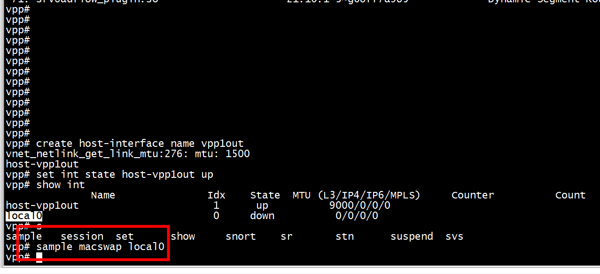
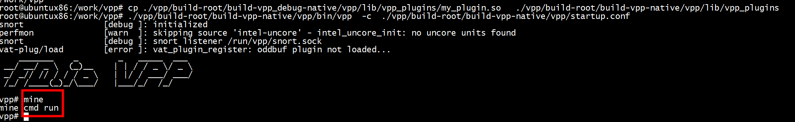
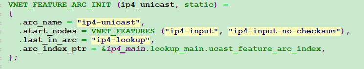

# Sample plugin for VPP    {#sample_plugin_doc}

## Overview

This is the VPP sample plugin demonstrates how to create a new plugin that integrates 
with VPP. The sample code implements a trival macswap algorithim that demonstrates plugin 
runtime integration with the VPP graph hierachy, api and cli.

For deeper dive information see the annotations in the  sample code itself. See [sample.c](@ref sample.c)

## How to build and run the sample plugin.

Now (re)build VPP.

	$ make wipe

1)  Define environmental variable 'SAMPLE_PLUGIN=yes' with a process scope

	$ SAMPLE_PLUGIN=yes make build

or a session scope, and build VPP. 

	$ export SAMPLE_PLUGIN=yes
	$ make build
	
2)  copy  sample_plugin.so  to   ./vpp/build-root/build-vpp-native/vpp/lib/vpp_plugins

***src location : ./src/examples/sample-plugin/sample***
```	
 cp ./vpp/build-root/build-vpp_debug-native/sample-plugin/lib/vpp_plugins/sample_plugin.so   ./vpp/build-root/build-vpp-native/vpp/lib/vpp_plugins
```
***build-vpp_debug-native 和build-vpp-native是不同目录***  
3)  enable  sample_plugin.so

```
plugins {
  plugin dpdk_plugin.so { disable }
  plugin unittest_plugin.so { enable }
  plugin sample_plugin.so { enable }
}
```


4)  Now run VPP and make sure the plugin is loaded. 

```shell
./vpp/build-root/build-vpp-native/vpp/bin/vpp  -c  ./vpp/build-root/build-vpp-native/vpp/startup.conf 
```


or 

	$ make run
	...
	load_one_plugin:184: Loaded plugin: memif_plugin.so (Packet Memory Interface (experimetal))
	load_one_plugin:184: Loaded plugin: sample_plugin.so (Sample of VPP Plugin)
	load_one_plugin:184: Loaded plugin: nat_plugin.so (Network Address Translation)
	...
	DBGvpp#



## How to create a new plugin

To create a new plugin based on the sample plugin, copy and rename the sample plugin directory and automake config.

	cp -r src/examples/sample-plugin/sample src/plugins/newplugin
	cp src/examples/sample-plugin/sample.am src/plugins/newplugin.am

Add the following entry to the plugins section of `src/configure.ac`.

	PLUGIN_ENABLED(newplugin)

Add the following entry to the plugins section of `src/plugins/Makefile.am`

	if ENABLE_NEWPLUGIN
	include newplugin.am
	endif

Now (re)build VPP.

	$ make wipe
	$ make build
	
## my plugin	
```
grep SAMPLE_PLUGIN -rn *
Makefile:19:SAMPLE_PLUGIN?=no
Makefile:168:ifneq ($(SAMPLE_PLUGIN),no)
Makefile:252:   @echo " SAMPLE_PLUGIN=yes        - in addition build/run/debug sample plugin"
Makefile:264:   @echo " SAMPLE_PLUGIN     = $(SAMPLE_PLUGIN)"
src/examples/sample-plugin/sample/sample.h:38:#define SAMPLE_PLUGIN_BUILD_VER "1.0"
src/examples/sample-plugin/sample/sample.c:61:    .version = SAMPLE_PLUGIN_BUILD_VER,
```
1) 编译  

代码路径  

```shell
root@ubuntux86:/work/vpp/vpp/src/plugins/my-plugin# ls
CMakeLists.txt  CMakeLists.txt.bak  my.am  my.api  my.c  my.h  node.c  sample_test.c
```
```shell
$ make build
```
2) 拷贝 my_plugin.so   
```shell
cp ./vpp/build-root/build-vpp_debug-native/vpp/lib/vpp_plugins/my_plugin.so   ./vpp/build-root/build-vpp-native/vpp/lib/vpp_plugins
```
3） 运行  
```shell
./vpp/build-root/build-vpp-native/vpp/bin/vpp  -c  ./vpp/build-root/build-vpp-native/vpp/startup.conf 
```


## VLIB_NODE_TYPE_INPUT
```
我们以DPDK类型的输入节点来进行分析。

/* *INDENT-OFF* */
VLIB_REGISTER_NODE (dpdk_input_node) = {
  .type = VLIB_NODE_TYPE_INPUT,
  .name = "dpdk-input",
  .sibling_of = "device-input",

  /* Will be enabled if/when hardware is detected. */
  .state = VLIB_NODE_STATE_DISABLED,

  .format_buffer = format_ethernet_header_with_length,
  .format_trace = format_dpdk_rx_trace,

  .n_errors = DPDK_N_ERROR,
  .error_strings = dpdk_error_strings,
};
```

## Configuration

To enable the sample plugin

	sample macswap <interface name>

To disable the sample plugin

	sample macswap <interface name> disable
	
	
	
	
# ip4_register_protocol 

```
static clib_error_t *
vrrp_input_init (vlib_main_t *vm)
{
  clib_error_t *error;

  if ((error = vlib_call_init_function (vm, vrrp_init)))
    return error;

  ip4_register_protocol (IP_PROTOCOL_VRRP, vrrp4_input_node.index);
  ip6_register_protocol (IP_PROTOCOL_VRRP, vrrp6_input_node.index);

  return 0;
}
```
# command

```shell
vpp# show node ip4-input
show node device-input
vpp# show node plugin
show features
show interface  host-vpp1out   features
```


	
# references
[vpp之feature机制介绍](https://blog.csdn.net/wh_computers/article/details/121432873)
[learn-vpp](https://github.com/giangnvbk1989/learn-vpp/tree/75226aafe98793e325209babc9d32c72f9442832)
