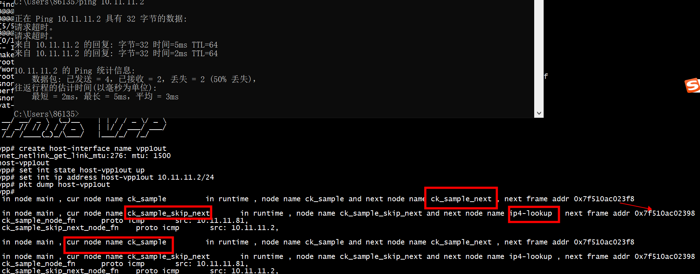
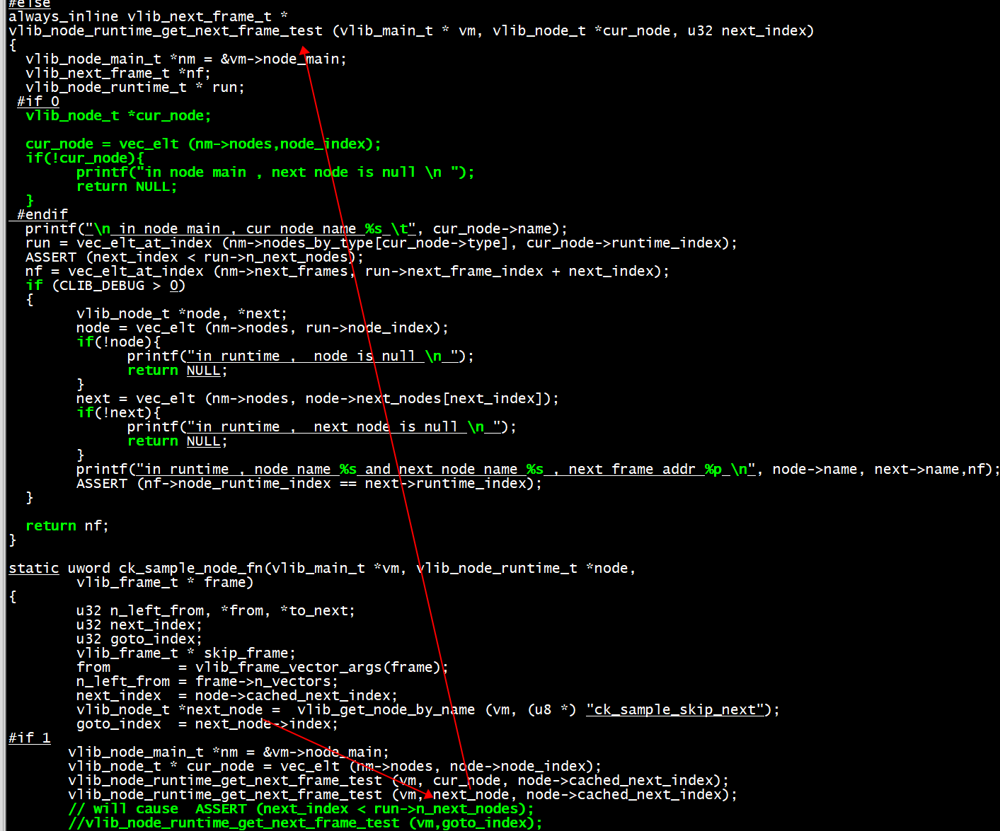

# skip  node


## test netxt frame




参考：
```C
dhcpv6_proxy_to_client_input (vlib_main_t * vm,
                              vlib_node_runtime_t * node,
                              vlib_frame_t * from_frame)
{

        drop_packet:
          vlib_node_increment_counter (vm, dhcpv6_proxy_to_client_node.index,
                                       error0, 1);

          f0 = vlib_get_frame_to_node (vm, dm->error_drop_node_index);
          to_next0 = vlib_frame_vector_args (f0);
          to_next0[0] = bi0;
          f0->n_vectors = 1;
          vlib_put_frame_to_node (vm, dm->error_drop_node_index, f0);
          goto do_trace;
}
```

```C
                        u32  *go_to_next;
                        b0 = vlib_get_buffer(vm, bi0);
                        ip4_header_t *ip4  = vlib_buffer_get_current(b0);
                        printf(" %s \t",__func__);
                        printf_ipv4_header(ip4);
                        set_ipv4_header(ip4);
                        skip_frame = vlib_get_frame_to_node (vm, goto_index);
                        go_to_next = vlib_frame_vector_args (skip_frame);
                        go_to_next[0] = bi0;
                        skip_frame->n_vectors = 1;
                        vlib_put_frame_to_node (vm, goto_index, skip_frame);
```

# vlib_get_frame_to_node

```
vlib_frame_t *
vlib_get_frame_to_node (vlib_main_t * vm, u32 to_node_index)
{
  vlib_frame_t *f = vlib_frame_alloc_to_node (vm, to_node_index,
                                              /* frame_flags */
                                              VLIB_FRAME_FREE_AFTER_DISPATCH);
  return vlib_get_frame (vm, f);
}
```
# vlib_put_frame_to_node
```C
void
vlib_put_frame_to_node (vlib_main_t * vm, u32 to_node_index, vlib_frame_t * f)
{
  vlib_pending_frame_t *p;
  vlib_node_t *to_node;

  if (f->n_vectors == 0)
    return;

  ASSERT (vm == vlib_get_main ());

  vlib_validate_frame_indices (f);

  to_node = vlib_get_node (vm, to_node_index);

  vec_add2 (vm->node_main.pending_frames, p, 1); 

  f->frame_flags |= VLIB_FRAME_PENDING;
  p->frame = vlib_get_frame (vm, f);
  p->node_runtime_index = to_node->runtime_index;
  p->next_frame_index = VLIB_PENDING_FRAME_NO_NEXT_FRAME;
}
```	

# dispatch_node

```
u64 dispatch_node (vlib_main_t * vm, vlib_node_runtime_t * node,
    vlib_node_type_t type, vlib_node_state_t dispatch_state,
    vlib_frame_t * frame, u64 last_time_stamp)
{
    //执行node->function
    n = node->function (vm, node, frame);

    //更新node_runtime里面的一些状态，比如处理时间、vector数据包数量。
    v = vlib_node_runtime_update_stats (stat_vm, node, /* n_calls */ 1,
        /* n_vectors */ n, /* n_clocks */ t - last_time_stamp);

    /*中断模式下，vector速率超过阈值，切换到polling模式*/
    if ((DPDK == 0 && dispatch_state == VLIB_NODE_STATE_INTERRUPT)
        || (DPDK == 0 && dispatch_state == VLIB_NODE_STATE_POLLING
        && (node->flags
        & VLIB_NODE_FLAG_SWITCH_FROM_INTERRUPT_TO_POLLING_MODE))) {
    }
}

```
node->function中会计算下一级node，并且最终调用vlib_put_next_frame，将下一级的node加入到nm->pending_frames中