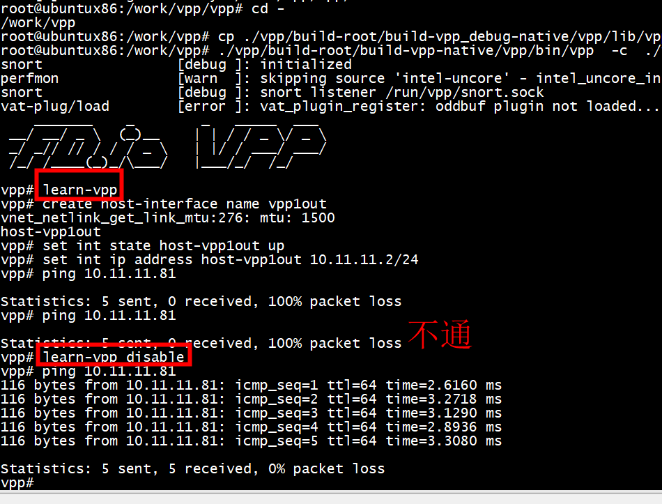

# learn-vpp 



# feature

```C
VNET_FEATURE_INIT (learn, static) = 
{
  .arc_name = "ip4-unicast",
  .node_name = "learn-vpp-input",
  .runs_before = VNET_FEATURES ("acl-plugin-in-ip4-fa"),
};
```

## enable feature

```C
int learn_enable_disable (learn_main_t * sm, int enable_disable)
{
  int rv = 0;


  vnet_feature_enable_disable ("ip4-unicast", "learn-vpp-input",
                                TEST_INTERFACE_INDEX, enable_disable, 0, 0);

  return rv;
}

```

# node learn-vpp-input

```C
VLIB_NODE_FN (learn_vpp_input) (vlib_main_t *vm,
                                vlib_node_runtime_t *rt,
                                vlib_frame_t *f)
{
  return learn_vpp_input_node_fn (vm, rt, f);
}

/* *INDENT-OFF* */
VLIB_REGISTER_NODE (learn_vpp_input) = {
  .name = "learn-vpp-input",
  .type = VLIB_NODE_TYPE_INPUT,
  .state = VLIB_NODE_STATE_POLLING,
  //.state = VLIB_NODE_STATE_INTERRUPT,
};
```
node learn-vpp-input  是VLIB_NODE_TYPE_INPUT ，不需要 next_nodes


