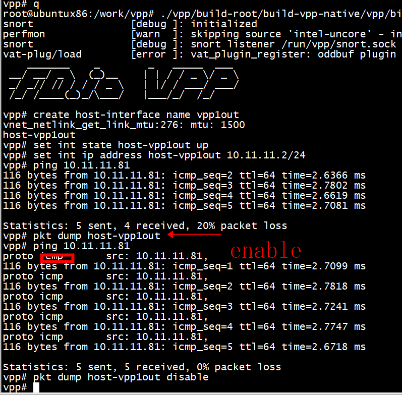
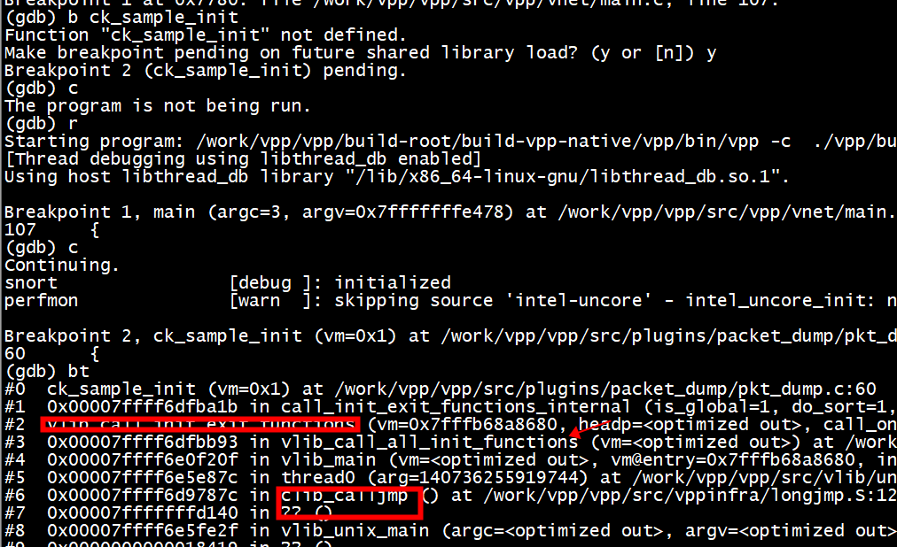
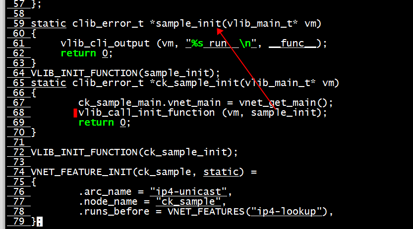
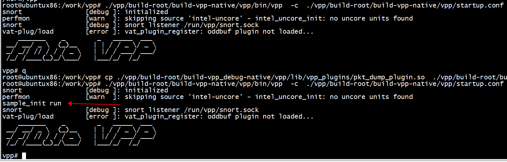
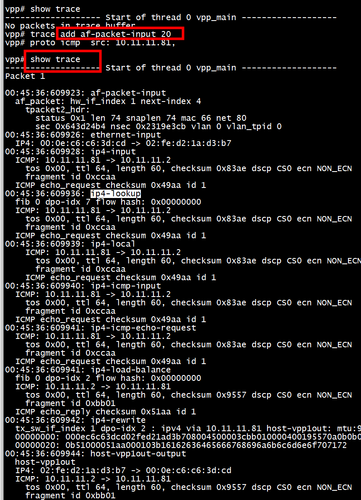

#  ip4_header_t

```shell
   ip4_header_t *ip4 = vlib_buffer_get_current (b0);
      /* Fill in ip4 header fields */
      ip4->checksum = 0;
      ip4->ip_version_and_header_length = 0x45;
      ip4->tos = 0;
      ip4->length = 0;		/* will be set later */
      ip4->fragment_id = 0;
      ip4->flags_and_fragment_offset = 0;
      ip4->ttl = 0xff;
      ip4->protocol = IP_PROTOCOL_ICMP;
      ip4->src_address = pa46->ip4;
      ip4->dst_address = pa46->ip4;
```

#  ck_sample_node_fn

```

static void printf_ipv4_header(ip4_header_t *ip4)
{
     //int l4_offset;
     //l4_offset = ip4_header_bytes (ip4);
     //void *paddr;
     //void *format_addr_func;
     //u8 *src, *dts;
     u8 *src;
     if (IP_PROTOCOL_ICMP == ip4->protocol)
                        printf("proto icmp\t");
     src = (u8*) &ip4->src_address;
     printf(" src: %d.%d.%d.%d,\t", src[0],src[1],src[2],src[3]);
     //paddr = (void *) &ip4->src_address;
     //format_addr_func = (void *) format_ip4_address;
     //vlib_cli_output (vm, "Source address: %U ", format_addr_func, paddr);
     printf("\n");
}
static uword ck_sample_node_fn(vlib_main_t *vm, vlib_node_runtime_t *node,
        vlib_frame_t * frame)
{
        u32 n_left_from, *from, *to_next;
        ck_sample_next_t     next_index;

        from        = vlib_frame_vector_args(frame);
        n_left_from = frame->n_vectors;
        next_index  = node->cached_next_index;

        while(n_left_from > 0){
                u32 n_left_to_next;
                vlib_get_next_frame(vm, node, next_index, to_next, n_left_to_next);

                while(n_left_from > 0 && n_left_to_next > 0){
                        vlib_buffer_t  *b0;
                        u32             bi0, next0 = 0;

                        bi0 = to_next[0] = from[0];
                        from           += 1;
                        to_next        += 1;
                        n_left_to_next -= 1;
                        n_left_from    -= 1;

                        b0 = vlib_get_buffer(vm, bi0);
                        ip4_header_t *ip4  = vlib_buffer_get_current(b0);
                        printf_ipv4_header(ip4);
                        vlib_validate_buffer_enqueue_x1(vm, node, next_index,
                                to_next, n_left_to_next, bi0, next0);
                }

                vlib_put_next_frame(vm, node, next_index, n_left_to_next);
        }

        return frame->n_vectors;
}
```
# run



```shell
ip link add name vpp1out type veth peer name vpp1host
ip link set dev vpp1out up
ip link set dev vpp1host up
ip addr add 10.10.1.1/24 dev vpp1host
brctl addbr br0 
brctl addif br0  vpp1host
brctl addif br0  eth0 
```

```shell
root@ubuntux86:/work/vpp/vpp# make build
 cp ./vpp/build-root/build-vpp_debug-native/vpp/lib/vpp_plugins/pkt_dump_plugin.so  ./vpp/build-root/build-vpp-native/vpp/lib/vpp_plugins
 ./vpp/build-root/build-vpp-native/vpp/bin/vpp  -c  ./vpp/build-root/build-vpp-native/vpp/startup.conf 
```

```shell
vpp# create host-interface name vpp1out 
vnet_netlink_get_link_mtu:276: mtu: 1500
host-vpp1out
vpp# set int state host-vpp1out up
vpp# set int ip address host-vpp1out 10.11.11.2/24
vpp# pkt dump host-vpp1out
vpp# 
```

#  ck_sample_node_fn pk  ip4_input_node_fn pk ip4_lookup_node_fn

```shell 
(gdb) b  ck_sample_node_fn
Breakpoint 1 at 0x7fe32eaba667: file /work/vpp/vpp/src/plugins/packet_dump/node.c, line 122.
(gdb) b ip4-input
Function "ip4-input" not defined.
Make breakpoint pending on future shared library load? (y or [n]) n
(gdb) b ip4_input_node_fn
Breakpoint 2 at 0x7fe371c1e8e0: file /work/vpp/vpp/src/vnet/ip/ip4_input.c, line 366.
(gdb) b ip4_lookup_node_fn
Breakpoint 3 at 0x7fe371c0bf10: file /work/vpp/vpp/src/vnet/ip/ip4_forward.c, line 98.
(gdb) 
```
#  icmp echo reply node
```C
VLIB_REGISTER_NODE (ip4_icmp_echo_reply_node, static) =
{
  .function = ip4_icmp_echo_reply_node_fn,
  .name = "ip4-icmp-echo-reply",
  .vector_size = sizeof (u32),
  .format_trace = format_icmp_echo_trace,
  .n_next_nodes = ICMP46_ECHO_REPLY_N_NEXT,
  .next_nodes = {
    [ICMP46_ECHO_REPLY_NEXT_DROP] = "ip4-drop",
    [ICMP46_ECHO_REPLY_NEXT_PUNT] = "ip4-punt",
  },
};
```
#  ip4_icmp_echo_request
vpp对ping的处理,会swap dst和 src地址
plugins/ping/ping.c
```C
 Breakpoint 2, ip4_icmp_echo_request (vm=0x7f9ff969f680, node=0x7f9ffb03f0c0, frame=0x7f9ffe769ec0) at /work/vpp/vpp/src/plugins/ping/ping.c:373
373     {
(gdb) bt
#0  ip4_icmp_echo_request (vm=0x7f9ff969f680, node=0x7f9ffb03f0c0, frame=0x7f9ffe769ec0) at /work/vpp/vpp/src/plugins/ping/ping.c:373
#1  0x00007fa039c025f5 in dispatch_node (last_time_stamp=<optimized out>, frame=0x7f9ffe769ec0, dispatch_state=VLIB_NODE_STATE_POLLING, type=VLIB_NODE_TYPE_INTERNAL, 
    node=0x7f9ffb03f0c0, vm=0x7f9ff969f680) at /work/vpp/vpp/src/vlib/main.c:1024
#2  dispatch_pending_node (vm=vm@entry=0x7f9ff969f680, pending_frame_index=pending_frame_index@entry=5, last_time_stamp=<optimized out>) at /work/vpp/vpp/src/vlib/main.c:1183
#3  0x00007fa039c06cd4 in vlib_main_or_worker_loop (is_main=1, vm=<optimized out>) at /work/vpp/vpp/src/vlib/main.c:1649
#4  vlib_main_loop (vm=<optimized out>) at /work/vpp/vpp/src/vlib/main.c:1777
```
# ip4_icmp_register_type pk vnet_feature_enable_disable

vnet/feature/feature.c: vnet_feature_enable_disable  
***vlib_node_add_next添加新的node，不需要调用vnet_feature_enable_disable***

```C
void
ip4_icmp_register_type (vlib_main_t * vm, icmp4_type_t type, u32 node_index)
{
  icmp4_main_t *im = &icmp4_main;
  u32 old_next_index;

  ASSERT ((int) type < ARRAY_LEN (im->ip4_input_next_index_by_type));
  old_next_index = im->ip4_input_next_index_by_type[type];

  im->ip4_input_next_index_by_type[type]
    = vlib_node_add_next (vm, ip4_icmp_input_node.index, node_index);

  if (old_next_index &&
      (old_next_index != im->ip4_input_next_index_by_type[type]))
    clib_warning ("WARNING: changed next_by_type[%d]", (int) type);
}

static clib_error_t *
icmp4_init (vlib_main_t * vm)
{
  ip_main_t *im = &ip_main;
  ip_protocol_info_t *pi;
  icmp4_main_t *cm = &icmp4_main;
  clib_error_t *error;

  error = vlib_call_init_function (vm, ip_main_init);

  if (error)
    return error;

  pi = ip_get_protocol_info (im, IP_PROTOCOL_ICMP);
  pi->format_header = format_ip4_icmp_header;
  pi->unformat_pg_edit = unformat_pg_icmp_header;

  cm->type_by_name = hash_create_string (0, sizeof (uword));
#define _(n,t) hash_set_mem (cm->type_by_name, #t, (n));
  foreach_icmp4_type;
#undef _

  cm->type_and_code_by_name = hash_create_string (0, sizeof (uword));
#define _(a,n,t) hash_set_mem (cm->type_by_name, #t, (n) | (ICMP4_##a << 8));
  foreach_icmp4_code;
#undef _

  clib_memset (cm->ip4_input_next_index_by_type,
               ICMP_INPUT_NEXT_ERROR,
               sizeof (cm->ip4_input_next_index_by_type));

  return 0;
}
```
## vnet_feature_arc_start

该函数主要由arc内的start node调用，在start node中通过该函数，进入到已经组织好的feature的node的矢量图中。feature中的node处理完当前节点后，需要调用 vnet_get_config_data 去设置下一个节点，保存在buffer的opaque信息里，以指导下一步进入哪个node。

比如在ipv4-unicast这个arc中，其start node之一是ip4-input，那么在ip4-input的处理函数中，将会调用此函数进入到feature的node矢量图中。
```C
ip4_input_set_next (u32 sw_if_index, vlib_buffer_t * b, int arc_enabled)
{
  ip4_main_t *im = &ip4_main;
  ip_lookup_main_t *lm = &im->lookup_main;
  u32 next;
  u8 arc;

  ip4_header_t *ip = vlib_buffer_get_current (b);

  if (PREDICT_FALSE (ip4_address_is_multicast (&ip->dst_address)))
    {
      next = IP4_INPUT_NEXT_LOOKUP_MULTICAST;
      arc = lm->mcast_feature_arc_index;
    }
  else
    {
      next = IP4_INPUT_NEXT_LOOKUP;
      arc = lm->ucast_feature_arc_index;
    }

  if (arc_enabled)
    vnet_feature_arc_start (arc, sw_if_index, &next, b);

  return next;
}
```
## vlib_call_init_function
```C
mpls_setup_nodes (vlib_main_t * vm)
{
  pg_node_t * pn;

  pn = pg_get_node (mpls_input_node.index);
  pn->unformat_edit = unformat_pg_mpls_header;

  ethernet_register_input_type (vm, ETHERNET_TYPE_MPLS,
                                mpls_input_node.index);
}

static clib_error_t * mpls_input_init (vlib_main_t * vm)
{
  mpls_setup_nodes (vm);

  return 0;
}

/* *INDENT-OFF* */
VLIB_INIT_FUNCTION (mpls_input_init) =
{
  .runs_after = VLIB_INITS("mpls_init"),
};
static clib_error_t *
mpls_init (vlib_main_t * vm)
{
  clib_error_t * error;

  if ((error = vlib_call_init_function (vm, ip_main_init)))
    return error;

  return vlib_call_init_function (vm, mpls_input_init);
}

VLIB_INIT_FUNCTION (mpls_init);
```







# trace command

```
show trace
clear trace
```

veth-pair网卡  trace add af-packet-input 20  
tap网卡   trace add af-packet-input 20  


