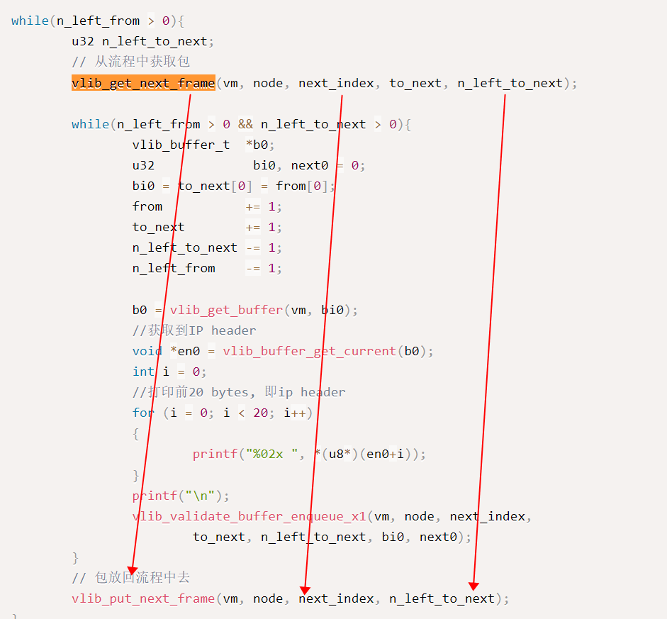
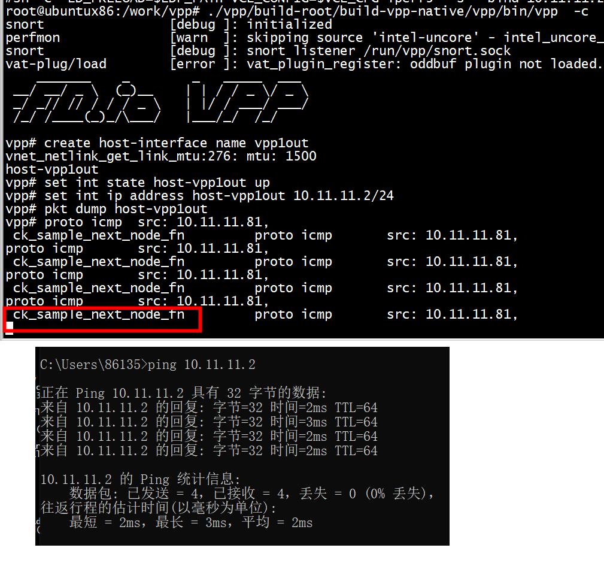
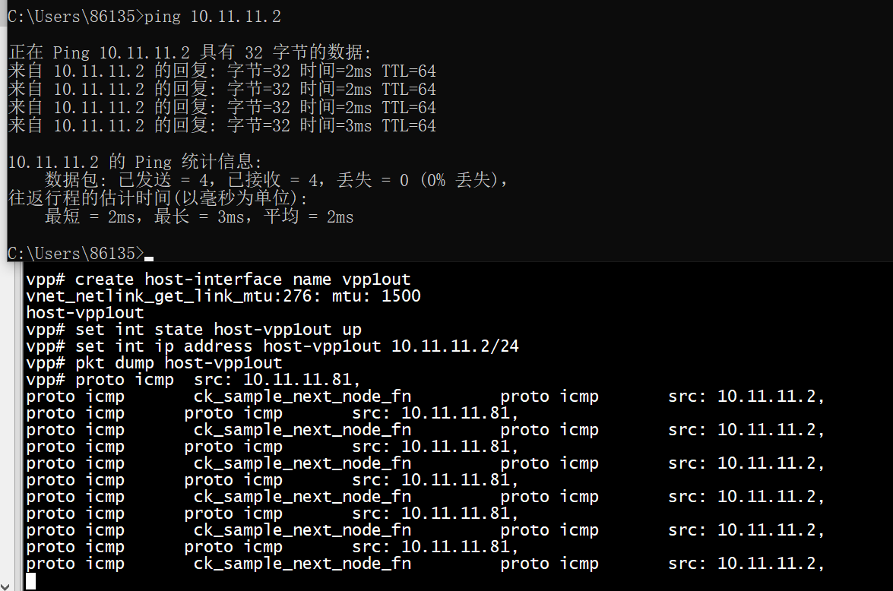
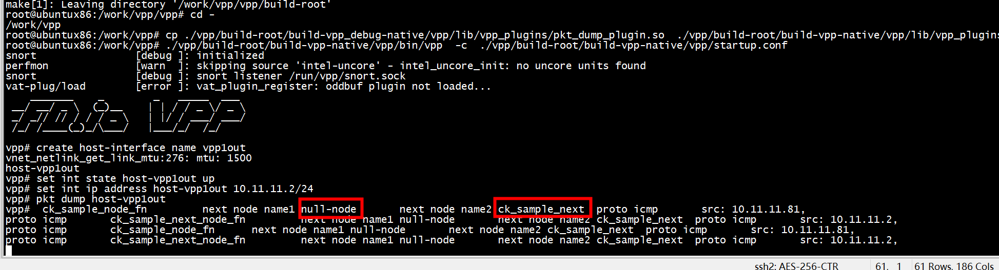
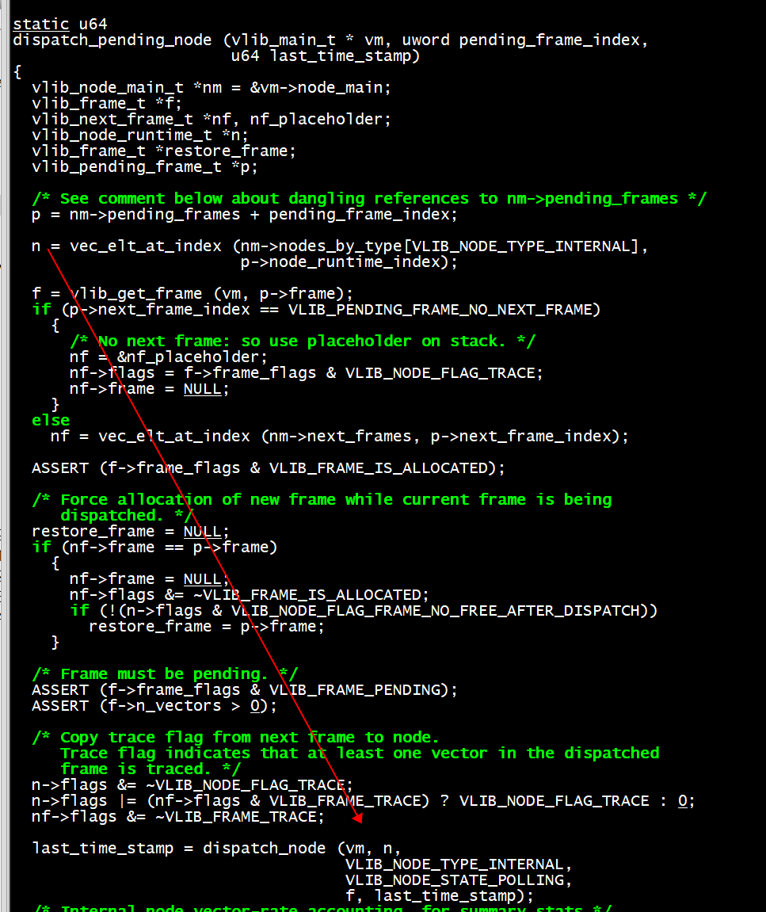
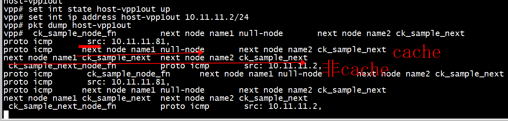

#  vlib_validate_buffer_enqueue_x1




```C
#define vlib_get_next_frame_macro(vm,node,next_index,vectors,n_vectors_left,alloc_new_frame) \
do {                                                                    \
  vlib_frame_t * _f                                                     \
    = vlib_get_next_frame_internal ((vm), (node), (next_index),         \
                                    (alloc_new_frame));                 \
  u32 _n = _f->n_vectors;                                               \
  (vectors) = vlib_frame_vector_args (_f) + _n * sizeof ((vectors)[0]); \
  (n_vectors_left) = VLIB_FRAME_SIZE - _n;                              \
} while (0)
```
1）调用了alloc_new_frame  
2）  给vectors分配了空间


```C
*/
#define vlib_validate_buffer_enqueue_x1(vm,node,next_index,to_next,n_left_to_next,bi0,next0) \
do {                                                                    \
  ASSERT (bi0 != 0);                                                    \
  if (PREDICT_FALSE (next0 != next_index))                              \
    {                                                                   \
      vlib_put_next_frame (vm, node, next_index, n_left_to_next + 1);   \
      next_index = next0;                                               \
      vlib_get_next_frame (vm, node, next_index, to_next, n_left_to_next); \
                                                                        \
      to_next[0] = bi0;                                                 \
      to_next += 1;                                                     \
      n_left_to_next -= 1;                                              \
    }                                                                   \
} while (0)
```


# ck_sample_next node
```C
VLIB_REGISTER_NODE (ck_sample_node) = {
        .name           = "ck_sample",
        .function       = ck_sample_node_fn,
        .vector_size    = sizeof(u32),
        .format_trace   = format_ck_sample_trace,
        .type           = VLIB_NODE_TYPE_INTERNAL,
        .n_errors       = ARRAY_LEN(ck_sample_error_strings),
        .error_strings  = ck_sample_error_strings,
        .n_next_nodes   = CK_SAMPLE_NEXT_N,
        .next_nodes     = {
                [CK_SAMPLE_NEXT_IP4]    = "ck_sample_next",
                //[CK_SAMPLE_NEXT_IP4]    = "ip4-lookup",
                [CK_SAMPLE_DROP]        = "error-drop",
        },
};
VLIB_REGISTER_NODE (ck_sample_next_node) = {
        .name           = "ck_sample_next",
        .function       = ck_sample_next_node_fn,
        .vector_size    = sizeof(u32),
        .format_trace   = format_ck_sample_trace,
        .type           = VLIB_NODE_TYPE_INTERNAL,
        .n_errors       = ARRAY_LEN(ck_sample_error_strings),
        .error_strings  = ck_sample_error_strings,
        .n_next_nodes   = CK_SAMPLE_NEXT_N,
        .next_nodes     = {
                [CK_SAMPLE_NEXT_IP4]    = "ip4-lookup",
                [CK_SAMPLE_DROP]        = "error-drop",
        },
};
```
1、ck_sample_next node没有调用VNET_FEATURE_INIT   
2、ck_sample_node next 是 ck_sample_next node 
# feature

```C
static clib_error_t *sample_init(vlib_main_t* vm)
{
     return 0;
}
VNET_FEATURE_INIT(ck_sample, static) =
{
        .arc_name = "ip4-unicast",
        .node_name = "ck_sample",
        .runs_before = VNET_FEATURES("ip4-lookup"),
};
VLIB_INIT_FUNCTION(sample_init);
```


# run



```shell
ip link add name vpp1out type veth peer name vpp1host
ip link set dev vpp1out up
ip link set dev vpp1host up
ip addr add 10.10.1.1/24 dev vpp1host
brctl addbr br0 
brctl addif br0  vpp1host
brctl addif br0  eth0 
```

```shell
root@ubuntux86:/work/vpp/vpp# make build
 cp ./vpp/build-root/build-vpp_debug-native/vpp/lib/vpp_plugins/pkt_dump_plugin.so  ./vpp/build-root/build-vpp-native/vpp/lib/vpp_plugins
 ./vpp/build-root/build-vpp-native/vpp/bin/vpp  -c  ./vpp/build-root/build-vpp-native/vpp/startup.conf 
```

```shell
vpp# create host-interface name vpp1out 
vnet_netlink_get_link_mtu:276: mtu: 1500
host-vpp1out
vpp# set int state host-vpp1out up
vpp# set int ip address host-vpp1out 10.11.11.2/24
vpp# pkt dump host-vpp1out
vpp# 
```

# run2

```C
static void set_ipv4_header(ip4_header_t *ip4)
{
     u8 *src, *dst;
     u8 temp[4];
     if (IP_PROTOCOL_ICMP == ip4->protocol)
                        printf("proto icmp\t");
     src = (u8*) &ip4->src_address;
     dst = (u8*) &ip4->dst_address;
     memcpy(temp, dst, 4);
     memcpy(dst,src, 4);
     memcpy(src,temp, 4);
}
```
ck_sample_node_fn 和 ck_sample_next_node_fn分别调用set_ipv4_header 交换dst and src ip  




ck_sample_next_node 和 ck_sample_node_的src ip不一样


# 一次处理多个packet

参考
```C
span_node_inline_fn (vlib_main_t * vm, vlib_node_runtime_t * node,
		     vlib_frame_t * frame, vlib_rx_or_tx_t rxtx,
		     span_feat_t sf)
```

```C
 while (n_left_from >= 4 && n_left_to_next >= 2){
                printf("**********process two packets **********\n");
                 /* next0和next1指明包的下一个节点索引值 */
                u32 next0 = next_index;
                u32 next1 = next_index;
                u32 bi0, bi1;
                vlib_buffer_t *b0, *b1;
                to_next[0] = bi0 = from[0];
                to_next[1] = bi1 = from[1];
                from += 2;
                to_next += 2;
                n_left_to_next -= 2;
                n_left_from -= 2;

                b0 = vlib_get_buffer (vm, bi0);
                b1 = vlib_get_buffer (vm, bi1);
               ip4_header_t *ip4  = vlib_buffer_get_current(b0);
               printf(" %s \t",__func__);
               print_node(vm,next_index);
               printf_ipv4_header(ip4);
               ip4  = vlib_buffer_get_current(b1);
               printf_ipv4_header(ip4);
               /* verify speculative enqueues, maybe switch current next frame */
               /* 
                *         next_index:默认的下一结点的index
                *         next0:实际的下一个结点的index
                *         next0 == next_index则不需要做特别的处理，报文会自动进入下一个节点
                *         next0 != next_index则需要对该数据包做调整，从之前next_index对应
                *         的frame中删除，添加到next0对应的frame中
                *
                *         next1的判断和next0一样
                **/
                vlib_validate_buffer_enqueue_x2 (vm, node, next_index, to_next, n_left_to_next, bi0, bi1, next0, next1);

                }
                
```


# get next

```
vnet_l2_feature_next
vlib_get_node_by_name
vlib_get_node
```


```C
static void print_node(vlib_main_t *vm, u32 next_index)
{
    vlib_node_t *node = vlib_get_node (vm, next_index);
    printf("next node name1 %s \t",node->name);
    node =  vlib_get_node_by_name (vm, (u8 *) "ck_sample_next");
    printf("next node name2 %s \t",node->name);
}
```
vlib_get_node 返回 null-node   
vlib_get_node_by_name返回 ck_sample_next_node  
因为ck_sample_next_node_fn(vlib_main_t *vm, vlib_node_runtime_t *node）参数node是vlib_node_runtime_t类型  

dispatch_node中vlib_get_node (vm, node->node_index)使用node->node_index，而不是node->cached_next_index
```C
dispatch_node (vlib_main_t * vm,
               vlib_node_runtime_t * node,
               vlib_node_type_t type,
               vlib_node_state_t dispatch_state,
               vlib_frame_t * frame, u64 last_time_stamp)
{
  uword n, v;
  u64 t;
  vlib_node_main_t *nm = &vm->node_main;
  vlib_next_frame_t *nf;

  if (CLIB_DEBUG > 0)
    {
      vlib_node_t *n = vlib_get_node (vm, node->node_index);
      ASSERT (n->type == type);
    }

```


## null-node

```C
void
vlib_register_all_static_nodes (vlib_main_t * vm)
{
  vlib_global_main_t *vgm = vlib_get_global_main ();
  vlib_node_registration_t *r;

  static char *null_node_error_strings[] = {
    "blackholed packets",
  };

  static vlib_node_registration_t null_node_reg = {
    .function = null_node_fn,
    .vector_size = sizeof (u32),
    .name = "null-node",
    .n_errors = 1,
    .error_strings = null_node_error_strings,
  };

  /* make sure that node index 0 is not used by
     real node */
  register_node (vm, &null_node_reg);

  r = vgm->node_registrations;
  while (r)
    {
      register_node (vm, r);
      r = r->next_registration;
    }
}
```

## node_index pk  cached_next_index

```
print_node(vm, node->cached_next_index);
print_node(vm,node->node_index);
```


# dispatch_pending_node

```
for (i = 0; i < _vec_len (nm->pending_frames); i++)
    cpu_time_now = dispatch_pending_node (vm, nm->pending_frames + i,
        cpu_time_now);
```

node_fn 通过 vlib_put_next_frame (vm, node, next_index, n_left_to_next)将下一级的node加入到 nm->pending_frames中


# skip  node

参考：

dhcpv6_proxy_to_client_input (vlib_main_t * vm,
                              vlib_node_runtime_t * node,
                              vlib_frame_t * from_frame)
{

        drop_packet:
          vlib_node_increment_counter (vm, dhcpv6_proxy_to_client_node.index,
                                       error0, 1);

          f0 = vlib_get_frame_to_node (vm, dm->error_drop_node_index);
          to_next0 = vlib_frame_vector_args (f0);
          to_next0[0] = bi0;
          f0->n_vectors = 1;
          vlib_put_frame_to_node (vm, dm->error_drop_node_index, f0);
          goto do_trace;
}
       
## vlib_get_frame_to_node
```
vlib_get_frame_to_node (vlib_main_t * vm, u32 to_node_index)
{
  vlib_frame_t *f = vlib_frame_alloc_to_node (vm, to_node_index,
                                              /* frame_flags */
                                              VLIB_FRAME_FREE_AFTER_DISPATCH);
  return vlib_get_frame (vm, f);
}

always_inline vlib_frame_t *
vlib_get_frame (vlib_main_t * vm, vlib_frame_t * f)
{
  ASSERT (f != NULL);
  ASSERT (f->frame_flags & VLIB_FRAME_IS_ALLOCATED);
  return f;
}
```

## vlib_put_frame_to_node
  ***添加到vm->node_main.pending_frames***
 vec_add2 (vm->node_main.pending_frames, p, 1);   
 p->node_runtime_index = to_node->runtime_index;   
 


```C
void
vlib_put_frame_to_node (vlib_main_t * vm, u32 to_node_index, vlib_frame_t * f)
{
  vlib_pending_frame_t *p;
  vlib_node_t *to_node;

  if (f->n_vectors == 0)
    return;

  ASSERT (vm == vlib_get_main ());

  vlib_validate_frame_indices (f);

  to_node = vlib_get_node (vm, to_node_index);

  vec_add2 (vm->node_main.pending_frames, p, 1); 

  f->frame_flags |= VLIB_FRAME_PENDING;
  p->frame = vlib_get_frame (vm, f);
  p->node_runtime_index = to_node->runtime_index;
  p->next_frame_index = VLIB_PENDING_FRAME_NO_NEXT_FRAME;
}
```	   
## vlib_node_get_next_frame
```C
 vlib_get_next_frame(vm, node, next_index, to_next, n_left_to_next);
always_inline vlib_next_frame_t *
vlib_node_get_next_frame (vlib_main_t * vm, u32 node_index, u32 next_index)
{
  vlib_node_main_t *nm = &vm->node_main;
  vlib_node_t *n;
  vlib_node_runtime_t *r;

  n = vec_elt (nm->nodes, node_index);
  r = vec_elt_at_index (nm->nodes_by_type[n->type], n->runtime_index);
  return vlib_node_runtime_get_next_frame (vm, r, next_index);
}

always_inline vlib_next_frame_t *
vlib_node_runtime_get_next_frame (vlib_main_t * vm,
                                  vlib_node_runtime_t * n, u32 next_index)
{
  vlib_node_main_t *nm = &vm->node_main;
  vlib_next_frame_t *nf;

  ASSERT (next_index < n->n_next_nodes);
  nf = vec_elt_at_index (nm->next_frames, n->next_frame_index + next_index);

  if (CLIB_DEBUG > 0)
    {
      vlib_node_t *node, *next;
      node = vec_elt (nm->nodes, n->node_index);
      next = vec_elt (nm->nodes, node->next_nodes[next_index]);
      ASSERT (nf->node_runtime_index == next->runtime_index);
    }

  return nf;
}
```
