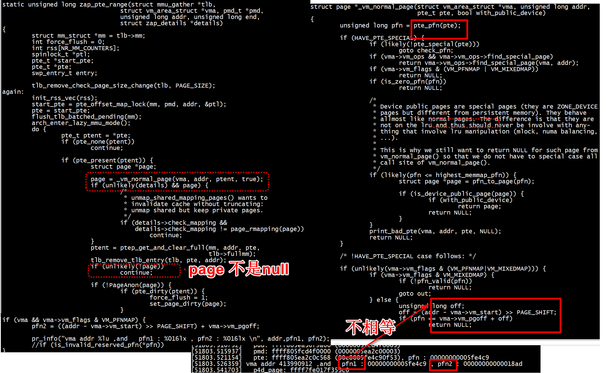

```
[root@centos7 handle_mm_fault]# dmesg | tail -n 50
[710963.878650] sample_open
[710963.881285] sample_write
[710963.883896] no page for vma addr  849805312 
[710963.888256]   ------------------------------
[710963.892598]   virtual user addr: 0000000032a70000
[710963.897369]   pgd: ffffa05fd30a4400 (0000005f37420003) 
[710963.897372]   p4d: ffffa05fd30a4400 (0000005f37420003) 
[710963.902672]   pud: ffffa05fd30a4400 (0000005f37420003) 
[710963.907971]   pmd: ffff805f37420008 (0000005fc7230003) 
[710963.913262]   pte: ffff805fc7239538 (00e8005690060f53) 
[710963.918566]   p4d_page: ffff7fe017cdd080
[710963.927859]   pud_page: ffff7fe017cdd080
[710963.931853]   pmd_page: ffff7fe017f1c8c0
[710963.935845]   pte_page: ffff7fe015a40180
[710963.939849]   physical addr: 0000005690060000
[710963.944274]   page addr: 0000005690060000
[710963.948361]   ------------------------------
[710963.952760] #########  after get_user_pages_remote ############# 
[710963.958930]   ------------------------------
[710963.963271]   virtual user addr: 0000000032a70000
[710963.968053]   pgd: ffffa05fd30a4400 (0000005f37420003) 
[710963.968055]   p4d: ffffa05fd30a4400 (0000005f37420003) 
[710963.973345]   pud: ffffa05fd30a4400 (0000005f37420003) 
[710963.978647]   pmd: ffff805f37420008 (0000005fc7230003) 
[710963.983937]   pte: ffff805fc7239538 (00e8005690060f53) 
[710963.989235]   p4d_page: ffff7fe017cdd080
[710963.998530]   pud_page: ffff7fe017cdd080
[710964.002524]   pmd_page: ffff7fe017f1c8c0
[710964.006518]   pte_page: ffff7fe015a40180
[710964.010523]   physical addr: 0000005690060000
[710964.014949]   page addr: 0000005690060000
[710964.019041]   ------------------------------
[710964.023381] Got mmaped.

[711675.260421] #########  after zap_vma_ptes( -1 ) ############# 
[711675.266326]   ------------------------------
[711675.270667]   virtual user addr: 000000003e2d0000
[711675.275438]   pgd: ffffa05fd057a000 (0000005fd5800003) 
[711675.275441]   p4d: ffffa05fd057a000 (0000005fd5800003) 
[711675.280743]   pud: ffffa05fd057a000 (0000005fd5800003) 
[711675.286044]   pmd: ffff805fd5800008 (0000005f04c40003) 
[711675.291335]   pte: ffff805f04c4f168 (00e8005683640f53) 
[711675.296637]   p4d_page: ffff7fe017f56000
[711675.305929]   pud_page: ffff7fe017f56000
[711675.309924]   pmd_page: ffff7fe017c13100
[711675.313918]   pte_page: ffff7fe015a0d900
[711675.317923]   physical addr: 0000005683640000
[711675.322350]   page addr: 0000005683640000
[711675.326440]   ------------------------------
[711675.330944] sample_release
```
+ after zap_vma_ptes物理地址仍然存在,返回值是-1       

+    pgd 、p4d、pud、pmd、pte_val(*pte) 的值都不是0    


```Text    
This function only unmaps ptes assigned to VM_PFNMAP vmas.

The entire address range must be fully contained within the vma.

Returns 0 if successful.
```


```
/**
 * zap_vma_ptes - remove ptes mapping the vma
 * @vma: vm_area_struct holding ptes to be zapped
 * @address: starting address of pages to zap
 * @size: number of bytes to zap
 *
 * This function only unmaps ptes assigned to VM_PFNMAP vmas.
 *
 * The entire address range must be fully contained within the vma.
 *
 * Returns 0 if successful.
 */
int zap_vma_ptes(struct vm_area_struct *vma, unsigned long address,
		unsigned long size)
{
	if (address < vma->vm_start || address + size > vma->vm_end ||
	    		!(vma->vm_flags & VM_PFNMAP))
		return -1;
	zap_page_range_single(vma, address, size, NULL);
	return 0;
}
EXPORT_SYMBOL_GPL(zap_vma_ptes);
```

#  VM_PFNMAP   


```
#if 1
    if (follow_pfn(vma, arg, &pfn))
    {
        //vma->vm_flags |= VM_IO | VM_DONTCOPY | VM_DONTEXPAND | VM_NORESERVE |
        //                      VM_DONTDUMP | VM_PFNMAP;
        vma->vm_flags |= VM_PFNMAP;
        printk(KERN_INFO "no page for vma addr  %lu \n",arg);
        handle_mm_fault(vma, arg, FAULT_FLAG_WRITE);

    }
    printk_pagetable(arg);
#if 0
    res = get_user_pages_remote(current, current->mm,
                                arg , 1, 0,  pages, &vma,NULL);
    pr_info("#########  after get_user_pages_remote ############# \n");
    printk_pagetable(arg);

    page = pages[0];
    if (res < 1) {
        printk(KERN_INFO "GUP error: %d\n", res);
        free_page((unsigned long) page);
        return -EFAULT;
    }
#endif
#else
        res = get_user_pages(
                arg ,
                1,
                1,
                &page,
                NULL);
#endif
```
+ vma->vm_flags |= VM_PFNMAP; vma->vm_flags设置VM_PFNMAP   


+  vma->vm_flags设置VM_PFNMAP 后，不能调用get_user_pages_remote（返回GUP error: -14） 


```
[root@centos7 handle_mm_fault]# ./user_test 
data is 
```


```
[712385.994515] sample_open
[712385.997136] sample_write
[712385.999748] no page for vma addr  454033408 
[712386.004119]   ------------------------------
[712386.008462]   virtual user addr: 000000001b100000
[712386.013236]   pgd: ffff805f053c7800 (0000005f65a80003) 
[712386.013238]   p4d: ffff805f053c7800 (0000005f65a80003) 
[712386.018544]   pud: ffff805f053c7800 (0000005f65a80003) 
[712386.023836]   pmd: ffff805f65a80000 (0000005f36430003) 
[712386.029139]   pte: ffff805f3643d880 (00e800568f1a0f53) 
[712386.034440]   p4d_page: ffff7fe017d96a00
[712386.043724]   pud_page: ffff7fe017d96a00
[712386.047729]   pmd_page: ffff7fe017cd90c0
[712386.051723]   pte_page: ffff7fe015a3c680
[712386.055727]   physical addr: 000000568f1a0000
[712386.060155]   page addr: 000000568f1a0000
[712386.064250]   ------------------------------
[712386.068687] #########  after zap_vma_ptes( 0 ) ############# 
[712386.074507]   ------------------------------
[712386.078846]   virtual user addr: 000000001b100000
[712386.083617]   pgd: ffff805f053c7800 (0000005f65a80003) 
[712386.083619]   p4d: ffff805f053c7800 (0000005f65a80003) 
[712386.088923]   pud: ffff805f053c7800 (0000005f65a80003) 
[712386.094225]   pmd: ffff805f65a80000 (0000005f36430003) 
[712386.099515]   pte: ffff805f3643d880 (0000000000000000) 
[712386.104813]   p4d_page: ffff7fe017d96a00
[712386.114105]   pud_page: ffff7fe017d96a00
[712386.118100]   pmd_page: ffff7fe017cd90c0
[712386.122093]   pte_page: ffff7fe000000000
[712386.126096]   physical addr: 0000000000000000
[712386.130522]   page addr: 0000000000000000
[712386.134615]   ------------------------------
[712386.139086] sample_release
```
after zap_vma_ptes物理地址不存在,返回值是0 

+  pgd 、p4d、pud、pmd的值都不是0    

+ 但是 pte_val(*pte) 是 (0000000000000000) 

#  vm_normal_page

关于normal页面和special页面？    
vm_normal_page根据pte来返回normal paging页面的struct page结构。   

一些特殊映射的页面是不会返回struct page结构的，这些页面不希望被参与到内存管理的一些活动中，如页面回收、页迁移和KSM等。

内核尝试用pte_mkspecial()宏来设置PTE_SPECIAL软件定义的比特位，主要用途有：      

+ 内核的零页面zero page    
+   大量的驱动程序使用remap_pfn_range()函数来实现映射内核页面到用户空间。这些用户程序使用的VMA通常设置了(VM_IO|VM_PFNMAP|VM_DONTEXPAND|VM_DONTDUMP)    
+ vm_insert_page()/vm_insert_pfn()映射内核页面到用户空间    


vm_normal_page()函数把page页面分为两阵营，一个是normal page，另一个是special page。   

normal page通常指正常mapping的页面，例如匿名页面、page cache和共享内存页面等。   
special page通常指不正常mapping的页面，这些页面不希望参与内存管理的回收或者合并功能，比如：  
+ VM_IO：为IO设备映射   
+ VM_PFN_MAP：纯PFN映射  
+ VM_MIXEDMAP：固定映射   

# zap_pte_range   
```
Call Trace:
[<ffffffff810061dc>] dump_trace+0x6c/0x2d0
[<ffffffff8139bab6>] dump_stack+0x69/0x73
[<ffffffff810d09ee>] print_bad_pte+0x1ae/0x290
[<ffffffff810d0b2d>] vm_normal_page+0x5d/0x70
[<ffffffff810d101a>] zap_pte_range+0x12a/0x410
[<ffffffff810d2237>] unmap_page_range+0x257/0x330
[<ffffffff810d347f>] unmap_vmas+0x1cf/0x320
[<ffffffff810d6c5f>] unmap_region+0x8f/0x140
[<ffffffff810d7fa3>] do_munmap+0x323/0x3b0
[<ffffffff811785e0>] sys_shmdt+0xc0/0x170
[<ffffffff81002f7b>] system_call_fastpath+0x16/0x1b
[<00007f4b2c57a927>] 0x7f4b2c57a927
Disabling lock debugging due to kernel taint
swap_free: Bad swap offset entry 06000000
```

#  kfd


> ##   zap_vma_ptes


```
void kfd_doorbell_unmap_locked(struct kfd_process_device *pdd)
{
	struct kfd_process *process = pdd->process;
	struct vm_area_struct *vma;
	size_t size;

	vma = pdd->qpd.doorbell_vma;
	/* Remember if the process was evicted without doorbells
	 * mapped to user mode.
	 */
	if (!vma) {
		pdd->qpd.doorbell_mapped = -1;
		return;
	}

	pr_debug("Process %d unmapping doorbell 0x%lx\n",
			process->pasid, vma->vm_start);

	size = kfd_doorbell_process_slice(pdd->dev);
	zap_vma_ptes(vma, vma->vm_start, size);
	pdd->qpd.doorbell_mapped = 0;
}
```

> ##  io_remap_pfn_range   VM_IO | VM_PFNMAP
```
int kfd_doorbell_mmap(struct kfd_dev *dev, struct kfd_process *process,
		      struct vm_area_struct *vma)
{
	phys_addr_t address;
	struct kfd_process_device *pdd;
	int ret;

	/*
	 * For simplicitly we only allow mapping of the entire doorbell
	 * allocation of a single device & process.
	 */
	if (vma->vm_end - vma->vm_start != kfd_doorbell_process_slice(dev))
		return -EINVAL;

	pdd = kfd_get_process_device_data(dev, process);
	if (!pdd)
		return -EINVAL;

	/* Calculate physical address of doorbell */
	address = kfd_get_process_doorbells(pdd);
	vma->vm_flags |= VM_IO | VM_DONTCOPY | VM_DONTEXPAND | VM_NORESERVE |
				VM_DONTDUMP | VM_PFNMAP;

	vma->vm_page_prot = pgprot_noncached(vma->vm_page_prot);

	pr_debug("Process %d mapping doorbell page\n"
		 "     target user address == 0x%08llX\n"
		 "     physical address    == 0x%08llX\n"
		 "     vm_flags            == 0x%04lX\n"
		 "     size                == 0x%04lX\n",
		 process->pasid, (unsigned long long) vma->vm_start,
		 address, vma->vm_flags, kfd_doorbell_process_slice(dev));

	pdd = kfd_get_process_device_data(dev, process);
	if (WARN_ON_ONCE(!pdd))
		return 0;

	mutex_lock(&pdd->qpd.doorbell_lock);

	ret = io_remap_pfn_range(vma,
				vma->vm_start,
				address >> PAGE_SHIFT,
				kfd_doorbell_process_slice(dev),
				vma->vm_page_prot);

	if (!ret && keep_idle_process_evicted) {
		vma->vm_ops = &kfd_doorbell_vm_ops;
		vma->vm_private_data = pdd;
		pdd->qpd.doorbell_vma = vma;

		/* If process is evicted before the first queue is created,
		 * process will be restored by the page fault when the
		 * doorbell is accessed the first time
		 */
		if (pdd->qpd.doorbell_mapped == -1) {
			pr_debug("Process %d evicted, unmapping doorbell\n",
				process->pasid);
			kfd_doorbell_unmap_locked(pdd);
		} else {
			pdd->qpd.doorbell_mapped = 1;
		}
	}

	mutex_unlock(&pdd->qpd.doorbell_lock);

	return ret;
}

```
# pmem

```
	if (data->vma && PMEM_IS_SUBMAP(data)) {
		if (operation == PMEM_MAP)
			ret = pmem_remap_pfn_range(id, data->vma, data,
						   region->offset, region->len);
		else if (operation == PMEM_UNMAP)
			ret = pmem_unmap_pfn_range(id, data->vma, data,
						   region->offset, region->len);
	}
```
zap_page_range   

 
zap_page_range()会遍历给定范围内所有的VMA, 对每一个VMA调用unmap_single_vma(…)   
后续会沿着unmap_single_vma() => unmap_page_range() => zap_pud_range() => zap_pmd_range() => zap_pte_range()的路径遍历各级页表项, 最后调用zap_pte_range()遍历每一个PTE   

```
static int pmem_unmap_pfn_range(int id, struct vm_area_struct *vma,
				struct pmem_data *data, unsigned long offset,
				unsigned long len)
{
	int garbage_pages;
	DLOG("unmap offset %lx len %lx\n", offset, len);

	BUG_ON(!PMEM_IS_PAGE_ALIGNED(len));

	garbage_pages = len >> PAGE_SHIFT;
	zap_page_range(vma, vma->vm_start + offset, len, NULL);
	pmem_map_garbage(id, vma, data, offset, len);
	return 0;
}

static int pmem_map_pfn_range(int id, struct vm_area_struct *vma,
			      struct pmem_data *data, unsigned long offset,
			      unsigned long len)
{
	DLOG("map offset %lx len %lx\n", offset, len);
	BUG_ON(!PMEM_IS_PAGE_ALIGNED(vma->vm_start));
	BUG_ON(!PMEM_IS_PAGE_ALIGNED(vma->vm_end));
	BUG_ON(!PMEM_IS_PAGE_ALIGNED(len));
	BUG_ON(!PMEM_IS_PAGE_ALIGNED(offset));

	if (io_remap_pfn_range(vma, vma->vm_start + offset,
		(pmem_start_addr(id, data) + offset) >> PAGE_SHIFT,
		len, vma->vm_page_prot)) {
		return -EAGAIN;
	}
	return 0;
}

static int pmem_remap_pfn_range(int id, struct vm_area_struct *vma,
			      struct pmem_data *data, unsigned long offset,
			      unsigned long len)
{
	/* hold the mm semp for the vma you are modifying when you call this */
	BUG_ON(!vma);
	zap_page_range(vma, vma->vm_start + offset, len, NULL);
	return pmem_map_pfn_range(id, vma, data, offset, len);
}
```
> ##  unmap_single_vma  

unmap_single_vma() => unmap_page_range() => zap_pud_range() => zap_pmd_range() => zap_pte_range()   
```
static void unmap_single_vma(struct mmu_gather *tlb,
		struct vm_area_struct *vma, unsigned long start_addr,
		unsigned long end_addr,
		struct zap_details *details)
{
	unsigned long start = max(vma->vm_start, start_addr);
	unsigned long end;

	if (start >= vma->vm_end)
		return;
	end = min(vma->vm_end, end_addr);
	if (end <= vma->vm_start)
		return;

	if (vma->vm_file)
		uprobe_munmap(vma, start, end);

	if (unlikely(vma->vm_flags & VM_PFNMAP))
		untrack_pfn(vma, 0, 0);

	if (start != end) {
		if (unlikely(is_vm_hugetlb_page(vma))) {
			/*
			 * It is undesirable to test vma->vm_file as it
			 * should be non-null for valid hugetlb area.
			 * However, vm_file will be NULL in the error
			 * cleanup path of mmap_region. When
			 * hugetlbfs ->mmap method fails,
			 * mmap_region() nullifies vma->vm_file
			 * before calling this function to clean up.
			 * Since no pte has actually been setup, it is
			 * safe to do nothing in this case.
			 */
			if (vma->vm_file) {
				i_mmap_lock_write(vma->vm_file->f_mapping);
				__unmap_hugepage_range_final(tlb, vma, start, end, NULL);
				i_mmap_unlock_write(vma->vm_file->f_mapping);
			}
		} else
			unmap_page_range(tlb, vma, start, end, details);
	}
}
```

#  zap_pte_range

```
static unsigned long zap_pte_range(struct mmu_gather *tlb,
				struct vm_area_struct *vma, pmd_t *pmd,
				unsigned long addr, unsigned long end,
				struct zap_details *details)
{
	struct mm_struct *mm = tlb->mm;
	int force_flush = 0;
	int rss[NR_MM_COUNTERS];
	spinlock_t *ptl;
	pte_t *start_pte;
	pte_t *pte;
	swp_entry_t entry;
	struct page *pending_page = NULL;

again:
	init_rss_vec(rss);
	start_pte = pte_offset_map_lock(mm, pmd, addr, &ptl);
	pte = start_pte;
	flush_tlb_batched_pending(mm);
	arch_enter_lazy_mmu_mode();
	do {
		pte_t ptent = *pte;
		if (pte_none(ptent)) {
			continue;
		}

		if (pte_present(ptent)) {
			struct page *page;

			page = vm_normal_page(vma, addr, ptent);
			if (unlikely(details) && page) {
				/*
				 * unmap_shared_mapping_pages() wants to
				 * invalidate cache without truncating:
				 * unmap shared but keep private pages.
				 */
				if (details->check_mapping &&
				    details->check_mapping != page_rmapping(page))
					continue;
			}
			ptent = ptep_get_and_clear_full(mm, addr, pte,
							tlb->fullmm);
			tlb_remove_tlb_entry(tlb, pte, addr);
			if (unlikely(!page))
				continue;

			if (!PageAnon(page)) {
				if (pte_dirty(ptent)) {
					/*
					 * oom_reaper cannot tear down dirty
					 * pages
					 */
					if (unlikely(details && details->ignore_dirty))
						continue;
					force_flush = 1;
					set_page_dirty(page);
				}
				if (pte_young(ptent) &&
				    likely(!(vma->vm_flags & VM_SEQ_READ)))
					mark_page_accessed(page);
			}
			rss[mm_counter(page)]--;
			page_remove_rmap(page, false);
			if (unlikely(page_mapcount(page) < 0))
				print_bad_pte(vma, addr, ptent, page);
			if (unlikely(__tlb_remove_page(tlb, page))) {
				force_flush = 1;
				pending_page = page;
				addr += PAGE_SIZE;
				break;
			}
			continue;
		}

		entry = pte_to_swp_entry(ptent);
		if (!non_swap_entry(entry)) {
			/* Genuine swap entry, hence a private anon page */
			if (!should_zap_cows(details))
				continue;
			rss[MM_SWAPENTS]--;
		} else if (is_migration_entry(entry)) {
			struct page *page;

			page = migration_entry_to_page(entry);
			if (details && details->check_mapping &&
			    details->check_mapping != page_rmapping(page))
				continue;
			rss[mm_counter(page)]--;
		}
		if (unlikely(!free_swap_and_cache(entry)))
			print_bad_pte(vma, addr, ptent, NULL);
		pte_clear_not_present_full(mm, addr, pte, tlb->fullmm);
	} while (pte++, addr += PAGE_SIZE, addr != end);

	add_mm_rss_vec(mm, rss);
	arch_leave_lazy_mmu_mode();

	/* Do the actual TLB flush before dropping ptl */
	if (force_flush)
		tlb_flush_mmu_tlbonly(tlb);
	pte_unmap_unlock(start_pte, ptl);

	/*
	 * If we forced a TLB flush (either due to running out of
	 * batch buffers or because we needed to flush dirty TLB
	 * entries before releasing the ptl), free the batched
	 * memory too. Restart if we didn't do everything.
	 */
	if (force_flush) {
		force_flush = 0;
		tlb_flush_mmu_free(tlb);
		if (pending_page) {
			/* remove the page with new size */
			__tlb_remove_pte_page(tlb, pending_page);
			pending_page = NULL;
		}
		if (addr != end)
			goto again;
	}

	return addr;
}

```

# test3



```
[53697.422954] sample_write
[53697.425479] no page for vma addr  275185664 
[53697.429771]   ------------------------------
[53697.434027]   virtual user addr: 0000000010670000
[53697.438728]   pgd: ffff805ea39aea00 (0000005fdaee0003) 
[53697.438732]   p4d: ffff805ea39aea00 (0000005fdaee0003) 
[53697.443938]   pud: ffff805ea39aea00 (0000005fdaee0003) 
[53697.449155]   pmd: ffff805fdaee0000 (0000005fd6810003) 
[53697.454361]   pte: ffff805fd6818338 (00e8005e14c40f53), pfn : 00000000005e14c4 
[53697.459578] vma addr 275185664 ,and   pfn1 : 00000000005e14c4 , pfn2 : 0000000000001067 
[53697.474919] Got page.

[53697.478717]   p4d_page: ffff7fe017f6bb80
[53697.482625]   pud_page: ffff7fe017f6bb80
[53697.486532]   pmd_page: ffff7fe017f5a040
[53697.490458]   pte_page: ffff7fe017853100
[53697.494367]   physical addr: 0000005e14c40000
[53697.498719]   page addr: 0000005e14c40000
[53697.502715]   ------------------------------
[53697.507093] sample_read
[53697.509540] #########  after zap_vma_ptes( 0 ) ############# 
[53697.515262]   ------------------------------
[53697.519532]   virtual user addr: 0000000010670000
[53697.524220]   pgd: ffff805ea39aea00 (0000005fdaee0003) 
[53697.524223]   p4d: ffff805ea39aea00 (0000005fdaee0003) 
[53697.529436]   pud: ffff805ea39aea00 (0000005fdaee0003) 
[53697.534641]   pmd: ffff805fdaee0000 (0000005fd6810003) 
[53697.539856]   pte: ffff805fd6818338 (0000000000000000), pfn : 0000000000000000 
[53697.545061] vma addr 275185664 ,and   pfn1 : 0000000000000000 , pfn2 : 0000000000001067 
[53697.560407]   p4d_page: ffff7fe017f6bb80
[53697.564313]   pud_page: ffff7fe017f6bb80
[53697.568228]   pmd_page: ffff7fe017f5a040
[53697.572136]   pte_page: ffff7fe000000000
[53697.576042]   physical addr: 0000000000000000
[53697.580396]   page addr: 0000000000000000
[53697.584390]   ------------------------------
[53697.588709] sample_release
```