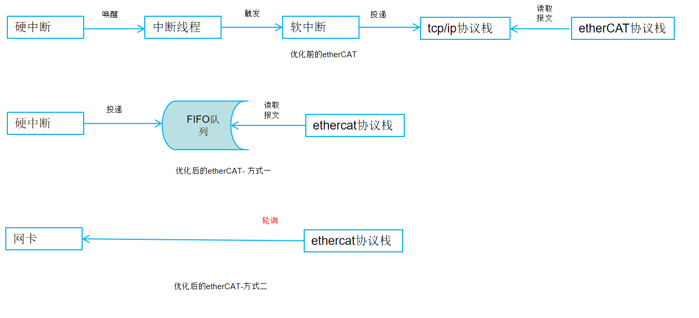
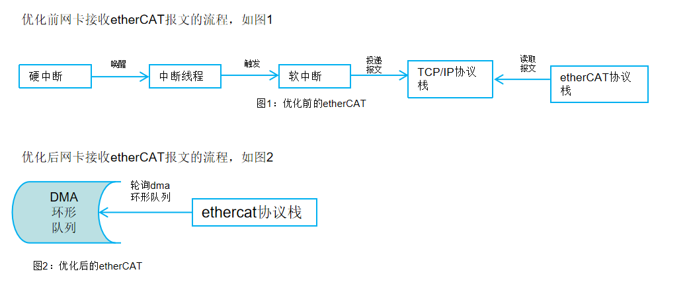
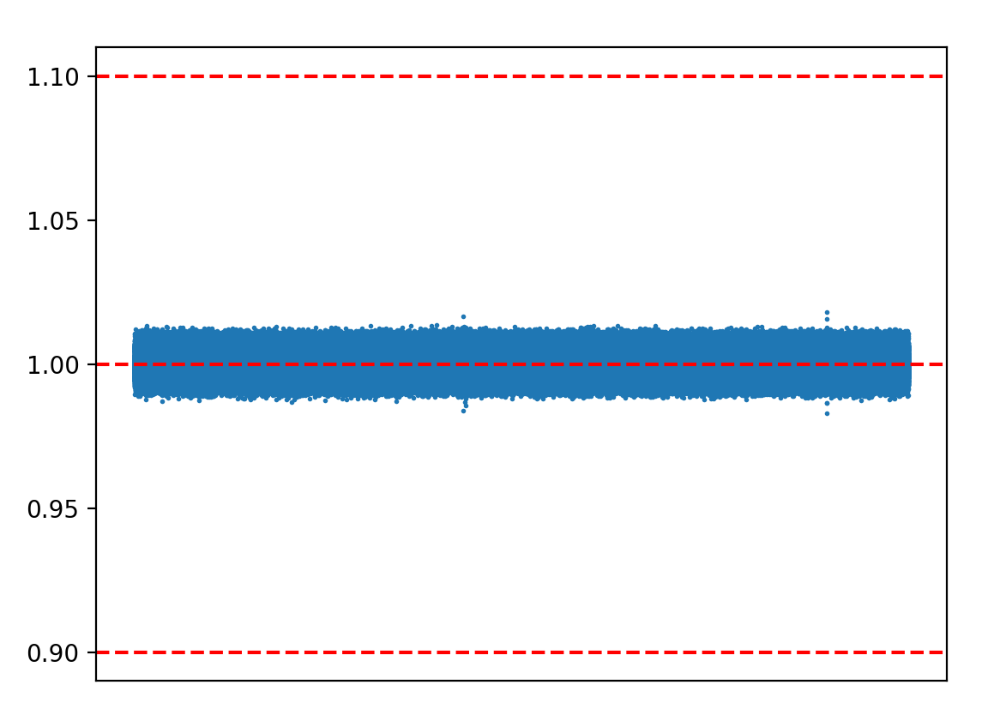
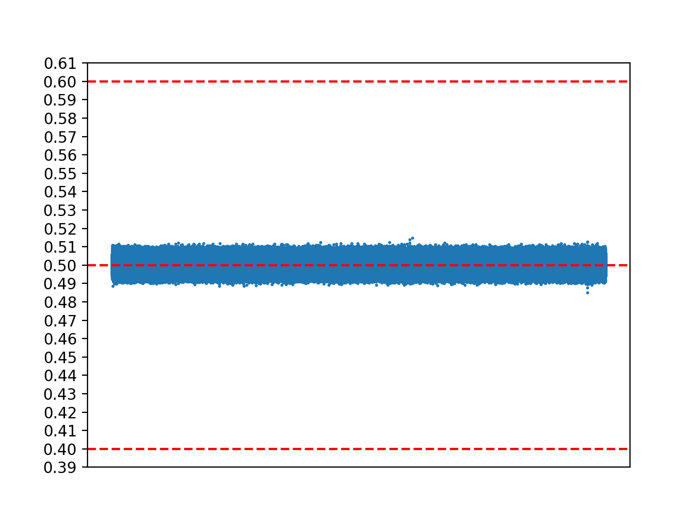

# 网卡优化（采用中断方式） 
不需要linux内核协议栈的软中断处理、中断线程化       
   


## poll（更优）





### ecat 1000us 测试（采用poll方式）


max= 1.018240 min = 0.982960, max -min=0.035280   

### ecat 500us 测试（采用poll方式）


max= 0.514720 min = 0.484960  max -min=0.029760   

#  进程调度API之preempt_count_add/preempt_count_sub


void preempt_count_add(int val) 用于增加当前进程的引用计数，这样可以避免当前进程被抢占
与之对应的是void preempt_count_sub(int val)
用来当前进程的引用计数，这样当引用计数为0时，当前进程就可以被抢占.
这两个函数是一对的，一般一起使用
其使用的例程如下：
``` 
#define __irq_enter()					\
	do {						\
		account_irq_enter_time(current);	\
		preempt_count_add(HARDIRQ_OFFSET);	\
		trace_hardirq_enter();			\
	} while (0)
 
/*
 * Exit irq context without processing softirqs:
 */
#define __irq_exit()					\
	do {						\
		trace_hardirq_exit();			\
		account_irq_exit_time(current);		\
		preempt_count_sub(HARDIRQ_OFFSET);	\
	} while (0)
```
	
可以看到在进入irq是调用preempt_count_add 来增加引用计数避免被抢占，离开irq是调用preempt_count_sub 来减少引用计数使能抢占
其源码分析如下：
```
void preempt_count_add(int val)
{
 
#ifdef CONFIG_DEBUG_PREEMPT
	/*
	 * Underflow?
	 */
	if (DEBUG_LOCKS_WARN_ON((preempt_count() < 0)))
		return;
#endif
	__preempt_count_add(val);
#ifdef CONFIG_DEBUG_PREEMPT
	/*
	 * Spinlock count overflowing soon?
	 */
	DEBUG_LOCKS_WARN_ON((preempt_count() & PREEMPT_MASK) >=
				PREEMPT_MASK - 10);
#endif
	preempt_latency_start(val);
}
```
假定不打开CONFIG_DEBUG_PREEMPT的话，则preempt_count_add 中首先调用__preempt_count_add 来增加引用计数，然后调用preempt_latency_start 来开始
Start timing the latency.这个has如果没有定义CONFIG_DEBUG_PREEMPT 和 CONFIG_PREEMPT_TRACER的话，也等同于空函数.    
```
void preempt_count_sub(int val)
{
#ifdef CONFIG_DEBUG_PREEMPT
	/*
	 * Underflow?
	 */
	if (DEBUG_LOCKS_WARN_ON(val > preempt_count()))
		return;
	/*
	 * Is the spinlock portion underflowing?
	 */
	if (DEBUG_LOCKS_WARN_ON((val < PREEMPT_MASK) &&
			!(preempt_count() & PREEMPT_MASK)))
		return;
#endif
 
	preempt_latency_stop(val);
	__preempt_count_sub(val);
}
```
假定不打开CONFIG_DEBUG_PREEMPT的话，则ppreempt_count_sub 中首先调用preempt_latency_stop 来Stop timing the latency来增加引用计数，然后调用preempt_latency_start 来开始   

# 真正执行抢占的地方

> ## 执行 user preemption
系统调用和中断返回用户空间的时候：

它们都是在 ret_to_user() 里判断是否执行用户抢占。
```
// arch/arm64/kernel/entry.S
ret_to_user() // 返回到用户空间
    work_pending()
        do_notify_resume()
            schedule() 

// arch/arm64/kernel/signal.c
asmlinkage void do_notify_resume(struct pt_regs *regs,
    unsigned long thread_flags)
{
 do {
      [...]
        // 检查是否要需要调度
      if (thread_flags & _TIF_NEED_RESCHED) {
           local_daif_restore(DAIF_PROCCTX_NOIRQ);
           schedule();
      } else {
           [...]
 } while (thread_flags & _TIF_WORK_MASK);
}
```
> ## 执行 kernel preemption
+ ***中断返回内核空间的时候：***
```
// arch/arm64/kernel/entry.S
el1_irq
    irq_handler
    arm64_preempt_schedule_irq
        preempt_schedule_irq
            __schedule(true) 

// kernel/sched/core.c
/* This is the entry point to schedule() from kernel preemption */
asmlinkage __visible void __sched preempt_schedule_irq(void)
{
 [...]
 do {
      preempt_disable();
      local_irq_enable();
      __schedule(true);
      local_irq_disable();
      sched_preempt_enable_no_resched();
 } while (need_resched());

 exception_exit(prev_state);
}
```
+  内核恢复为可抢占的时候：  

前面列举了集中关闭抢占的场景，当离开这些场景时，会恢复内核抢占。   

例如 spinlock unlock 时：    

```
static inline void __raw_spin_unlock(raw_spinlock_t *lock)
{
     spin_release(&lock->dep_map, 1, _RET_IP_);
     do_raw_spin_unlock(lock);
     preempt_enable();  // 使能抢占时，如果需要，就会执行抢占
}

// include/linux/preempt.h
#define preempt_enable() \
do { \
     barrier(); \
     if (unlikely(preempt_count_dec_and_test())) \
          __preempt_schedule(); \
} while (0)
```
内核显式地要求调度的时候：  

内核里有大量的地方会显式地要求进行调度，最常见的是：cond_resched() 和 sleep()类函数，它们最终都会调用到 __schedule()。   

内核阻塞的时候：   

例如 mutex，sem，waitqueue 获取不到资源，或者是等待 IO。这种情况下进程会将自己的状态从　TASK_RUNNING 修改为 TASK_INTERRUPTIBLE，然后调用 schedule() 主动让出 CPU 并等待唤醒。     

```
/ block/blk-core.c
static struct request *get_request(struct request_queue *q, int op,
       int op_flags, struct bio *bio,
       gfp_t gfp_mask)
{
    [...]
    prepare_to_wait_exclusive(&rl->wait[is_sync], &wait,
      TASK_UNINTERRUPTIBLE);
    io_schedule();  // 会调用 schedule();
    [...]
}
```

#   up(struct semaphore *sem)

```
/**
 * up - release the semaphore
 * @sem: the semaphore to release
 *
 * Release the semaphore.  Unlike mutexes, up() may be called from any
 * context and even by tasks which have never called down().
 */
void up(struct semaphore *sem)
{
        unsigned long flags;

        raw_spin_lock_irqsave(&sem->lock, flags);
        if (likely(list_empty(&sem->wait_list)))
                sem->count++;
        else
                __up(sem);
        raw_spin_unlock_irqrestore(&sem->lock, flags);
}
EXPORT_SYMBOL(up);
```

# memory


kmap(page) will cause heavy jitter    
 