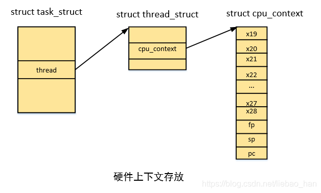

#  上下文切换详细过程


进程上下文切换主要涉及到两部分主要过程：进程地址空间切换和处理器状态切换。地址空间切换主要是针对用户进程而言，而处理器状态切换对应于所有的调度单位。下面我们分别看下这两个过程：

```
__schedule   // kernel/sched/core.c
->context_switch
  ->switch_mm_irqs_off   //进程地址空间切换
  ->switch_to //处理器状态切换
```



```
context_switch  // kernel/sched/core.c
->switch_mm_irqs_off
  ->switch_mm
  ->__switch_mm
    ->check_and_switch_context
    ->cpu_switch_mm
      ->cpu_do_switch_mm(virt_to_phys(pgd),mm) //arch/arm64/include/asm/mmu_context.h
    
arch/arm64/mm/proc.S
158 /*
159  *      cpu_do_switch_mm(pgd_phys, tsk)
160  *
161  *      Set the translation table base pointer to be pgd_phys.
162  *
163  *      - pgd_phys - physical address of new TTB
164  */
165 ENTRY(cpu_do_switch_mm)
166         mrs     x2, ttbr1_el1
167         mmid    x1, x1                          // get mm->context.id
168         phys_to_ttbr x3, x0
169
170 alternative_if ARM64_HAS_CNP
171         cbz     x1, 1f                          // skip CNP for reserved ASID
172         orr     x3, x3, #TTBR_CNP_BIT
173 1:
174 alternative_else_nop_endif
175 #ifdef CONFIG_ARM64_SW_TTBR0_PAN
176         bfi     x3, x1, #48, #16                // set the ASID field in TTBR0
177 #endif
178         bfi     x2, x1, #48, #16                // set the ASID
179         msr     ttbr1_el1, x2                   // in TTBR1 (since TCR.A1 is set)
180         isb
181         msr     ttbr0_el1, x3                   // now update TTBR0
182         isb
183         b       post_ttbr_update_workaround     // Back to C code...
184 ENDPROC(cpu_do_switch_mm)
```

> ## check_and_switch_context
[一篇解析context_switch进程切换(针对ARM体系架构)](https://www.bilibili.com/read/cv28229570/)   
[进程切换分析（2）：TLB处理](https://cloud.tencent.com/developer/article/2431036)   

+ 进程切换过程中ARM64的tlb操作以及ASID的处理

```
void check_and_switch_context(struct mm_struct *mm, unsigned int cpu)
{
    unsigned long flags;
    u64 asid;
    asid = atomic64_read(&mm->context.id); －－－－－－－－－－－－－（1）
    if (!((asid ^ atomic64_read(&asid_generation)) >> asid_bits) －－－－－－（2）
        && atomic64_xchg_relaxed(&per_cpu(active_asids, cpu), asid))
        goto switch_mm_fastpath;
    raw_spin_lock_irqsave(&cpu_asid_lock, flags); 
    asid = atomic64_read(&mm->context.id);
    if ((asid ^ atomic64_read(&asid_generation)) >> asid_bits) { －－－－－－（3）
        asid = new_context(mm, cpu);
        atomic64_set(&mm->context.id, asid);
    }
    if (cpumask_test_and_clear_cpu(cpu, &tlb_flush_pending)) －－－－－－（4）
        local_flush_tlb_all();
    atomic64_set(&per_cpu(active_asids, cpu), asid);
    raw_spin_unlock_irqrestore(&cpu_asid_lock, flags);
switch_mm_fastpath:
    cpu_switch_mm(mm->pgd, mm);
}
```
看到这些代码的时候，你一定很抓狂：本来期望支持ASID的情况下，进程切换不需要TLB flush的操作了吗？怎么会有那么多代码？呵呵～～实际上理想很美好，现实很骨干，代码中嵌入太多管理asid的内容了。    

（1）现在准备切入mm变量指向的地址空间，首先通过内存描述符获取该地址空间的ID（software asid）。需要说明的是这个ID并不是HW asid，实际上mm->context.id是64个bit，其中低16 bit对应HW 的ASID（ARM64支持8bit或者16bit的ASID，但是这里假设当前系统的ASID是16bit）。其余的bit都是软件扩展的，我们称之generation。    

（2）arm64支持ASID的概念，理论上进程切换不需要TLB的操作，不过由于HW asid的编址空间有限，因此我们扩展了64 bit的software asid，其中一部分对应HW asid，另外一部分被称为asid generation。asid generation从ASID_FIRST_VERSION开始，每当HW asid溢出后，asid generation会累加。asid_bits就是硬件支持的ASID的bit数目，8或者16，通过ID_AA64MMFR0_EL1寄存器可以获得该具体的bit数目。    

当要切入的mm的software asid仍然处于当前这一批次（generation）的ASID的时候，切换中不需要任何的TLB操作，可以直接调用cpu_switch_mm进行地址空间的切换，当然，也会顺便设定active_asids这个percpu变量。   

（3）如果要切入的进程和当前的asid generation不一致，那么说明该地址空间需要一个新的software asid了，更准确的说是需要推进到new generation了。因此这里调用new_context分配一个新的context ID，并设定到mm->context.id中。    

（4）各个cpu在切入新一代的asid空间的时候会调用local_flush_tlb_all将本地tlb flush掉。   


# RISC-V 的switch_mm_irqs_off/switch_mm() 实现
[RISC-V Linux 上下文切换分析](https://tinylab.org/riscv-context-switch/)    

```
 // include/linux/mmu_context.h:8
/* Architectures that care about IRQ state in switch_mm can override this. */
#ifndef switch_mm_irqs_off
# define switch_mm_irqs_off switch_mm
#endif
```


```
// arch/riscv/mm/context.c:305
void switch_mm(struct mm_struct *prev, struct mm_struct *next,
	struct task_struct *task)
{
	unsigned int cpu;
	if (unlikely(prev == next))
		return;
	cpu = smp_processor_id();
	cpumask_clear_cpu(cpu, mm_cpumask(prev));
	cpumask_set_cpu(cpu, mm_cpumask(next));
	set_mm(next, cpu);
	flush_icache_deferred(next, cpu);
}
```

> ## riscv tlb

RISC-V --> switch_mm  --> set_mm  -->  set_mm_noasid   
```
// arch/riscv/mm/context.c:208
static inline void set_mm(struct mm_struct *mm, unsigned int cpu)
{
	if (static_branch_unlikely(&use_asid_allocator))
		set_mm_asid(mm, cpu);
	else
		set_mm_noasid(mm);
}
```

```
// arch/riscv/mm/context.c:201
static void set_mm_noasid(struct mm_struct *mm)
{
	/* Switch the page table and blindly nuke entire local TLB */
	csr_write(CSR_SATP, virt_to_pfn(mm->pgd) | satp_mode);
	local_flush_tlb_all();
}
```