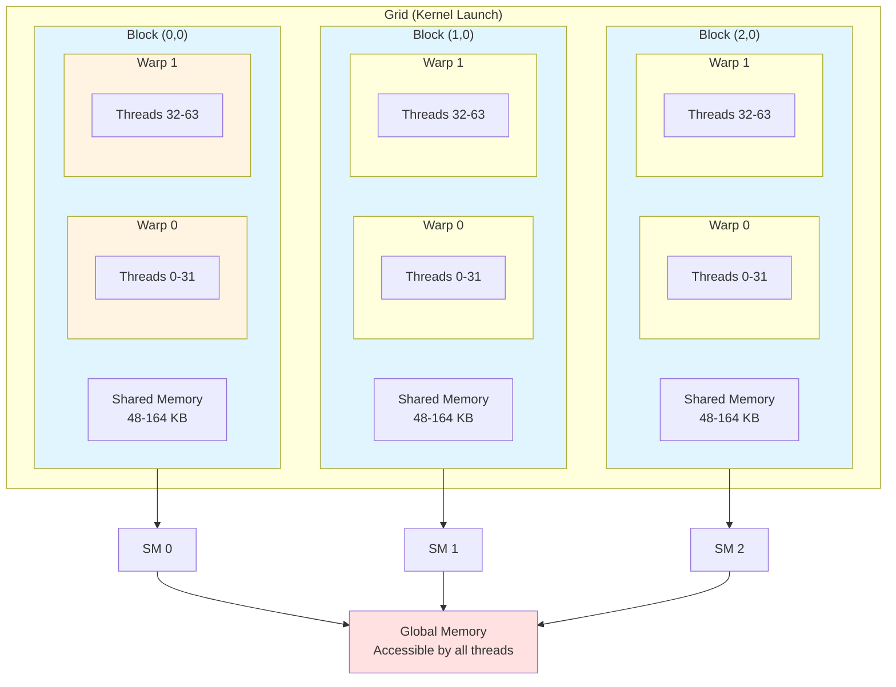

#  Thread Hierarchy Complete Guide

The CUDA thread hierarchy is the foundation of GPU parallel programming. Understanding how threads, warps, blocks, and grids work together is essential for writing efficient kernels and avoiding common pitfalls.

**[Back to Overview](1_cuda_execution_model.md)** | **Next: [Warp Execution Guide](3_warp_execution.md)**

---

##  **Table of Contents**

1. [ Thread Hierarchy Architecture](#-thread-hierarchy-architecture)
2. [ Thread Indexing Mastery](#-thread-indexing-mastery)
3. [ Dimensionality Design Patterns](#-dimensionality-design-patterns)
4. [ Launch Configuration Strategies](#-launch-configuration-strategies)
5. [ Performance Optimization](#-performance-optimization)
6. [ Debugging and Validation](#-debugging-and-validation)
7. [ Real-World Applications](#-real-world-applications)

---

##  **Thread Hierarchy Architecture**

CUDA organizes parallel execution in a four-level hierarchy that maps directly to GPU hardware capabilities. Each level serves a specific purpose in the overall execution model.



**Key Relationships:**
- **Grid** → Contains multiple **Blocks**
- **Block** → Contains multiple **Warps** (groups of 32 threads)
- **Warp** → Contains 32 **Threads** that execute in lockstep
- Each **Block** maps to an **SM** (Streaming Multiprocessor)

###  **Complete Hierarchy Breakdown**

| Level | Size Range | Hardware Mapping | Memory Scope | Synchronization | Lifetime |
|-------|------------|------------------|--------------|-----------------|----------|
| **Thread** | 1 unit | CUDA core | Private registers | None (independent) | Kernel duration |
| **Warp** | 32 threads | Warp scheduler | Warp-scoped ops | Implicit SIMT | Kernel duration |
| **Block** | 1-1024 threads | Portion of SM | Shared memory | `__syncthreads()` | Kernel duration |
| **Grid** | Unlimited blocks | Entire GPU | Global memory | None directly | Kernel duration |

###  **Visual Representation**
```
Grid (Kernel Launch)
 Block[0,0]               Block[1,0]               Block[2,0]
    Warp 0 Warp 0 Warp 0
       Thread[0-31]           Thread[0-31]           Thread[0-31]
       Registers Registers Registers
    Warp 1 Warp 1 Warp 1
       Thread[32-63]          Thread[32-63]          Thread[32-63]
       Registers Registers Registers
    Shared Memory Shared Memory Shared Memory
 Maps to SM[0]            Maps to SM[1]            Maps to SM[2]
```

###  **Thread-Level Detail**

Each thread represents the smallest unit of execution and has:

#### **Private Resources:**
- **Program Counter**: Tracks current instruction
- **Registers**: 32-255 registers depending on kernel complexity
- **Local Memory**: Overflow storage for complex data structures
- **Stack**: For function calls and local arrays

#### **Thread Characteristics:**
```cpp
__global__ void thread_info_kernel() {
    // Every thread has unique indices
    int threadId = threadIdx.x + threadIdx.y * blockDim.x + threadIdx.z * blockDim.x * blockDim.y;
    int globalId = threadId + blockIdx.x * blockDim.x * blockDim.y * blockDim.z;

    // Each thread maintains private state
    int private_var = threadId * 2;  // Unique to this thread
    float private_array[10];         // Private to this thread

    printf("Thread %d in block (%d,%d,%d) has private data: %d\n",
           threadId, blockIdx.x, blockIdx.y, blockIdx.z, private_var);
}
```

###  **Block-Level Detail**

Thread blocks enable cooperation through shared resources:

#### **Shared Resources:**
- **Shared Memory**: 48-164KB per block (architecture dependent)
- **Synchronization**: `__syncthreads()` barriers
- **Block-Wide Operations**: Voting, reduction patterns

#### **Block Characteristics:**
```cpp
__global__ void block_cooperation_kernel(float* global_data) {
    __shared__ float block_data[256];  // Shared by all threads in block
    __shared__ int block_counter;      // Shared counter

    int tid = threadIdx.x;
    int bid = blockIdx.x;

    // Initialize shared data (usually done by thread 0)
    if (tid == 0) {
        block_counter = 0;
        for (int i = 0; i < 256; i++) {
            block_data[i] = 0.0f;
        }
    }
    __syncthreads(); // Ensure initialization completes

    // All threads can now safely access shared data
    block_data[tid] = global_data[bid * blockDim.x + tid];
    atomicAdd(&block_counter, 1);

    __syncthreads(); // Ensure all loads complete

    // Collaborative processing
    if (tid == 0) {
        printf("Block %d processed %d elements\n", bid, block_counter);
    }
}
```

###  **Grid-Level Detail**

The grid represents the complete parallel workload:

#### **Grid Characteristics:**
- **Scalability**: Automatically distributes across available SMs
- **Independence**: Blocks execute independently (no guaranteed order)
- **Flexibility**: Can handle workloads larger than GPU capacity

---

##  **Thread Indexing Mastery**

Efficient indexing is crucial for correct and performant CUDA kernels. Master these patterns to avoid bugs and optimize memory access.

###  **Fundamental Indexing Formulas**

#### **1D Indexing (Most Common)**
```cpp
__global__ void vector_kernel(float* data, int N) {
    // Basic 1D indexing
    int idx = threadIdx.x + blockIdx.x * blockDim.x;

    // Always check bounds!
    if (idx < N) {
        data[idx] = data[idx] * 2.0f;
    }
}

// Advanced 1D with grid-stride loops (for large datasets)
__global__ void grid_stride_kernel(float* data, int N) {
    int idx = threadIdx.x + blockIdx.x * blockDim.x;
    int stride = blockDim.x * gridDim.x;

    // Process multiple elements per thread
    for (int i = idx; i < N; i += stride) {
        data[i] = data[i] * 2.0f;
    }
}
```

#### **2D Indexing (Matrices, Images)**
```cpp
__global__ void matrix_kernel(float* matrix, int width, int height) {
    // 2D thread indexing
    int col = threadIdx.x + blockIdx.x * blockDim.x;
    int row = threadIdx.y + blockIdx.y * blockDim.y;

    // Convert to 1D array index (row-major order)
    int idx = row * width + col;

    // Bounds checking for both dimensions
    if (col < width && row < height) {
        matrix[idx] = matrix[idx] * 2.0f;
    }
}

// Alternative: Direct 2D bounds checking
__global__ void matrix_kernel_alt(float* matrix, int width, int height) {
    int col = threadIdx.x + blockIdx.x * blockDim.x;
    int row = threadIdx.y + blockIdx.y * blockDim.y;

    if (col < width && row < height) {
        // Direct 2D access
        matrix[row * width + col] = computeValue(row, col);
    }
}
```

#### **3D Indexing (Volumes, Tensors)**
```cpp
__global__ void volume_kernel(float* volume, int width, int height, int depth) {
    // 3D thread indexing
    int x = threadIdx.x + blockIdx.x * blockDim.x;
    int y = threadIdx.y + blockIdx.y * blockDim.y;
    int z = threadIdx.z + blockIdx.z * blockDim.z;

    // Convert to 1D array index
    int idx = z * width * height + y * width + x;

    // 3D bounds checking
    if (x < width && y < height && z < depth) {
        volume[idx] = processVoxel(volume[idx], x, y, z);
    }
}
```

#### **Advanced Multi-Dimensional Indexing**
```cpp
// Generic N-dimensional indexing helper
__device__ int compute_nd_index(int* coords, int* dimensions, int ndim) {
    int idx = 0;
    int stride = 1;

    for (int i = ndim - 1; i >= 0; i--) {
        idx += coords[i] * stride;
        stride *= dimensions[i];
    }

    return idx;
}

__global__ void nd_kernel(float* data, int* dims, int ndim) {
    // Example for 4D tensor: [batch, channel, height, width]
    int coords[4];
    coords[0] = blockIdx.z;  // batch
    coords[1] = blockIdx.y;  // channel
    coords[2] = threadIdx.y + blockIdx.x * blockDim.y;  // height
    coords[3] = threadIdx.x;  // width

    int idx = compute_nd_index(coords, dims, 4);

    // Process element
    data[idx] = processElement(data[idx], coords);
}
```

###  **Common Indexing Mistakes and Solutions**

#### **Mistake 1: Off-by-One Errors**
```cpp
//  WRONG: May access out of bounds
__global__ void wrong_kernel(float* data, int N) {
    int idx = threadIdx.x + blockIdx.x * blockDim.x;
    data[idx] = data[idx] * 2.0f;  // No bounds check!
}

//  CORRECT: Always check bounds
__global__ void correct_kernel(float* data, int N) {
    int idx = threadIdx.x + blockIdx.x * blockDim.x;
    if (idx < N) {  // Essential bounds check
        data[idx] = data[idx] * 2.0f;
    }
}
```

#### **Mistake 2: Incorrect 2D Indexing**
```cpp
//  WRONG: Column-major instead of row-major
__global__ void wrong_2d_kernel(float* matrix, int width, int height) {
    int col = threadIdx.x + blockIdx.x * blockDim.x;
    int row = threadIdx.y + blockIdx.y * blockDim.y;

    // Wrong: column-major indexing
    int idx = col * height + row;  // Should be row * width + col
    matrix[idx] = 0.0f;
}

//  CORRECT: Row-major indexing (standard for C/C++)
__global__ void correct_2d_kernel(float* matrix, int width, int height) {
    int col = threadIdx.x + blockIdx.x * blockDim.x;
    int row = threadIdx.y + blockIdx.y * blockDim.y;

    if (col < width && row < height) {
        int idx = row * width + col;  // Correct row-major
        matrix[idx] = 0.0f;
    }
}
```

#### **Mistake 3: Mixed Coordinate Systems**
```cpp
//  CONFUSING: Mixing x/y with row/col inconsistently
__global__ void confusing_kernel(float* image, int width, int height) {
    int x = threadIdx.y + blockIdx.y * blockDim.y;  // Wrong assignment
    int y = threadIdx.x + blockIdx.x * blockDim.x;  // Wrong assignment

    if (x < width && y < height) {
        image[y * width + x] = process_pixel(x, y);
    }
}

//  CLEAR: Consistent coordinate naming
__global__ void clear_kernel(float* image, int width, int height) {
    int col = threadIdx.x + blockIdx.x * blockDim.x;  // x-coordinate
    int row = threadIdx.y + blockIdx.y * blockDim.y;  // y-coordinate

    if (col < width && row < height) {
        image[row * width + col] = process_pixel(col, row);
    }
}
```

---

##  **Dimensionality Design Patterns**

Choosing the right dimensionality for your thread organization is crucial for performance and code clarity. Here are proven patterns for different problem types.

###  **1D Patterns: Linear Data Processing**

#### **Pattern 1: Simple Vector Operations**
```cpp
// Use case: Element-wise operations on arrays
__global__ void vector_add(float* a, float* b, float* c, int N) {
    int idx = threadIdx.x + blockIdx.x * blockDim.x;

    if (idx < N) {
        c[idx] = a[idx] + b[idx];
    }
}

// Launch configuration
void launch_vector_add(float* a, float* b, float* c, int N) {
    int threadsPerBlock = 256;
    int blocksPerGrid = (N + threadsPerBlock - 1) / threadsPerBlock;

    vector_add<<<blocksPerGrid, threadsPerBlock>>>(a, b, c, N);
}
```

#### **Pattern 2: Grid-Stride Loops for Large Datasets**
```cpp
// Use case: When dataset size >> GPU thread count
__global__ void large_vector_process(float* data, int N) {
    int idx = threadIdx.x + blockIdx.x * blockDim.x;
    int stride = blockDim.x * gridDim.x;

    // Each thread processes multiple elements
    for (int i = idx; i < N; i += stride) {
        data[i] = expensive_computation(data[i]);
    }
}

// Launch with limited grid size for better SM utilization
void launch_large_vector(float* data, int N) {
    int threadsPerBlock = 256;
    int maxBlocks = 2048;  // Limit blocks for better occupancy
    int blocksPerGrid = min(maxBlocks, (N + threadsPerBlock - 1) / threadsPerBlock);

    large_vector_process<<<blocksPerGrid, threadsPerBlock>>>(data, N);
}
```

#### **Pattern 3: Reduction Operations**
```cpp
// Use case: Sum, max, min operations on arrays
__global__ void reduce_sum(float* input, float* output, int N) {
    __shared__ float shared_data[256];

    int tid = threadIdx.x;
    int idx = threadIdx.x + blockIdx.x * blockDim.x;

    // Load data into shared memory
    shared_data[tid] = (idx < N) ? input[idx] : 0.0f;
    __syncthreads();

    // Reduction in shared memory
    for (int stride = blockDim.x / 2; stride > 0; stride >>= 1) {
        if (tid < stride) {
            shared_data[tid] += shared_data[tid + stride];
        }
        __syncthreads();
    }

    // Write result
    if (tid == 0) {
        output[blockIdx.x] = shared_data[0];
    }
}
```

###  **2D Patterns: Matrix and Image Processing**

#### **Pattern 1: Matrix Element-wise Operations**
```cpp
__global__ void matrix_multiply_scalar(float* matrix, float scalar,
                                      int width, int height) {
    int col = threadIdx.x + blockIdx.x * blockDim.x;
    int row = threadIdx.y + blockIdx.y * blockDim.y;

    if (col < width && row < height) {
        int idx = row * width + col;
        matrix[idx] *= scalar;
    }
}

// Optimal launch configuration for 2D
void launch_matrix_scalar(float* matrix, float scalar, int width, int height) {
    dim3 threadsPerBlock(16, 16);  // 256 threads total
    dim3 blocksPerGrid(
        (width + threadsPerBlock.x - 1) / threadsPerBlock.x,
        (height + threadsPerBlock.y - 1) / threadsPerBlock.y
    );

    matrix_multiply_scalar<<<blocksPerGrid, threadsPerBlock>>>(
        matrix, scalar, width, height);
}
```

#### **Pattern 2: Convolution with Shared Memory**
```cpp
#define FILTER_SIZE 5
#define TILE_SIZE 16

__constant__ float filter[FILTER_SIZE * FILTER_SIZE];

__global__ void convolution_2d(float* input, float* output,
                              int width, int height) {
    // Shared memory with halo for filter
    __shared__ float tile[TILE_SIZE + FILTER_SIZE - 1][TILE_SIZE + FILTER_SIZE - 1];

    int tx = threadIdx.x;
    int ty = threadIdx.y;
    int col = blockIdx.x * TILE_SIZE + tx;
    int row = blockIdx.y * TILE_SIZE + ty;

    int halo = FILTER_SIZE / 2;

    // Load tile with halo
    for (int i = 0; i < (TILE_SIZE + FILTER_SIZE - 1 + TILE_SIZE - 1) / TILE_SIZE; i++) {
        for (int j = 0; j < (TILE_SIZE + FILTER_SIZE - 1 + TILE_SIZE - 1) / TILE_SIZE; j++) {
            int tile_row = i * TILE_SIZE + ty;
            int tile_col = j * TILE_SIZE + tx;
            int global_row = row - halo + i * TILE_SIZE;
            int global_col = col - halo + j * TILE_SIZE;

            if (tile_row < TILE_SIZE + FILTER_SIZE - 1 &&
                tile_col < TILE_SIZE + FILTER_SIZE - 1) {
                if (global_row >= 0 && global_row < height &&
                    global_col >= 0 && global_col < width) {
                    tile[tile_row][tile_col] = input[global_row * width + global_col];
                } else {
                    tile[tile_row][tile_col] = 0.0f;  // Zero padding
                }
            }
        }
    }

    __syncthreads();

    // Apply convolution
    if (col < width && row < height) {
        float result = 0.0f;

        for (int i = 0; i < FILTER_SIZE; i++) {
            for (int j = 0; j < FILTER_SIZE; j++) {
                result += tile[ty + i][tx + j] * filter[i * FILTER_SIZE + j];
            }
        }

        output[row * width + col] = result;
    }
}
```

#### **Pattern 3: Matrix Multiplication with Tiling**
```cpp
#define TILE_WIDTH 16

__global__ void matrix_multiply_tiled(float* A, float* B, float* C,
                                     int M, int N, int K) {
    __shared__ float As[TILE_WIDTH][TILE_WIDTH];
    __shared__ float Bs[TILE_WIDTH][TILE_WIDTH];

    int tx = threadIdx.x;
    int ty = threadIdx.y;
    int row = blockIdx.y * TILE_WIDTH + ty;
    int col = blockIdx.x * TILE_WIDTH + tx;

    float result = 0.0f;

    // Process tiles
    for (int tile = 0; tile < (K + TILE_WIDTH - 1) / TILE_WIDTH; tile++) {
        // Load tile of A
        int a_col = tile * TILE_WIDTH + tx;
        if (row < M && a_col < K) {
            As[ty][tx] = A[row * K + a_col];
        } else {
            As[ty][tx] = 0.0f;
        }

        // Load tile of B
        int b_row = tile * TILE_WIDTH + ty;
        if (b_row < K && col < N) {
            Bs[ty][tx] = B[b_row * N + col];
        } else {
            Bs[ty][tx] = 0.0f;
        }

        __syncthreads();

        // Compute partial result
        for (int k = 0; k < TILE_WIDTH; k++) {
            result += As[ty][k] * Bs[k][tx];
        }

        __syncthreads();
    }

    // Store result
    if (row < M && col < N) {
        C[row * N + col] = result;
    }
}
```

###  **3D Patterns: Volume and Tensor Processing**

#### **Pattern 1: 3D Stencil Operations**
```cpp
__global__ void stencil_3d(float* input, float* output,
                          int width, int height, int depth) {
    int x = threadIdx.x + blockIdx.x * blockDim.x;
    int y = threadIdx.y + blockIdx.y * blockDim.y;
    int z = threadIdx.z + blockIdx.z * blockDim.z;

    if (x >= 1 && x < width - 1 &&
        y >= 1 && y < height - 1 &&
        z >= 1 && z < depth - 1) {

        int idx = z * width * height + y * width + x;

        // 7-point stencil
        float result = input[idx] * (-6.0f);
        result += input[idx - 1];                    // left
        result += input[idx + 1];                    // right
        result += input[idx - width];                // front
        result += input[idx + width];                // back
        result += input[idx - width * height];       // down
        result += input[idx + width * height];       // up

        output[idx] = result;
    }
}

// Launch configuration for 3D
void launch_stencil_3d(float* input, float* output,
                      int width, int height, int depth) {
    dim3 threadsPerBlock(8, 8, 8);  // 512 threads total
    dim3 blocksPerGrid(
        (width + threadsPerBlock.x - 1) / threadsPerBlock.x,
        (height + threadsPerBlock.y - 1) / threadsPerBlock.y,
        (depth + threadsPerBlock.z - 1) / threadsPerBlock.z
    );

    stencil_3d<<<blocksPerGrid, threadsPerBlock>>>(
        input, output, width, height, depth);
}
```

#### **Pattern 2: 3D Convolution with Shared Memory**
```cpp
#define FILTER_3D_SIZE 3
#define TILE_3D_SIZE 8

__global__ void convolution_3d(float* input, float* output,
                              int width, int height, int depth) {
    // 3D shared memory tile with halo
    __shared__ float tile[TILE_3D_SIZE + FILTER_3D_SIZE - 1]
                         [TILE_3D_SIZE + FILTER_3D_SIZE - 1]
                         [TILE_3D_SIZE + FILTER_3D_SIZE - 1];

    int tx = threadIdx.x;
    int ty = threadIdx.y;
    int tz = threadIdx.z;

    int x = blockIdx.x * TILE_3D_SIZE + tx;
    int y = blockIdx.y * TILE_3D_SIZE + ty;
    int z = blockIdx.z * TILE_3D_SIZE + tz;

    int halo = FILTER_3D_SIZE / 2;

    // Load data with halo (simplified for clarity)
    int load_x = x - halo + tx;
    int load_y = y - halo + ty;
    int load_z = z - halo + tz;

    if (load_x >= 0 && load_x < width &&
        load_y >= 0 && load_y < height &&
        load_z >= 0 && load_z < depth) {
        tile[tz + halo][ty + halo][tx + halo] =
            input[load_z * width * height + load_y * width + load_x];
    } else {
        tile[tz + halo][ty + halo][tx + halo] = 0.0f;
    }

    __syncthreads();

    // Apply 3D convolution
    if (x < width && y < height && z < depth) {
        float result = 0.0f;

        // 3x3x3 filter (simplified)
        for (int fz = 0; fz < FILTER_3D_SIZE; fz++) {
            for (int fy = 0; fy < FILTER_3D_SIZE; fy++) {
                for (int fx = 0; fx < FILTER_3D_SIZE; fx++) {
                    result += tile[tz + fz][ty + fy][tx + fx] *
                             filter_3d[fz][fy][fx];
                }
            }
        }

        output[z * width * height + y * width + x] = result;
    }
}
```

---

##  **Launch Configuration Strategies**

Optimal launch configuration is critical for GPU performance. These strategies help you choose the right thread and block organization.

###  **Performance-Oriented Configuration**

#### **Strategy 1: Occupancy-Based Tuning**
```cpp
class LaunchConfigOptimizer {
private:
    cudaDeviceProp device_prop;

public:
    LaunchConfigOptimizer() {
        cudaGetDeviceProperties(&device_prop, 0);
    }

    // Find optimal block size for maximum occupancy
    template<typename KernelFunc>
    int find_optimal_block_size(KernelFunc kernel, size_t shared_mem_size = 0) {
        int min_grid_size, block_size;

        cudaOccupancyMaxPotentialBlockSize(
            &min_grid_size, &block_size, kernel, shared_mem_size, 0);

        return block_size;
    }

    // Calculate achieved occupancy
    template<typename KernelFunc>
    float calculate_occupancy(KernelFunc kernel, int block_size,
                             size_t shared_mem_size = 0) {
        int max_active_blocks;
        cudaOccupancyMaxActiveBlocksPerMultiprocessor(
            &max_active_blocks, kernel, block_size, shared_mem_size);

        int max_warps_per_sm = device_prop.maxThreadsPerMultiProcessor / 32;
        int warps_per_block = (block_size + 31) / 32;

        return (float)(max_active_blocks * warps_per_block) / max_warps_per_sm;
    }

    // Find best configuration considering multiple factors
    template<typename KernelFunc>
    dim3 find_best_2d_config(KernelFunc kernel, int width, int height,
                             size_t shared_mem_size = 0) {
        struct Config {
            dim3 block_size;
            float occupancy;
            int total_blocks;
        };

        std::vector<Config> candidates = {
            {{16, 16}, 0.0f, 0},  // 256 threads
            {{32, 8}, 0.0f, 0},   // 256 threads
            {{8, 32}, 0.0f, 0},   // 256 threads
            {{32, 16}, 0.0f, 0},  // 512 threads
            {{16, 32}, 0.0f, 0},  // 512 threads
        };

        dim3 best_config = {16, 16};
        float best_score = 0.0f;

        for (auto& config : candidates) {
            config.occupancy = calculate_occupancy(
                kernel, config.block_size.x * config.block_size.y, shared_mem_size);

            config.total_blocks =
                ((width + config.block_size.x - 1) / config.block_size.x) *
                ((height + config.block_size.y - 1) / config.block_size.y);

            // Score combines occupancy and work distribution
            float score = config.occupancy *
                         std::min(1.0f, (float)config.total_blocks /
                                       (device_prop.multiProcessorCount * 4));

            if (score > best_score) {
                best_score = score;
                best_config = config.block_size;
            }
        }

        return best_config;
    }
};

// Usage example
void optimized_launch_example() {
    LaunchConfigOptimizer optimizer;

    // Find optimal 1D configuration
    int optimal_1d_block = optimizer.find_optimal_block_size(vector_kernel);
    printf("Optimal 1D block size: %d\n", optimal_1d_block);

    // Find optimal 2D configuration
    dim3 optimal_2d_block = optimizer.find_best_2d_config(
        matrix_kernel, 1024, 1024, 0);
    printf("Optimal 2D block: (%d, %d)\n",
           optimal_2d_block.x, optimal_2d_block.y);
}
```

#### **Strategy 2: Workload-Adaptive Configuration**
```cpp
// Automatically adjust configuration based on problem size
template<typename T>
void adaptive_vector_launch(void (*kernel)(T*, int), T* data, int N) {
    int device_id;
    cudaGetDevice(&device_id);

    cudaDeviceProp prop;
    cudaGetDeviceProperties(&prop, device_id);

    // Calculate optimal configuration
    int max_threads = prop.maxThreadsPerMultiProcessor * prop.multiProcessorCount;
    int threads_per_block;
    int blocks_per_grid;

    if (N <= max_threads) {
        // Small workload: maximize occupancy
        threads_per_block = std::min(N, prop.maxThreadsPerBlock);
        blocks_per_grid = (N + threads_per_block - 1) / threads_per_block;
    } else {
        // Large workload: use grid-stride loops
        threads_per_block = 256;  // Good balance for most kernels
        blocks_per_grid = std::min(
            (N + threads_per_block - 1) / threads_per_block,
            prop.multiProcessorCount * 4  // 4 blocks per SM
        );
    }

    printf("Launching with %d blocks of %d threads for N=%d\n",
           blocks_per_grid, threads_per_block, N);

    kernel<<<blocks_per_grid, threads_per_block>>>(data, N);
}
```

###  **Resource-Aware Configuration**

#### **Shared Memory Optimization**
```cpp
// Configure launch based on shared memory requirements
template<typename KernelFunc>
dim3 configure_for_shared_memory(KernelFunc kernel, size_t shared_mem_per_block,
                                int width, int height) {
    cudaDeviceProp prop;
    cudaGetDeviceProperties(&prop, 0);

    // Calculate maximum blocks per SM based on shared memory
    int max_blocks_shared = prop.sharedMemPerMultiprocessor / shared_mem_per_block;

    // Calculate maximum blocks per SM based on threads
    std::vector<dim3> block_sizes = {{8, 8}, {16, 16}, {32, 8}, {8, 32}};

    dim3 best_config = {16, 16};
    int best_blocks_per_sm = 0;

    for (const auto& block_size : block_sizes) {
        int threads_per_block = block_size.x * block_size.y;

        if (threads_per_block > prop.maxThreadsPerBlock) continue;

        int max_blocks_threads = prop.maxThreadsPerMultiProcessor / threads_per_block;
        int actual_blocks_per_sm = std::min(max_blocks_shared, max_blocks_threads);

        if (actual_blocks_per_sm > best_blocks_per_sm) {
            best_blocks_per_sm = actual_blocks_per_sm;
            best_config = block_size;
        }
    }

    printf("Selected block size (%d, %d) allows %d blocks per SM\n",
           best_config.x, best_config.y, best_blocks_per_sm);

    return best_config;
}
```

---

##  **Performance Optimization**

###  **Memory Access Optimization**

Thread hierarchy affects memory access patterns significantly. Proper organization can improve cache utilization and reduce memory latency.

#### **Coalesced Access Patterns**
```cpp
// Ensure consecutive threads access consecutive memory
__global__ void coalesced_access_good(float* data, int N) {
    int idx = threadIdx.x + blockIdx.x * blockDim.x;

    if (idx < N) {
        // Good: consecutive threads access consecutive memory
        data[idx] = data[idx] * 2.0f;
    }
}

// Stride access pattern (avoid when possible)
__global__ void strided_access_bad(float* data, int N, int stride) {
    int idx = threadIdx.x + blockIdx.x * blockDim.x;

    if (idx * stride < N) {
        // Bad: threads access memory with large strides
        data[idx * stride] = data[idx * stride] * 2.0f;
    }
}

// Solution: Restructure data layout or algorithm
__global__ void restructured_access(float* input, float* output,
                                   int N, int stride) {
    int idx = threadIdx.x + blockIdx.x * blockDim.x;

    if (idx < N) {
        // Coalesced read
        float value = input[idx];

        // Process value
        value = value * 2.0f;

        // Coalesced write
        output[idx] = value;
    }
}
```

###  **Load Balancing Strategies**

#### **Dynamic Work Distribution**
```cpp
// Handle irregular workloads with dynamic load balancing
__global__ void dynamic_load_balance_kernel(float* data, int* work_counts,
                                           int num_work_items) {
    __shared__ int shared_work_queue[256];
    __shared__ int queue_head;
    __shared__ int queue_tail;

    int tid = threadIdx.x;
    int bid = blockIdx.x;

    // Initialize shared work queue
    if (tid == 0) {
        queue_head = 0;
        queue_tail = 0;

        // Populate initial work items for this block
        int start_item = bid * (256 / 32);  // Assume 32 initial items per block
        int end_item = min(start_item + (256 / 32), num_work_items);

        for (int i = start_item; i < end_item; i++) {
            shared_work_queue[queue_tail++] = i;
        }
    }
    __syncthreads();

    // Process work items dynamically
    while (queue_head < queue_tail) {
        int work_item = -1;

        // Get work item atomically
        if (tid == 0 && queue_head < queue_tail) {
            work_item = shared_work_queue[atomicAdd(&queue_head, 1)];
        }

        // Broadcast work item to all threads in warp
        work_item = __shfl_sync(0xffffffff, work_item, 0);

        if (work_item >= 0 && work_item < num_work_items) {
            // Process work item
            int work_amount = work_counts[work_item];

            for (int i = tid; i < work_amount; i += blockDim.x) {
                // Do actual work
                data[work_item * 1000 + i] = process_element(data[work_item * 1000 + i]);
            }
        }

        __syncthreads();
    }
}
```

---

##  **Debugging and Validation**

###  **Index Validation Tools**

#### **Runtime Index Checking**
```cpp
// Debug kernel with comprehensive index validation
__global__ void debug_indexing_kernel(float* data, int width, int height,
                                     int depth, bool enable_debug) {
    int x = threadIdx.x + blockIdx.x * blockDim.x;
    int y = threadIdx.y + blockIdx.y * blockDim.y;
    int z = threadIdx.z + blockIdx.z * blockDim.z;

    if (enable_debug) {
        // Validate thread indices
        if (threadIdx.x >= blockDim.x || threadIdx.y >= blockDim.y ||
            threadIdx.z >= blockDim.z) {
            printf("ERROR: Invalid thread index (%d,%d,%d) in block (%d,%d,%d)\n",
                   threadIdx.x, threadIdx.y, threadIdx.z,
                   blockDim.x, blockDim.y, blockDim.z);
            return;
        }

        // Validate block indices
        if (blockIdx.x >= gridDim.x || blockIdx.y >= gridDim.y ||
            blockIdx.z >= gridDim.z) {
            printf("ERROR: Invalid block index (%d,%d,%d) in grid (%d,%d,%d)\n",
                   blockIdx.x, blockIdx.y, blockIdx.z,
                   gridDim.x, gridDim.y, gridDim.z);
            return;
        }

        // Log first few threads
        if (x < 5 && y < 5 && z < 5) {
            printf("Thread (%d,%d,%d) in block (%d,%d,%d) processing (%d,%d,%d)\n",
                   threadIdx.x, threadIdx.y, threadIdx.z,
                   blockIdx.x, blockIdx.y, blockIdx.z,
                   x, y, z);
        }
    }

    // Bounds checking
    if (x >= width || y >= height || z >= depth) {
        if (enable_debug && (x == width || y == height || z == depth)) {
            printf("Thread (%d,%d,%d) out of bounds (%d,%d,%d)\n",
                   x, y, z, width, height, depth);
        }
        return;
    }

    // Process data
    int idx = z * width * height + y * width + x;
    data[idx] = data[idx] * 2.0f;
}
```

#### **Host-Side Validation**
```cpp
// Validate launch configuration before kernel launch
bool validate_launch_config(dim3 grid, dim3 block, size_t shared_mem = 0) {
    cudaDeviceProp prop;
    cudaGetDeviceProperties(&prop, 0);

    // Check block size limits
    if (block.x * block.y * block.z > prop.maxThreadsPerBlock) {
        printf("ERROR: Block size %d exceeds maximum %d\n",
               block.x * block.y * block.z, prop.maxThreadsPerBlock);
        return false;
    }

    // Check dimension limits
    if (block.x > prop.maxThreadsDim[0] ||
        block.y > prop.maxThreadsDim[1] ||
        block.z > prop.maxThreadsDim[2]) {
        printf("ERROR: Block dimensions (%d,%d,%d) exceed limits (%d,%d,%d)\n",
               block.x, block.y, block.z,
               prop.maxThreadsDim[0], prop.maxThreadsDim[1], prop.maxThreadsDim[2]);
        return false;
    }

    // Check grid size limits
    if (grid.x > prop.maxGridSize[0] ||
        grid.y > prop.maxGridSize[1] ||
        grid.z > prop.maxGridSize[2]) {
        printf("ERROR: Grid dimensions (%d,%d,%d) exceed limits (%d,%d,%d)\n",
               grid.x, grid.y, grid.z,
               prop.maxGridSize[0], prop.maxGridSize[1], prop.maxGridSize[2]);
        return false;
    }

    // Check shared memory
    if (shared_mem > prop.sharedMemPerBlock) {
        printf("ERROR: Shared memory %zu exceeds maximum %zu\n",
               shared_mem, prop.sharedMemPerBlock);
        return false;
    }

    printf(" Launch configuration valid: grid(%d,%d,%d) block(%d,%d,%d)\n",
           grid.x, grid.y, grid.z, block.x, block.y, block.z);
    return true;
}

// Safe kernel launcher with validation
template<typename... Args>
cudaError_t safe_kernel_launch(void (*kernel)(Args...), dim3 grid, dim3 block,
                              size_t shared_mem, cudaStream_t stream, Args... args) {
    if (!validate_launch_config(grid, block, shared_mem)) {
        return cudaErrorInvalidConfiguration;
    }

    kernel<<<grid, block, shared_mem, stream>>>(args...);

    cudaError_t launch_error = cudaGetLastError();
    if (launch_error != cudaSuccess) {
        printf("ERROR: Kernel launch failed: %s\n", cudaGetErrorString(launch_error));
        return launch_error;
    }

    return cudaSuccess;
}
```

---

##  **Real-World Applications**

###  **Scientific Computing: 3D Heat Diffusion**

```cpp
// Complete 3D heat diffusion simulation with optimized thread hierarchy
class HeatDiffusion3D {
private:
    float* d_temperature_current;
    float* d_temperature_next;
    int width, height, depth;
    float dt, dx, dy, dz;
    float thermal_diffusivity;

public:
    HeatDiffusion3D(int w, int h, int d, float dt_val, float dx_val, float dy_val, float dz_val)
        : width(w), height(h), depth(d), dt(dt_val), dx(dx_val), dy(dy_val), dz(dz_val) {

        thermal_diffusivity = 1.0f;  // Material property

        size_t size = width * height * depth * sizeof(float);
        cudaMalloc(&d_temperature_current, size);
        cudaMalloc(&d_temperature_next, size);

        // Initialize with some temperature distribution
        initialize_temperature();
    }

    ~HeatDiffusion3D() {
        cudaFree(d_temperature_current);
        cudaFree(d_temperature_next);
    }

    void simulate_step() {
        dim3 threadsPerBlock(8, 8, 8);  // 512 threads per block
        dim3 blocksPerGrid(
            (width + threadsPerBlock.x - 1) / threadsPerBlock.x,
            (height + threadsPerBlock.y - 1) / threadsPerBlock.y,
            (depth + threadsPerBlock.z - 1) / threadsPerBlock.z
        );

        heat_diffusion_kernel<<<blocksPerGrid, threadsPerBlock>>>(
            d_temperature_current, d_temperature_next,
            width, height, depth, dt, dx, dy, dz, thermal_diffusivity
        );

        cudaDeviceSynchronize();

        // Swap buffers
        std::swap(d_temperature_current, d_temperature_next);
    }

private:
    void initialize_temperature() {
        // Initialize on host then copy to device
        std::vector<float> h_temp(width * height * depth, 20.0f);  // Ambient temperature

        // Add heat source in center
        int center_x = width / 2;
        int center_y = height / 2;
        int center_z = depth / 2;

        for (int z = center_z - 5; z <= center_z + 5; z++) {
            for (int y = center_y - 5; y <= center_y + 5; y++) {
                for (int x = center_x - 5; x <= center_x + 5; x++) {
                    if (x >= 0 && x < width && y >= 0 && y < height && z >= 0 && z < depth) {
                        h_temp[z * width * height + y * width + x] = 100.0f;
                    }
                }
            }
        }

        cudaMemcpy(d_temperature_current, h_temp.data(),
                   h_temp.size() * sizeof(float), cudaMemcpyHostToDevice);
    }
};

// Optimized 3D heat diffusion kernel
__global__ void heat_diffusion_kernel(float* temp_current, float* temp_next,
                                     int width, int height, int depth,
                                     float dt, float dx, float dy, float dz,
                                     float alpha) {
    int x = threadIdx.x + blockIdx.x * blockDim.x;
    int y = threadIdx.y + blockIdx.y * blockDim.y;
    int z = threadIdx.z + blockIdx.z * blockDim.z;

    // Interior points only (boundary conditions handled separately)
    if (x > 0 && x < width - 1 &&
        y > 0 && y < height - 1 &&
        z > 0 && z < depth - 1) {

        int idx = z * width * height + y * width + x;

        float current_temp = temp_current[idx];

        // Calculate second derivatives using finite differences
        float d2T_dx2 = (temp_current[idx + 1] - 2.0f * current_temp + temp_current[idx - 1]) / (dx * dx);
        float d2T_dy2 = (temp_current[idx + width] - 2.0f * current_temp + temp_current[idx - width]) / (dy * dy);
        float d2T_dz2 = (temp_current[idx + width * height] - 2.0f * current_temp + temp_current[idx - width * height]) / (dz * dz);

        // Heat equation: dT/dt = alpha * (d2T/dx2 + d2T/dy2 + d2T/dz2)
        float laplacian = d2T_dx2 + d2T_dy2 + d2T_dz2;
        temp_next[idx] = current_temp + alpha * dt * laplacian;
    }
}

// Usage example
void run_heat_simulation() {
    HeatDiffusion3D simulation(128, 128, 128, 0.01f, 1.0f, 1.0f, 1.0f);

    for (int step = 0; step < 1000; step++) {
        simulation.simulate_step();

        if (step % 100 == 0) {
            printf("Completed simulation step %d\n", step);
        }
    }
}
```

###  **Image Processing: Multi-Scale Feature Detection**

```cpp
// Multi-scale feature detection using 2D thread hierarchy
class FeatureDetector {
private:
    float* d_image;
    float* d_features;
    int width, height;

public:
    FeatureDetector(int w, int h) : width(w), height(h) {
        cudaMalloc(&d_image, width * height * sizeof(float));
        cudaMalloc(&d_features, width * height * sizeof(float));
    }

    ~FeatureDetector() {
        cudaFree(d_image);
        cudaFree(d_features);
    }

    void detect_features_multiscale(float* h_image) {
        // Copy image to device
        cudaMemcpy(d_image, h_image, width * height * sizeof(float),
                   cudaMemcpyHostToDevice);

        // Detect features at multiple scales
        for (int scale = 1; scale <= 4; scale *= 2) {
            dim3 threadsPerBlock(16, 16);
            dim3 blocksPerGrid(
                (width + threadsPerBlock.x - 1) / threadsPerBlock.x,
                (height + threadsPerBlock.y - 1) / threadsPerBlock.y
            );

            feature_detection_kernel<<<blocksPerGrid, threadsPerBlock>>>(
                d_image, d_features, width, height, scale
            );

            cudaDeviceSynchronize();
        }
    }

    void get_features(float* h_features) {
        cudaMemcpy(h_features, d_features, width * height * sizeof(float),
                   cudaMemcpyDeviceToHost);
    }
};

// Feature detection kernel with 2D thread organization
__global__ void feature_detection_kernel(float* image, float* features,
                                        int width, int height, int scale) {
    int col = threadIdx.x + blockIdx.x * blockDim.x;
    int row = threadIdx.y + blockIdx.y * blockDim.y;

    if (col < width && row < height) {
        int idx = row * width + col;

        // Apply feature detection filter at specified scale
        float feature_response = detect_corner_harris(image, width, height,
                                                     col, row, scale);

        // Accumulate responses across scales
        atomicAdd(&features[idx], feature_response);
    }
}

// Harris corner detection implementation
__device__ float detect_corner_harris(float* image, int width, int height,
                                     int x, int y, int scale) {
    if (x < scale || x >= width - scale || y < scale || y >= height - scale) {
        return 0.0f;
    }

    float Ixx = 0.0f, Iyy = 0.0f, Ixy = 0.0f;

    // Calculate gradients in window
    for (int dy = -scale; dy <= scale; dy++) {
        for (int dx = -scale; dx <= scale; dx++) {
            int idx = (y + dy) * width + (x + dx);

            // Sobel gradients
            float Ix = 0.0f, Iy = 0.0f;

            if (x + dx > 0 && x + dx < width - 1) {
                Ix = image[idx + 1] - image[idx - 1];
            }

            if (y + dy > 0 && y + dy < height - 1) {
                Iy = image[idx + width] - image[idx - width];
            }

            // Accumulate structure tensor
            Ixx += Ix * Ix;
            Iyy += Iy * Iy;
            Ixy += Ix * Iy;
        }
    }

    // Harris corner response
    float det = Ixx * Iyy - Ixy * Ixy;
    float trace = Ixx + Iyy;
    float k = 0.04f;

    return det - k * trace * trace;
}
```

---

##  **Key Takeaways**

1. ** Master the Hierarchy**: Understand how threads, warps, blocks, and grids map to hardware
2. ** Index Correctly**: Always validate bounds and use consistent coordinate systems
3. ** Choose Right Dimensions**: Match thread organization to your data structure
4. ** Optimize Launch Config**: Balance occupancy, resource usage, and work distribution
5. ** Debug Systematically**: Use validation tools and runtime checks during development

##  **Related Guides**

- **Next Step**: [ Warp Execution Advanced Guide](3_warp_execution.md) - Master SIMT execution
- **Performance**: [ Streaming Multiprocessors Guide](4_streaming_multiprocessors_deep.md) - Optimize SM utilization
- **Coordination**: [Synchronization Guide](../03_synchronization/1_synchronization_basics.md) - Thread cooperation patterns
- **Overview**: [ Execution Model Overview](1_cuda_execution_model.md) - Quick reference and navigation

---

** Pro Tip**: Start with simple 1D indexing, validate your bounds checking, then progressively move to higher dimensions. Always profile to ensure your thread organization matches your performance goals!
