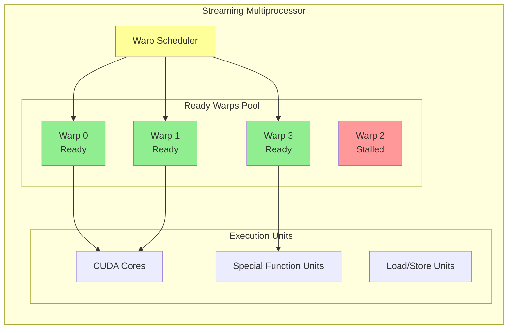

#  Warp Execution Advanced Guide

Understanding warp execution is crucial for writing high-performance CUDA kernels. Warps are the fundamental execution unit in CUDA's SIMT (Single Instruction, Multiple Thread) model, and mastering their behavior is key to GPU optimization.

** [Back to Overview](1_cuda_execution_model.md)** | ** Previous: [Thread Hierarchy Guide](2_thread_hierarchy.md)** | ** Next: [Streaming Multiprocessors Guide](4_streaming_multiprocessors_deep.md)**

---

##  **Table of Contents**

1. [ SIMT Architecture Deep Dive](#-simt-architecture-deep-dive)
2. [ Warp Scheduling Mechanics](#-warp-scheduling-mechanics)
3. [ Divergence Analysis and Optimization](#-divergence-analysis-and-optimization)
4. [ Warp-Level Primitives](#-warp-level-primitives)
5. [ Memory Access Patterns](#-memory-access-patterns)
6. [ Performance Optimization Strategies](#-performance-optimization-strategies)
7. [ Debugging and Profiling Tools](#-debugging-and-profiling-tools)
8. [ Advanced Applications](#-advanced-applications)

---

##  **SIMT Architecture Deep Dive**

The Single Instruction, Multiple Thread (SIMT) model is the foundation of CUDA's parallel execution. Understanding how it works at the hardware level is essential for optimization.

###  **Warp Fundamentals**

| Property | Value | Description |
|----------|--------|-------------|
| **Warp Size** | 32 threads | Fixed across all CUDA architectures |
| **Execution Model** | SIMT | Single instruction broadcast to all active threads |
| **Hardware Unit** | Warp Scheduler | Manages warp execution on SM |
| **Memory Model** | Shared L1/Texture cache | Threads in warp share cache lines |
| **Synchronization** | Implicit | All threads execute same instruction simultaneously |

###  **SIMT Execution Visualization**

```
Warp Scheduler (SM)
 Instruction Fetch Unit
    Broadcasts instruction to all 32 threads
 Active Mask Generation
    Determines which threads execute current instruction
 Execution Units
    Thread[0]
    Thread[1]
    Thread[2]
    ...        Execute same instruction
    Thread[30]
    Thread[31]
 Result Collection
     Gather results and update thread states
```

###  **Warp State Management**

Each warp maintains several state components:

#### **Execution State:**
```cpp
// Conceptual warp state (not actual CUDA code)
struct WarpState {
    uint32_t active_mask;           // Which threads are active (0xFFFFFFFF = all active)
    uint32_t predicate_mask;        // Current predicate evaluation
    uint64_t program_counter;       // Current instruction address
    uint32_t convergence_stack[8];  // Stack for handling divergence
    bool is_waiting;                // Waiting for memory/barrier
    int execution_priority;         // Scheduling priority
};
```

#### **Active Mask Dynamics:**
```cpp
__global__ void demonstrate_active_mask() {
    int tid = threadIdx.x;

    // Initially: active_mask = 0xFFFFFFFF (all 32 threads active)
    printf("All threads active: tid=%d\n", tid);

    // Conditional execution changes active mask
    if (tid < 16) {
        // active_mask = 0x0000FFFF (threads 0-15 active)
        printf("First half: tid=%d\n", tid);
    } else {
        // active_mask = 0xFFFF0000 (threads 16-31 active)
        printf("Second half: tid=%d\n", tid);
    }

    // Back to: active_mask = 0xFFFFFFFF (all threads reconverge)
    printf("Reconverged: tid=%d\n", tid);
}
```

###  **Hardware Implementation Details**

#### **Volta+ Architecture Enhancements:**
```cpp
// Independent thread scheduling (Volta+)
__global__ void independent_scheduling_demo() {
    int tid = threadIdx.x;

    if (tid % 2 == 0) {
        // Even threads can proceed independently
        for (int i = 0; i < 100; i++) {
            // Complex computation
            float result = expensive_computation(i);
        }
    }

    // Explicit synchronization required in Volta+
    __syncwarp(0xFFFFFFFF);  // Synchronize all threads in warp

    // Now all threads are guaranteed to be at this point
    printf("Thread %d synchronized\n", tid);
}
```

---

##  **Warp Scheduling Mechanics**

Understanding how warps are scheduled helps optimize kernel performance and resource utilization.



**Key Insight:** Multiple ready warps hide latency by keeping execution units busy while others wait for memory or synchronization.

###  **Scheduling Algorithm**

The warp scheduler uses a sophisticated algorithm to maximize throughput:

#### **Round-Robin with Priority:**
```cpp
// Conceptual scheduling algorithm
class WarpScheduler {
private:
    std::vector<Warp> eligible_warps;
    std::vector<Warp> waiting_warps;
    int current_cycle;

public:
    Warp* select_next_warp() {
        // Priority 1: Ready warps (no dependencies)
        for (auto& warp : eligible_warps) {
            if (warp.is_ready() && !warp.has_stall()) {
                return &warp;
            }
        }

        // Priority 2: Warps with resolved dependencies
        for (auto& warp : waiting_warps) {
            if (warp.dependencies_resolved(current_cycle)) {
                move_to_eligible(warp);
                return &warp;
            }
        }

        // Priority 3: Issue NOPs if no warps ready
        return nullptr;  // Stall cycle
    }

    void update_warp_states() {
        for (auto& warp : eligible_warps) {
            warp.update_dependencies(current_cycle);
        }
        current_cycle++;
    }
};
```

#### **Warp Scheduling Factors:**
```cpp
// Factors affecting warp scheduling priority
__global__ void scheduling_factors_demo() {
    int warp_id = threadIdx.x / 32;
    int lane_id = threadIdx.x % 32;

    // Factor 1: Memory latency hiding
    if (warp_id % 4 == 0) {
        // This warp does memory access
        float* global_data = get_global_pointer();
        float value = global_data[threadIdx.x];  // High latency

        // Scheduler will likely switch to other warps here
        // while this memory access completes

        process_data(value);
    }

    // Factor 2: Compute intensity
    if (warp_id % 4 == 1) {
        // This warp does intensive computation
        float result = 0.0f;
        for (int i = 0; i < 1000; i++) {
            result += sin(float(i)) * cos(float(i));
        }

        // Scheduler maintains this warp while compute units are busy
        store_result(result);
    }

    // Factor 3: Synchronization points
    if (warp_id % 4 == 2) {
        // This warp hits synchronization
        __syncthreads();  // All warps in block must reach this point

        // Scheduler will context switch until all warps ready
        continue_processing();
    }
}
```

###  **Occupancy and Warp Scheduling**

#### **Occupancy Impact on Scheduling:**
```cpp
// Demonstrate relationship between occupancy and scheduling efficiency
template<int THREADS_PER_BLOCK>
__global__ void occupancy_demo(float* data, int N) {
    int tid = threadIdx.x + blockIdx.x * blockDim.x;

    // Calculate warps per SM
    constexpr int warps_per_block = (THREADS_PER_BLOCK + 31) / 32;

    if (tid == 0) {
        printf("Block size: %d, Warps per block: %d\n",
               THREADS_PER_BLOCK, warps_per_block);
    }

    if (tid < N) {
        // Memory access that benefits from latency hiding
        float value = data[tid];

        // Compute operation while memory subsystem is busy
        for (int i = 0; i < 100; i++) {
            value = fmaf(value, 1.01f, 0.1f);
        }

        data[tid] = value;
    }
}

// Host code to demonstrate occupancy effects
void test_occupancy_impact() {
    cudaDeviceProp prop;
    cudaGetDeviceProperties(&prop, 0);

    int max_threads_per_sm = prop.maxThreadsPerMultiProcessor;
    int max_blocks_per_sm = prop.maxBlocksPerMultiProcessor;

    printf("Testing different block sizes for occupancy:\n");

    // Low occupancy: 128 threads per block
    printf("128 threads/block: %d warps, theoretical occupancy: %.2f\n",
           4, (4.0f * 65536) / max_threads_per_sm);

    // Medium occupancy: 256 threads per block
    printf("256 threads/block: %d warps, theoretical occupancy: %.2f\n",
           8, (8.0f * 65536) / max_threads_per_sm);

    // High occupancy: 512 threads per block
    printf("512 threads/block: %d warps, theoretical occupancy: %.2f\n",
           16, (16.0f * 65536) / max_threads_per_sm);
}
```

---

##  **Divergence Analysis and Optimization**

Warp divergence is one of the most significant performance bottlenecks in CUDA. Understanding and minimizing divergence is crucial for optimal performance.


**Performance Impact:** Divergent branches execute serially, effectively reducing parallelism by the number of divergent paths.

###  **Understanding Divergence**

#### **Types of Divergence:**

| Type | Cause | Performance Impact | Solution Strategy |
|------|-------|-------------------|-------------------|
| **Control Flow** | if/else, loops | 50-90% slowdown | Restructure algorithms |
| **Memory Access** | Scattered access | 10-80% slowdown | Coalesce access patterns |
| **Function Calls** | Dynamic function calls | 20-60% slowdown | Use templates/inlining |
| **Synchronization** | Uneven work distribution | Variable | Load balancing |

#### **Control Flow Divergence Example:**
```cpp
//  BAD: High divergence example
__global__ void high_divergence_kernel(int* data, int N) {
    int tid = threadIdx.x + blockIdx.x * blockDim.x;

    if (tid < N) {
        // This creates maximum divergence in each warp
        if (tid % 2 == 0) {
            // Half the threads execute this path
            for (int i = 0; i < 1000; i++) {
                data[tid] += expensive_computation_a(i);
            }
        } else {
            // Other half execute this path
            for (int i = 0; i < 800; i++) {
                data[tid] += expensive_computation_b(i);
            }
        }
    }
}

//  GOOD: Low divergence optimization
__global__ void low_divergence_kernel(int* data_even, int* data_odd, int N) {
    int tid = threadIdx.x + blockIdx.x * blockDim.x;

    // Separate kernels for different execution paths
    // All threads in each warp follow the same path

    if (tid < N/2) {
        // Process even elements
        for (int i = 0; i < 1000; i++) {
            data_even[tid] += expensive_computation_a(i);
        }
    }
}

__global__ void process_odd_elements(int* data_odd, int N) {
    int tid = threadIdx.x + blockIdx.x * blockDim.x;

    if (tid < N/2) {
        // Process odd elements
        for (int i = 0; i < 800; i++) {
            data_odd[tid] += expensive_computation_b(i);
        }
    }
}
```

###  **Divergence Detection and Measurement**

#### **Runtime Divergence Analysis:**
```cpp
// Utility to measure divergence in kernels
__device__ int count_active_threads() {
    return __popc(__activemask());  // Population count of active mask
}

__device__ float calculate_warp_efficiency() {
    int active_threads = count_active_threads();
    return (float)active_threads / 32.0f;  // Efficiency as percentage
}

__global__ void divergence_analysis_kernel(float* data, int* divergence_stats, int N) {
    int tid = threadIdx.x + blockIdx.x * blockDim.x;
    int warp_id = tid / 32;
    int lane_id = tid % 32;

    // Measure initial efficiency
    float initial_efficiency = calculate_warp_efficiency();

    if (tid < N) {
        // Potentially divergent code section
        if (data[tid] > 0.5f) {
            // Branch A
            data[tid] = sqrt(data[tid]);
            float efficiency_a = calculate_warp_efficiency();

            if (lane_id == 0) {
                atomicAdd(&divergence_stats[warp_id * 3 + 0],
                         (int)(efficiency_a * 100));
            }
        } else {
            // Branch B
            data[tid] = data[tid] * data[tid];
            float efficiency_b = calculate_warp_efficiency();

            if (lane_id == 0) {
                atomicAdd(&divergence_stats[warp_id * 3 + 1],
                         (int)(efficiency_b * 100));
            }
        }
    }

    // Measure final efficiency after reconvergence
    float final_efficiency = calculate_warp_efficiency();
    if (lane_id == 0) {
        atomicAdd(&divergence_stats[warp_id * 3 + 2],
                 (int)(final_efficiency * 100));
    }
}
```

###  **Divergence Optimization Techniques**

#### **Technique 1: Data Reorganization**
```cpp
// Reorganize data to minimize divergence
__global__ void sort_for_coherence(float* input, float* output_positive,
                                  float* output_negative, int* pos_count, int N) {
    int tid = threadIdx.x + blockIdx.x * blockDim.x;

    if (tid < N) {
        float value = input[tid];

        if (value >= 0.0f) {
            int pos_idx = atomicAdd(pos_count, 1);
            output_positive[pos_idx] = value;
        } else {
            int neg_idx = atomicAdd(pos_count + 1, 1);
            output_negative[neg_idx] = value;
        }
    }
}

// Process sorted data with minimal divergence
__global__ void process_sorted_data(float* positive_data, int pos_count) {
    int tid = threadIdx.x + blockIdx.x * blockDim.x;

    // All threads in warp follow same path - no divergence!
    if (tid < pos_count) {
        positive_data[tid] = sqrt(positive_data[tid]);
    }
}
```

#### **Technique 2: Predicated Execution**
```cpp
// Use predicated execution to avoid branching
__global__ void predicated_execution_kernel(float* data, int N) {
    int tid = threadIdx.x + blockIdx.x * blockDim.x;

    if (tid < N) {
        float value = data[tid];

        // Instead of if/else, compute both paths
        float path_a = sqrt(value);          // For positive values
        float path_b = value * value;        // For negative values

        // Use predicated selection instead of branching
        bool condition = (value >= 0.0f);
        data[tid] = condition ? path_a : path_b;

        // Alternative using fmaf for better performance
        // data[tid] = condition * path_a + (1 - condition) * path_b;
    }
}
```

#### **Technique 3: Warp-Cooperative Algorithms**
```cpp
// Implement algorithms that work at warp granularity
__global__ void warp_cooperative_scan(int* input, int* output, int N) {
    int tid = threadIdx.x + blockIdx.x * blockDim.x;
    int lane_id = tid % 32;
    int warp_id = tid / 32;

    if (tid < N) {
        int value = input[tid];

        // Warp-level inclusive scan (no divergence)
        for (int offset = 1; offset < 32; offset <<= 1) {
            int temp = __shfl_up_sync(0xFFFFFFFF, value, offset);
            if (lane_id >= offset) {
                value += temp;
            }
        }

        output[tid] = value;
    }
}
```

---

##  **Warp-Level Primitives**

Modern CUDA provides powerful warp-level primitives that enable efficient intra-warp communication and coordination.

###  **Shuffle Operations**

#### **Basic Shuffle Patterns:**
```cpp
__global__ void shuffle_operations_demo() {
    int tid = threadIdx.x;
    int lane_id = tid % 32;
    int value = lane_id;  // Each thread starts with its lane ID

    // 1. Broadcast from lane 0 to all threads
    int broadcast_value = __shfl_sync(0xFFFFFFFF, value, 0);
    // Result: all threads have value 0

    // 2. Rotate values right by 1
    int rotated_value = __shfl_sync(0xFFFFFFFF, value, (lane_id + 1) % 32);
    // Result: thread i has value from thread (i+1)%32

    // 3. Shift values up by 1
    int shifted_value = __shfl_up_sync(0xFFFFFFFF, value, 1);
    // Result: thread i has value from thread (i-1), thread 0 unchanged

    // 4. Shift values down by 1
    int down_shifted = __shfl_down_sync(0xFFFFFFFF, value, 1);
    // Result: thread i has value from thread (i+1), thread 31 unchanged

    // 5. XOR-based butterfly exchange
    int xor_value = __shfl_xor_sync(0xFFFFFFFF, value, 16);
    // Result: thread i exchanges with thread (i XOR 16)

    printf("Lane %d: broadcast=%d, rotated=%d, shifted_up=%d, shifted_down=%d, xor=%d\n",
           lane_id, broadcast_value, rotated_value, shifted_value, down_shifted, xor_value);
}
```

#### **Advanced Shuffle Applications:**
```cpp
// Parallel reduction using shuffle
__device__ int warp_reduce_sum(int value) {
    // Butterfly reduction pattern
    for (int offset = 16; offset > 0; offset /= 2) {
        value += __shfl_down_sync(0xFFFFFFFF, value, offset);
    }
    return value;  // Lane 0 contains the sum
}

// Parallel scan using shuffle
__device__ int warp_scan_inclusive(int value) {
    // Up-sweep phase
    for (int offset = 1; offset < 32; offset <<= 1) {
        int temp = __shfl_up_sync(0xFFFFFFFF, value, offset);
        if ((threadIdx.x % 32) >= offset) {
            value += temp;
        }
    }
    return value;
}

// Warp-level histogram
__global__ void warp_histogram(int* input, int* histogram, int N, int num_bins) {
    int tid = threadIdx.x + blockIdx.x * blockDim.x;
    int lane_id = tid % 32;

    // Each warp processes 32 elements
    if (tid < N) {
        int bin = input[tid] % num_bins;

        // Count occurrences of each bin in this warp
        for (int target_bin = 0; target_bin < num_bins; target_bin++) {
            int vote = (bin == target_bin) ? 1 : 0;
            int count = warp_reduce_sum(vote);

            // Lane 0 adds to global histogram
            if (lane_id == 0 && count > 0) {
                atomicAdd(&histogram[target_bin], count);
            }
        }
    }
}
```

###  **Voting Functions**

#### **Collective Decision Making:**
```cpp
__global__ void voting_operations_demo(float* data, bool* results, int N) {
    int tid = threadIdx.x + blockIdx.x * blockDim.x;
    int lane_id = tid % 32;

    if (tid < N) {
        float value = data[tid];
        bool condition = (value > 0.5f);

        // 1. Check if ALL threads in warp satisfy condition
        bool all_satisfy = __all_sync(0xFFFFFFFF, condition);

        // 2. Check if ANY thread in warp satisfies condition
        bool any_satisfy = __any_sync(0xFFFFFFFF, condition);

        // 3. Get ballot of which threads satisfy condition
        unsigned int ballot = __ballot_sync(0xFFFFFFFF, condition);

        // 4. Count how many threads satisfy condition
        int count = __popc(ballot);  // Population count

        if (lane_id == 0) {
            printf("Warp %d: all=%d, any=%d, count=%d, ballot=0x%08x\n",
                   tid / 32, all_satisfy, any_satisfy, count, ballot);
        }

        // Use voting results for collective decision
        if (all_satisfy) {
            // All threads take fast path
            data[tid] = sqrt(value);
        } else if (any_satisfy) {
            // Mixed execution - use predicated approach
            data[tid] = condition ? sqrt(value) : value * value;
        } else {
            // No threads satisfy condition
            data[tid] = value * value;
        }

        results[tid] = condition;
    }
}
```

#### **Warp-Level Load Balancing:**
```cpp
__global__ void warp_load_balancing(int* work_items, int* work_counts,
                                   float* results, int num_items) {
    int tid = threadIdx.x + blockIdx.x * blockDim.x;
    int lane_id = tid % 32;
    int warp_id = tid / 32;

    // Each warp processes work items cooperatively
    for (int item = warp_id; item < num_items; item += gridDim.x * blockDim.x / 32) {
        int work_amount = work_counts[item];

        // Distribute work across threads in warp
        for (int work_idx = lane_id; work_idx < work_amount; work_idx += 32) {
            float result = process_work_item(work_items[item], work_idx);

            // Accumulate results across warp
            for (int offset = 16; offset > 0; offset /= 2) {
                result += __shfl_down_sync(0xFFFFFFFF, result, offset);
            }

            // Lane 0 stores final result
            if (lane_id == 0) {
                results[item] = result;
            }
        }
    }
}
```

###  **Match Functions (Volta+)**

#### **Advanced Warp Coordination:**
```cpp
// Available on compute capability 7.0+ (Volta and newer)
__global__ void match_operations_demo(int* data, int N) {
    int tid = threadIdx.x + blockIdx.x * blockDim.x;
    int lane_id = tid % 32;

    if (tid < N) {
        int value = data[tid];

        // Find all threads with the same value
        unsigned int match_mask = __match_any_sync(0xFFFFFFFF, value);

        // Find all threads with a specific target value
        unsigned int match_all_mask = __match_all_sync(0xFFFFFFFF, value, &value);

        // Process groups of threads with identical values
        if (__popc(match_mask) > 1) {  // More than one thread has this value
            // Threads with same value cooperate
            int group_size = __popc(match_mask);
            int group_rank = __popc(match_mask & ((1u << lane_id) - 1));

            if (group_rank == 0) {  // First thread in group
                printf("Found group of %d threads with value %d\n", group_size, value);
            }

            // Distribute work among group members
            data[tid] = value + group_rank;
        }
    }
}
```

---

##  **Memory Access Patterns**

Warp-level memory access patterns significantly impact performance. Understanding and optimizing these patterns is crucial for high-performance kernels.

###  **Coalesced Access Optimization**

#### **Perfect Coalescing Examples:**
```cpp
//  PERFECT: Sequential access pattern
__global__ void perfect_coalescing(float* data, int N) {
    int tid = threadIdx.x + blockIdx.x * blockDim.x;

    if (tid < N) {
        // All threads in warp access consecutive memory locations
        // Thread 0: data[0], Thread 1: data[1], ..., Thread 31: data[31]
        data[tid] = data[tid] * 2.0f;  // Perfect coalescing
    }
}

//  GOOD: Strided access with small stride
__global__ void good_coalescing_stride(float* data, int N, int stride) {
    int tid = threadIdx.x + blockIdx.x * blockDim.x;

    if (tid * stride < N) {
        // Still relatively good if stride is small (power of 2)
        data[tid * stride] = data[tid * stride] * 2.0f;
    }
}

//  BAD: Random access pattern
__global__ void poor_coalescing_random(float* data, int* indices, int N) {
    int tid = threadIdx.x + blockIdx.x * blockDim.x;

    if (tid < N) {
        // Random memory access - poor coalescing
        int random_idx = indices[tid];
        data[random_idx] = data[random_idx] * 2.0f;
    }
}
```

#### **Memory Access Analysis Tool:**
```cpp
// Tool to analyze memory access patterns
__global__ void analyze_memory_pattern(float* data, int* access_pattern,
                                      int* coalescing_stats, int N) {
    int tid = threadIdx.x + blockIdx.x * blockDim.x;
    int lane_id = tid % 32;
    int warp_id = tid / 32;

    if (tid < N) {
        int access_index = access_pattern[tid];

        // Analyze access pattern within warp
        if (lane_id == 0) {
            // Collect access indices from all threads in warp
            int warp_accesses[32];
            for (int i = 0; i < 32; i++) {
                if (tid + i < N) {
                    warp_accesses[i] = access_pattern[tid + i];
                } else {
                    warp_accesses[i] = -1;  // Invalid
                }
            }

            // Analyze coalescing potential
            int consecutive_count = 0;
            int stride_1_count = 0;
            int random_count = 0;

            for (int i = 1; i < 32; i++) {
                if (warp_accesses[i] == warp_accesses[i-1] + 1) {
                    consecutive_count++;
                } else if (abs(warp_accesses[i] - warp_accesses[i-1]) <= 32) {
                    stride_1_count++;
                } else {
                    random_count++;
                }
            }

            // Store coalescing statistics
            coalescing_stats[warp_id * 3 + 0] = consecutive_count;
            coalescing_stats[warp_id * 3 + 1] = stride_1_count;
            coalescing_stats[warp_id * 3 + 2] = random_count;
        }

        // Perform actual memory access
        data[access_index] = data[access_index] * 2.0f;
    }
}
```

###  **Cache-Friendly Access Patterns**

#### **Temporal and Spatial Locality:**
```cpp
// Optimize for L1 cache usage
__global__ void cache_friendly_matrix_multiply(float* A, float* B, float* C,
                                              int M, int N, int K) {
    int tid = threadIdx.x + blockIdx.x * blockDim.x;
    int warp_id = tid / 32;
    int lane_id = tid % 32;

    // Each warp processes a row of output matrix
    int row = warp_id;

    if (row < M) {
        // Process 32 columns per warp iteration
        for (int col_base = 0; col_base < N; col_base += 32) {
            int col = col_base + lane_id;

            if (col < N) {
                float result = 0.0f;

                // Inner product with cache-friendly access
                for (int k = 0; k < K; k++) {
                    // A[row][k] - same for all threads in warp (broadcast)
                    float a_val = A[row * K + k];

                    // B[k][col] - consecutive access across warp
                    float b_val = B[k * N + col];

                    result += a_val * b_val;
                }

                C[row * N + col] = result;
            }
        }
    }
}

// Use shared memory to optimize irregular access patterns
__global__ void shared_memory_coalescing(float* global_data, int* indices,
                                        float* results, int N) {
    __shared__ float shared_buffer[256];
    __shared__ int shared_indices[256];

    int tid = threadIdx.x;
    int global_tid = tid + blockIdx.x * blockDim.x;

    // Coalesced load to shared memory
    if (global_tid < N) {
        shared_buffer[tid] = global_data[global_tid];
        shared_indices[tid] = indices[global_tid];
    }

    __syncthreads();

    // Now access can be optimized within shared memory
    if (global_tid < N) {
        int target_idx = shared_indices[tid] % blockDim.x;
        float value = shared_buffer[target_idx];
        results[global_tid] = process_value(value);
    }
}
```

---

##  **Performance Optimization Strategies**

###  **Occupancy Optimization**

#### **Register Usage Optimization:**
```cpp
// Minimize register usage for higher occupancy
__global__ void register_optimized_kernel(float* data, int N) {
    int tid = threadIdx.x + blockIdx.x * blockDim.x;

    if (tid < N) {
        // Use register efficiently - avoid unnecessary temporary variables
        float value = data[tid];

        // Instead of multiple intermediate variables
        // float temp1 = sin(value);
        // float temp2 = cos(value);
        // float temp3 = temp1 * temp2;
        // data[tid] = temp3;

        // Direct computation reduces register pressure
        data[tid] = sin(value) * cos(value);
    }
}

// Template specialization for different register requirements
template<int MAX_REGISTERS>
__global__ void __launch_bounds__(256, MAX_REGISTERS)
occupancy_controlled_kernel(float* data, int N) {
    int tid = threadIdx.x + blockIdx.x * blockDim.x;

    if (tid < N) {
        // Compiler will limit register usage based on MAX_REGISTERS
        float result = data[tid];

        // Computation complexity adjusted based on register budget
        if constexpr (MAX_REGISTERS >= 32) {
            // Complex computation for high register availability
            for (int i = 0; i < 10; i++) {
                result = fmaf(result, 1.1f, sin(result));
            }
        } else {
            // Simple computation for limited registers
            result = result * 1.1f + 0.1f;
        }

        data[tid] = result;
    }
}
```

###  **Instruction-Level Optimization**

#### **Warp-Synchronous Programming:**
```cpp
// Optimize for warp-synchronous execution
__global__ void warp_synchronous_reduction(float* input, float* output, int N) {
    int tid = threadIdx.x + blockIdx.x * blockDim.x;
    int lane_id = tid % 32;
    int warp_id = tid / 32;

    float value = (tid < N) ? input[tid] : 0.0f;

    // Warp-level reduction without __syncthreads()
    // This is safe because all threads in a warp execute synchronously
    for (int offset = 16; offset > 0; offset /= 2) {
        value += __shfl_down_sync(0xFFFFFFFF, value, offset);
    }

    // Only lane 0 has the final result
    if (lane_id == 0) {
        output[warp_id] = value;
    }
}

// Vectorized memory access for better throughput
__global__ void vectorized_access_kernel(float4* data, int N) {
    int tid = threadIdx.x + blockIdx.x * blockDim.x;

    if (tid < N) {
        // Load 4 floats in a single transaction
        float4 values = data[tid];

        // Process all components
        values.x = fmaf(values.x, 2.0f, 1.0f);
        values.y = fmaf(values.y, 2.0f, 1.0f);
        values.z = fmaf(values.z, 2.0f, 1.0f);
        values.w = fmaf(values.w, 2.0f, 1.0f);

        // Store 4 floats in a single transaction
        data[tid] = values;
    }
}
```

---

##  **Debugging and Profiling Tools**

###  **Warp-Level Debugging**

#### **Warp Execution Tracer:**
```cpp
// Debug tool to trace warp execution
__global__ void warp_execution_tracer(float* data, int* execution_trace, int N) {
    int tid = threadIdx.x + blockIdx.x * blockDim.x;
    int lane_id = tid % 32;
    int warp_id = tid / 32;

    // Trace entry point
    if (lane_id == 0) {
        atomicAdd(&execution_trace[0], 1);  // Count warp entries
    }

    if (tid < N) {
        float value = data[tid];

        // Trace divergent branches
        if (value > 0.5f) {
            if (lane_id == 0) {
                atomicAdd(&execution_trace[1], __popc(__activemask()));
            }
            data[tid] = sqrt(value);
        } else {
            if (lane_id == 0) {
                atomicAdd(&execution_trace[2], __popc(__activemask()));
            }
            data[tid] = value * value;
        }

        // Trace reconvergence
        if (lane_id == 0) {
            atomicAdd(&execution_trace[3], __popc(__activemask()));
        }
    }
}

// Host-side analysis of execution trace
void analyze_execution_trace(int* h_trace) {
    printf("Warp Execution Analysis:\n");
    printf("Total warp entries: %d\n", h_trace[0]);
    printf("Threads in branch A: %d\n", h_trace[1]);
    printf("Threads in branch B: %d\n", h_trace[2]);
    printf("Threads after reconvergence: %d\n", h_trace[3]);

    float divergence_ratio = 1.0f - (float)(h_trace[1] + h_trace[2]) /
                            (2.0f * h_trace[0] * 32);
    printf("Divergence efficiency: %.2f%%\n", (1.0f - divergence_ratio) * 100);
}
```

###  **Performance Measurement**

#### **Warp-Level Performance Counters:**
```cpp
// Kernel with built-in performance measurement
__global__ void performance_measurement_kernel(float* data,
                                              unsigned long long* timing_data, int N) {
    int tid = threadIdx.x + blockIdx.x * blockDim.x;
    int lane_id = tid % 32;
    int warp_id = tid / 32;

    // Start timing (only lane 0 measures)
    unsigned long long start_time = 0;
    if (lane_id == 0) {
        start_time = clock64();
    }

    if (tid < N) {
        // Workload to measure
        float value = data[tid];

        for (int i = 0; i < 100; i++) {
            value = fmaf(value, 1.01f, sin(value * 0.1f));
        }

        data[tid] = value;
    }

    // End timing
    if (lane_id == 0) {
        unsigned long long end_time = clock64();
        timing_data[warp_id] = end_time - start_time;
    }
}

// Analysis of performance data
void analyze_warp_performance(unsigned long long* h_timing, int num_warps) {
    unsigned long long total_cycles = 0;
    unsigned long long min_cycles = ULLONG_MAX;
    unsigned long long max_cycles = 0;

    for (int i = 0; i < num_warps; i++) {
        total_cycles += h_timing[i];
        min_cycles = min(min_cycles, h_timing[i]);
        max_cycles = max(max_cycles, h_timing[i]);
    }

    double avg_cycles = (double)total_cycles / num_warps;
    double load_imbalance = (double)(max_cycles - min_cycles) / avg_cycles;

    printf("Warp Performance Analysis:\n");
    printf("Average cycles per warp: %.2f\n", avg_cycles);
    printf("Min cycles: %llu, Max cycles: %llu\n", min_cycles, max_cycles);
    printf("Load imbalance: %.2f%%\n", load_imbalance * 100);
}
```

---

##  **Advanced Applications**

###  **Parallel Algorithms with Warp Primitives**

#### **Warp-Level Merge Sort:**
```cpp
// Implementation of bitonic merge sort at warp level
__device__ void warp_bitonic_sort(float* data) {
    int lane_id = threadIdx.x % 32;
    float value = data[lane_id];

    // Bitonic sort network for 32 elements
    for (int stage = 1; stage < 32; stage <<= 1) {
        for (int step = stage; step > 0; step >>= 1) {
            int partner = lane_id ^ step;
            float partner_value = __shfl_sync(0xFFFFFFFF, value, partner);

            bool ascending = ((lane_id & stage) == 0);
            bool should_swap = (ascending == (value > partner_value));

            if (should_swap) {
                value = partner_value;
            }
        }
    }

    data[lane_id] = value;
}

__global__ void warp_sort_kernel(float* data, int N) {
    __shared__ float shared_data[32];

    int tid = threadIdx.x + blockIdx.x * blockDim.x;
    int lane_id = tid % 32;
    int warp_id = tid / 32;

    // Each warp sorts 32 elements
    int base_idx = warp_id * 32;

    if (base_idx + lane_id < N) {
        shared_data[lane_id] = data[base_idx + lane_id];
    } else {
        shared_data[lane_id] = FLT_MAX;  // Padding for incomplete warps
    }

    warp_bitonic_sort(shared_data);

    if (base_idx + lane_id < N) {
        data[base_idx + lane_id] = shared_data[lane_id];
    }
}
```

#### **Fast Fourier Transform (FFT) with Warp Shuffle:**
```cpp
// Radix-2 FFT using warp shuffle operations
__device__ void warp_fft_radix2(float2* data) {
    int lane_id = threadIdx.x % 32;
    float2 value = data[lane_id];

    // FFT stages
    for (int stage = 1; stage < 32; stage <<= 1) {
        // Calculate twiddle factor
        float angle = -2.0f * M_PI * (lane_id % stage) / (2 * stage);
        float2 twiddle = make_float2(cosf(angle), sinf(angle));

        // Butterfly operation
        int partner = lane_id ^ stage;
        float2 partner_value = make_float2(
            __shfl_sync(0xFFFFFFFF, value.x, partner),
            __shfl_sync(0xFFFFFFFF, value.y, partner)
        );

        if ((lane_id & stage) == 0) {
            // Top butterfly
            float2 temp = make_float2(
                partner_value.x * twiddle.x - partner_value.y * twiddle.y,
                partner_value.x * twiddle.y + partner_value.y * twiddle.x
            );
            value = make_float2(value.x + temp.x, value.y + temp.y);
        } else {
            // Bottom butterfly
            float2 temp = make_float2(
                value.x * twiddle.x - value.y * twiddle.y,
                value.x * twiddle.y + value.y * twiddle.x
            );
            value = make_float2(partner_value.x - temp.x, partner_value.y - temp.y);
        }
    }

    data[lane_id] = value;
}
```

###  **Game Development: Particle Systems**

```cpp
// High-performance particle system using warp primitives
struct Particle {
    float3 position;
    float3 velocity;
    float life;
    float mass;
};

__global__ void update_particles_warp_optimized(Particle* particles,
                                               float dt, int num_particles) {
    int tid = threadIdx.x + blockIdx.x * blockDim.x;
    int lane_id = tid % 32;
    int warp_id = tid / 32;

    if (tid < num_particles) {
        Particle p = particles[tid];

        // Skip dead particles efficiently using voting
        bool is_alive = (p.life > 0.0f);
        unsigned int alive_mask = __ballot_sync(0xFFFFFFFF, is_alive);

        if (!is_alive) return;  // Early exit for dead particles

        // Physics update
        p.position.x += p.velocity.x * dt;
        p.position.y += p.velocity.y * dt;
        p.position.z += p.velocity.z * dt;

        // Apply gravity
        p.velocity.y -= 9.81f * dt;

        // Collision detection with ground
        if (p.position.y <= 0.0f) {
            p.position.y = 0.0f;
            p.velocity.y = -p.velocity.y * 0.8f;  // Bounce with damping
        }

        // Update life
        p.life -= dt;

        // Warp-level collision detection optimization
        // Check for inter-particle collisions within warp
        for (int other_lane = 0; other_lane < 32; other_lane++) {
            if (other_lane == lane_id) continue;

            float3 other_pos = make_float3(
                __shfl_sync(alive_mask, p.position.x, other_lane),
                __shfl_sync(alive_mask, p.position.y, other_lane),
                __shfl_sync(alive_mask, p.position.z, other_lane)
            );

            float3 diff = make_float3(
                p.position.x - other_pos.x,
                p.position.y - other_pos.y,
                p.position.z - other_pos.z
            );

            float dist_sq = diff.x * diff.x + diff.y * diff.y + diff.z * diff.z;
            float min_dist = 0.1f;  // Minimum separation distance

            if (dist_sq < min_dist * min_dist && dist_sq > 0.0f) {
                float dist = sqrtf(dist_sq);
                float push_force = (min_dist - dist) / dist * 0.5f;

                p.velocity.x += diff.x * push_force;
                p.velocity.y += diff.y * push_force;
                p.velocity.z += diff.z * push_force;
            }
        }

        particles[tid] = p;
    }
}
```

---

##  **Key Takeaways**

1. ** Understand SIMT**: Warps execute in lockstep - optimize for uniform execution
2. ** Master Scheduling**: High occupancy enables better latency hiding through warp scheduling
3. ** Minimize Divergence**: Restructure algorithms to avoid control flow differences within warps
4. ** Use Warp Primitives**: Shuffle, voting, and match operations enable efficient intra-warp communication
5. ** Optimize Memory**: Coalesced access patterns are crucial for bandwidth utilization
6. ** Profile and Debug**: Use built-in tools to measure and optimize warp-level performance

##  **Related Guides**

- **Next Step**: [ Streaming Multiprocessors Guide](4_streaming_multiprocessors_deep.md) - Understand SM architecture and scheduling
- **Foundation**: [ Thread Hierarchy Guide](2_thread_hierarchy.md) - Thread organization fundamentals
- **Coordination**: [Synchronization Guide](../03_synchronization/1_synchronization_basics.md) - Thread cooperation beyond warps
- **Overview**: [ Execution Model Overview](1_cuda_execution_model.md) - Quick reference and navigation

---

** Pro Tip**: The key to high-performance CUDA kernels is thinking at the warp level. Design your algorithms to minimize divergence and maximize the effectiveness of warp-level primitives!
