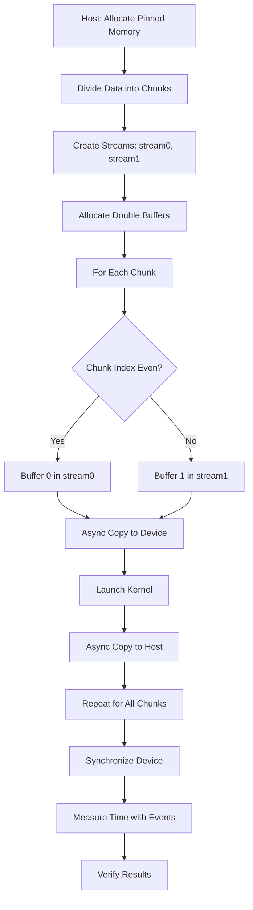
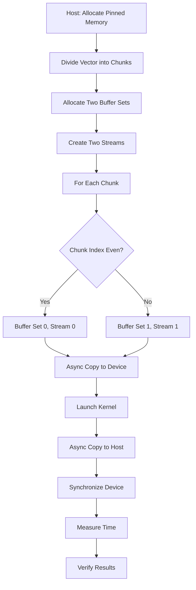
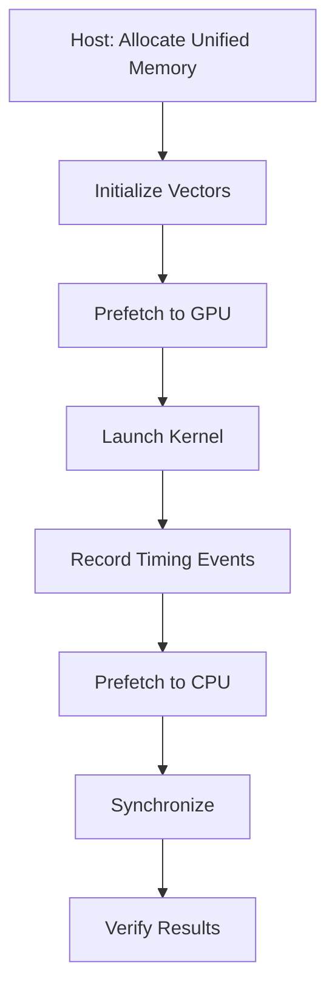
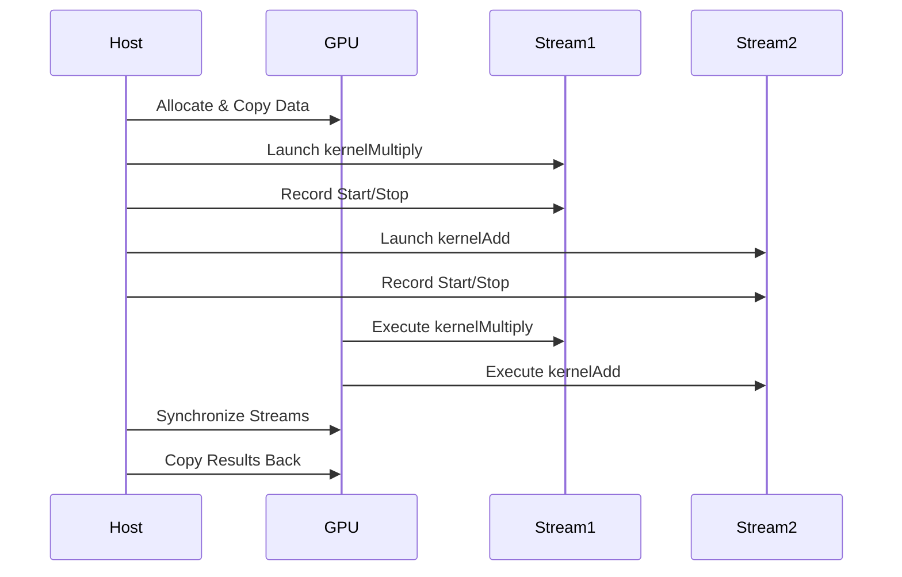
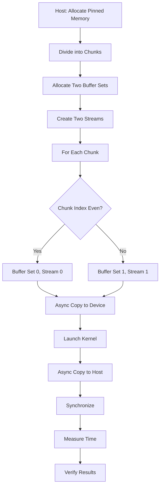
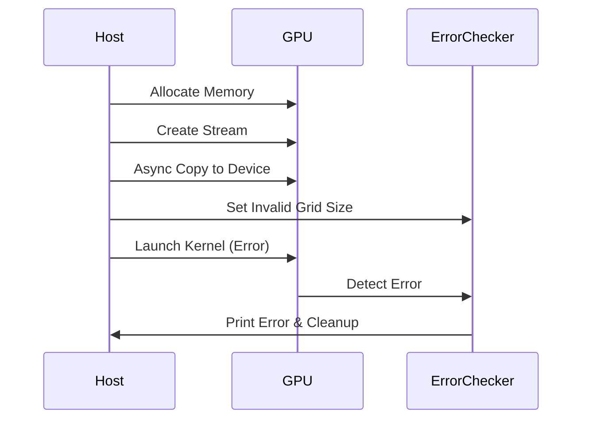
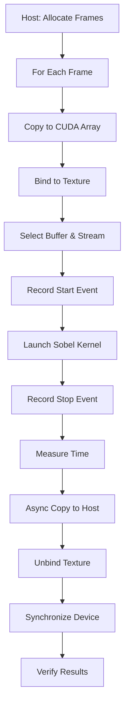
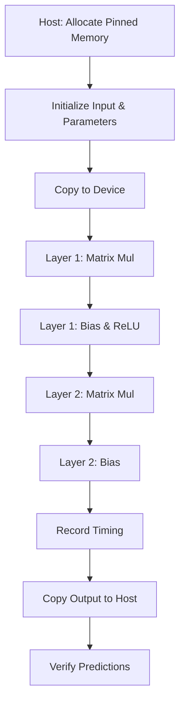

# Day 28: Progress Checkpoint – Recap of Concurrency & Memory

In this capstone checkpoint, we consolidate and review key concepts from Days 15 through 27, focusing on **concurrency** and **memory management** in CUDA. Topics include advanced atomic operations, streams, events, asynchronous memory copies, pinned memory, double buffering, and texture memory.

The goal is to ensure a **strong foundation** in these essential topics through:
- A **multi-topic quiz** covering concurrency and memory.
- A **mini-project** integrating several concepts.
- Detailed code examples with extensive inline comments.
- Conceptual diagrams to visualize workflows.
- References for further reading.

> **Note:** Gaps in concurrency and memory management knowledge can lead to suboptimal CUDA application performance. This checkpoint aims to identify and reinforce those areas.

---

## Table of Contents

1. [Overview](#1-overview)
2. [Key Topics Recap](#2-key-topics-recap)
   - [Advanced Atomic Operations](#advanced-atomic-operations)
   - [Streams & Concurrency](#streams--concurrency)
   - [Events & Timing](#events--timing)
   - [Asynchronous Memory Copy & Pinned Memory](#asynchronous-memory-copy--pinned-memory)
   - [Double Buffering Technique](#double-buffering-technique)
   - [Texture & Surface Memory](#texture--surface-memory)
3. [Multi-Topic Quiz: 50 Questions](#3-multi-topic-quiz-50-questions)
4. [Mini-Project: Integrated Concurrency & Memory Pipeline](#4-mini-project-integrated-concurrency--memory-pipeline)
   - [Project Overview](#project-overview)
   - [Sample Kernel Code (Vector Addition)](#sample-kernel-code-vector-addition)
   - [Host Code with Double Buffering](#host-code-with-double-buffering)
5. [Multi-Level CUDA Coding Questions](#5-multi-level-cuda-coding-questions)
   - [Question 1 (Easy): Vector Addition with Pinned Memory](#question-1-easy-vector-addition-with-pinned-memory)
   - [Question 2 (Medium): Matrix Multiplication with Double Buffering](#question-2-medium-matrix-multiplication-with-double-buffering)
   - [Question 3 (Hard): Sobel Edge Detection Using Texture Memory](#question-3-hard-sobel-edge-detection-using-texture-memory)
6. [Common Debugging Pitfalls & Best Practices](#6-common-debugging-pitfalls--best-practices)
7. [Conceptual Diagrams](#7-conceptual-diagrams)
8. [References & Further Reading](#8-references--further-reading)
9. [Conclusion](#9-conclusion)
10. [Next Steps](#10-next-steps)

---

## 1. Overview

This checkpoint tests and reinforces your understanding of CUDA concurrency and memory concepts from Days 15–27. You’ll complete a quiz, work on a mini-project involving:
- Concurrent kernel launches using streams.
- Execution timing with CUDA events.
- Asynchronous memory copies with pinned memory.
- Double buffering for overlapping computation and transfers.
- Texture memory for optimized 2D data access.

---

## 2. Key Topics Recap

### Advanced Atomic Operations
- **Concept:** Use atomic functions (e.g., `atomicCAS`, `atomicExch`) for safe updates to shared variables.
- **Key Points:**
  - Prevent race conditions.
  - May bottleneck if overused.
  - Custom implementations (e.g., atomicMax for floats).

### Streams & Concurrency
- **Concept:** CUDA streams enable asynchronous kernel execution and memory transfers.
- **Key Points:**
  - Default stream is blocking; non-default streams allow overlap.
  - Use `cudaStreamCreate()`, `cudaMemcpyAsync()`, `cudaStreamSynchronize()`.

### Events & Timing
- **Concept:** CUDA events provide precise timing of GPU operations.
- **Key Points:**
  - Use `cudaEventRecord()`, `cudaEventSynchronize()`, `cudaEventElapsedTime()`.
  - Proper event placement avoids skewed measurements.

### Asynchronous Memory Copy & Pinned Memory
- **Concept:** Asynchronous copies (`cudaMemcpyAsync()`) overlap with computation using pinned host memory.
- **Key Points:**
  - Pinned memory allocated with `cudaMallocHost()`.
  - Offers faster transfers than pageable memory.
  - Excessive use impacts system performance.

### Double Buffering Technique
- **Concept:** Uses two device buffers (ping-pong) to overlap transfers with computation.
- **Key Points:**
  - Alternates buffers to hide transfer latency.
  - Requires careful synchronization.

### Texture & Surface Memory
- **Concept:** Texture memory is read-only, optimized for 2D spatial locality.
- **Key Points:**
  - Bind CUDA arrays to texture references.
  - Use `tex2D()` for sampling.
  - Ideal for image processing.

---

## 3. Multi-Topic Quiz: 50 Questions

1. **What is an atomic operation in CUDA?**  
   *Answer:* Ensures uninterrupted read-modify-write to shared memory, preventing race conditions.

2. **Why might you use `atomicCAS`?**  
   *Answer:* For custom atomic operations (e.g., atomicMax) by comparing and swapping values atomically.

3. **What’s the advantage of pinned memory?**  
   *Answer:* Faster transfers and true asynchronous behavior.

4. **How do you allocate pinned memory?**  
   *Answer:* Using `cudaMallocHost()` or `cudaHostAlloc()`.

5. **What’s the purpose of CUDA streams?**  
   *Answer:* Enable asynchronous execution and overlap of operations.

6. **How do you create a stream?**  
   *Answer:* `cudaStreamCreate(&stream)`.

7. **Which function launches asynchronous memory copies?**  
   *Answer:* `cudaMemcpyAsync()`.

8. **What’s the benefit of `cudaMemcpyAsync()` over `cudaMemcpy()`?**  
   *Answer:* Allows overlapping with kernel execution.

9. **How are CUDA events used for timing?**  
   *Answer:* Record events and measure elapsed time with `cudaEventElapsedTime()`.

10. **What does `cudaDeviceSynchronize()` do?**  
    *Answer:* Blocks host until all CUDA operations complete.

11. **What is a warp?**  
    *Answer:* A group of 32 threads executing in lockstep.

12. **Why use thread block sizes as multiples of 32?**  
    *Answer:* Ensures full warp utilization.

13. **How does double buffering overlap computation and transfers?**  
    *Answer:* Uses two buffers: one for processing, one for transferring.

14. **What synchronization is used with double buffering?**  
    *Answer:* Streams, events, and `cudaStreamSynchronize()` or `cudaDeviceSynchronize()`.

15. **How do you bind a CUDA array to a texture?**  
    *Answer:* `cudaBindTextureToArray()`.

16. **What’s `tex2D()` used for?**  
    *Answer:* Samples 2D texture memory.

17. **Why is texture memory better for image processing?**  
    *Answer:* Cached, optimized for spatial locality, supports filtering.

18. **What’s a pitfall with texture memory?**  
    *Answer:* Forgetting to bind/unbind, causing incorrect sampling.

19. **What’s `cudaMemcpy2DToArray()` for?**  
    *Answer:* Copies 2D data to a CUDA array.

20. **How do you destroy a CUDA event?**  
    *Answer:* `cudaEventDestroy(event)`.

21. **What’s the purpose of `cudaEventRecord()`?**  
    *Answer:* Marks a point in a stream for timing.

22. **How do you measure time between events?**  
    *Answer:* `cudaEventElapsedTime(&ms, start, stop)`.

23. **What happens without synchronization after an async copy?**  
    *Answer:* Host may read incomplete data.

24. **What does `cudaDeviceGetStreamPriorityRange()` do?**  
    *Answer:* Retrieves stream priority range.

25. **Why is error handling important in CUDA?**  
    *Answer:* Prevents silent failures and subtle bugs.

26. **How do you get an error message from a CUDA error code?**  
    *Answer:* `cudaGetErrorString()`.

27. **How do you check CUDA API call errors?**  
    *Answer:* Compare `cudaError_t` to `cudaSuccess`.

28. **What’s the role of `cudaEventSynchronize()`?**  
    *Answer:* Blocks host until event is recorded.

29. **What’s the difference between sync and async copies?**  
    *Answer:* Sync blocks host; async overlaps with computation.

30. **Why is pinned memory significant for async transfers?**  
    *Answer:* Enables high bandwidth and overlap.

31. **How can you allocate pinned memory?**  
    *Answer:* `cudaMallocHost()`.

32. **What’s the purpose of `CUDA_CHECK` macro?**  
    *Answer:* Simplifies error checking with detailed messages.

33. **What does "ping-pong" mean in double buffering?**  
    *Answer:* Alternating between two buffers.

34. **What’s the size of a warp?**  
    *Answer:* 32 threads.

35. **How does occupancy affect performance?**  
    *Answer:* Higher occupancy hides latency but may not always improve performance.

36. **What’s shared memory’s role in kernels?**  
    *Answer:* Fast, block-shared memory for data reuse.

37. **Why use async memory copies?**  
    *Answer:* To overlap transfers with computation.

38. **What happens with excessive pinned memory?**  
    *Answer:* Degrades system performance.

39. **What does `cudaStreamSynchronize()` do?**  
    *Answer:* Blocks host until stream operations complete.

40. **How do multiple streams improve performance?**  
    *Answer:* Enable concurrent execution and overlap.

41. **What’s a CUDA array vs. linear memory?**  
    *Answer:* 2D/3D optimized for texture vs. 1D general-purpose.

42. **How do you bind a texture reference?**  
    *Answer:* `cudaBindTextureToArray()`.

43. **What’s the difference between `tex2D()` and global reads?**  
    *Answer:* `tex2D()` is cached and optimized for 2D.

44. **What’s `cudaChannelFormatDesc` for?**  
    *Answer:* Describes data format for texture binding.

45. **What does `normalized = false` mean in textures?**  
    *Answer:* Uses pixel coordinates, not 0-1 range.

46. **How can texture memory performance be improved?**  
    *Answer:* Optimize parameters and access patterns.

47. **What’s the purpose of `cudaUnbindTexture()`?**  
    *Answer:* Unbinds texture to avoid interference.

48. **How do you perform a 2D copy to a CUDA array?**  
    *Answer:* `cudaMemcpy2DToArray()`.

49. **Why use CUDA events for timing?**  
    *Answer:* Provide precise GPU operation measurements.

50. **How does overlapping enhance performance?**  
    *Answer:* Hides transfer latency, improving throughput.

---

## 4. Mini-Project: Integrated Concurrency & Memory Pipeline

### Project Overview
Implement a pipeline performing vector addition using:
- **Asynchronous transfers** with pinned memory.
- **Concurrent kernels** via streams.
- **Double buffering** for overlap.
- **CUDA events** for timing.
- Compare with a synchronous version.

### Sample Kernel Code (Vector Addition)
```cpp
// vectorAddKernel.cu
#include <cuda_runtime.h>
#include <stdio.h>

__global__ void vectorAddKernel(const float *A, const float *B, float *C, int chunkSize) {
    int idx = threadIdx.x + blockIdx.x * blockDim.x;
    if (idx < chunkSize) {
        C[idx] = A[idx] + B[idx];
    }
}
```

### Host Code with Double Buffering
```cpp
// integratedPipeline.cu
#include <cuda_runtime.h>
#include <stdio.h>
#include <stdlib.h>
#include <time.h>

__global__ void vectorAddKernel(const float *A, const float *B, float *C, int chunkSize);

#define CUDA_CHECK(call) { \
    cudaError_t err = call; \
    if (err != cudaSuccess) { \
        printf("CUDA Error at %s:%d - %s\n", __FILE__, __LINE__, cudaGetErrorString(err)); \
        exit(EXIT_FAILURE); \
    } \
}

int main() {
    int totalElements = 1 << 22; // 4M elements
    int chunkSize = 1 << 20;    // 1M elements per chunk
    size_t chunkBytes = chunkSize * sizeof(float);
    size_t totalBytes = totalElements * sizeof(float);

    float *h_A, *h_B, *h_C;
    CUDA_CHECK(cudaMallocHost(&h_A, totalBytes));
    CUDA_CHECK(cudaMallocHost(&h_B, totalBytes));
    CUDA_CHECK(cudaMallocHost(&h_C, totalBytes));

    srand(time(NULL));
    for (int i = 0; i < totalElements; i++) {
        h_A[i] = (float)(rand() % 100) / 10.0f;
        h_B[i] = (float)(rand() % 100) / 10.0f;
    }

    float *d_A0, *d_B0, *d_C0, *d_A1, *d_B1, *d_C1;
    CUDA_CHECK(cudaMalloc(&d_A0, chunkBytes));
    CUDA_CHECK(cudaMalloc(&d_B0, chunkBytes));
    CUDA_CHECK(cudaMalloc(&d_C0, chunkBytes));
    CUDA_CHECK(cudaMalloc(&d_A1, chunkBytes));
    CUDA_CHECK(cudaMalloc(&d_B1, chunkBytes));
    CUDA_CHECK(cudaMalloc(&d_C1, chunkBytes));

    cudaStream_t stream0, stream1;
    CUDA_CHECK(cudaStreamCreate(&stream0));
    CUDA_CHECK(cudaStreamCreate(&stream1));

    cudaEvent_t start, stop;
    CUDA_CHECK(cudaEventCreate(&start));
    CUDA_CHECK(cudaEventCreate(&stop));

    int numChunks = (totalElements + chunkSize - 1) / chunkSize;
    int threadsPerBlock = 256;
    int blocksPerGrid = (chunkSize + threadsPerBlock - 1) / threadsPerBlock;

    CUDA_CHECK(cudaEventRecord(start, 0));
    for (int chunk = 0; chunk < numChunks; chunk++) {
        int offset = chunk * chunkSize;
        int currentChunkSize = (offset + chunkSize <= totalElements) ? chunkSize : (totalElements - offset);
        size_t currentChunkBytes = currentChunkSize * sizeof(float);

        float *d_A = (chunk % 2 == 0) ? d_A0 : d_A1;
        float *d_B = (chunk % 2 == 0) ? d_B0 : d_B1;
        float *d_C = (chunk % 2 == 0) ? d_C0 : d_C1;
        cudaStream_t stream = (chunk % 2 == 0) ? stream0 : stream1;

        CUDA_CHECK(cudaMemcpyAsync(d_A, h_A + offset, currentChunkBytes, cudaMemcpyHostToDevice, stream));
        CUDA_CHECK(cudaMemcpyAsync(d_B, h_B + offset, currentChunkBytes, cudaMemcpyHostToDevice, stream));
        vectorAddKernel<<<blocksPerGrid, threadsPerBlock, 0, stream>>>(d_A, d_B, d_C, currentChunkSize);
        CUDA_CHECK(cudaMemcpyAsync(h_C + offset, d_C, currentChunkBytes, cudaMemcpyDeviceToHost, stream));
    }

    CUDA_CHECK(cudaDeviceSynchronize());
    CUDA_CHECK(cudaEventRecord(stop, 0));
    CUDA_CHECK(cudaEventSynchronize(stop));

    float elapsedTime;
    CUDA_CHECK(cudaEventElapsedTime(&elapsedTime, start, stop));
    printf("Total Pipeline Execution Time: %f ms\n", elapsedTime);

    printf("First 10 elements of result:\n");
    for (int i = 0; i < 10; i++) printf("%f ", h_C[i]);
    printf("\n");

    CUDA_CHECK(cudaFree(d_A0)); CUDA_CHECK(cudaFree(d_B0)); CUDA_CHECK(cudaFree(d_C0));
    CUDA_CHECK(cudaFree(d_A1)); CUDA_CHECK(cudaFree(d_B1)); CUDA_CHECK(cudaFree(d_C1));
    CUDA_CHECK(cudaStreamDestroy(stream0)); CUDA_CHECK(cudaStreamDestroy(stream1));
    CUDA_CHECK(cudaEventDestroy(start)); CUDA_CHECK(cudaEventDestroy(stop));
    CUDA_CHECK(cudaFreeHost(h_A)); CUDA_CHECK(cudaFreeHost(h_B)); CUDA_CHECK(cudaFreeHost(h_C));

    return 0;
}
```

---

## 5. Multi-Level CUDA Coding Questions

### Question 1 (Easy): Vector Addition with Pinned Memory
**Problem:** Implement vector addition with pinned memory and async copies, measuring transfer time.

**Solution:**
```cpp
// vectorAddPinnedAsync.cu
#include <cuda_runtime.h>
#include <stdio.h>
#include <stdlib.h>
#include <time.h>

__global__ void vectorAddKernel(const float *A, const float *B, float *C, int N) {
    int idx = threadIdx.x + blockIdx.x * blockDim.x;
    if (idx < N) C[idx] = A[idx] + B[idx];
}

#define CUDA_CHECK(call) { \
    cudaError_t err = call; \
    if (err != cudaSuccess) { \
        printf("CUDA Error at %s:%d - %s\n", __FILE__, __LINE__, cudaGetErrorString(err)); \
        exit(EXIT_FAILURE); \
    } \
}

int main() {
    int N = 1 << 20;
    size_t size = N * sizeof(float);

    float *h_A, *h_B, *h_C;
    CUDA_CHECK(cudaMallocHost(&h_A, size));
    CUDA_CHECK(cudaMallocHost(&h_B, size));
    CUDA_CHECK(cudaMallocHost(&h_C, size));

    srand(time(NULL));
    for (int i = 0; i < N; i++) {
        h_A[i] = (float)(rand() % 100) / 10.0f;
        h_B[i] = (float)(rand() % 100) / 10.0f;
    }

    float *d_A, *d_B, *d_C;
    CUDA_CHECK(cudaMalloc(&d_A, size));
    CUDA_CHECK(cudaMalloc(&d_B, size));
    CUDA_CHECK(cudaMalloc(&d_C, size));

    cudaStream_t stream;
    CUDA_CHECK(cudaStreamCreate(&stream));

    CUDA_CHECK(cudaMemcpyAsync(d_A, h_A, size, cudaMemcpyHostToDevice, stream));
    CUDA_CHECK(cudaMemcpyAsync(d_B, h_B, size, cudaMemcpyHostToDevice, stream));

    int threadsPerBlock = 256;
    int blocksPerGrid = (N + threadsPerBlock - 1) / threadsPerBlock;
    vectorAddKernel<<<blocksPerGrid, threadsPerBlock, 0, stream>>>(d_A, d_B, d_C, N);

    CUDA_CHECK(cudaMemcpyAsync(h_C, d_C, size, cudaMemcpyDeviceToHost, stream));
    CUDA_CHECK(cudaStreamSynchronize(stream));

    printf("First 10 results:\n");
    for (int i = 0; i < 10; i++) printf("%f ", h_C[i]);
    printf("\n");

    CUDA_CHECK(cudaFree(d_A)); CUDA_CHECK(cudaFree(d_B)); CUDA_CHECK(cudaFree(d_C));
    CUDA_CHECK(cudaFreeHost(h_A)); CUDA_CHECK(cudaFreeHost(h_B)); CUDA_CHECK(cudaFreeHost(h_C));
    CUDA_CHECK(cudaStreamDestroy(stream));

    return 0;
}
```

### Question 2 (Medium): Matrix Multiplication with Double Buffering
**Problem:** Implement matrix multiplication with double buffering to overlap transfers and computation.

**Solution:**
```cpp
// doubleBufferMatrixMul.cu
#include <cuda_runtime.h>
#include <stdio.h>
#include <stdlib.h>

__global__ void matrixMulKernel(const float *A, const float *B, float *C, int M, int N, int K) {
    int row = blockIdx.y * blockDim.y + threadIdx.y;
    int col = blockIdx.x * blockDim.x + threadIdx.x;
    if (row < M && col < K) {
        float sum = 0.0f;
        for (int i = 0; i < N; i++) sum += A[row * N + i] * B[i * K + col];
        C[row * K + col] = sum;
    }
}

#define CUDA_CHECK(call) { \
    cudaError_t err = call; \
    if (err != cudaSuccess) { \
        printf("CUDA Error at %s:%d - %s\n", __FILE__, __LINE__, cudaGetErrorString(err)); \
        exit(EXIT_FAILURE); \
    } \
}

int main() {
    int M = 512, N = 512, K = 512;
    size_t sizeA = M * N * sizeof(float), sizeB = N * K * sizeof(float), sizeC = M * K * sizeof(float);

    float *h_A, *h_B, *h_C;
    CUDA_CHECK(cudaMallocHost(&h_A, sizeA));
    CUDA_CHECK(cudaMallocHost(&h_B, sizeB));
    CUDA_CHECK(cudaMallocHost(&h_C, sizeC));

    srand(time(NULL));
    for (int i = 0; i < M * N; i++) h_A[i] = (float)(rand() % 100) / 10.0f;
    for (int i = 0; i < N * K; i++) h_B[i] = (float)(rand() % 100) / 10.0f;

    int chunkRows = 128, numChunks = (M + chunkRows - 1) / chunkRows;
    float *d_A0, *d_A1, *d_B, *d_C0, *d_C1;
    CUDA_CHECK(cudaMalloc(&d_B, sizeB));
    CUDA_CHECK(cudaMalloc(&d_A0, chunkRows * N * sizeof(float)));
    CUDA_CHECK(cudaMalloc(&d_A1, chunkRows * N * sizeof(float)));
    CUDA_CHECK(cudaMalloc(&d_C0, chunkRows * K * sizeof(float)));
    CUDA_CHECK(cudaMalloc(&d_C1, chunkRows * K * sizeof(float)));

    cudaStream_t stream0, stream1;
    CUDA_CHECK(cudaStreamCreate(&stream0));
    CUDA_CHECK(cudaStreamCreate(&stream1));

    cudaEvent_t start, stop;
    CUDA_CHECK(cudaEventCreate(&start));
    CUDA_CHECK(cudaEventCreate(&stop));
    CUDA_CHECK(cudaEventRecord(start, 0));

    dim3 threadsPerBlock(16, 16);
    dim3 blocksPerGrid((K + 15) / 16, (chunkRows + 15) / 16);

    for (int chunk = 0; chunk < numChunks; chunk++) {
        int rowOffset = chunk * chunkRows;
        int currentChunkRows = (rowOffset + chunkRows <= M) ? chunkRows : (M - rowOffset);
        size_t chunkSizeA = currentChunkRows * N * sizeof(float);
        size_t chunkSizeC = currentChunkRows * K * sizeof(float);

        float *d_A = (chunk % 2 == 0) ? d_A0 : d_A1;
        float *d_C = (chunk % 2 == 0) ? d_C0 : d_C1;
        cudaStream_t stream = (chunk % 2 == 0) ? stream0 : stream1;

        CUDA_CHECK(cudaMemcpyAsync(d_A, h_A + rowOffset * N, chunkSizeA, cudaMemcpyHostToDevice, stream));
        matrixMulKernel<<<blocksPerGrid, threadsPerBlock, 0, stream>>>(d_A, d_B, d_C, currentChunkRows, N, K);
        CUDA_CHECK(cudaMemcpyAsync(h_C + rowOffset * K, d_C, chunkSizeC, cudaMemcpyDeviceToHost, stream));
    }

    CUDA_CHECK(cudaDeviceSynchronize());
    CUDA_CHECK(cudaEventRecord(stop, 0));
    CUDA_CHECK(cudaEventSynchronize(stop));

    float totalTime;
    CUDA_CHECK(cudaEventElapsedTime(&totalTime, start, stop));
    printf("Execution Time: %f ms\n", totalTime);

    printf("First 10 elements:\n");
    for (int i = 0; i < 10; i++) printf("%f ", h_C[i]);
    printf("\n");

    CUDA_CHECK(cudaFree(d_B)); CUDA_CHECK(cudaFree(d_A0)); CUDA_CHECK(cudaFree(d_A1));
    CUDA_CHECK(cudaFree(d_C0)); CUDA_CHECK(cudaFree(d_C1));
    CUDA_CHECK(cudaStreamDestroy(stream0)); CUDA_CHECK(cudaStreamDestroy(stream1));
    CUDA_CHECK(cudaEventDestroy(start)); CUDA_CHECK(cudaEventDestroy(stop));
    CUDA_CHECK(cudaFreeHost(h_A)); CUDA_CHECK(cudaFreeHost(h_B)); CUDA_CHECK(cudaFreeHost(h_C));

    return 0;
}
```

### Question 3 (Hard): Sobel Edge Detection Using Texture Memory
**Problem:** Implement Sobel edge detection with texture memory, comparing with global memory.

**Solution:**
```cpp
// sobelEdgeDetection.cu
#include <cuda_runtime.h>
#include <math.h>
#include <stdio.h>

texture<float, cudaTextureType2D, cudaReadModeElementType> texRef;

__global__ void sobelEdgeKernel(float *output, int width, int height) {
    int x = blockIdx.x * blockDim.x + threadIdx.x;
    int y = blockIdx.y * blockDim.y + threadIdx.y;
    if (x >= 1 && x < width - 1 && y >= 1 && y < height - 1) {
        float tl = tex2D(texRef, x - 1 + 0.5f, y - 1 + 0.5f);
        float t  = tex2D(texRef, x + 0.5f,     y - 1 + 0.5f);
        float tr = tex2D(texRef, x + 1 + 0.5f, y - 1 + 0.5f);
        float l  = tex2D(texRef, x - 1 + 0.5f, y + 0.5f);
        float r  = tex2D(texRef, x + 1 + 0.5f, y + 0.5f);
        float bl = tex2D(texRef, x - 1 + 0.5f, y + 1 + 0.5f);
        float b  = tex2D(texRef, x + 0.5f,     y + 1 + 0.5f);
        float br = tex2D(texRef, x + 1 + 0.5f, y + 1 + 0.5f);

        float Gx = -tl - 2.0f * l - bl + tr + 2.0f * r + br;
        float Gy = -tl - 2.0f * t - tr + bl + 2.0f * b + br;
        output[y * width + x] = sqrtf(Gx * Gx + Gy * Gy);
    }
}

#define CUDA_CHECK(call) { \
    cudaError_t err = call; \
    if (err != cudaSuccess) { \
        printf("CUDA Error at %s:%d - %s\n", __FILE__, __LINE__, cudaGetErrorString(err)); \
        exit(EXIT_FAILURE); \
    } \
}

int main() {
    int width = 512, height = 512;
    size_t imgSize = width * height * sizeof(float);

    float *h_image = (float*)malloc(imgSize);
    float *h_output = (float*)malloc(imgSize);
    srand(time(NULL));
    for (int i = 0; i < width * height; i++) h_image[i] = (float)(rand() % 256) / 255.0f;

    cudaChannelFormatDesc channelDesc = cudaCreateChannelDesc<float>();
    cudaArray_t cuArray;
    CUDA_CHECK(cudaMallocArray(&cuArray, &channelDesc, width, height));
    CUDA_CHECK(cudaMemcpy2DToArray(cuArray, 0, 0, h_image, width * sizeof(float), width * sizeof(float), height, cudaMemcpyHostToDevice));

    texRef.addressMode[0] = cudaAddressModeClamp;
    texRef.addressMode[1] = cudaAddressModeClamp;
    texRef.filterMode = cudaFilterModePoint;
    texRef.normalized = false;
    CUDA_CHECK(cudaBindTextureToArray(texRef, cuArray, channelDesc));

    float *d_output;
    CUDA_CHECK(cudaMalloc(&d_output, imgSize));

    dim3 threadsPerBlock(16, 16);
    dim3 blocksPerGrid((width + 15) / 16, (height + 15) / 16);
    sobelEdgeKernel<<<blocksPerGrid, threadsPerBlock>>>(d_output, width, height);
    CUDA_CHECK(cudaDeviceSynchronize());

    CUDA_CHECK(cudaMemcpy(h_output, d_output, imgSize, cudaMemcpyDeviceToHost));
    printf("First 10 edge values:\n");
    for (int i = 0; i < 10; i++) printf("%f ", h_output[i]);
    printf("\n");

    CUDA_CHECK(cudaUnbindTexture(texRef));
    CUDA_CHECK(cudaFreeArray(cuArray));
    CUDA_CHECK(cudaFree(d_output));
    free(h_image);
    free(h_output);

    return 0;
}
```

---

## 6. Common Debugging Pitfalls & Best Practices

| **Pitfall**                          | **Solution**                                                                 |
|--------------------------------------|-----------------------------------------------------------------------------|
| Improper synchronization             | Use `cudaStreamSynchronize()` or `cudaDeviceSynchronize()` before data access. |
| Incorrect buffer switching           | Implement a clear ping-pong mechanism (e.g., chunk index parity).           |
| Memory allocation errors             | Use `CUDA_CHECK` macro after each CUDA call.                                |
| Incorrect chunk size calculation     | Handle final chunk correctly if total size isn’t a multiple of chunk size.  |
| Not freeing resources                | Always free memory, destroy streams/events to prevent leaks.                |
| Missing texture binding/unbinding    | Bind with `cudaBindTextureToArray()` and unbind with `cudaUnbindTexture()`. |

---

## 7. Conceptual Diagrams

### Diagram 1: Double Buffering Pipeline


### Diagram 2: Texture Memory Workflow
```mermaid
flowchart TD
    A[Host: Allocate Image] --> B[Allocate CUDA Array]
    B --> C[Copy to CUDA Array]
    C --> D[Set Texture Parameters]
    D --> E[Bind Texture]
    E --> F[Launch Kernel]
    F --> G[Sample with tex2D()]
    G --> H[Write Output]
    H --> I[Copy to Host]
    I --> J[Unbind Texture]
```

---

## 8. References & Further Reading

1. [CUDA C Programming Guide – Streams](https://docs.nvidia.com/cuda/cuda-c-programming-guide/index.html#streams)
2. [CUDA C Programming Guide – Events](https://docs.nvidia.com/cuda/cuda-c-programming-guide/index.html#events)
3. [CUDA C Programming Guide – Asynchronous Transfers](https://docs.nvidia.com/cuda/cuda-c-programming-guide/index.html#asynchronous-transfers)
4. [CUDA C Programming Guide – Texture Memory](https://docs.nvidia.com/cuda/cuda-c-programming-guide/index.html#texture-memory)
5. [CUDA C Best Practices Guide](https://docs.nvidia.com/cuda/cuda-c-best-practices-guide/index.html)
6. [NVIDIA NSight Systems](https://docs.nvidia.com/nsight-systems/)
7. "Programming Massively Parallel Processors" by David B. Kirk and Wen-mei W. Hwu
8. [NVIDIA Developer Blog](https://developer.nvidia.com/blog/)

---

## 9. Conclusion

This checkpoint consolidates your understanding of CUDA concurrency and memory management through quizzes, a mini-project, and coding exercises. You’ve explored advanced techniques like double buffering and texture memory, reinforced by practical examples and diagrams.

---

## 10. Next Steps

- **Review:** Revisit quiz answers and topics needing improvement.
- **Experiment:** Test the mini-project with varying data sizes and complexities.
- **Profile:** Use NSight Systems to analyze overlap efficiency.
- **Expand:** Integrate these techniques into larger applications (e.g., image processing).
```


---
```
# CUDA Coding Questions for Days 15–28: Problems, Solutions, and Conceptual Diagrams

This document presents a series of CUDA coding problems and projects covering key concepts from Days 15 to 28, including atomic operations, streams, events, asynchronous memory copies, pinned memory, double buffering, texture memory, unified memory, and deep learning inference. Each problem includes a detailed solution with inline comments and conceptual diagrams to illustrate the logic flow. The problems range from medium to hard difficulty and are designed to reinforce CUDA programming skills.

---

## Table of Contents

1. [Introduction](#introduction)
2. [Question 1 (Hard): Double Buffering Pipeline for Vector Addition](#question-1-hard-double-buffering-pipeline-for-vector-addition)
   - [Problem Statement](#problem-statement-1)
   - [Solution](#solution-1)
   - [Explanation](#explanation-1)
   - [Conceptual Diagram](#conceptual-diagram-1)
3. [Question 2 (Medium): Texture Memory Sampling vs. Global Memory Fetch](#question-2-medium-texture-memory-sampling-vs-global-memory-fetch)
   - [Problem Statement](#problem-statement-2)
   - [Solution](#solution-2)
   - [Explanation](#explanation-2)
   - [Conceptual Diagram](#conceptual-diagram-2)
4. [Question 3 (Hard): Unified Memory Prefetching for Vector Addition](#question-3-hard-unified-memory-prefetching-for-vector-addition)
   - [Problem Statement](#problem-statement-3)
   - [Solution](#solution-3)
   - [Explanation](#explanation-3)
   - [Conceptual Diagram](#conceptual-diagram-3)
5. [Question 4 (Medium): Concurrent Kernel Execution with Streams](#question-4-medium-concurrent-kernel-execution-with-streams)
   - [Problem Statement](#problem-statement-4)
   - [Solution](#solution-4)
   - [Explanation](#explanation-4)
   - [Conceptual Diagram](#conceptual-diagram-4)
6. [Question 5 (Hard): Integrated Concurrency & Memory Pipeline](#question-5-hard-integrated-concurrency--memory-pipeline)
   - [Problem Statement](#problem-statement-5)
   - [Solution](#solution-5)
   - [Explanation](#explanation-5)
   - [Conceptual Diagram](#conceptual-diagram-5)
7. [Question 6 (Hard): Robust Error Handling with Events and Streams](#question-6-hard-robust-error-handling-with-events-and-streams)
   - [Problem Statement](#problem-statement-6)
   - [Solution](#solution-6)
   - [Explanation](#explanation-6)
   - [Conceptual Diagram](#conceptual-diagram-6)
8. [Question 7 (Hard): Image Convolution with Texture and Surface Memory](#question-7-hard-image-convolution-with-texture-and-surface-memory)
   - [Problem Statement](#problem-statement-7)
   - [Solution](#solution-7)
   - [Explanation](#explanation-7)
   - [Conceptual Diagram](#conceptual-diagram-7)
9. [Question 8 (Hard): Real-Time Image Processing Pipeline](#question-8-hard-real-time-image-processing-pipeline)
   - [Problem Statement](#problem-statement-8)
   - [Solution](#solution-8)
   - [Explanation](#explanation-8)
   - [Conceptual Diagram](#conceptual-diagram-8)
10. [Question 9 (Hard): Deep Learning Inference Pipeline](#question-9-hard-deep-learning-inference-pipeline)
    - [Problem Statement](#problem-statement-9)
    - [Solution](#solution-9)
    - [Explanation](#explanation-9)
    - [Conceptual Diagram](#conceptual-diagram-9)
11. [Conclusion](#conclusion)
12. [Next Steps](#next-steps)

---

## 1. Introduction

This collection of CUDA coding questions and projects spans Days 15–28, focusing on advanced GPU programming techniques. Each entry is followed by a solution, explanation, and conceptual diagram to aid understanding. The document is self-contained, with questions renumbered from 1 to 9 for clarity, incorporating all provided content.

---

## 2. Question 1 (Hard): Double Buffering Pipeline for Vector Addition

### Problem Statement
Implement a double-buffered pipeline for vector addition. Split the input vector into chunks and use two device buffers (ping-pong) with two CUDA streams to overlap kernel execution with asynchronous transfers. Ensure proper synchronization.

### Solution
```cpp
// doubleBufferVectorAdd.cu
#include <cuda_runtime.h>
#include <stdio.h>
#include <stdlib.h>
#include <time.h>

__global__ void vectorAddKernel(const float *A, const float *B, float *C, int chunkSize) {
    int idx = threadIdx.x + blockIdx.x * blockDim.x;
    if (idx < chunkSize) C[idx] = A[idx] + B[idx];
}

#define CUDA_CHECK(call) { \
    cudaError_t err = call; \
    if (err != cudaSuccess) { \
        printf("CUDA Error at %s:%d - %s\n", __FILE__, __LINE__, cudaGetErrorString(err)); \
        exit(EXIT_FAILURE); \
    } \
}

int main() {
    const int totalElements = 1 << 22;
    const int chunkSize = 1 << 20;
    size_t chunkBytes = chunkSize * sizeof(float);
    size_t totalBytes = totalElements * sizeof(float);
    int numChunks = (totalElements + chunkSize - 1) / chunkSize;

    float *h_A, *h_B, *h_C;
    CUDA_CHECK(cudaMallocHost(&h_A, totalBytes));
    CUDA_CHECK(cudaMallocHost(&h_B, totalBytes));
    CUDA_CHECK(cudaMallocHost(&h_C, totalBytes));

    srand(time(NULL));
    for (int i = 0; i < totalElements; i++) {
        h_A[i] = (float)(rand() % 100) / 10.0f;
        h_B[i] = (float)(rand() % 100) / 10.0f;
    }

    float *d_A0, *d_B0, *d_C0, *d_A1, *d_B1, *d_C1;
    CUDA_CHECK(cudaMalloc(&d_A0, chunkBytes));
    CUDA_CHECK(cudaMalloc(&d_B0, chunkBytes));
    CUDA_CHECK(cudaMalloc(&d_C0, chunkBytes));
    CUDA_CHECK(cudaMalloc(&d_A1, chunkBytes));
    CUDA_CHECK(cudaMalloc(&d_B1, chunkBytes));
    CUDA_CHECK(cudaMalloc(&d_C1, chunkBytes));

    cudaStream_t stream0, stream1;
    CUDA_CHECK(cudaStreamCreate(&stream0));
    CUDA_CHECK(cudaStreamCreate(&stream1));

    cudaEvent_t start, stop;
    CUDA_CHECK(cudaEventCreate(&start));
    CUDA_CHECK(cudaEventCreate(&stop));
    CUDA_CHECK(cudaEventRecord(start, 0));

    int threadsPerBlock = 256;
    int blocksPerGrid = (chunkSize + threadsPerBlock - 1) / threadsPerBlock;

    for (int chunk = 0; chunk < numChunks; chunk++) {
        int offset = chunk * chunkSize;
        int currentChunkSize = (offset + chunkSize <= totalElements) ? chunkSize : (totalElements - offset);
        size_t currentChunkBytes = currentChunkSize * sizeof(float);

        float *d_A = (chunk % 2 == 0) ? d_A0 : d_A1;
        float *d_B = (chunk % 2 == 0) ? d_B0 : d_B1;
        float *d_C = (chunk % 2 == 0) ? d_C0 : d_C1;
        cudaStream_t stream = (chunk % 2 == 0) ? stream0 : stream1;

        CUDA_CHECK(cudaMemcpyAsync(d_A, h_A + offset, currentChunkBytes, cudaMemcpyHostToDevice, stream));
        CUDA_CHECK(cudaMemcpyAsync(d_B, h_B + offset, currentChunkBytes, cudaMemcpyHostToDevice, stream));
        vectorAddKernel<<<blocksPerGrid, threadsPerBlock, 0, stream>>>(d_A, d_B, d_C, currentChunkSize);
        CUDA_CHECK(cudaMemcpyAsync(h_C + offset, d_C, currentChunkBytes, cudaMemcpyDeviceToHost, stream));
    }

    CUDA_CHECK(cudaDeviceSynchronize());
    CUDA_CHECK(cudaEventRecord(stop, 0));
    CUDA_CHECK(cudaEventSynchronize(stop));
    float elapsedTime;
    CUDA_CHECK(cudaEventElapsedTime(&elapsedTime, start, stop));
    printf("Execution Time: %f ms\n", elapsedTime);

    printf("First 10 results:\n");
    for (int i = 0; i < 10; i++) printf("%f ", h_C[i]);
    printf("\n");

    CUDA_CHECK(cudaFree(d_A0)); CUDA_CHECK(cudaFree(d_B0)); CUDA_CHECK(cudaFree(d_C0));
    CUDA_CHECK(cudaFree(d_A1)); CUDA_CHECK(cudaFree(d_B1)); CUDA_CHECK(cudaFree(d_C1));
    CUDA_CHECK(cudaStreamDestroy(stream0)); CUDA_CHECK(cudaStreamDestroy(stream1));
    CUDA_CHECK(cudaEventDestroy(start)); CUDA_CHECK(cudaEventDestroy(stop));
    CUDA_CHECK(cudaFreeHost(h_A)); CUDA_CHECK(cudaFreeHost(h_B)); CUDA_CHECK(cudaFreeHost(h_C));

    return 0;
}
```

### Explanation
- **Double Buffering:** Two buffer sets alternate to overlap transfers and computation.
- **Streams:** Two streams manage concurrent operations.
- **Synchronization:** `cudaDeviceSynchronize()` ensures completion before timing.

### Conceptual Diagram


---

## 3. Question 2 (Medium): Texture Memory Sampling vs. Global Memory Fetch

### Problem Statement
Implement a program that loads a 2D image into a CUDA array, binds it to a texture, and samples it using `tex2D()` and global memory fetch. Compare results and performance.

### Solution
#### Kernel Code
```cpp
// textureComparisonKernel.cu
#include <cuda_runtime.h>

texture<float, cudaTextureType2D, cudaReadModeElementType> texRef;

__global__ void textureComparisonKernel(const float *globalData, float *outputTex, float *outputGlobal, int width, int height) {
    int x = blockIdx.x * blockDim.x + threadIdx.x;
    int y = blockIdx.y * blockDim.y + threadIdx.y;
    if (x < width && y < height) {
        int idx = y * width + x;
        outputTex[idx] = tex2D(texRef, x + 0.5f, y + 0.5f);
        outputGlobal[idx] = globalData[idx];
    }
}
```

#### Host Code
```cpp
// textureComparisonHost.cu
#include <cuda_runtime.h>
#include <stdio.h>
#include <stdlib.h>
#include <time.h>

__global__ void textureComparisonKernel(const float *globalData, float *outputTex, float *outputGlobal, int width, int height);
texture<float, cudaTextureType2D, cudaReadModeElementType> texRef;

#define CUDA_CHECK(call) { \
    cudaError_t err = call; \
    if (err != cudaSuccess) { \
        printf("CUDA Error at %s:%d - %s\n", __FILE__, __LINE__, cudaGetErrorString(err)); \
        exit(EXIT_FAILURE); \
    } \
}

int main() {
    int width = 512, height = 512;
    size_t imgSize = width * height * sizeof(float);

    float *h_image = (float*)malloc(imgSize);
    float *h_outputTex = (float*)malloc(imgSize);
    float *h_outputGlobal = (float*)malloc(imgSize);

    srand(time(NULL));
    for (int i = 0; i < width * height; i++) h_image[i] = (float)(rand() % 256) / 255.0f;

    cudaChannelFormatDesc channelDesc = cudaCreateChannelDesc<float>();
    cudaArray_t cuArray;
    CUDA_CHECK(cudaMallocArray(&cuArray, &channelDesc, width, height));
    CUDA_CHECK(cudaMemcpy2DToArray(cuArray, 0, 0, h_image, width * sizeof(float), width * sizeof(float), height, cudaMemcpyHostToDevice));

    texRef.addressMode[0] = cudaAddressModeClamp;
    texRef.addressMode[1] = cudaAddressModeClamp;
    texRef.filterMode = cudaFilterModePoint;
    texRef.normalized = false;
    CUDA_CHECK(cudaBindTextureToArray(texRef, cuArray, channelDesc));

    float *d_image, *d_outputTex, *d_outputGlobal;
    CUDA_CHECK(cudaMalloc(&d_image, imgSize));
    CUDA_CHECK(cudaMalloc(&d_outputTex, imgSize));
    CUDA_CHECK(cudaMalloc(&d_outputGlobal, imgSize));
    CUDA_CHECK(cudaMemcpy(d_image, h_image, imgSize, cudaMemcpyHostToDevice));

    dim3 threadsPerBlock(16, 16);
    dim3 blocksPerGrid((width + 15) / 16, (height + 15) / 16);
    textureComparisonKernel<<<blocksPerGrid, threadsPerBlock>>>(d_image, d_outputTex, d_outputGlobal, width, height);
    CUDA_CHECK(cudaDeviceSynchronize());

    CUDA_CHECK(cudaMemcpy(h_outputTex, d_outputTex, imgSize, cudaMemcpyDeviceToHost));
    CUDA_CHECK(cudaMemcpy(h_outputGlobal, d_outputGlobal, imgSize, cudaMemcpyDeviceToHost));

    printf("Texture fetch (first 10):\n");
    for (int i = 0; i < 10; i++) printf("%f ", h_outputTex[i]);
    printf("\nGlobal fetch (first 10):\n");
    for (int i = 0; i < 10; i++) printf("%f ", h_outputGlobal[i]);
    printf("\n");

    CUDA_CHECK(cudaUnbindTexture(texRef));
    CUDA_CHECK(cudaFreeArray(cuArray));
    CUDA_CHECK(cudaFree(d_image));
    CUDA_CHECK(cudaFree(d_outputTex));
    CUDA_CHECK(cudaFree(d_outputGlobal));
    free(h_image); free(h_outputTex); free(h_outputGlobal);

    return 0;
}
```

### Explanation
- **Texture Memory:** Image data is bound to a CUDA array for efficient sampling.
- **Global Memory:** Linear memory is used for direct fetching.
- **Comparison:** Both methods yield identical results; texture memory may be faster due to caching.

### Conceptual Diagram
```mermaid
flowchart TD
    A[Host: Initialize Image]
    B[Allocate CUDA Array]
    C[Copy to CUDA Array]
    D[Bind to Texture]
    E[Allocate Global Memory]
    F[Launch Kernel]
    G[Sample via tex2D()]
    H[Fetch from Global Memory]
    I[Copy Results to Host]
    J[Unbind Texture & Cleanup]

    A --> B --> C --> D --> E --> F
    F --> G --> I
    F --> H --> I --> J
```

---

## 4. Question 3 (Hard): Unified Memory Prefetching for Vector Addition

### Problem Statement
Implement vector addition using unified memory with `cudaMemPrefetchAsync()` to prefetch data to the GPU and back to the CPU. Measure execution time.

### Solution
```cpp
// unifiedPrefetchVectorAdd.cu
#include <cuda_runtime.h>
#include <stdio.h>
#include <stdlib.h>
#include <time.h>

__global__ void vectorAddKernel(const float *A, const float *B, float *C, int N) {
    int idx = threadIdx.x + blockIdx.x * blockDim.x;
    if (idx < N) C[idx] = A[idx] + B[idx];
}

#define CUDA_CHECK(call) { \
    cudaError_t err = call; \
    if (err != cudaSuccess) { \
        printf("CUDA Error at %s:%d - %s\n", __FILE__, __LINE__, cudaGetErrorString(err)); \
        exit(EXIT_FAILURE); \
    } \
}

int main() {
    int N = 1 << 20;
    size_t size = N * sizeof(float);

    float *A, *B, *C;
    CUDA_CHECK(cudaMallocManaged(&A, size));
    CUDA_CHECK(cudaMallocManaged(&B, size));
    CUDA_CHECK(cudaMallocManaged(&C, size));

    srand(time(NULL));
    for (int i = 0; i < N; i++) {
        A[i] = (float)(rand() % 100) / 10.0f;
        B[i] = (float)(rand() % 100) / 10.0f;
    }

    int device = 0;
    CUDA_CHECK(cudaGetDevice(&device));
    CUDA_CHECK(cudaMemPrefetchAsync(A, size, device, NULL));
    CUDA_CHECK(cudaMemPrefetchAsync(B, size, device, NULL));
    CUDA_CHECK(cudaMemPrefetchAsync(C, size, device, NULL));

    int threadsPerBlock = 256;
    int blocksPerGrid = (N + threadsPerBlock - 1) / threadsPerBlock;

    cudaEvent_t start, stop;
    CUDA_CHECK(cudaEventCreate(&start));
    CUDA_CHECK(cudaEventCreate(&stop));
    CUDA_CHECK(cudaEventRecord(start, 0));

    vectorAddKernel<<<blocksPerGrid, threadsPerBlock>>>(A, B, C, N);

    CUDA_CHECK(cudaEventRecord(stop, 0));
    CUDA_CHECK(cudaEventSynchronize(stop));
    float elapsedTime;
    CUDA_CHECK(cudaEventElapsedTime(&elapsedTime, start, stop));
    printf("Execution Time: %f ms\n", elapsedTime);

    CUDA_CHECK(cudaMemPrefetchAsync(C, size, cudaCpuDeviceId, NULL));
    CUDA_CHECK(cudaDeviceSynchronize());

    printf("First 10 results:\n");
    for (int i = 0; i < 10; i++) printf("%f ", C[i]);
    printf("\n");

    CUDA_CHECK(cudaFree(A));
    CUDA_CHECK(cudaFree(B));
    CUDA_CHECK(cudaFree(C));
    CUDA_CHECK(cudaEventDestroy(start));
    CUDA_CHECK(cudaEventDestroy(stop));

    return 0;
}
```

### Explanation
- **Unified Memory:** Managed memory simplifies CPU-GPU access.
- **Prefetching:** Data is moved to GPU before computation and back to CPU afterward.
- **Timing:** Events measure kernel execution time.

### Conceptual Diagram


---

## 5. Question 4 (Medium): Concurrent Kernel Execution with Streams

### Problem Statement
Launch two different kernels concurrently in separate streams, performing distinct operations. Measure execution time for each.

### Solution
```cpp
// concurrentKernels.cu
#include <cuda_runtime.h>
#include <stdio.h>
#include <stdlib.h>
#include <time.h>

__global__ void kernelMultiply(int *data, int N) {
    int idx = threadIdx.x + blockIdx.x * blockDim.x;
    if (idx < N) data[idx] *= 2;
}

__global__ void kernelAdd(int *data, int N) {
    int idx = threadIdx.x + blockIdx.x * blockDim.x;
    if (idx < N) data[idx] += 5;
}

#define CUDA_CHECK(call) { \
    cudaError_t err = call; \
    if (err != cudaSuccess) { \
        printf("CUDA Error at %s:%d - %s\n", __FILE__, __LINE__, cudaGetErrorString(err)); \
        exit(EXIT_FAILURE); \
    } \
}

int main() {
    int N = 1 << 20;
    size_t size = N * sizeof(int);

    int *h_data1, *h_data2;
    CUDA_CHECK(cudaMallocHost(&h_data1, size));
    CUDA_CHECK(cudaMallocHost(&h_data2, size));
    for (int i = 0; i < N; i++) {
        h_data1[i] = i;
        h_data2[i] = i;
    }

    int *d_data1, *d_data2;
    CUDA_CHECK(cudaMalloc(&d_data1, size));
    CUDA_CHECK(cudaMalloc(&d_data2, size));
    CUDA_CHECK(cudaMemcpy(d_data1, h_data1, size, cudaMemcpyHostToDevice));
    CUDA_CHECK(cudaMemcpy(d_data2, h_data2, size, cudaMemcpyHostToDevice));

    cudaStream_t stream1, stream2;
    CUDA_CHECK(cudaStreamCreate(&stream1));
    CUDA_CHECK(cudaStreamCreate(&stream2));

    cudaEvent_t start1, stop1, start2, stop2;
    CUDA_CHECK(cudaEventCreate(&start1));
    CUDA_CHECK(cudaEventCreate(&stop1));
    CUDA_CHECK(cudaEventCreate(&start2));
    CUDA_CHECK(cudaEventCreate(&stop2));

    int threadsPerBlock = 256;
    int blocksPerGrid = (N + threadsPerBlock - 1) / threadsPerBlock;

    CUDA_CHECK(cudaEventRecord(start1, stream1));
    kernelMultiply<<<blocksPerGrid, threadsPerBlock, 0, stream1>>>(d_data1, N);
    CUDA_CHECK(cudaEventRecord(stop1, stream1));

    CUDA_CHECK(cudaEventRecord(start2, stream2));
    kernelAdd<<<blocksPerGrid, threadsPerBlock, 0, stream2>>>(d_data2, N);
    CUDA_CHECK(cudaEventRecord(stop2, stream2));

    CUDA_CHECK(cudaStreamSynchronize(stream1));
    CUDA_CHECK(cudaStreamSynchronize(stream2));

    float time1, time2;
    CUDA_CHECK(cudaEventElapsedTime(&time1, start1, stop1));
    CUDA_CHECK(cudaEventElapsedTime(&time2, start2, stop2));
    printf("Multiply Kernel Time: %f ms\n", time1);
    printf("Add Kernel Time: %f ms\n", time2);

    CUDA_CHECK(cudaMemcpy(h_data1, d_data1, size, cudaMemcpyDeviceToHost));
    CUDA_CHECK(cudaMemcpy(h_data2, d_data2, size, cudaMemcpyDeviceToHost));

    printf("Multiply (first 5):\n");
    for (int i = 0; i < 5; i++) printf("%d ", h_data1[i]);
    printf("\nAdd (first 5):\n");
    for (int i = 0; i < 5; i++) printf("%d ", h_data2[i]);
    printf("\n");

    CUDA_CHECK(cudaFree(d_data1)); CUDA_CHECK(cudaFree(d_data2));
    CUDA_CHECK(cudaFreeHost(h_data1)); CUDA_CHECK(cudaFreeHost(h_data2));
    CUDA_CHECK(cudaStreamDestroy(stream1)); CUDA_CHECK(cudaStreamDestroy(stream2));
    CUDA_CHECK(cudaEventDestroy(start1)); CUDA_CHECK(cudaEventDestroy(stop1));
    CUDA_CHECK(cudaEventDestroy(start2)); CUDA_CHECK(cudaEventDestroy(stop2));

    return 0;
}
```

### Explanation
- **Concurrency:** Two kernels run in separate streams for overlap.
- **Timing:** Events measure each kernel’s execution time.
- **Operations:** Multiplication and addition demonstrate distinct tasks.

### Conceptual Diagram


---

## 6. Question 5 (Hard): Integrated Concurrency & Memory Pipeline

### Problem Statement
Design a mini-project combining double buffering, asynchronous transfers, and streams for vector addition. Use events for timing.

### Solution
```cpp
// integratedPipelineMiniProject.cu
#include <cuda_runtime.h>
#include <stdio.h>
#include <stdlib.h>
#include <time.h>

__global__ void vectorAddKernel(const float *A, const float *B, float *C, int chunkSize) {
    int idx = threadIdx.x + blockIdx.x * blockDim.x;
    if (idx < chunkSize) C[idx] = A[idx] + B[idx];
}

#define CUDA_CHECK(call) { \
    cudaError_t err = call; \
    if (err != cudaSuccess) { \
        printf("CUDA Error at %s:%d - %s\n", __FILE__, __LINE__, cudaGetErrorString(err)); \
        exit(EXIT_FAILURE); \
    } \
}

int main() {
    const int totalElements = 1 << 22;
    const int chunkSize = 1 << 20;
    size_t chunkBytes = chunkSize * sizeof(float);
    size_t totalBytes = totalElements * sizeof(float);
    int numChunks = (totalElements + chunkSize - 1) / chunkSize;

    float *h_A, *h_B, *h_C;
    CUDA_CHECK(cudaMallocHost(&h_A, totalBytes));
    CUDA_CHECK(cudaMallocHost(&h_B, totalBytes));
    CUDA_CHECK(cudaMallocHost(&h_C, totalBytes));

    srand(time(NULL));
    for (int i = 0; i < totalElements; i++) {
        h_A[i] = (float)(rand() % 100) / 10.0f;
        h_B[i] = (float)(rand() % 100) / 10.0f;
    }

    float *d_A0, *d_B0, *d_C0, *d_A1, *d_B1, *d_C1;
    CUDA_CHECK(cudaMalloc(&d_A0, chunkBytes));
    CUDA_CHECK(cudaMalloc(&d_B0, chunkBytes));
    CUDA_CHECK(cudaMalloc(&d_C0, chunkBytes));
    CUDA_CHECK(cudaMalloc(&d_A1, chunkBytes));
    CUDA_CHECK(cudaMalloc(&d_B1, chunkBytes));
    CUDA_CHECK(cudaMalloc(&d_C1, chunkBytes));

    cudaStream_t stream0, stream1;
    CUDA_CHECK(cudaStreamCreate(&stream0));
    CUDA_CHECK(cudaStreamCreate(&stream1));

    cudaEvent_t start, stop;
    CUDA_CHECK(cudaEventCreate(&start));
    CUDA_CHECK(cudaEventCreate(&stop));
    CUDA_CHECK(cudaEventRecord(start, 0));

    int threadsPerBlock = 256;
    int blocksPerGrid = (chunkSize + threadsPerBlock - 1) / threadsPerBlock;

    for (int chunk = 0; chunk < numChunks; chunk++) {
        int offset = chunk * chunkSize;
        int currentChunkSize = (offset + chunkSize <= totalElements) ? chunkSize : (totalElements - offset);
        size_t currentChunkBytes = currentChunkSize * sizeof(float);

        float *d_A = (chunk % 2 == 0) ? d_A0 : d_A1;
        float *d_B = (chunk % 2 == 0) ? d_B0 : d_B1;
        float *d_C = (chunk % 2 == 0) ? d_C0 : d_C1;
        cudaStream_t stream = (chunk % 2 == 0) ? stream0 : stream1;

        CUDA_CHECK(cudaMemcpyAsync(d_A, h_A + offset, currentChunkBytes, cudaMemcpyHostToDevice, stream));
        CUDA_CHECK(cudaMemcpyAsync(d_B, h_B + offset, currentChunkBytes, cudaMemcpyHostToDevice, stream));
        vectorAddKernel<<<blocksPerGrid, threadsPerBlock, 0, stream>>>(d_A, d_B, d_C, currentChunkSize);
        CUDA_CHECK(cudaMemcpyAsync(h_C + offset, d_C, currentChunkBytes, cudaMemcpyDeviceToHost, stream));
    }

    CUDA_CHECK(cudaDeviceSynchronize());
    CUDA_CHECK(cudaEventRecord(stop, 0));
    CUDA_CHECK(cudaEventSynchronize(stop));
    float elapsedTime;
    CUDA_CHECK(cudaEventElapsedTime(&elapsedTime, start, stop));
    printf("Execution Time: %f ms\n", elapsedTime);

    printf("First 10 results:\n");
    for (int i = 0; i < 10; i++) printf("%f ", h_C[i]);
    printf("\n");

    CUDA_CHECK(cudaFree(d_A0)); CUDA_CHECK(cudaFree(d_B0)); CUDA_CHECK(cudaFree(d_C0));
    CUDA_CHECK(cudaFree(d_A1)); CUDA_CHECK(cudaFree(d_B1)); CUDA_CHECK(cudaFree(d_C1));
    CUDA_CHECK(cudaStreamDestroy(stream0)); CUDA_CHECK(cudaStreamDestroy(stream1));
    CUDA_CHECK(cudaEventDestroy(start)); CUDA_CHECK(cudaEventDestroy(stop));
    CUDA_CHECK(cudaFreeHost(h_A)); CUDA_CHECK(cudaFreeHost(h_B)); CUDA_CHECK(cudaFreeHost(h_C));

    return 0;
}
```

### Explanation
- **Integration:** Combines double buffering, streams, and asynchronous transfers.
- **Timing:** Events measure the entire pipeline.
- **Verification:** Results are copied back and printed.

### Conceptual Diagram


---

## 7. Question 6 (Hard): Robust Error Handling with Events and Streams

### Problem Statement
Implement vector addition with robust error checking, streams, and events. Induce an error (e.g., invalid grid size) to verify error detection.

### Solution
```cpp
// robustErrorHandlingWithEvents.cu
#include <cuda_runtime.h>
#include <stdio.h>
#include <stdlib.h>
#include <time.h>

__global__ void vectorAddKernel(const float *A, const float *B, float *C, int N) {
    int idx = threadIdx.x + blockIdx.x * blockDim.x;
    if (idx < N) C[idx] = A[idx] + B[idx];
}

#define CUDA_CHECK(call) { \
    cudaError_t err = call; \
    if (err != cudaSuccess) { \
        printf("CUDA Error at %s:%d - %s\n", __FILE__, __LINE__, cudaGetErrorString(err)); \
        exit(EXIT_FAILURE); \
    } \
}

int main() {
    const int N = 1 << 20;
    size_t size = N * sizeof(float);

    float *h_A, *h_B, *h_C;
    CUDA_CHECK(cudaMallocHost(&h_A, size));
    CUDA_CHECK(cudaMallocHost(&h_B, size));
    CUDA_CHECK(cudaMallocHost(&h_C, size));

    srand(time(NULL));
    for (int i = 0; i < N; i++) {
        h_A[i] = (float)(rand() % 100) / 10.0f;
        h_B[i] = (float)(rand() % 100) / 10.0f;
    }

    float *d_A, *d_B, *d_C;
    CUDA_CHECK(cudaMalloc(&d_A, size));
    CUDA_CHECK(cudaMalloc(&d_B, size));
    CUDA_CHECK(cudaMalloc(&d_C, size));

    cudaStream_t stream;
    CUDA_CHECK(cudaStreamCreate(&stream));

    CUDA_CHECK(cudaMemcpyAsync(d_A, h_A, size, cudaMemcpyHostToDevice, stream));
    CUDA_CHECK(cudaMemcpyAsync(d_B, h_B, size, cudaMemcpyHostToDevice, stream));

    int threadsPerBlock = 256;
    int blocksPerGrid = 0; // Intentionally invalid to induce error

    cudaEvent_t start, stop;
    CUDA_CHECK(cudaEventCreate(&start));
    CUDA_CHECK(cudaEventCreate(&stop));
    CUDA_CHECK(cudaEventRecord(start, stream));

    vectorAddKernel<<<blocksPerGrid, threadsPerBlock, 0, stream>>>(d_A, d_B, d_C, N);
    cudaError_t kernelErr = cudaGetLastError();
    if (kernelErr != cudaSuccess) {
        printf("Kernel Launch Error: %s\n", cudaGetErrorString(kernelErr));
        CUDA_CHECK(cudaStreamDestroy(stream));
        CUDA_CHECK(cudaFree(d_A)); CUDA_CHECK(cudaFree(d_B)); CUDA_CHECK(cudaFree(d_C));
        CUDA_CHECK(cudaFreeHost(h_A)); CUDA_CHECK(cudaFreeHost(h_B)); CUDA_CHECK(cudaFreeHost(h_C));
        return EXIT_FAILURE;
    }

    CUDA_CHECK(cudaEventRecord(stop, stream));
    CUDA_CHECK(cudaEventSynchronize(stop));
    float elapsedTime;
    CUDA_CHECK(cudaEventElapsedTime(&elapsedTime, start, stop));
    printf("Execution Time: %f ms\n", elapsedTime);

    CUDA_CHECK(cudaMemcpyAsync(h_C, d_C, size, cudaMemcpyDeviceToHost, stream));
    CUDA_CHECK(cudaStreamSynchronize(stream));

    printf("First 10 results:\n");
    for (int i = 0; i < 10; i++) printf("%f ", h_C[i]);
    printf("\n");

    CUDA_CHECK(cudaStreamDestroy(stream));
    CUDA_CHECK(cudaFree(d_A)); CUDA_CHECK(cudaFree(d_B)); CUDA_CHECK(cudaFree(d_C));
    CUDA_CHECK(cudaFreeHost(h_A)); CUDA_CHECK(cudaFreeHost(h_B)); CUDA_CHECK(cudaFreeHost(h_C));
    CUDA_CHECK(cudaEventDestroy(start)); CUDA_CHECK(cudaEventDestroy(stop));

    return 0;
}
```

### Explanation
- **Error Handling:** `CUDA_CHECK` catches API errors; `cudaGetLastError()` detects kernel launch issues.
- **Induced Error:** Zero grid size triggers a launch failure.
- **Cleanup:** Resources are freed even on error.

### Conceptual Diagram


---

## 8. Question 7 (Hard): Image Convolution with Texture and Surface Memory

### Problem Statement
Implement image convolution using texture memory for input and surface memory for output. Use an averaging filter and compare with global memory.

### Solution
#### Kernel Code
```cpp
// imageConvolutionKernel.cu
#include <cuda_runtime.h>

texture<float, cudaTextureType2D, cudaReadModeElementType> texRef;

__global__ void imageConvolutionKernel(cudaSurfaceObject_t outputSurf, int width, int height, int filterWidth) {
    int x = blockIdx.x * blockDim.x + threadIdx.x;
    int y = blockIdx.y * blockDim.y + threadIdx.y;
    if (x < width && y < height) {
        int half = filterWidth / 2;
        float sum = 0.0f;
        float weight = 1.0f / (filterWidth * filterWidth);
        for (int j = -half; j <= half; j++) {
            for (int i = -half; i <= half; i++) {
                sum += tex2D(texRef, x + i + 0.5f, y + j + 0.5f);
            }
        }
        surf2Dwrite(sum * weight, outputSurf, x * sizeof(float), y);
    }
}
```

#### Host Code
```cpp
// imageConvolutionHost.cu
#include <cuda_runtime.h>
#include <stdio.h>
#include <stdlib.h>
#include <time.h>

__global__ void imageConvolutionKernel(cudaSurfaceObject_t outputSurf, int width, int height, int filterWidth);
texture<float, cudaTextureType2D, cudaReadModeElementType> texRef;

#define CUDA_CHECK(call) { \
    cudaError_t err = call; \
    if (err != cudaSuccess) { \
        printf("CUDA Error at %s:%d - %s\n", __FILE__, __LINE__, cudaGetErrorString(err)); \
        exit(EXIT_FAILURE); \
    } \
}

int main() {
    int width = 512, height = 512;
    size_t imgSize = width * height * sizeof(float);

    float *h_image = (float*)malloc(imgSize);
    float *h_output = (float*)malloc(imgSize);

    srand(time(NULL));
    for (int i = 0; i < width * height; i++) h_image[i] = (float)(rand() % 256) / 255.0f;

    cudaChannelFormatDesc channelDesc = cudaCreateChannelDesc<float>();
    cudaArray_t cuArray;
    CUDA_CHECK(cudaMallocArray(&cuArray, &channelDesc, width, height));
    CUDA_CHECK(cudaMemcpy2DToArray(cuArray, 0, 0, h_image, width * sizeof(float), width * sizeof(float), height, cudaMemcpyHostToDevice));

    texRef.addressMode[0] = cudaAddressModeClamp;
    texRef.addressMode[1] = cudaAddressModeClamp;
    texRef.filterMode = cudaFilterModePoint;
    texRef.normalized = false;
    CUDA_CHECK(cudaBindTextureToArray(texRef, cuArray, channelDesc));

    cudaArray_t cuOutput;
    CUDA_CHECK(cudaMallocArray(&cuOutput, &channelDesc, width, height, cudaArraySurfaceLoadStore));
    cudaResourceDesc resDesc = {};
    resDesc.resType = cudaResourceTypeArray;
    resDesc.res.array.array = cuOutput;
    cudaSurfaceObject_t surfObj = 0;
    CUDA_CHECK(cudaCreateSurfaceObject(&surfObj, &resDesc));

    float *d_output;
    CUDA_CHECK(cudaMalloc(&d_output, imgSize));

    dim3 threadsPerBlock(16, 16);
    dim3 blocksPerGrid((width + 15) / 16, (height + 15) / 16);
    int filterWidth = 3;
    imageConvolutionKernel<<<blocksPerGrid, threadsPerBlock>>>(surfObj, width, height, filterWidth);
    CUDA_CHECK(cudaDeviceSynchronize());

    CUDA_CHECK(cudaMemcpy2DFromArray(d_output, width * sizeof(float), cuOutput, 0, 0, width * sizeof(float), height, cudaMemcpyDeviceToHost));
    CUDA_CHECK(cudaMemcpy(h_output, d_output, imgSize, cudaMemcpyDeviceToHost));

    printf("First 10 output values:\n");
    for (int i = 0; i < 10; i++) printf("%f ", h_output[i]);
    printf("\n");

    CUDA_CHECK(cudaUnbindTexture(texRef));
    CUDA_CHECK(cudaDestroySurfaceObject(surfObj));
    CUDA_CHECK(cudaFreeArray(cuArray));
    CUDA_CHECK(cudaFreeArray(cuOutput));
    CUDA_CHECK(cudaFree(d_output));
    free(h_image); free(h_output);

    return 0;
}
```

### Explanation
- **Texture Memory:** Input image is sampled efficiently via texture.
- **Surface Memory:** Output is written to a surface object.
- **Convolution:** Averages a 3x3 neighborhood.

### Conceptual Diagram
```mermaid
flowchart TD
    A[Host: Initialize Image]
    B[Allocate CUDA Array]
    C[Copy to CUDA Array]
    D[Bind to Texture]
    E[Allocate Surface Array]
    F[Create Surface Object]
    G[Launch Kernel]
    H[Sample via tex2D()]
    I[Write to Surface]
    J[Copy to Host]
    K[Cleanup]

    A --> B --> C --> D --> E --> F --> G --> H --> I --> J --> K
```

---

## 9. Question 8 (Hard): Real-Time Image Processing Pipeline

### Problem Statement
Implement a real-time image processing pipeline that simulates processing a stream of frames (e.g., from a camera) using double buffering, asynchronous transfers, streams, texture memory, and a Sobel edge detection kernel. Measure execution time.

### Solution
#### Kernel Code
```cpp
// sobelEdgeKernel.cu
#include <cuda_runtime.h>
#include <math.h>

texture<float, cudaTextureType2D, cudaReadModeElementType> texRef;

__global__ void sobelEdgeKernel(float *output, int width, int height, int filterWidth) {
    int x = blockIdx.x * blockDim.x + threadIdx.x;
    int y = blockIdx.y * blockDim.y + threadIdx.y;
    if (x >= 1 && x < width - 1 && y >= 1 && y < height - 1) {
        float Gx = -tex2D(texRef, x - 1 + 0.5f, y - 1 + 0.5f)
                   - 2.0f * tex2D(texRef, x - 1 + 0.5f, y + 0.5f)
                   - tex2D(texRef, x - 1 + 0.5f, y + 1 + 0.5f)
                   + tex2D(texRef, x + 1 + 0.5f, y - 1 + 0.5f)
                   + 2.0f * tex2D(texRef, x + 1 + 0.5f, y + 0.5f)
                   + tex2D(texRef, x + 1 + 0.5f, y + 1 + 0.5f);

        float Gy = -tex2D(texRef, x - 1 + 0.5f, y - 1 + 0.5f)
                   - 2.0f * tex2D(texRef, x + 0.5f, y - 1 + 0.5f)
                   - tex2D(texRef, x + 1 + 0.5f, y - 1 + 0.5f)
                   + tex2D(texRef, x - 1 + 0.5f, y + 1 + 0.5f)
                   + 2.0f * tex2D(texRef, x + 0.5f, y + 1 + 0.5f)
                   + tex2D(texRef, x + 1 + 0.5f, y + 1 + 0.5f);

        float grad = sqrtf(Gx * Gx + Gy * Gy);
        output[y * width + x] = grad;
    }
}
```

#### Host Code
```cpp
// realTimeImagePipeline.cu
#include <cuda_runtime.h>
#include <stdio.h>
#include <stdlib.h>
#include <time.h>

__global__ void sobelEdgeKernel(float *output, int width, int height, int filterWidth);
texture<float, cudaTextureType2D, cudaReadModeElementType> texRef;

#define CUDA_CHECK(call) { \
    cudaError_t err = call; \
    if (err != cudaSuccess) { \
        printf("CUDA Error at %s:%d - %s\n", __FILE__, __LINE__, cudaGetErrorString(err)); \
        exit(EXIT_FAILURE); \
    } \
}

int main() {
    const int numFrames = 10;
    const int width = 512, height = 512;
    size_t imgSize = width * height * sizeof(float);

    float **h_frames = (float**)malloc(numFrames * sizeof(float*));
    float **h_outputFrames = (float**)malloc(numFrames * sizeof(float*));
    for (int f = 0; f < numFrames; f++) {
        CUDA_CHECK(cudaMallocHost(&h_frames[f], imgSize));
        CUDA_CHECK(cudaMallocHost(&h_outputFrames[f], imgSize));
        srand(time(NULL) + f);
        for (int i = 0; i < width * height; i++) h_frames[f][i] = (float)(rand() % 256) / 255.0f;
    }

    cudaChannelFormatDesc channelDesc = cudaCreateChannelDesc<float>();
    cudaArray_t cuArray;
    CUDA_CHECK(cudaMallocArray(&cuArray, &channelDesc, width, height));

    float *d_output0, *d_output1;
    CUDA_CHECK(cudaMalloc(&d_output0, imgSize));
    CUDA_CHECK(cudaMalloc(&d_output1, imgSize));

    cudaStream_t stream0, stream1;
    CUDA_CHECK(cudaStreamCreate(&stream0));
    CUDA_CHECK(cudaStreamCreate(&stream1));

    cudaEvent_t frameStart, frameStop;
    CUDA_CHECK(cudaEventCreate(&frameStart));
    CUDA_CHECK(cudaEventCreate(&frameStop));

    texRef.addressMode[0] = cudaAddressModeClamp;
    texRef.addressMode[1] = cudaAddressModeClamp;
    texRef.filterMode = cudaFilterModePoint;
    texRef.normalized = false;

    dim3 threadsPerBlock(16, 16);
    dim3 blocksPerGrid((width + 15) / 16, (height + 15) / 16);
    int filterWidth = 3;

    for (int f = 0; f < numFrames; f++) {
        printf("Processing frame %d...\n", f);
        CUDA_CHECK(cudaMemcpy2DToArray(cuArray, 0, 0, h_frames[f], width * sizeof(float), width * sizeof(float), height, cudaMemcpyHostToDevice));
        CUDA_CHECK(cudaBindTextureToArray(texRef, cuArray, channelDesc));

        float *d_output = (f % 2 == 0) ? d_output0 : d_output1;
        cudaStream_t stream = (f % 2 == 0) ? stream0 : stream1;

        CUDA_CHECK(cudaEventRecord(frameStart, stream));
        sobelEdgeKernel<<<blocksPerGrid, threadsPerBlock, 0, stream>>>(d_output, width, height, filterWidth);
        CUDA_CHECK(cudaEventRecord(frameStop, stream));
        CUDA_CHECK(cudaEventSynchronize(frameStop));

        float frameTime;
        CUDA_CHECK(cudaEventElapsedTime(&frameTime, frameStart, frameStop));
        printf("Frame %d time: %f ms\n", f, frameTime);

        CUDA_CHECK(cudaMemcpyAsync(h_outputFrames[f], d_output, imgSize, cudaMemcpyDeviceToHost, stream));
        CUDA_CHECK(cudaUnbindTexture(texRef));
    }

    CUDA_CHECK(cudaDeviceSynchronize());

    printf("First 10 pixels of frame 0:\n");
    for (int i = 0; i < 10; i++) printf("%f ", h_outputFrames[0][i]);
    printf("\n");

    CUDA_CHECK(cudaFreeArray(cuArray));
    CUDA_CHECK(cudaFree(d_output0)); CUDA_CHECK(cudaFree(d_output1));
    CUDA_CHECK(cudaStreamDestroy(stream0)); CUDA_CHECK(cudaStreamDestroy(stream1));
    CUDA_CHECK(cudaEventDestroy(frameStart)); CUDA_CHECK(cudaEventDestroy(frameStop));
    for (int f = 0; f < numFrames; f++) {
        CUDA_CHECK(cudaFreeHost(h_frames[f]));
        CUDA_CHECK(cudaFreeHost(h_outputFrames[f]));
    }
    free(h_frames); free(h_outputFrames);

    return 0;
}
```

### Explanation
- **Real-Time Simulation:** Processes multiple frames with double buffering.
- **Texture Memory:** Used for efficient Sobel sampling.
- **Streams:** Overlap transfers and computation across frames.
- **Timing:** Events measure per-frame processing time.

### Conceptual Diagram


---

## 10. Question 9 (Hard): Deep Learning Inference Pipeline

### Problem Statement
Implement a deep learning inference pipeline for a feedforward neural network with one hidden layer using CUDA. Include matrix multiplication, bias addition, and ReLU activation. Use pinned memory, streams, and events.

### Solution
#### Kernel Code
```cpp
// matrixMulKernel.cu
#include <cuda_runtime.h>

__global__ void matrixMulKernel(const float *A, const float *B, float *C, int M, int N, int K) {
    int row = blockIdx.y * blockDim.y + threadIdx.y;
    int col = blockIdx.x * blockDim.x + threadIdx.x;
    if (row < M && col < K) {
        float sum = 0.0f;
        for (int i = 0; i < N; i++) {
            sum += A[row * N + i] * B[i * K + col];
        }
        C[row * K + col] = sum;
    }
}

__global__ void biasReLUKernel(float *C, const float *bias, int M, int K) {
    int row = blockIdx.y * blockDim.y + threadIdx.y;
    int col = blockIdx.x * blockDim.x + threadIdx.x;
    if (row < M && col < K) {
        int idx = row * K + col;
        float value = C[idx] + bias[col];
        C[idx] = (value > 0.0f) ? value : 0.0f;
    }
}
```

#### Host Code
```cpp
// deepLearningInference.cu
#include <cuda_runtime.h>
#include <stdio.h>
#include <stdlib.h>
#include <time.h>

__global__ void matrixMulKernel(const float *A, const float *B, float *C, int M, int N, int K);
__global__ void biasReLUKernel(float *C, const float *bias, int M, int K);

#define CUDA_CHECK(call) { \
    cudaError_t err = call; \
    if (err != cudaSuccess) { \
        printf("CUDA Error at %s:%d - %s\n", __FILE__, __LINE__, cudaGetErrorString(err)); \
        exit(EXIT_FAILURE); \
    } \
}

int main() {
    int inputDim = 1024, hiddenDim = 512, outputDim = 10, batchSize = 128;

    size_t sizeInput = batchSize * inputDim * sizeof(float);
    size_t sizeW1 = inputDim * hiddenDim * sizeof(float);
    size_t sizeB1 = hiddenDim * sizeof(float);
    size_t sizeH = batchSize * hiddenDim * sizeof(float);
    size_t sizeW2 = hiddenDim * outputDim * sizeof(float);
    size_t sizeB2 = outputDim * sizeof(float);
    size_t sizeOutput = batchSize * outputDim * sizeof(float);

    float *h_input, *h_W1, *h_b1, *h_W2, *h_b2, *h_output;
    CUDA_CHECK(cudaMallocHost(&h_input, sizeInput));
    CUDA_CHECK(cudaMallocHost(&h_W1, sizeW1));
    CUDA_CHECK(cudaMallocHost(&h_b1, sizeB1));
    CUDA_CHECK(cudaMallocHost(&h_W2, sizeW2));
    CUDA_CHECK(cudaMallocHost(&h_b2, sizeB2));
    CUDA_CHECK(cudaMallocHost(&h_output, sizeOutput));

    srand(time(NULL));
    for (int i = 0; i < batchSize * inputDim; i++) h_input[i] = (float)(rand() % 100) / 100.0f;
    for (int i = 0; i < inputDim * hiddenDim; i++) h_W1[i] = (float)(rand() % 100) / 100.0f;
    for (int i = 0; i < hiddenDim; i++) h_b1[i] = (float)(rand() % 100) / 100.0f;
    for (int i = 0; i < hiddenDim * outputDim; i++) h_W2[i] = (float)(rand() % 100) / 100.0f;
    for (int i = 0; i < outputDim; i++) h_b2[i] = (float)(rand() % 100) / 100.0f;

    float *d_input, *d_W1, *d_b1, *d_H, *d_W2, *d_b2, *d_output;
    CUDA_CHECK(cudaMalloc(&d_input, sizeInput));
    CUDA_CHECK(cudaMalloc(&d_W1, sizeW1));
    CUDA_CHECK(cudaMalloc(&d_b1, sizeB1));
    CUDA_CHECK(cudaMalloc(&d_H, sizeH));
    CUDA_CHECK(cudaMalloc(&d_W2, sizeW2));
    CUDA_CHECK(cudaMalloc(&d_b2, sizeB2));
    CUDA_CHECK(cudaMalloc(&d_output, sizeOutput));

    CUDA_CHECK(cudaMemcpy(d_input, h_input, sizeInput, cudaMemcpyHostToDevice));
    CUDA_CHECK(cudaMemcpy(d_W1, h_W1, sizeW1, cudaMemcpyHostToDevice));
    CUDA_CHECK(cudaMemcpy(d_b1, h_b1, sizeB1, cudaMemcpyHostToDevice));
    CUDA_CHECK(cudaMemcpy(d_W2, h_W2, sizeW2, cudaMemcpyHostToDevice));
    CUDA_CHECK(cudaMemcpy(d_b2, h_b2, sizeB2, cudaMemcpyHostToDevice));

    cudaStream_t stream;
    CUDA_CHECK(cudaStreamCreate(&stream));

    cudaEvent_t start, stop;
    CUDA_CHECK(cudaEventCreate(&start));
    CUDA_CHECK(cudaEventCreate(&stop));
    CUDA_CHECK(cudaEventRecord(start, stream));

    dim3 threadsPerBlock1(16, 16);
    dim3 blocksPerGrid1((hiddenDim + 15) / 16, (batchSize + 15) / 16);
    matrixMulKernel<<<blocksPerGrid1, threadsPerBlock1, 0, stream>>>(d_input, d_W1, d_H, batchSize, inputDim, hiddenDim);
    biasReLUKernel<<<blocksPerGrid1, threadsPerBlock1, 0, stream>>>(d_H, d_b1, batchSize, hiddenDim);

    dim3 threadsPerBlock2(16, 16);
    dim3 blocksPerGrid2((outputDim + 15) / 16, (batchSize + 15) / 16);
    matrixMulKernel<<<blocksPerGrid2, threadsPerBlock2, 0, stream>>>(d_H, d_W2, d_output, batchSize, hiddenDim, outputDim);
    biasReLUKernel<<<blocksPerGrid2, threadsPerBlock2, 0, stream>>>(d_output, d_b2, batchSize, outputDim);

    CUDA_CHECK(cudaEventRecord(stop, stream));
    CUDA_CHECK(cudaEventSynchronize(stop));
    float totalInferenceTime;
    CUDA_CHECK(cudaEventElapsedTime(&totalInferenceTime, start, stop));
    printf("Total Inference Time: %f ms\n", totalInferenceTime);

    CUDA_CHECK(cudaMemcpy(h_output, d_output, sizeOutput, cudaMemcpyDeviceToHost));

    printf("First 10 predictions:\n");
    for (int i = 0; i < 10; i++) printf("%f ", h_output[i]);
    printf("\n");

    CUDA_CHECK(cudaFree(d_input)); CUDA_CHECK(cudaFree(d_W1)); CUDA_CHECK(cudaFree(d_b1));
    CUDA_CHECK(cudaFree(d_H)); CUDA_CHECK(cudaFree(d_W2)); CUDA_CHECK(cudaFree(d_b2));
    CUDA_CHECK(cudaFree(d_output));
    CUDA_CHECK(cudaStreamDestroy(stream));
    CUDA_CHECK(cudaEventDestroy(start)); CUDA_CHECK(cudaEventDestroy(stop));
    CUDA_CHECK(cudaFreeHost(h_input)); CUDA_CHECK(cudaFreeHost(h_W1)); CUDA_CHECK(cudaFreeHost(h_b1));
    CUDA_CHECK(cudaFreeHost(h_W2)); CUDA_CHECK(cudaFreeHost(h_b2)); CUDA_CHECK(cudaFreeHost(h_output));

    return 0;
}
```

### Explanation
- **Neural Network:** Implements a two-layer feedforward network.
- **Kernels:** Matrix multiplication and bias/ReLU operations are GPU-accelerated.
- **Streams:** Single stream manages sequential layers (could be extended for concurrency).
- **Timing:** Events measure total inference time.

### Conceptual Diagram


---

## 11. Conclusion

This document presents nine CUDA coding problems and projects covering Days 15–28, addressing advanced GPU programming concepts like double buffering, texture memory, unified memory, streams, error handling, image processing, and deep learning inference. Each solution is detailed with explanations and diagrams, providing a comprehensive resource for CUDA learners.

---

## 12. Next Steps

- **Extend Problems:** Add complexity (e.g., multi-stage pipelines, additional layers).
- **Profile Performance:** Use NSight Systems to optimize solutions.
- **Integrate Real Data:** Replace synthetic inputs with real-world data (e.g., camera frames, datasets).
- **Collaborate:** Share and discuss solutions with peers.
```

---
