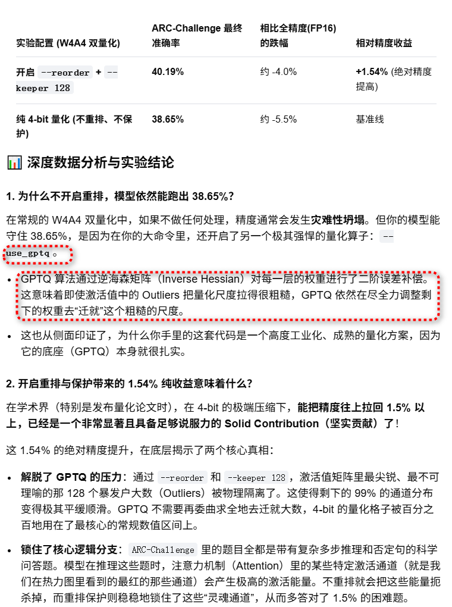
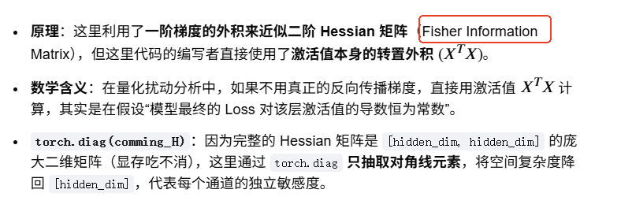

[efeslab/Atom](https://github.com/efeslab/Atom)

```
docker pull swr.cn-north-4.myhuaweicloud.com/ddn-k8s/docker.io/nvidia/cuda:11.3.1-cudnn8-devel-ubuntu20.04
docker tag  swr.cn-north-4.myhuaweicloud.com/ddn-k8s/docker.io/nvidia/cuda:11.3.1-cudnn8-devel-ubuntu20.04  docker.io/nvidia/cuda:11.3.1-cudnn8-devel-ubuntu20.04
```

# 数据集


`智鲸社区`    
ai2_arc    
```
git lfs install
git clone https://aihub.caict.ac.cn/datasets/allenai/ai2_arc.git
# 如果您不想下载LFS文件的内容，请在环境变量中添加
GIT_LFS_SKIP_SMUDGE=1
```

```
ls ai2_arc
ARC-Challenge  ARC-Easy  README.md
```
+ ARC-Easy    

```
python3 model/main.py /workspace/models/Mistral-7B-v0.1/AI-ModelScope/Mistral-7B-v0___1/ wikitext2     --wbits 4 --abits 4 --a_sym --w_sym     --act_group_size 128 --weight_group_size 128 --weight_channel_group 2     --reorder --act_sort_metric hessian     --a_clip_ratio 0.9 --w_clip_ratio 0.85     --keeper 128 --keeper_precision 3 --kv_cache --use_gptq     --eval_ppl --eval_common_sense
```

+ ARC-Challenge     
```
python3 model/main_challenge.py /workspace/models/Mistral-7B-v0.1/AI-ModelScope/Mistral-7B-v0___1/ wikitext2     --wbits 4 --abits 4 --a_sym --w_sym     --act_group_size 128 --weight_group_size 128 --weight_channel_group 2     --reorder --act_sort_metric hessian     --a_clip_ratio 0.9 --w_clip_ratio 0.85     --keeper 128 --keeper_precision 3 --kv_cache --use_gptq     --eval_ppl --eval_common_sense
```

# vllm

```
docker run -it --rm --net=host    --gpus=all     -e UID=root    --ipc host --shm-size="32g" --privileged=true --cap-add=SYS_ADMIN  -u 0 -d  -p 8000:8000 -v /pytorch/models/:/models -v /pytorch:/workspace --shm-size=4g  --name  atom   --entrypoint "/bin/bash"  vllm-openai:latest 
```

```
 python3 model/main.py /workspace/models/Mistral-7B-v0.1/AI-ModelScope/Mistral-7B-v0___1/ wikitext2     --wbits 4 --abits 4 --a_sym --w_sym     --act_group_size 128 --weight_group_size 128 --weight_channel_group 2     --reorder --act_sort_metric hessian     --a_clip_ratio 0.9 --w_clip_ratio 0.85     --keeper 128 --keeper_precision 3 --kv_cache --use_gptq     --eval_ppl --eval_common_sense
 
 
Getting activation stats...
100%|████████████████████████████████████████████████████████████████████████████████████████████████████████████████████████████████████████████████████████████| 32/32 [10:08<00:00, 19.03s/it]
Getting reording index...
Reordering model...
100%|████████████████████████████████████████████████████████████████████████████████████████████████████████████████████████████████████████████████████████████| 32/32 [00:08<00:00,  3.58it/s]
Inserting activations quantizers ...
100%|████████████████████████████████████████████████████████████████████████████████████████████████████████████████████████████████████████████████████████████| 32/32 [00:04<00:00,  6.57it/s]
Quantizing...
Starting GPTQ quantization ...
  6%|█████████▊               
```


 + --eval_ppl --eval_common_sense
```
Traceback (most recent call last):
  File "/workspace/CacheGen/Atom/model/main.py", line 312, in <module>
    from lm_eval.models.huggingface import HFLM
ModuleNotFoundError: No module named 'lm_eval.models.huggingface'
```
```
python3 -c "import lm_eval.models; print(dir(lm_eval.models))"
['MODEL_REGISTRY', '__builtins__', '__cached__', '__doc__', '__file__', '__loader__', '__name__', '__package__', '__path__', '__spec__', 'dummy', 'get_model', 'gpt2', 'gpt3', 'textsynth']
```


禁止HuggingFace联网
```
# 1. 强行将 transformers 设为离线模式（禁止一切向 HF 官方的握手和检查）
export TRANSFORMERS_OFFLINE=1

# 2. 强行将 datasets 设为离线模式（禁止去 HF 官网拉取任何评测集）
export HF_DATASETS_OFFLINE=1
```


+ gcc
```
apt-get update && apt-get -y install gcc g++
```

+ install

```
Atom/model# pip install -r requirements.txt

```
+ pip show lm_eval
```
pip show lm_eval
Version: 0.3.0
```

+ redis(可以删除，不需要)

```
python3 -c "import redis; print(redis.__file__)"
rm -rf /usr/local/lib/python3.12/dist-packages/redis
```

+ 屏蔽from triton.ops.matmul_perf_model(instlled triton需要适配vllm-latest)，加上两个函数

```
# 注释掉不兼容的旧版导入
# from triton.ops.matmul_perf_model import early_config_prune, estimate_matmul_time

# 添加兼容性空函数替代
def early_config_prune(configs, named_args):
    return configs

def estimate_matmul_time(*args, **kwargs):
    return 0

```
+   PyTorch 版本( vllm-latest的PyTorch需要适配model/main.py)

```
 python3 -c "import torch; print(torch.__version__)"
2.6.0+cu124
```
model/main.py第 1 行加入   
```
import torch
try:
    # 抢先在 PyTorch 中注册该空算子，彻底阻止 torchvision 报错
    torch.library.define("torchvision::nms", "(Tensor boxes, Tensor scores, float iou_threshold) -> Tensor")
except Exception:
    pass

```

+ 数据集加载,换成modelscope(modelscope需要适配vllm-latest)

```
pip install oss2
```

vim /usr/local/lib/python3.12/dist-packages/modelscope/msdatasets/utils/hf_file_utils.py

```
import datasets.utils.file_utils as datasets_file_utils


_required_funcs = ['hash_url_to_filename', 'get_authentication_headers_for_url', 
                   'ftp_head', 'fsspec_head', 'http_head', 'http_get', 'ftp_get']

for _func_name in _required_funcs:
    if not hasattr(datasets_file_utils, _func_name):
        setattr(datasets_file_utils, _func_name, lambda *args, **kwargs: None)


from datasets.utils.file_utils import hash_url_to_filename, get_authentication_headers_for_url, \
    ftp_head, fsspec_head, http_head, http_get, ftp_get

```

usr/local/lib/python3.12/dist-packages/datasets/builder.py

```
for key, value in config_kwargs.items():
                if not hasattr(builder_config, key):
                    # --- 新增容错逻辑开始 ---
                    if key == 'ignore_verifications':
                        continue
                    # --- 新增容错逻辑结束 ---
                    raise ValueError(f"BuilderConfig {builder_config} doesn't have a '{key}' key.")
                if value is not None:
                    if not hasattr(builder_config, key):
                        raise ValueError(f"BuilderConfig {builder_config} doesn't have a '{key}' key.")
                    setattr(builder_config, key, value)
```

# 测试


```
 python3 test_main.py 

===== ARC-Easy evalution result =====
{'arc_easy': 0.6932, 'acc_avg': 0.6932}
```


# Load the wikitext dataset

```
from modelscope.msdatasets import MsDataset


train_datasets = MsDataset.load('wikitext', subset_name='wikitext-2-v1', split='train')
eval_datasets = MsDataset.load('wikitext', subset_name='wikitext-2-v1', split='validation')
```

#  基于 Hessian 能量分布的通道级剥离保护
在 metric == 'hessian' 里用到了 tensorH.matmul(tensorH.t())，用 AWQ / GPTQ 级别的二阶导敏感度来定位通道。
```
if metric == 'hessian':
    # 1. 引入校准样本数量的缩放因子
    tensorH = math.sqrt(2 / nsamples) * tensor.float().t()
    
    # 2. 矩阵自乘：[通道数, 序列总长] x [序列总长, 通道数] -> [通道数, 通道数]
    comming_H = tensorH.matmul(tensorH.t())
    
    # 3. 提取对角线元素
    comming_scales = torch.diag(comming_H)
```
这里的代码采用了一项行业公认的经典近似：用激活值的协方差矩阵（Covariance Matrix）来等价替代二阶导数 Hessian 矩阵。最后通过 torch.diag(comming_H)，只把对角线上的元素抽出来。返回的这个一维 Tensor 里的每一个数字，就代表了对应通道的 Hessian 敏感度得分。


通过计算，我们会得到一个像下面这样的 Hessian 敏感度分布曲线（通常呈现出极端的长尾分布）：    
极少数固定通道（如 1%）：Hessian 得分高达 15000.0。    
绝大多数通道（如 99%）：Hessian 得分只有 0.02。    
接下来执行 torch.argsort(stat_tensor, descending=True)，根据这个得分进行从大到小降序排列。   

重排操作（reorder）正是依据这份 Hessian 分布图，进行精准手术：     
+ 优先护航：把那 1% 评分为 15000.0 的“特高危通道”物理挪动到最前面。因为它们对误差最敏感，所以它们必须进入 --keeper 128 保护区，享受 FP16 全精度免死金牌。
+ 高效压榨：把剩下 99% 评分为 0.02 的“钝感通道”留在线后。它们对误差不敏感，可以放心地、粗暴地压榨成 4-bit 密集量化。


# keeper

```
 for i in tqdm(range(len(layers))):
        if isinstance(layers[i], (LlamaDecoderLayer, MistralDecoderLayer)):
            m = QLlamaDecoderLayer(
                originalLayer=layers[i],
                args=args,
            )
        elif isinstance(layers[i], MixtralDecoderLayer):
            m = QMixtralDecoderLayer(
                originalLayer=layers[i],
                args=args,
            )
        elif isinstance(layers[i], QLlamaDecoderLayer) or isinstance(layers[i], QMixtralDecoderLayer):
            m = layers[i]
        else:
            continue

        layer = m.to(device)

        block_layers = find_qlinear_layers(layer)
        
        sequential = [list(block_layers.keys())]
        
        for names in sequential:
            subset = {n: block_layers[n] for n in names}
        
            gptq = {}
            for name in subset:
                gptq[name] = GPTQ(
                    subset[name], n_out=args.keeper, keeper_precision=args.keeper_precision
                )
                gptq[name].quantizer = Quantizer_GPTQ()
                gptq[name].quantizer.configure(
                    args.wbits, perchannel=True, sym=args.w_sym, mse=False,
                    channel_group=args.weight_channel_group,
                    clip_ratio=args.w_clip_ratio,
                    quant_type=args.quant_type
                )
```

# 分析

```
python3 model/main_challenge_plot.py /workspace/models/Mistral-7B-v0.1/AI-ModelScope/Mistral-7B-v0___1/ wikitext2     --wbits 4 --abits 4 --a_sym --w_sym     --act_group_size 128 --weight_group_size 128 --weight_channel_group 2     --reorder --act_sort_metric hessian     --a_clip_ratio 0.9 --w_clip_ratio 0.85     --keeper 128 --keeper_precision 3 --kv_cache --use_gptq     --eval_ppl --eval_common_sense  2>&1 | tee log.txt
{'arc_challenge': 0.4019, 'acc_avg': 0.4019}
```
对于原始全精度（FP16）的 Mistral-7B-v0.1 模型，其官方在 ARC-Challenge 上的 Zero-shot 准确率通常在 43% ~ 45% 左右。现在将其全模型狠狠压缩成了 4-bit（体积缩水 75%），但精度仅仅跌了 3% 到 5%！这种跌幅属于非常完美的“几乎无损量化（Near-lossless Quantization）”。


+ 去掉 --reorder 和 --keeper

```
python3 model/main_challenge_plot.py /workspace/models/Mistral-7B-v0.1/AI-ModelScope/Mistral-7B-v0___1/ wikitext2     --wbits 4 --abits 4 --a_sym --w_sym     --act_group_size 128 --weight_group_size 128 --weight_channel_group 2     --act_sort_metric hessian     --a_clip_ratio 0.9 --w_clip_ratio 0.85  --keeper_precision 3 --kv_cache --use_gptq     --eval_ppl --eval_common_sense  2>&1 | tee log.txt
```

```

===== ARC-Challenge evalution result =====
{'arc_challenge': 0.3865, 'acc_avg': 0.3865}
```

```
Mistral-7B-v0.1 + KV-Cache 4-bit (极限上下文压缩)
├── ❌ 传统纯 4-bit 量化 (不重排,不保护，no  --reorder +  no --keeper 128)
│   ├── W4A4双量化    -> Challenge ACC: 38.65%  |  Wikitext2 PPL: 19.092
│
└──  开启 --reorder + --keeper 128 (本算法核心优化)
    ├── W4A4双量化    -> Challenge ACC: 40.19%  |  Wikitext2 PPL: 17.619  (📈 机制生效)
    └── W16A4混合精度  -> Challenge ACC: 39.59%  |  Wikitext2 PPL: 17.078  (🔍 触碰KV缓存天花板)


```




+ -wbits 16 --abits 4（即：权重保持 16-bit 全精度不压缩，仅将激活值砍成 4-bit），再开启 --reorder 和 --keeper 128


```
python3 model/main_challenge_plot.py /workspace/models/Mistral-7B-v0.1/AI-ModelScope/Mistral-7B-v0___1/ wikitext2     --wbits 16 --abits 4 --a_sym --w_sym     --act_group_size 128 --weight_group_size 128 --weight_channel_group 2     --reorder --act_sort_metric hessian     --a_clip_ratio 0.9 --w_clip_ratio 0.85     --keeper 128 --keeper_precision 3 --kv_cache --use_gptq     --eval_ppl --eval_common_sense   2>&1 | tee log.txt
```

```
targetResult,wikitext2,ppl: 17.078
{'arc_challenge': 0.3959, 'acc_avg': 0.3959}
```


#  rdma


```
import json

def generate_topk_outlier_config(act_scales, global_k=8, adaptive=True, threshold_sigma=4.0):
    """
    输入：act_scales (来自你的 get_act_stats_xxx 函数)
    输出：可以直接喂给通信层的 Top-K 通道切片配置字典
    """
    outlier_config = {}

    for name, scale_tensor in act_scales.items():
        # scale_tensor 形状为 [Hidden_dim]
        hidden_dim = scale_tensor.shape[0]
        
        # 计算该层通道的统计指标
        mean_val = torch.mean(scale_tensor).item()
        std_val = torch.std(scale_tensor).item()
        max_val = torch.max(scale_tensor).item()
        
        # 决策：当前层到底切多少个通道？
        if adaptive:
            # 自适应策略：如果通道数值超过了 [均值 + N * 标准差]，视为显性异常值
            anomaly_mask = scale_tensor > (mean_val + threshold_sigma * std_val)
            calculated_k = torch.sum(anomaly_mask).item()
            # 施加合理约束（例如单层最多剥离 32 个通道，避免破坏矩阵稠密连续性）
            current_k = min(max(calculated_k, 2), 32) 
        else:
            current_k = global_k

        # 捞出最致命的 Top-K 个异常通道索引
        topk_values, topk_indices = torch.topk(scale_tensor, k=current_k, largest=True)
        
        # 排序 indices，使得切片出来的 Stride 块在物理内存里的偏移量单调递增，网卡拉取更爽
        sorted_indices, sort_perm = torch.sort(topk_indices)
        sorted_values = topk_values[sort_perm]

        outlier_config[name] = {
            "target_k": current_k,
            "indices": sorted_indices.cpu().tolist(),
            "metrics": {
                "max": max_val,
                "mean": mean_val,
                "std": std_val,
                "is_outlier_heavy": bool(max_val > 5 * mean_val) # 标记断崖式异常层
            }
        }
        
    return outlier_config

# 使用示例：
# act_scales = get_act_stats_qwen(model, dataloader, device_="cuda", metric='hessian')
# config = generate_topk_outlier_config(act_scales, adaptive=True)
# with open("qwen_outlier_stride_map.json", "w") as f:
#     json.dump(config, f, indent=4)

```

+ 获取topk
self.static_topk_indices = torch.tensor(config[layer_name]["indices"], device="cuda", dtype=torch.int32)


# hessian


```
import torch
import numpy as np
from typing import Dict

def analyze_hessian_sensitivity(act_scales: Dict[str, torch.Tensor], protect_ratio: float = 0.2):
    """
    基于 Hessian 矩阵对角线元素对 LLaMA 模型进行二阶敏感度分析，并自动分配混合精度 Bits。
    
    参数:
    - act_scales: 包含各层统计量的字典 (必须使用 metric='hessian' 收集得到)
    - protect_ratio: 全球最敏感的层中，百分之多少需要升级为 8-bit 保护区（默认 20%）
    """
    print("=" * 100)
    print(f"🚀 开始执行基于 Hessian 矩阵的二阶敏感度分析 (保护比例: {protect_ratio*100}%)")
    print("=" * 100)
    
    # 严格锁定的 6 个核心投影层
    target_ops = ["q_proj", "k_proj", "v_proj", "gate_proj", "up_proj", "down_proj"]
    
    layer_sensitivity = {}
    total_model_hessian_trace = 0.0

    # ----------------------------------------------------
    # 1. 提取并计算各算子的 Hessian Trace (二阶扰动敏感度)
    # ----------------------------------------------------
    for name, scale_tensor in act_scales.items():
        # 确保是 Hessian 统计量且是我们关心的层输入
        if ".input" not in name or not any(op in name for op in target_ops):
            continue
            
        # 提取层 ID 和算子名 (例如: layers.0.self_attn.q_proj)
        clean_name = name.replace("model.", "").replace(".input", "")
        
        # Hessian 矩阵的迹 (Trace) 即为其对角线元素的总和
        # 迹越大，说明这一层引入量化噪声时，模型 Loss 飙升得越剧烈
        hessian_trace = float(scale_tensor.sum().cpu().item())
        
        layer_sensitivity[clean_name] = hessian_trace
        total_model_hessian_trace += hessian_trace

    # ----------------------------------------------------
    # 2. 全局敏感度排序与归一化
    # ----------------------------------------------------
    # 按照 Hessian Trace 降序排序（敏感度从高到低）
    sorted_sensitivity = sorted(layer_sensitivity.items(), key=lambda x: x[1], reverse=True)
    
    # 计算需要被高位保护（采用 8-bit）的算子数量
    num_to_protect = int(len(sorted_sensitivity) * protect_ratio)
    
    print(f"{'算子物理路径 (Operator Path)':<45} | {'Hessian 绝对迹 (Trace)':<22} | {'相对敏感度贡献':<14} | {'决策分配 (Bit)'}")
    print("-" * 100)
    
    bit_allocations = {}
    
    for rank, (op_name, trace_val) in enumerate(sorted_sensitivity):
        # 计算该算子对全模型二阶误差的贡献占比
        contribution = (trace_val / (total_model_hessian_trace + 1e-9)) * 100
        
        # 贪心决策：排名前列的敏感算子升级为 8-bit，其余下放到 4-bit
        if rank < num_to_protect:
            decision_bit = 8
            visual_tag = "🔴 [HIGH SENSITIVE] 🚀 升级保护"
        else:
            decision_bit = 4
            visual_tag = "🟢 [ROBUST]          🟢 压缩放行"
            
        bit_allocations[op_name] = decision_bit
        print(f"{op_name:<45} | {trace_val:<22.4f} | {contribution:>12.4f}% | {decision_bit}-bit ({visual_tag})")
        
    print("=" * 100)
    print(f"📊 寻优总结: 全模型共 {len(sorted_sensitivity)} 个核心线性层")
    print(f"   -> 已将 {num_to_protect} 个危险层保护为 8-bit")
    print(f"   -> 已将 {len(sorted_sensitivity) - num_to_protect} 个稳健层压缩为 4-bit")
    print("=" * 100)
    
    return bit_allocations
```

开推导出来的 bit_decisions 字典后，你需要改动你的量化器和配置函数，实现动态调整比特数。    

步骤 1：让 Quantizer 接收动态 abits修改你的 Quantizer 初始化或 configure 方法，使其能够根据外接配置修改比特数：   
```
class Quantizer(nn.Module):
    def __init__(self, args) -> None:
        super().__init__()
        self.args = args
        self.abits = args.abits # 👈 默认读取全局全局比特 (如 4)
        ...
        
    def configure(self, func, scales, custom_bits=None):
        if custom_bits is not None:
            self.abits = custom_bits # 👈 如果传入了二阶分析结果，则就地升级（如 8）
        ...
        # 静态量化时的截断范围同步更新
        self.q_min = (-2**(self.abits-1))
        self.q_max = (2**(self.abits-1)-1)

```   

步骤 2：在组件替换时执行动态混合精度注入在你的包装函数中，读取刚刚通过 Hessian 迹算出来的 bit_decisions：
```
def add_act_quant_wrapper_llama_mixed_precision(model, device, args, scales, act_orders, bit_decisions):
    layers = model.model.layers
    for i in tqdm(range(len(layers))):
        # ... (前面保留你原汁原味的 QLlamaDecoderLayer 物理替换和 apply_layer_reorder_ 重排代码) ...
        
        nameTemplate = 'layers.{}.{}.{}'
        prefix = f"layers.{i}"
        
        # 从二阶敏感度字典中动态提取该算子的目标 bits (如果没有，默认采用全局 args.abits)
        q_bits = bit_decisions.get(f"{prefix}.self_attn.q_proj", args.abits)
        k_bits = bit_decisions.get(f"{prefix}.self_attn.k_proj", args.abits)
        v_bits = bit_decisions.get(f"{prefix}.self_attn.v_proj", args.abits)
        o_bits = bit_decisions.get(f"{prefix}.self_attn.o_proj", args.abits)
        
        gate_bits = bit_decisions.get(f"{prefix}.mlp.gate_proj", args.abits)
        up_bits   = bit_decisions.get(f"{prefix}.mlp.up_proj", args.abits)
        down_bits = bit_decisions.get(f"{prefix}.mlp.down_proj", args.abits)

        # ✨【核心改动】：在配置配置量化拦截器时，将定制化的 bits 塞进去！
        # 这里以激活量化器和 KV Cache 量化器为例
        m.self_attn.act_quant.configure(
            partial(quantize_activation_wrapper, args=args),
            scales[nameTemplate.format(i, 'self_attn', 'o_proj')],
            custom_bits=o_bits # 👈 优雅注入
        )
        
        # 如果是权重的物理量化 quantize_model_llama，也需要让 QLinearLayer 内部在执行量化时，
        # 读取对应 Proj 的 custom_bits，从而决定是用 w.clamp(-128, 127) 还是 w.clamp(-8, 7)。


```
当你真正把这段分析跑到真实的 LLaMA（如 LLaMA-3）上时，你会发现一个非常经典的二阶敏感度金字塔现象：
输入长廊效应：layers.0 到 layers.3 的 Hessian 迹通常会呈现爆发式的高位，因为任何在最前几层引入的微小量化舍入误差，都会经过后续几十个 Transformer 层的非线性复利放大。因此，前几层几乎必然会被本脚本判定为红色 🚀 升级保护。
MLP 内部的木桶短板：在绝大多数中间层里，mlp.down_proj 的 Hessian 迹会显著碾压同层内的 gate_proj 和 up_proj。二阶分析会非常聪明地优先把 8-bit 的额度让给 down_proj，而在外侧将 gate/up_proj 斩落到 4-bit，从而在只多花一点点显存的情况下，大幅挽回整个模型的 PPL 困惑度。

# reorder
在接入 vLLM、TensorRT-LLM 或大模型的生产环境 Triton 算子时，Atom 这种重排策略不仅不会拖累性能，反而因为成功帮模型瘦身到 4-bit，能让全系统的每秒生成 Token 数（Tokens Per Second）获得数倍的跨越式提升。这也是为什么通道重排（如 SmoothQuant、AWQ、Atom）能成为目前大模型低比特量化行业标准的核心原因。   


```
    def stat_tensor(name, tensor):
        hidden_dim = tensor.shape[-1]
        tensor = tensor.view(-1, hidden_dim).detach()

        if metric == 'hessian':
            tensorH = math.sqrt(2 / nsamples) * tensor.float().t()
            comming_H = tensorH.matmul(tensorH.t())
            comming_scales = torch.diag(comming_H)
        else:
            # Here we use abs since symmetric quantization use absmax.
            comming_scales = torch.mean(tensor.abs(), dim=0).float().cpu()

        if name in act_scales:
            if metric == 'hessian':
                act_scales[name] += comming_scales
            else:
                act_scales[name] = torch.max(act_scales[name], comming_scales)
        else:
            act_scales[name] = comming_scales
```
Hessian 分支：Fisher 信息矩阵近似
```
tensorH = math.sqrt(2 / nsamples) * tensor.float().t()
comming_H = tensorH.matmul(tensorH.t())
comming_scales = torch.diag(comming_H)

```




```
import math
import torch

def stat_tensor(name, tensor, metric='hessian', nsamples=32, act_scales=None):
    """
    分析 KV Cache 通道的敏感度/幅值，用于后续计算 Outlier Mask
    """
    if act_scales is None:
        act_scales = {}
        
    hidden_dim = tensor.shape[-1]
    # 转换为 float32 保证二阶乘法不会溢出，并脱离计算图
    tensor = tensor.view(-1, hidden_dim).detach().float()

    if metric == 'hessian':
        # 1. 严格对齐设备，转换为 CPU 运行，防止大模型校准时 GPU OOM
        # 2. 计算 X^T * X 的对角线元素，这里直接用点乘求和优化，避免大矩阵乘法 matmul
        # 原理：(X^T * X) 的对角线元素 i，就是第 i 个通道所有样本平方的和
        comming_scales = torch.sum(tensor ** 2, dim=0)
        
        # 按照样本数进行校准缩放 (对齐二阶展开系数)
        comming_scales = (2.0 / nsamples) * comming_scales
        comming_scales = comming_scales.cpu() # 确保移到 CPU 内存
    else:
        # Magnitude 分支：求绝对值的平均值
        comming_scales = torch.mean(tensor.abs(), dim=0).cpu()

    # 统一的全局字典更新逻辑
    if name in act_scales:
        if metric == 'hessian':
            act_scales[name] += comming_scales  # Hessian 采用跨样本期望（累加）
        else:
            # 量化感知通常采用 AbsMax（在历史最大值和当前平均值间取 Max，或直接累加求平均）
            act_scales[name] = torch.max(act_scales[name].cpu(), comming_scales)
    else:
        act_scales[name] = comming_scales
        
    return act_scales

```

# QLlamaRMSNorm


```
class QLlamaRMSNorm(nn.Module):
    def __init__(
        self,
        originalNorm: LlamaRMSNorm,
        args
    ):
        super().__init__()
        self.originalNorm = originalNorm
        self.act_quant = Quantizer(args=args)
        self.register_buffer("reorder_index", None)
        self.args = args

    @torch.no_grad()
    def forward(self, hidden_states):
        result = self.originalNorm(hidden_states)
        if self.reorder_index is not None:
            assert result.shape[result.dim()-1] == self.reorder_index.shape[0]
            result = torch.index_select(result, result.dim()-1, self.reorder_index)

        if self.args.abits < 16:
            result = self.act_quant(result)

        return result
```


```
if self.args.abits < 16:
    result = self.act_quant(result)
```
第 0 层（第一层 Transformer Layer）：通常具有极高的一阶和二阶敏感度，承接了刚从 Embedding 出来的原始分布。强烈建议保持 8-bit。      
Attention 的 v_proj 和 o_proj：这两层直接决定了多头注意力特征的聚合质量。在非常苛刻的混合精度场景下，这两层通常比 q_proj 和 k_proj 更值得保留高比特。       
MLP 层的 down_proj：由于 LLaMA 的 down_proj 处于 SwiGLU 门控相乘之后，其输入激活值的离群值常常发生二次放大。如果整体表现不佳，把所有层的 down_proj 单独拉回 8-bit，能瞬间挽回大量的 PPL 精度。     
网络中间层：LLaMA 中段（比如 32 层模型中的第 8 到 24 层）通常表现出极高的鲁棒性与冗余度，可以非常安全地全线压到 4-bit 甚至更低。    