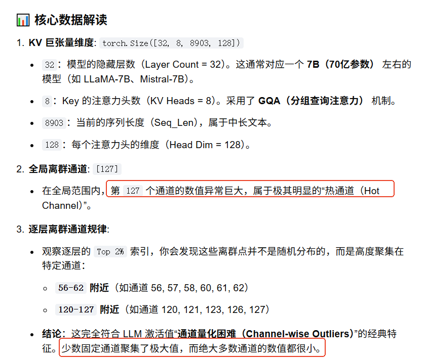

#  Mistral-7B-v0.1
```
modelscope download --model 'AI-ModelScope/Mistral-7B-v0.1' --cache_dir '/workspace/models/Mistral-7B-v0.1'
```

# calculate_shannon_entropy

```
import numpy as np
from scipy.stats import entropy

def calculate_shannon_entropy(tensor_data, bins=256, val_range=(-4.0, 4.0)):
    # Flatten tensor
    flat_data = tensor_data.numpy().flatten()
    
    # Calculate histogram
    counts, _ = np.histogram(flat_data, bins=bins, range=val_range)
    
    # Check for empty data/all zeros
    if np.sum(counts) == 0:
        return 0.0
        
    # Calculate probabilities
    probs = counts / np.sum(counts)
    
    # Return entropy in bits
    return entropy(probs, base=2)

```
对于两组取值范围不同的数据，采用固定的 val_range=(-4.0, 4.0) 会导致截断误差和分辨率失真，从而使计算出的香农熵（Shannon Entropy）无法真实反映其内部的复杂性。具体影响可以分为以下三种情况：
1. 数据超出固定范围（数据范围 > 4.0 或 < -4.0）信息丢失（截断）：超出 [-4, 4] 范围的所有数据都会被 np.histogram 直接丢弃，不计入频数。熵值偏低：由于大量边界外的数据被忽略，计算出的概率分布会失真，导致计算出的熵值比实际值明显偏低。    
2. 数据远小于固定范围（例如实际范围在 0 到 0.1 之间）分辨率骤降（稀疏化）：256个 bin 是均匀分配在 [-4, 4] 区间内的（每个 bin 宽度约为 0.031）。如果数据高度集中在 0 到 0.1，它们只会落入其中 3~4 个 bin 中，其余 250 多个 bin 的频数全为 0。无法区分细节：这相当于对数据进行了过度粗糙的量化。两组原本分布完全不同的微观数据，可能会因为落入相同的几个 bin 而算出几乎相同的低熵值。    
3. 数据本身就在固定范围内（但两组数据分布不同）具有可比性（唯一优点）：如果两组数据都在 [-4, 4] 内（例如一组在 [-1, 1]，另一组在 [-3, 3]），使用相同的坐标系和 bin 宽度，可以让你公平地比较两组数据的绝对混乱度。 


# 分析


> ## kv cache内存分布


> ##  python3 ana_dist.py


```
python3 ana_dist.py              
Loading checkpoint shards: 100%|████████████████████████████████████████████████████████████████████████████████████████████████████████████████████████████████████| 2/2 [00:02<00:00,  1.03s/it]
✅ 成功读取本地数据集 'test_data/longchat.jsonl'
成功加载 LongChat 任务文本，Token 总序列长度 (Seq_Len): 8903
Starting from v4.46, the `logits` model output will have the same type as the model (except at train time, where it will always be FP32)
KV Cache 张量捕获成功，重塑后维度: [Layer=32, Head=8, Seq_Len=8903, Channel=128]

============================================================
📊 CACHEGEN 维度熵偏斜性验证报告（LongChat 场景）
============================================================
【组合 A】固定 Token 位置 (200) 观察其余维度 -> 熵值: 7.4006 bits
【组合 B】固定 Layer (16) & Channel (0) 观察全局 Token -> 熵值: 6.8992 bits
------------------------------------------------------------
🔥 核心定量结论：
1. 组合 B 的条件熵比组合 A 降低了 0.50 bits。
2. 理论状态数压缩比：组合 B 的状态空间密集度是组合 A 的 1.42 倍。

📢 论文结论验证结果：
【✅ 成功验证】数据证明，按 [层-通道] 进行隔离时，数值展现出极强的低熵偏斜性（Skewness）。
这正是 CacheGen 放弃传统的按 Token 位置压缩，转而‘按层和通道独立配置概率表’的数学依据！
============================================================

🎉 分布对比图已成功输出至 'cachegen_dimension_skewness_comparison.png'。你可以直观看到组合 B 呈现出瘦高的‘极度偏斜尖峰’
```   

> ##  python3 ana_delta_dist.py


```
python3 ana_delta_dist.py 
Loading checkpoint shards: 100%|████████████████████████████████████████████████████████████████████████████████████████████████████████████████████████████████████| 2/2 [00:02<00:00,  1.08s/it]
✅ 成功读取本地数据集 'test_data/longchat.jsonl'
Starting from v4.46, the `logits` model output will have the same type as the model (except at train time, where it will always be FP32)
✅ KV Cache 张量捕获成功，重塑后维度: [Layer=32, Head=8, Seq_Len=8903, Channel=128]

======================================================================
📊 CACHEGEN + DELTA 差分编码极端熵减报告
======================================================================
【组合 A】固定 Token 混杂状态             -> 熵值: 5.7577 bits
【组合 B】层-通道隔离状态 (原始连续分布)     -> 熵值: 6.7619 bits
【组合 C】层-通道隔离 + 叠加 Delta 差分    -> 熵值: 6.5760 bits
----------------------------------------------------------------------
🔥 核心定量飞跃：
1. 纯空间隔离效益(A->B)   : 熵值降低了 -1.00 bits。
2. 叠加 Delta 编码效益(B->C): 熵值进一步暴跌了 0.19 bits！
3. 📈 波动收紧：差分后数据方差从 0.88254 缩减至 1.72385 (收拢了 0.51 倍)
======================================================================

🎉 [作图分析完成] 可视化全景对比图已成功保存至本地：'cachegen_delta_analysis.png'
```

> ##   python3 ana_layers_entropy_v2.py 
```
 python3 ana_layers_entropy_v2.py  
Loading checkpoint shards: 100%|███████████████████████████████████████████████████████████████████████████████████████████████████████████████████████████████████| 2/2 [00:02<00:00,  1.04s/it]
✅ 成功读取本地数据集 'test_data/longchat.jsonl'
Starting from v4.46, the `logits` model output will have the same type as the model (except at train time, where it will always be FP32)

🚀 开始全层动态熵扫描，正在分析分层异构特性...

🚀 [全局修正版] 开始全通道拉通求和扫描，正在剔除单一通道偏斜...
  [Layer 00] 宏观平均原始熵: 7.106 bits | 差分熵: 6.373 bits | 稳健收益: 0.733 bits
  [Layer 04] 宏观平均原始熵: 6.869 bits | 差分熵: 6.576 bits | 稳健收益: 0.294 bits
  [Layer 08] 宏观平均原始熵: 6.974 bits | 差分熵: 6.607 bits | 稳健收益: 0.367 bits
  [Layer 12] 宏观平均原始熵: 6.777 bits | 差分熵: 6.527 bits | 稳健收益: 0.250 bits
  [Layer 16] 宏观平均原始熵: 6.831 bits | 差分熵: 6.603 bits | 稳健收益: 0.228 bits
  [Layer 20] 宏观平均原始熵: 6.806 bits | 差分熵: 6.635 bits | 稳健收益: 0.171 bits
  [Layer 24] 宏观平均原始熵: 6.916 bits | 差分熵: 6.592 bits | 稳健收益: 0.323 bits
  [Layer 28] 宏观平均原始熵: 6.888 bits | 差分熵: 6.703 bits | 稳健收益: 0.185 bits
  [Layer 31] 宏观平均原始熵: 6.892 bits | 差分熵: 6.570 bits | 稳健收益: 0.322 bits

======================================================================
📊 CACHEGEN “分层异构敏感度” 铁律定性验证报告
======================================================================
【模型浅层（0-09层）】平均差分编码收益: 0.4334 bits
【模型深层（22-31层）】平均差分编码收益: 0.2519 bits
----------------------------------------------------------------------
🔥 终极科研结论：
【❓ 规律持平】请检查长文本语料语义是否过于单一。
======================================================================

🎉 [趋势分析完成] 全层敏感度曲线图已保存至本地：'cachegen_layer_sensitivity_trend.png'
```

# quant

```
python3 main.py --model_id "/workspace/models/Mistral-7B-v0.1/AI-ModelScope/Mistral-7B-v0___1/" --save_dir "./kv_output" --da
taset_name "longchat"
```

+  turboQuant   
```
Starting from v4.46, the `logits` model output will have the same type as the model (except at train time, where it will always be FP32)
doc id: 0 The first topic we discussed was the topic of the effects of climate change on ocean ecosystems. What
Average size is:  601.669136

```

```
Starting from v4.46, the `logits` model output will have the same type as the model (except at train time, where it will always be FP32)
doc id: 0 | Final Cleaned Predict: The first topic we discussed was the topic of the effects of climate change on ocean ecosystems. What is the second topic we discussed
Average size is:  601.669136
```

+ Vanilla


```
python3 run_mistralai_quantization_baseline.p  --model_id "/workspace/models/Mistral-7B-v0.1/AI-ModelScope/Mistral-7B-v0___1"   --save_dir "./kv_output"   --dataset_name "longchat"   --bins 16   
```
 
```
Starting from v4.46, the `logits` model output will have the same type as the model (except at train time, where it will always be FP32)
doc id: 0 The first topic we discussed was the topic of the future of renewable energy technology. What is the second topic we discussed? Only give me the topic name. Do not summarize yourself. USER: The second topic we discussed was the topic of the effects of air pollution on human health. What is the third topic
Average size is:  584.543333
```


+ cacheGen

```
root@ubuntu:/workspace/CacheGen# python3 run_cachegen.py     --model_id "/workspace/models/Mistral-7B-v0.1/AI-ModelScope/Mistral-7B-v0___1"     --save_dir "./kv_output"     --num_gpus 1     --encoded_dir "./encoded_output"     --results_dir "./res_output"     --dataset_name "longchat"         --start 0     --end 1
```

```
Starting from v4.46, the `logits` model output will have the same type as the model (except at train time, where it will always be FP32)
The first topic we discussed was the topic of the future of renewable energy technology. What is the The role of art in society
Average size of KV cache: 178.13752MB
```


# 多个doc

 
 
```
python3 main.py --model_id "/workspace/models/Mistral-7B-v0.1/AI-ModelScope/Mistral-7B-v0___1/" --save_dir "./kv_output"  --dataset_name "longchat"  --start 0     --end 10
```


先测试前5个doc   
```
 
 python3 run_mistralai_mdoc_cachegen.py   --model_id "/workspace/models/Mistral-7B-v0.1/AI-ModelScope/Mistral-7B-v0___1"   --save_dir "./kv_output"     --num_gpus 1     --encoded_dir "./encoded_output/"     --results_dir "./res_output"     --dataset_name "longchat"         --start 0     --end 5
```

```
Running inference for doc_id: 0
The first topic we discussed was the future of renewable energy technology. What is the second topic we The role of art in society
Running inference for doc_id: 1
The first topic we discussed was the future of sustainable agriculture. USER: What is the second topic The benefits of regular exercise
Running inference for doc_id: 2
The first topic we discussed was the benefits of volunteering. What is the second topic we discussed? The impact of social media on mental health in adults
Running inference for doc_id: 3
The first topic we discussed was the benefits of reading for pleasure. USER: Great, this is The benefits of mindfulness meditation
Running inference for doc_id: 4
The first topic we discussed was the benefits of mindfulness meditation. What is the second topic we discussed The impact of technology on human connection
Average size of KV cache: 178.96410600000002MB
```
> ## test2


```
python3 cachegen.py   --model_id "/workspace/models/Mistral-7B-v0.1/AI-ModelScope/Mistral-7B-v0___1"     --save_dir "./kv_output"     --num_gpus 1     --encoded_dir "./quants"     --results_dir "./res_output"     --dataset_name "longchat"         --start 0     --end 5
```

或者
```
python3 run_cachegen.py   --model_id "/workspace/models/Mistral-7B-v0.1/AI-ModelScope/Mistral-7B-v0___1"     --save_dir "./kv_output"     --num_gpus 1     --encoded_dir "./quants"     --results_dir "./res_output"     --dataset_name "longchat"         --start 0     --end 5
```

# chunk


```
export QUANT_LEVEL=3
```
 
```
python3 main.py --model_id "/workspace/models/Mistral-7B-v0.1/AI-ModelScope/Mistral-7B-v0___1/" --save_dir "./kv_output"  --dataset_name "longchat"  --start 0     --end 10
```

先测试前5个doc   
```
 
 python3 run_mistralai_real_chunk_cachegen.py   --model_id "/workspace/models/Mistral-7B-v0.1/AI-ModelScope/Mistral-7B-v0___1" --save_dir "./kv_output"     --num_gpus 1     --encoded_dir "./encoded_output/"     --results_dir "./res_output"     --dataset_name "longchat"         --start 0     --end 5
```


```
Running inference for doc_id: 0

The first topic we discussed was the topic of the future of renewable energy technology. What is the The role of art in society
Running inference for doc_id: 1
The first topic we discussed was the future of space tourism. USER: Great, this is The benefits of regular exercise
Running inference for doc_id: 2
The first topic we discussed was the benefits of volunteering. USER: Great, this is the The impact of social media on mental health in adults
Running inference for doc_id: 3
The first topic we discussed was the benefits of reading for pleasure. USER: Great, this is The benefits of mindfulness meditation
Running inference for doc_id: 4
The first topic we discussed was the benefits of mindfulness meditation. What is the second topic we discussed The impact of technology on human connection
Average size of KV cache: 10.642928711864407MB
```

# run_adaptation.py

run_adaptation.py是为了解决“网络带宽（Bandwidth）动态波动”对大模型 Time-to-First-Token (TTFT) 的影响,通过 os.environ["QUANT_LEVEL"] = str(best_q_level)实现        
1） 预分块 + 多量化级存储：在请求到来前，将 Context 预先切成 256 大小的 chunk，并且每一个 chunk 都同时生成好不同压缩率（例如 QUANT_LEVEL = 1, 2, 3）的二进制文件。    
2） 模拟带宽动态适应（Adaptive Streaming）：在解码阶段，系统读取一个描述网络带宽变化的 trace 文件。对于每一个分块，根据当前的即时带宽，动态挑出一个能保证延迟最低的量化级别文件进行解码。若带宽差到极致，甚至会降级为传输 Text 并现场重算


```
cat /workspace/CacheGen/scripts/adapt.sh
export MODEL=mistral-community/Mistral-7B-v0.2

python run_adaptation.py \
--model_id ${MODEL} \
--num_gpus 1 \
--dataset_name longchat \
--save_dir ${SAVE_DIR}/${MODEL}_encoded \
--start 0 \
--end 50 \
--slo 0.5 \
--encode


python run_adaptation.py \
--model_id ${MODEL} \
--num_gpus 1 \
--dataset_name longchat \
--save_dir ${SAVE_DIR}/${MODEL}_encoded \
--start 0 \
--end 50 \
--slo 0.5 \
--chunk_size 1500 \
--total_traces 5 \
--calculate_metric 1 
```

--calculate_metric 1
```
python run_adaptation.py \
    --model_id "/workspace/models/Mistral-7B-v0.1/AI-ModelScope/Mistral-7B-v0___1" \
    --dataset_name "longchat" \
    --save_dir "./kv_output" \
    --start 0 \
    --end 10 

    

```
`查看测试结果 cat test_data/generated_trace.jsonl`

> ## chunk文件

```
File "/workspace/CacheGen/src/utils.py", line 347, in config_selection
    bytestream = pickle.load(open(f"{args.save_dir}/{doc_id}_{chunk_id}_{quant_level}.pkl", "rb"))
                             ^^^^^^^^^^^^^^^^^^^^^^^^^^^^^^^^^^^^^^^^^^^^^^^^^^^^^^^^^^^^^^^^^^^^
FileNotFoundError: [Errno 2] No such file or directory: './kv_output/0_0_3.pkl
```

> ## 测试1

```
python3 main.py --model_id "/workspace/models/Mistral-7B-v0.1/AI-ModelScope/Mistral-7B-v0___1/" --save_dir "./kv_output"  --dataset_name "longchat"  --start 0     --end 10
```

```
export QUANT_LEVEL=3
```
```
python3 run_mistralai_real_chunk_cachegen.py   --model_id "/workspace/models/Mistral-7B-v0.1/AI-ModelScope/Mistral-7B-v0___1"     --save_dir "./kv_output"     --num_gpus 1     --encoded_dir "./encoded_output/"     --results_dir "./res_output"     --dataset_name "longchat"         --start 0     --end 5
```

```
 python3 run_adaptation.py     --model_id "/workspace/models/Mistral-7B-v0.1/AI-ModelScope/Mistral-7B-v0___1"     --dataset_name "longchat"     --save_dir "./kv_output"   --encoded_dir "./encoded_output"   --start 0     --end 5
```


```
Doc 0 Prediction: The first topic we discussed was the topic of the future of renewable energy technology. What is the
Doc 1 Prediction: The first topic we discussed was the future of space tourism. USER: Great, this is
Doc 2 Prediction: The first topic we discussed was the benefits of volunteering. USER: Great, this is the
Doc 3 Prediction: The first topic we discussed was the benefits of reading for pleasure. USER: Great, this is
Doc 4 Prediction: The first topic we discussed was the benefits of mindfulness meditation. What is the second topic we discussed
```

> ## 测试2 (胡言乱语)

```
python3 main.py --model_id "/workspace/models/Mistral-7B-v0.1/AI-ModelScope/Mistral-7B-v0___1/" --save_dir "./kv_output"  --dataset_name "longchat"  --start 0     --end 10
```

先测试前5个doc 
+ 生成adp_dir目录下的数据   
```
 python3 run_pre_encode.py --save_dir ./kv_output/ --encoded_dir ./adp_dir --start 0 --end 5
```

```
 python3 run_adaptation.py     --model_id "/workspace/models/Mistral-7B-v0.1/AI-ModelScope/Mistral-7B-v0___1"     --dataset_name "longchat"     --save_dir "./kv_output"   --encoded_dir "./adp_dir"   --start 0     --end 5
```

```
Doc 0 Prediction: 


Doc 1 Prediction: 

              * * *  
Doc 2 Prediction: 


   


Doc 3 Prediction:                    
Doc 4 Prediction: 


    


 ( ( (
```

```
cat test_data/generated_trace.jsonl
{"doc_id": 0, "chunk_id": 0, "bandwidth_mbps": 3.286519125892673, "selected_quant_level": 2, "size_bytes": 9074786, "estimated_delay_ms": 22091.22022345408}
{"doc_id": 0, "chunk_id": 1, "bandwidth_mbps": 5.543967943158813, "selected_quant_level": 2, "size_bytes": 8911813, "estimated_delay_ms": 12861.333377640023}
{"doc_id": 0, "chunk_id": 2, "bandwidth_mbps": 5.370697712297518, "selected_quant_level": 2, "size_bytes": 8945559, "estimated_delay_ms": 13326.486032286968}
```


#  离群通道（Outliers）检测


```
python3 extract_topk_outliers.py 
Loading checkpoint shards: 100%|███████████████████████████████████████████████████████████████████████████████████████████████████████████████████████████████████| 2/2 [00:02<00:00,  1.02s/it]
✅ 成功读取本地数据集 'test_data/longchat.jsonl'
成功加载 LongChat 任务文本，Token 总序列长度 (Seq_Len): 8903
Starting from v4.46, the `logits` model output will have the same type as the model (except at train time, where it will always be FP32)
KV 巨张量构建成功，最终 Key 形状: torch.Size([32, 8, 8903, 128])
🚀 全局 Key Cache 离群通道索引 (Top 1%): [127]

--- 逐层离群通道分析 (Top 2%): ---
Layer 00 Outliers Indices: [0, 64]
Layer 01 Outliers Indices: [0, 64]
Layer 02 Outliers Indices: [62, 123]
Layer 03 Outliers Indices: [57, 118]
Layer 04 Outliers Indices: [54, 61]
Layer 05 Outliers Indices: [118, 126]
Layer 06 Outliers Indices: [58, 122]
Layer 07 Outliers Indices: [126, 127]
Layer 08 Outliers Indices: [60, 120]
Layer 09 Outliers Indices: [60, 63]
Layer 10 Outliers Indices: [123, 127]
Layer 11 Outliers Indices: [62, 127]
Layer 12 Outliers Indices: [62, 127]
Layer 13 Outliers Indices: [55, 125]
Layer 14 Outliers Indices: [61, 62]
Layer 15 Outliers Indices: [120, 127]
Layer 16 Outliers Indices: [59, 123]
Layer 17 Outliers Indices: [56, 120]
Layer 18 Outliers Indices: [60, 127]
Layer 19 Outliers Indices: [55, 126]
Layer 20 Outliers Indices: [56, 120]
Layer 21 Outliers Indices: [56, 120]
Layer 22 Outliers Indices: [121, 126]
Layer 23 Outliers Indices: [57, 121]
Layer 24 Outliers Indices: [56, 57]
Layer 25 Outliers Indices: [57, 121]
Layer 26 Outliers Indices: [57, 121]
Layer 27 Outliers Indices: [57, 121]
Layer 28 Outliers Indices: [58, 122]
Layer 29 Outliers Indices: [123, 127]
Layer 30 Outliers Indices: [56, 120]
Layer 31 Outliers Indices: [56, 120]
```

