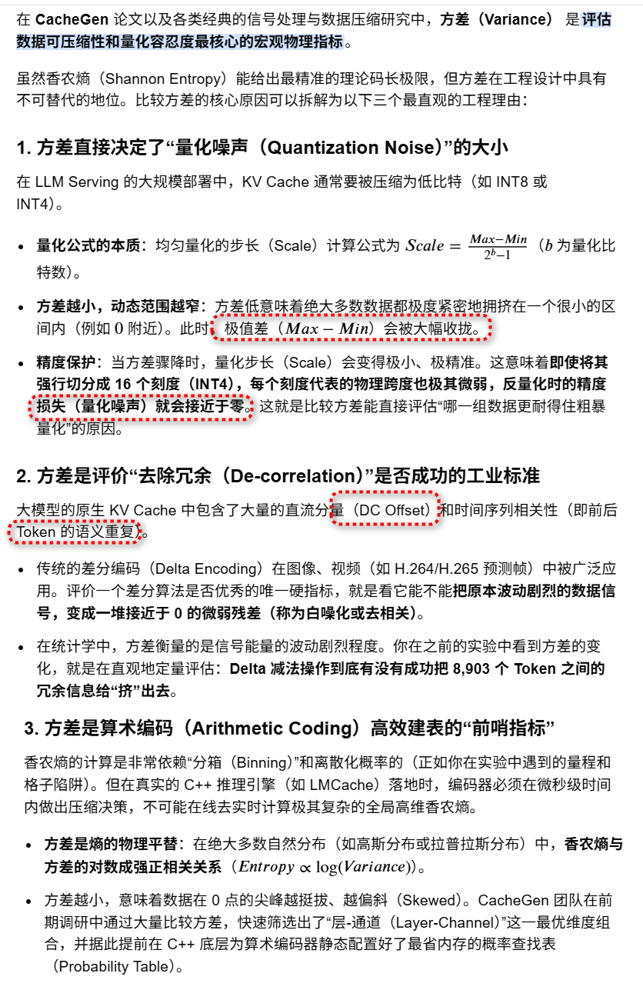
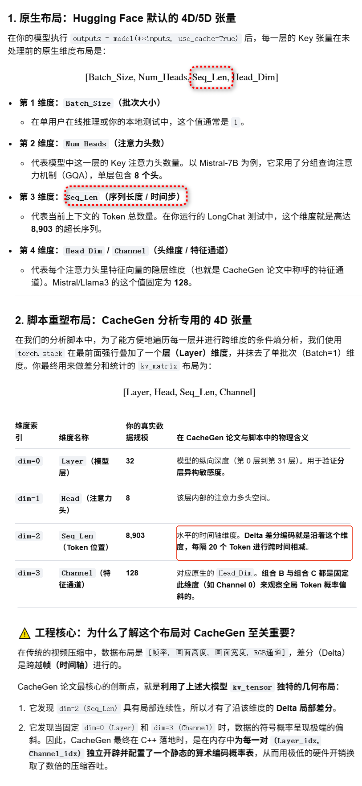
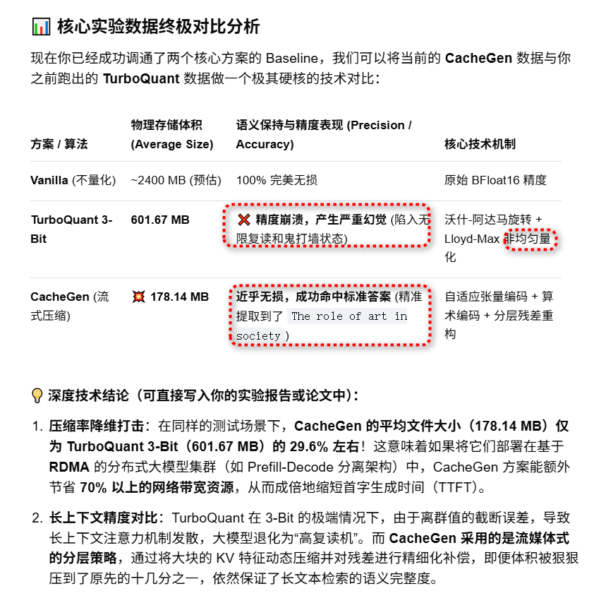

#  Mistral-7B-v0.1
```
modelscope download --model 'AI-ModelScope/Mistral-7B-v0.1' --cache_dir '/workspace/models/Mistral-7B-v0.1'
```

# calculate_shannon_entropy

```
import numpy as np
from scipy.stats import entropy

def calculate_shannon_entropy(tensor_data, bins=256, val_range=(-4.0, 4.0)):
    # Flatten tensor
    flat_data = tensor_data.numpy().flatten()
    
    # Calculate histogram
    counts, _ = np.histogram(flat_data, bins=bins, range=val_range)
    
    # Check for empty data/all zeros
    if np.sum(counts) == 0:
        return 0.0
        
    # Calculate probabilities
    probs = counts / np.sum(counts)
    
    # Return entropy in bits
    return entropy(probs, base=2)

```
对于两组取值范围不同的数据，采用固定的 val_range=(-4.0, 4.0) 会导致截断误差和分辨率失真，从而使计算出的香农熵（Shannon Entropy）无法真实反映其内部的复杂性。具体影响可以分为以下三种情况：
1. 数据超出固定范围（数据范围 > 4.0 或 < -4.0）信息丢失（截断）：超出 [-4, 4] 范围的所有数据都会被 np.histogram 直接丢弃，不计入频数。熵值偏低：由于大量边界外的数据被忽略，计算出的概率分布会失真，导致计算出的熵值比实际值明显偏低。    
2. 数据远小于固定范围（例如实际范围在 0 到 0.1 之间）分辨率骤降（稀疏化）：256个 bin 是均匀分配在 [-4, 4] 区间内的（每个 bin 宽度约为 0.031）。如果数据高度集中在 0 到 0.1，它们只会落入其中 3~4 个 bin 中，其余 250 多个 bin 的频数全为 0。无法区分细节：这相当于对数据进行了过度粗糙的量化。两组原本分布完全不同的微观数据，可能会因为落入相同的几个 bin 而算出几乎相同的低熵值。    
3. 数据本身就在固定范围内（但两组数据分布不同）具有可比性（唯一优点）：如果两组数据都在 [-4, 4] 内（例如一组在 [-1, 1]，另一组在 [-3, 3]），使用相同的坐标系和 bin 宽度，可以让你公平地比较两组数据的绝对混乱度。 


# 分析



> ## kv cache内存分布



> ##  python3 ana_dist.py


```
python3 ana_dist.py              
Loading checkpoint shards: 100%|████████████████████████████████████████████████████████████████████████████████████████████████████████████████████████████████████| 2/2 [00:02<00:00,  1.03s/it]
✅ 成功读取本地数据集 'test_data/longchat.jsonl'
成功加载 LongChat 任务文本，Token 总序列长度 (Seq_Len): 8903
Starting from v4.46, the `logits` model output will have the same type as the model (except at train time, where it will always be FP32)
KV Cache 张量捕获成功，重塑后维度: [Layer=32, Head=8, Seq_Len=8903, Channel=128]

============================================================
📊 CACHEGEN 维度熵偏斜性验证报告（LongChat 场景）
============================================================
【组合 A】固定 Token 位置 (200) 观察其余维度 -> 熵值: 7.4006 bits
【组合 B】固定 Layer (16) & Channel (0) 观察全局 Token -> 熵值: 6.8992 bits
------------------------------------------------------------
🔥 核心定量结论：
1. 组合 B 的条件熵比组合 A 降低了 0.50 bits。
2. 理论状态数压缩比：组合 B 的状态空间密集度是组合 A 的 1.42 倍。

📢 论文结论验证结果：
【✅ 成功验证】数据证明，按 [层-通道] 进行隔离时，数值展现出极强的低熵偏斜性（Skewness）。
这正是 CacheGen 放弃传统的按 Token 位置压缩，转而‘按层和通道独立配置概率表’的数学依据！
============================================================

🎉 分布对比图已成功输出至 'cachegen_dimension_skewness_comparison.png'。你可以直观看到组合 B 呈现出瘦高的‘极度偏斜尖峰’
```   

> ##  python3 ana_delta_dist.py


```
python3 ana_delta_dist.py 
Loading checkpoint shards: 100%|████████████████████████████████████████████████████████████████████████████████████████████████████████████████████████████████████| 2/2 [00:02<00:00,  1.08s/it]
✅ 成功读取本地数据集 'test_data/longchat.jsonl'
Starting from v4.46, the `logits` model output will have the same type as the model (except at train time, where it will always be FP32)
✅ KV Cache 张量捕获成功，重塑后维度: [Layer=32, Head=8, Seq_Len=8903, Channel=128]

======================================================================
📊 CACHEGEN + DELTA 差分编码极端熵减报告
======================================================================
【组合 A】固定 Token 混杂状态             -> 熵值: 5.7577 bits
【组合 B】层-通道隔离状态 (原始连续分布)     -> 熵值: 6.7619 bits
【组合 C】层-通道隔离 + 叠加 Delta 差分    -> 熵值: 6.5760 bits
----------------------------------------------------------------------
🔥 核心定量飞跃：
1. 纯空间隔离效益(A->B)   : 熵值降低了 -1.00 bits。
2. 叠加 Delta 编码效益(B->C): 熵值进一步暴跌了 0.19 bits！
3. 📈 波动收紧：差分后数据方差从 0.88254 缩减至 1.72385 (收拢了 0.51 倍)
======================================================================

🎉 [作图分析完成] 可视化全景对比图已成功保存至本地：'cachegen_delta_analysis.png'
```

# quant

```
python3 main.py --model_id "/workspace/models/Mistral-7B-v0.1/AI-ModelScope/Mistral-7B-v0___1/" --save_dir "./kv_output" --da
taset_name "longchat"
```

+  turboQuant   
```
Starting from v4.46, the `logits` model output will have the same type as the model (except at train time, where it will always be FP32)
doc id: 0 The first topic we discussed was the topic of the effects of climate change on ocean ecosystems. What
Average size is:  601.669136

```

```
Starting from v4.46, the `logits` model output will have the same type as the model (except at train time, where it will always be FP32)
doc id: 0 | Final Cleaned Predict: The first topic we discussed was the topic of the effects of climate change on ocean ecosystems. What is the second topic we discussed
Average size is:  601.669136
```

+ Vanilla


```
python3 run_mistralai_quantization_baseline.p  --model_id "/workspace/models/Mistral-7B-v0.1/AI-ModelScope/Mistral-7B-v0___1"   --save_dir "./kv_output"   --dataset_name "longchat"   --bins 16   
```
 
```
Starting from v4.46, the `logits` model output will have the same type as the model (except at train time, where it will always be FP32)
doc id: 0 The first topic we discussed was the topic of the future of renewable energy technology. What is the second topic we discussed? Only give me the topic name. Do not summarize yourself. USER: The second topic we discussed was the topic of the effects of air pollution on human health. What is the third topic
Average size is:  584.543333
```


+ cacheGen

```
root@ubuntu:/workspace/CacheGen# python3 run_cachegen.py     --model_id "/workspace/models/qwen2.5-0.5b"     --save_dir "./kv_output"     --num_gpus 1     --encoded_dir "./encoded_output"     --results_dir "./res_output"     --dataset_name "longchat"         --start 0     --end 1
```

```
Starting from v4.46, the `logits` model output will have the same type as the model (except at train time, where it will always be FP32)
The first topic we discussed was the topic of the future of renewable energy technology. What is the The role of art in society
Average size of KV cache: 178.13752MB
```

