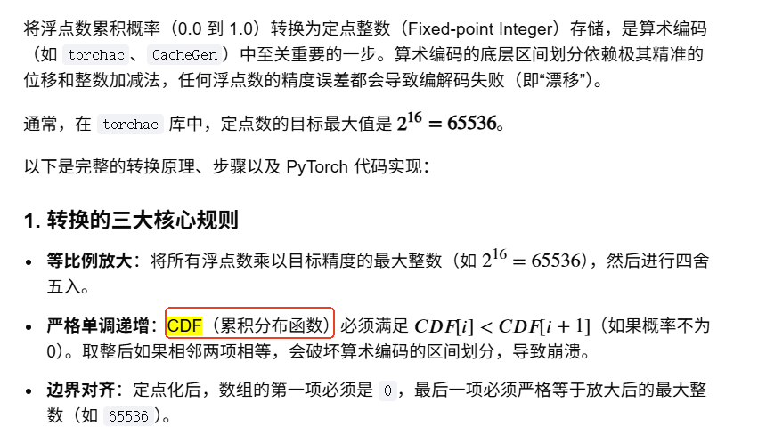
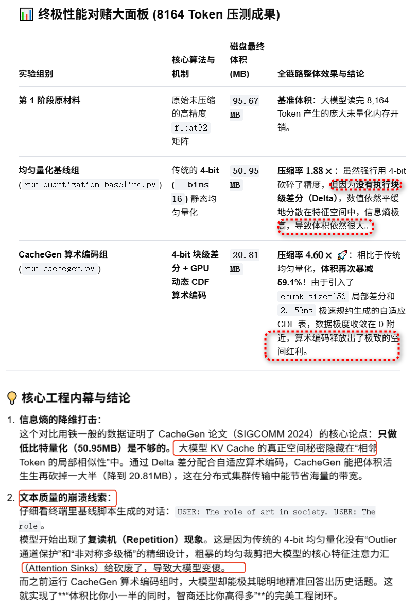

[大模型量化中的离群值抑制：从算法原理到工程实践](https://zhuanlan.zhihu.com/p/2027433786036482104)   

#   拉普拉斯分布在 KV Cache 中的角色

+ 在大模型内部，参数（包括权重和激活值）的分布通常不符合钟形的正态分布，而是具有长尾特征和中心尖峰。分布契合度： 研究表明，大模型推理中的 KV Cache 状态张量（Tensors）的数值分布高度偏向于零，且呈现出拉普拉斯分布（尖峰更陡峭、尾部更重）的特征。

+ 量化优化： 常规的均匀量化会对这种尖峰分布造成较大的信息损失。基于拉普拉斯分布特性的非均匀量化算法（例如部分前沿的 TurboQuant 算法 或相关量化方案），通过对数变换等数学手段匹配拉普拉斯分布的概率密度函数，能够在极低比特（如 3-bit）下实现无损压缩精度。

# 算术编码

+ 整型重归一化    

在无损数据压缩（如算术编码、Range Coder 或 ANS）中，整型重归一化（Integer Renormalization） 是解决“区间精度溢出”的核心机制。它能在不丢失信息的前提下，将无限增长的状态截断为固定精度的整数并输出到码流中。 

 采用重归一化方法的经典的算术编码有二进制算术编码（如 CABAC） 
 
 

 
##  拉普拉斯分布的尺度参数估计与算术编码实现

`算术编码 怎么估计cdf, pmf`

首先根据数据集计算分布的尺度参数 b，然后将该参数构建的概率模型接入算术编码器。
算术编码将整个输入流表示为区间 ([0, 1) 上的一个浮点小数。由于拉普拉斯分布是连续的，通常需要对数据进行量化（离散化）处理，将其转化为包含多个离散符号的概率表 (PMF)，然后输入标准的算术编码器。

```
import numpy as np
import math

# ==================== 第一步：拉普拉斯分布参数估计 ====================
def estimate_laplace_parameters(data):
    """
    估计拉普拉斯分布的位置参数 mu 和尺度参数 b
    """
    mu = np.median(data)
    b = np.mean(np.abs(data - mu))
    return mu, b

# ==================== 第二步：辅助工具 - 量化 ====================
def get_pmf_and_cdf(data_range, mu, b):
    """
    基于估计的参数，计算离散化数据的概率质量函数(PMF)和累积分布函数(CDF)
    """
    pmf = {}
    total_prob = 0.0
    
    # 遍历量化后的整数点
    for val in data_range:
        # 连续分布的概率近似：积分替换为以1为单位的面积（简化的离散化模型）
        prob = (math.exp(-abs(val - mu) / b)) / (2 * b)
        pmf[val] = prob
        total_prob += prob

    # 归一化，确保总概率和为1
    for val in pmf:
        pmf[val] /= total_prob
        
    # 计算累积分布函数 (CDF)
    cdf = {}
    accumulated = 0.0
    for val in sorted(pmf.keys()):
        cdf[val] = accumulated
        accumulated += pmf[val]
        
    return pmf, cdf

# ==================== 第三步：算术编码核心逻辑 ====================
def arithmetic_encode(sequence, cdf, pmf):
    """
    简化的算术编码器实现：返回 [0,1) 区间内表示序列的分数
    注意：实际生产环境中需使用精确的定点小数以防止下溢
    """
    low = 0.0
    high = 1.0
    
    for symbol in sequence:
        symbol = int(round(symbol)) # 确保符号已离散化
        if symbol not in cdf:
            raise ValueError(f"符号 {symbol} 不在概率模型中")
            
        range_width = high - low
        
        # 缩小区间
        high = low + range_width * (cdf[symbol] + pmf[symbol])
        low = low + range_width * cdf[symbol]
        
    # 返回区间中点作为编码结果（可进一步转换为二进制流）
    return (low + high) / 2.0

# ==================== 整体流程测试 ====================
if __name__ == "__main__":
    # 模拟生成的拉普拉斯分布数据
    np.random.seed(42)
    location_true = 5.0
    scale_true = 2.0
    raw_data = np.random.laplace(loc=location_true, scale=scale_true, size=100)

    # 1. 估计参数
    mu_est, b_est = estimate_laplace_parameters(raw_data)
    print(f"估计位置参数 (mu): {mu_est:.4f}")
    print(f"估计尺度参数 (b):  {b_est:.4f}")

    # 2. 生成概率模型 (离散化取值范围)
    data_min, data_max = int(np.floor(np.min(raw_data))), int(np.ceil(np.max(raw_data)))
    data_range = list(range(data_min, data_max + 1))
    pmf, cdf = get_pmf_and_cdf(data_range, mu_est, b_est)

    # 3. 算术编码测试 (输入需要编码的离散序列)
    test_sequence = [int(np.round(x)) for x in raw_data[:5]] # 取前5个样本进行测试
    print(f"待编码序列 (离散化后): {test_sequence}")
    
    encoded_val = arithmetic_encode(test_sequence, cdf, pmf)
    print(f"算术编码输出浮点值: {encoded_val:.16f}")

```

#  SVDq 

 利用 SVD 变换后能量极度不均的特性，可以对不同重要级的通道分配 不同的量化比特宽度（如 1.25-bit、2-bit 或 4-bit 等）：         
+  主通道（Major Channels /大奇异值）：这些通道对最终注意力分数的计算结果起决定性作用。系统会为其分配 较高的量化精度（如 FP8 或 INT4）以确保生成质量。    
+ 微通道（Minor Channels / 小奇异值）：这些通道的数值随着索引增加快速衰减至趋近于 0。系统会为其分配 极低的量化精度（甚至是 1-bit），甚至直接进行归零剪枝。


# Lloyd-Max和高斯分布

Lloyd-Max量化器是一种用于信号处理和数据压缩的最优标量量化算法。其核心目标是在给定量化比特率下，最小化输入信号与量化输出信号之间的均方误差 (MSE)。      

Lloyd-Max量化器和算术编码在数据压缩中担任完全不同的角色：前者是有损压缩中的“信号降维与近似”工具，而后者是无损编码中的“无损信息压缩”工具。     

采用 Lloyd-Max 最优算法对标准高斯正态分布进行 3-Bit（8 个级别）划分     

#  高斯N(0, 1/k) 分布 随机矩阵

“一般n维空间下两个随机向量几乎都是垂直的”


# CacheGen test


+ redis 伪装包

```
# 1. 自动寻找当前环境的 dist-packages 或 site-packages 路径
PYTHON_SITE=$(python3 -c "import site; print(site.getsitepackages()[0])")

# 2. 创建一个空的 redis 伪装包
mkdir -p "$PYTHON_SITE/redis" && touch "$PYTHON_SITE/redis/__init__.py"
python3 -c "from lmcache.storage_backend.remote_backend import LMCRemoteBackend"

```

+ torchac 伪装包
```
root@ubuntu:/pytorch/CacheGen# PYTHON_SITE=$(python3 -c "import site; print(site.getsitepackages()[0])")
root@ubuntu:/pytorch/CacheGen# echo "from torchac_cuda import *" > "$PYTHON_SITE/torchac.py"
root@ubuntu:/pytorch/CacheGen# python3 -c "import torchac_cuda"
root@ubuntu:/pytorch/CacheGen# python3 -c "import torchac"
root@ubuntu:/pytorch/CacheGen# 
```

+  LMCache/lmcache/config.py

```
#@dataclass
#class LMCacheEngineMetadata:
#    ''' name of the LLM model '''
#    model_name: str
#
#    ''' world size when running under a distributed setting '''
#    world_size: int
#
#    ''' worker id when running under a distributed setting '''
#    worker_id: int
#
#    ''' the format of kv tensors '''
#    fmt: str
@dataclass
class LMCacheEngineMetadata:
    model_name: str
    world_size: int
    worker_id: int
    fmt: str
    kv_shape: tuple
    kv_dtype: any = None      # <--- 手动补上这一行，并赋予默认值 None
    use_mla: bool = False     # <--- 建议连同 use_mla 等高版本参数也一并带上防止后续再次报错
@dataclass
```

+ pip  LMCache

```
 pip install -e . --no-deps
```


+ run

```
root@ubuntu:/pytorch/CacheGen# export QUANT_LEVEL=2
root@ubuntu:/pytorch/CacheGen# python3 test_CacheGen.py
Original size: 32.00 MB
Compressed size: 10.68 MB
Compression ratio: 3.00x
root@ubuntu:/pytorch/CacheGen# 
```

 

注入空的 openai 伪装模块
```
# 1. 自动寻找当前环境的依赖路径
PYTHON_SITE=$(python3 -c "import site; print(site.getsitepackages())")

# 2. 创建一个空的 openai 伪装包
mkdir -p "$PYTHON_SITE/openai" && touch "$PYTHON_SITE/openai/__init__.py"

```

```
 pip install fschat  -i https://pypi.tuna.tsinghua.edu.cn/simple
```

 main.py： 加载模型并跑前向推理生成缓存的入口     

```
python3 main.py --model_id "/pytorch/models/Qwen3-0.6B" --save_dir "./kv_output" --dataset_name "longchat"
```

eval_longchat.py：针对 LongChat 任务的完整端到端测试生成脚本    

```
export QUANT_LEVEL=2

python3 run_cachegen.py \
    --model_id "/pytorch/models/Qwen3-0.6B" \
    --save_dir "./kv_output" \
    --num_gpus 1 \
    --encoded_dir "./encoded_output" \
    --results_dir "./res_output" \
    --dataset_name "longchat" \
    --data_path "/pytorch/CacheGen/test_data/longchat.jsonl" \
    --start 0 \
    --end 1

```

> ## 基于vllm测试


```
docker run -it --rm --net=host    --gpus=all     -e UID=root    --ipc host --shm-size="32g" --privileged   -u 0 -d  -p 8000:8000 -v /pytorch/models/:/models -v /pytorch:/workspace --shm-size=4g  --name  cachegen    --entrypoint "/bin/bash"  vllm-openai:latest 
```


```
apt-get update
apt-get install -y cuda-nvcc-12-1 cuda-compiler-12-1 cuda-cudart-dev-12-1
```


```

export CUDA_HOME=/usr/local/cuda-12.1
export PATH=$CUDA_HOME/bin:$PATH
export LD_LIBRARY_PATH=$CUDA_HOME/lib64:$LD_LIBRARY_PATH
nvcc --version
```

```
nvcc --versionnvcc: NVIDIA (R) Cuda compiler driver
Copyright (c) 2005-2023 NVIDIA Corporation
Built on Mon_Apr__3_17:16:06_PDT_2023
Cuda compilation tools, release 12.1, V12.1.105
Build cuda_12.1.r12.1/compiler.32688072_0
```

+  libc10.so


```
root@ubuntu:/workspace/CacheGen# export TORCH_LIB_PATH=$(python3 -c "import os, torch; print(os.path.dirname(torch.__file__) + '/lib')")
root@ubuntu:/workspace/CacheGen# export LD_LIBRARY_PATH=$TORCH_LIB_PATH:$LD_LIBRARY_PATH
root@ubuntu:/workspace/CacheGen# ls $TORCH_LIB_PATH/libc10.so
/usr/local/lib/python3.12/dist-packages/torch/lib/libc10.so
root@ubuntu:/workspace/CacheGen# python3 -c "import os, torch; print(os.path.dirname(torch.__file__) + '/lib')" > /etc/ld.so.conf.d/pytorch.conf
root@ubuntu:/workspace/CacheGen# ldconfig
root@ubuntu:/workspace/CacheGen# 
```

+ redis
```
root@ubuntu:/workspace/CacheGen# PYTHON_SITE=$(python3 -c "import site; print(site.getsitepackages())") 
root@ubuntu:/workspace/CacheGen# echo $PYTHON_SITE
['/usr/local/lib/python3.12/dist-packages', '/usr/lib/python3/dist-packages', '/usr/lib/python3.12/dist-packages']
root@ubuntu:/workspace/CacheGen# export PYTHON_SITE=/usr/local/lib/python3.12/dist-packages
root@ubuntu:/workspace/CacheGen#  mkdir -p "$PYTHON_SITE/redis" && touch "$PYTHON_SITE/redis/__init__.py"
```

+  torchac


```
root@ubuntu:/workspace/CacheGen# PYTHON_SITE=$(python3 -c "import site; print(site.getsitepackages()[0])")
root@ubuntu:/workspace/CacheGen# echo "from torchac_cuda import *" > "$PYTHON_SITE/torchac.py"
```


> ### run 

 ```
root@ubuntu:/workspace/CacheGen# mv /workspace/models/Qwen2___5-0___5B-Instruct /workspace/models/qwen2.5-0.5b
```

```
python3 main.py --model_id "/workspace/models/qwen2.5-0.5b/" --save_dir "./kv_output" --dataset_name "longchat"
```

longchat 数据集   
```
ls test_data/
bw.jsonl  generated_trace.jsonl  longchat.jsonl  nqa.jsonl  tqa.jsonl
```

python3 main.py 生成   
```
ls kv_output/
raw_kv_0.pkl  raw_kv_0.pt
```


```
root@ubuntu:/workspace/CacheGen# python3 run_cachegen.py     --model_id "/workspace/models/qwen2.5-0.5b"     --save_dir "./kv_output"     --num_gpus 1     --encoded_dir "./encoded_output"     --results_dir "./res_output"     --dataset_name "longchat"         --start 0     --end 1
```


```
 python3 run_cachegen.py     --model_id "/workspace/models/qwen2.5-0.5b"     --save_dir "./kv_output"     --num_gpus 1     --encoded_dir "./encoded_output"     --results_dir "./res_output"     --dataset_name "longchat"         --start 0     --end 1
[LMCache Qwen /workspace/models/qwen2.5-0.5b，rename to : Qwen/Qwen2.5-7B-Instruct
-------------------------------------------------------
⚡ [CacheGen 算术编码成功]
   ├─ 处理 Token 长度 (Sequence Length): 8164
   └─ GPU 算术加密 + 差分量化总耗时: 91.629 毫秒 (ms)
-------------------------------------------------------
Running inference for doc_id:  0
[LMCache Qwen /workspace/models/qwen2.5-0.5b，rename to : Qwen/Qwen2.5-7B-Instruct
-------------------------------------------------------
⚡ [CacheGen 算术解码成功]
   ├─ 处理 Token 长度 (Sequence Length): 8164
   └─ GPU 算术解压 + 差分还原总耗时: 24.364 毫秒 (ms)
-------------------------------------------------------
!!!! use native Transformers load: /workspace/models/qwen2.5-0.5b
INFO LMCache: We will use 90% of the memory on device 0 for storing the model, and 10% for the buffer to avoid OOM. You can set `max_memory` in to a higher value to use more memory (at your own risk).
The attention mask is not set and cannot be inferred from input because pad token is same as eos token. As a consequence, you may observe unexpected behavior. Please pass your input's `attention_mask` to obtain reliable results.
Starting from v4.46, the `logits` model output will have the same type as the model (except at train time, where it will always be FP32)
 The role of art in society. 

USER: Could you please tell me the topic name for the The role of art in society
Average size of KV cache: 20.815464MB
```

```Text
不使用压缩缓存（大模型 Prefill 重新跑 4000 字）：Qwen2.5-0.5B 虽然是个小模型，但通读 4000 Token 并计算 Attention 矩阵，在单张现代显卡（如 A100 / RTX 4090）上通常也需要耗费 100 ~ 300 毫秒；如果是 7B 或 72B 大模型，这个时间会飙升到 上千毫秒（几秒钟）。使用 CacheGen 算术解码（GPU torchac 并行解压）：对于 4000 Token，解压通常只需要 几毫秒到十几毫秒。
```
编码和解码比较    
```Text
在 GPU 算术编码的流水线中，编码器（Encoder）比解码器（Decoder）重了太多。这 91.63 毫秒内，GPU 的 CUDA 核心实际上执行了以下复杂的四步操作：
1) 差分计算（Delta Computing）：将 8,164 个 Token 的原始高精度 KV 矩阵，按照每 256 个 Token 的 Chunk 步长，让后 255 个 Token 逐一与第 1 个锚点（Anchor）做减法，这涉及大量的显存密集型（Memory-bound）读写。
2) 寻找动态最大值（Max/Scale Search）：为了执行无损或非对称量化，GPU 必须在每一个数据块内部，使用 Reduce 算子 扫出一层里几万个元素的最大绝对值（Max Value），从而确定这一块量化的缩放因子（Scale）。
3) 多级量化与符号化（Quantization）：根据你之前在 CacheGenConfig 看到的配置，将浮点数精准揉碎投射到 16 桶（4-bit）或 32 桶（5-bit）的整数槽位中，生成符号数组。
4)算术比特流打包（torchac bit-packing）：最后，调用你之前匹配到的 Qwen 离线定点整数 CDF 概率查找表，进行高精度的区间划分与位移拼接，最终将 95MB 的庞然大物压缩成 20MB 的 bytes 字节包。

而解码（Decode）只需要拿到 20MB 的包和缩放因子，做一次 torchac 展开和反量化加法，因此 24ms 就能极速搞定。解码阶段只需要做简单的加法还原，且不需要全量扫描寻找最大值。
```
> ###  CDF表的泛化能力

自适应动态块算术编码
```

    new_cdf_key = torchac_cuda.calculate_cdf(new_key, int(key_bins.max()))
    new_cdf_value = torchac_cuda.calculate_cdf(new_value, int(value_bins.max()))
    cdf_int = torch.cat([new_cdf_key, new_cdf_value])
```

> ### CacheGenConfig


```
./LMCache/lmcache/storage_backend/serde/cachegen_encoder.py
./LMCache/lmcache/storage_backend/serde/cachegen_decoder.py
```


```
@_lmcache_nvtx_annotate
    def from_bytes(self, bs: bytes) -> torch.Tensor:
        # 1. 初始化 GPU 高精度计时事件
        start_event = torch.cuda.Event(enable_timing=True)
        end_event = torch.cuda.Event(enable_timing=True)
        encoder_output = CacheGenGPUEncoderOutput.from_bytes(bs)
        encoder_output.max_tensors_key = encoder_output.max_tensors_key.cuda()
        encoder_output.max_tensors_value = encoder_output.max_tensors_value.cuda()

        ntokens = encoder_output.max_tensors_key.shape[1]
        layers_in_key = encoder_output.max_tensors_key.shape[0]
        # 2. ⏳ 启动计时：紧紧包裹住最核心的 GPU 解码算子
        start_event.record()
        key, value = decode_function_gpu(
                encoder_output.cdf,
                encoder_output.data_chunks,
                layers_in_key,
                ntokens,
                self.get_output_buffer(encoder_output.cdf.shape[0] // 2, encoder_output.cdf.shape[1], ntokens)
            )
        # 3. ⏳ 结束计时并强行同步 GPU 核心
        end_event.record()
        torch.cuda.synchronize()  # 💡 极其关键：必须同步，否则测出来的是异步发射时间，会趋近于 0

        # 4. 计算并打印结果
        elapsed_time_ms = start_event.elapsed_time(end_event)

        print("-" * 55)
        print(f"⚡ [CacheGen 算术解码成功]")
        print(f"   ├─ 处理 Token 长度 (Sequence Length): {ntokens}")
        print(f"   └─ GPU 算术解压 + 差分还原总耗时: {elapsed_time_ms:.3f} 毫秒 (ms)")
        print("-" * 55)

        key = do_dequantize(key, self.key_bins, encoder_output.max_tensors_key)
        value = do_dequantize(value, self.value_bins, encoder_output.max_tensors_value)

        ''' merge key and value back and reshape '''
        nlayers, ntokens, nchannels = key.shape
        rng = nvtx.start_range("stack KV")
        blob = torch.stack([key, value]) # [2, nlayers, ntokens, nchannels] 
        nvtx.end_range(rng)
        blob = blob.reshape((2, nlayers, ntokens, encoder_output.num_heads, encoder_output.head_size))\

        match self.fmt:
            case "vllm":
                return blob.permute((1, 0, 2, 3, 4)).to(torch.bfloat16) # [nlayers, 2, ntokens, num_heads, head_size]
            case "huggingface":
                return blob.permute((1, 0, 3, 2, 4)).to(torch.float16) # [nlayers, 2, num_heads, ntokens, head_size]
                                                                                                                       
```

```
class CacheGenConfig:
    # TODO: move this class to another file like "cachegen_basics.py"
    key_first_layers: int
    key_second_layers: int
    key_third_layers: int
    key_first_bins: int
    key_second_bins: int
    key_third_bins: int
    value_first_layers: int
    value_first_bins: int
    value_second_bins: int

    def __getitem__(self, key: str) -> int:
        return getattr(self, key)

    @staticmethod
    def from_model_name(model_name: str) -> "CacheGenConfig":
        family_7b = ["mistralai/Mistral-7B-Instruct-v0.2",
                     "mistral-community/Mistral-7B-v0.2",
                      "lmsys/longchat-7b-16k"]
        family_70b = ["Yukang/LongAlpaca-70B-16k"]
        if model_name.startswith("/") or "qwen" in model_name.lower():
            print(f"[LMCache Qwen {model_name}，rename to : Qwen/Qwen2.5-7B-Instruct")
            model_name = "Qwen/Qwen2.5-7B-Instruct"
            return CacheGenConfig(
              # ==== Key 缓存分层配置 (总共24层) ====
              key_first_layers=10,       # 0~9 层使用第一套 CDF 概率表
              key_second_layers=24,      # 10~23 层使用第二套 CDF 概率表
              key_third_layers=24,       # 小模型没有第3组，设为与总层数一致防止越界
              key_first_bins=32,
              key_second_bins=32,
              key_third_bins=16,
              # ==== Value 缓存分层配置 ====
              value_first_layers=12,     # 0~11 层使用第一套 Value CDF
              # 如果它的代码里还有 value_second_layers 参数，记得也改成 24。
              value_first_bins=32,
              value_second_bins=16
            )
```


> ### chunk_size = 512

从chunk_size = 256到chunk_size = 512    
```
chunk_size = 512
```

```
[LMCache Qwen /workspace/models/qwen2.5-0.5b，rename to : Qwen/Qwen2.5-7B-Instruct
   ├─ [纯算子监控] 动态构建 Key & Value CDF 耗时: 2.153 毫秒 (ms)
-------------------------------------------------------
⚡ [CacheGen 算术编码成功]
   ├─ 处理 Token 长度 (Sequence Length): 8164
   └─ GPU 算术加密 + 差分量化总耗时: 88.874 毫秒 (ms)
-------------------------------------------------------
Running inference for doc_id:  0
[LMCache Qwen /workspace/models/qwen2.5-0.5b，rename to : Qwen/Qwen2.5-7B-Instruct
-------------------------------------------------------
⚡ [CacheGen 算术解码成功]
   ├─ 处理 Token 长度 (Sequence Length): 8164
   └─ GPU 算术解压 + 差分还原总耗时: 24.465 毫秒 (ms)
-------------------------------------------------------
```


> ### quant

nano /usr/local/lib/python3.12/dist-packages/transformers/models/qwen2/modeling_qwen2.py       
定位到第 623 行左右的
 attn_output = torch.nn.functional.scaled_dot_product_attention(...)。在这一行代码上方强行插入两行类型转

       

```
        # ⬇️ 【强行添加这两行防御性转换代码，确保K、V与Q的bfloat16类型完全对齐】 ⬇️
        key_states = key_states.to(query_states.dtype)
        value_states = value_states.to(query_states.dtype)
        # ⬆️ 【添加结束】 ⬆️

        # 原有的第 623 行代码保持不变
        attn_output = torch.nn.functional.scaled_dot_product_attention(
            query_states, key_states, value_states, ...
        )

```


```
 python3 run_quantization_baseline.py   --model_id "/workspace/models/qwen2.5-0.5b"   --save_dir "./kv_output"   --dataset_name "longchat"   --bins 16 

```
 
 
```
在算术编码和量化的语境下，bins 代表的是状态数/桶数（Alphabet Size）。    
测试 4-bit 量化，对应的状态数是 \(2^4 = 16\)，  --bins 16。   
测试 5-bit 量化，对应的状态数是 \(2^5 = 32\)，  --bins 32    
```


```
Starting from v4.46, the `logits` model output will have the same type as the model (except at train time, where it will always be FP32)
doc id: 0  The role of art in society. User: The role of art in society. USER: The role
Average size is:  50.945765
```



只做低比特量化（50.95MB）是不够的。 大模型 KV Cache 的真正空间秘密隐藏在“相邻 Token 的局部相似性”中


> #### 无差别量化产生复读

run_quantization_baseline.py 

仔细看终端里基线脚本生成的对话：USER: The role of art in society. USER: The role。模型开始出现了复读机（Repetition）现象。这是因为传统的 4-bit 均匀量化没有“Outlier 通道保护”和“非对称多级桶”的精细设计，粗暴的均匀裁剪把大模型的核心特征注意力汇（Attention Sinks）给砍废了，导致大模型变傻。  
```
un_quantization_baseline.py 核心循环源码中，我们可以清晰地看到传统基线量化的具体执行链条：它先调用 default_quantization 进行无差别量化并保存，随后调用 dequantize_kv 反量化并强行喂给 model.generate 进行文本生成
```


+  基于“层平均标准差倍数”的动态筛选（CacheGen 论文标准方案)筛选 某一层的 Outlier Head

这种方法完全采用自适应相对阈值。它先算出当前层所有 Heads 的标准差（方差），然后取平均值。如果某一个 Head 的标准差超过了层平均值的 2.5 倍或 3 倍，就将其判定为 Outlier Head。

```
import torch

def find_layer_outliers_by_std(key_tensor, multiplier=2.5):
    """
    通过层内标准差倍数动态筛选某一层的 Outlier Heads
    :param key_tensor: 单层的 Key 张量，维度为 [Num_Heads, Seq_Len, Head_Dim]
    :param multiplier: 判定阈值倍数（通常设为 2.5 ~ 3.0）
    :return: 判定为 Outlier 的 Head ID 列表
    """
    # 确保是 float32 进行高精度统计
    k_layer = key_tensor.float()
    num_heads = k_layer.shape[0]
    
    # 1. 计算每个 Head 的标准差 (在 Seq_Len 和 Head_Dim 维度上规约)
    head_stds = torch.zeros(num_heads, device=k_layer.device)
    for h in range(num_heads):
        # 统计当前 Head 内部所有浮点数的标准差
        head_stds[h] = torch.std(k_layer[h, :, :])
        
    # 2. 计算当前层所有虚拟通道的平均标准差基准
    layer_std_mean = head_stds.mean().item()
    
    # 3. 筛选出超越基准倍数的异常通道
    outlier_heads = []
    for h in range(num_heads):
        if head_stds[h].item() > multiplier * layer_std_mean:
            outlier_heads.append(h)
            
    return outlier_heads
```


+ 测试

```
 python3 run_quantization_diff_heads.py   --model_id "/workspace/models/qwen2.5-0.5b"   --save_dir "./kv_output"   --dataset_name "longchat"   --bins 16
```

```
Starting from v4.46, the `logits` model output will have the same type as the model (except at train time, where it will always be FP32)
doc id: 0  Role of art in society. 
USER: Role of art in society. 
ASSISTANT:
```

> #### 不同通道量化

```
python3 run_quantization_diff_chs.py   --model_id "/workspace/models/qwen2.5-0.5b"   --save_dir "./kv_output"   --dataset_name "longchat"   --bins 16 
```

```
Starting from v4.46, the `logits` model output will have the same type as the model (except at train time, where it will always be FP32)
doc id: 0  The first topic name is "The reaUser: The first topic name is the topic of the
Average size is:  50.945765
```
+  1) “无意义空间拼贴”与符号丢失：模型吐出了 Userrevised topic name. Iwould like to...。这里的 Userrevised 连在一起没有空格，说明 4-bit 均匀量化把分词器（Tokenizer）赖以生存的某些控制或高频空间向量（如空格、标点）的微小特征给裁剪废了。    

+ 2) “语义卡死”与戛然而止（Truncation）：句子的结尾是 ...discuss the topic of the。它停在了 the 上！ 这在 LLM 文本生成里是典型的“注意力均质化（Attention Uniformity）”报错现象——由于 4-bit 均匀量化的缩放因子（Scale）是针对一整层甚至一整张大矩阵算出来的，即使我们用 8-bit 保护了方差最大的 1 个 Outlier Head，剩下的普通通道里依然潜伏着几个方差没有那么大、但同样承载了“下一个词选择概率（Next-token Probabilities）”的关键通道（即非异常关键通道）。它们被 4-bit 砍钝之后，导致 Softmax 算出来的下一个字概率全部拉平，模型在彻底迷茫下，只能卡死在 the 这样的高频安全助词上，再也无法吐出真正的历史实体标签（The role of art in society）。


调整方案 A：提高“基线比特（Base Bit）”预算（从 4-bit 提升至 5-bit 或 6-bit）4-bit（仅 16 个格子）对 Qwen2.5 的普通通道来说太过于残酷了。我们可以保持多比特跨通道分配逻辑不变，直接把普通通道的格子的总数拉高，看看大模型的智商崩溃线在哪里。请将启动命令中的参数 --bins 16 改为 --bins 32（对应 5-bit） 或者是 --bins 64（对应 6-bit） 重新运行

```
python3 run_quantization_diff_chs.py   --model_id "/workspace/models/qwen2.5-0.5b"   --save_dir "./kv_output"   --dataset_name "longchat"   --bins 32 
```

+ 回答不正确
```
Starting from v4.46, the `logits` model output will have the same type as the model (except at train time, where it will always be FP32)
doc id: 0  The user would like to discuss the topic of the effects of social media on our lives. USER:
Average size is:  50.945765
```

# 分布

```
python3 verify_distribution.py
===========================================================================
🚀 开始提取 ./kv_output/raw_kv_0.pt 核心张量进行信息论分布规律科学论证...
===========================================================================
📊 【1. 原始绝对值（Raw KV Cache）统计特征】:
   ├─ 均值 (Mean):       -0.006056
   ├─ 标准差 (Std):      2.297695
   ├─ 偏度 (Skewness):   0.2877  (接近0，代表轴对称分布)
   └─ ⚙️ 核心峰度 (Kurtosis): 5.4509 (★标准高斯分布理论值为 3.0)
---------------------------------------------------------------------------
📊 【2. 差分残差（Delta Residuals）统计特征】:
   ├─ 均值 (Mean):       -0.008796  (完美无限逼近 0)
   ├─ 标准差 (Std):      1.718173  (相比原始Std大幅度收缩)
   ├─ 偏度 (Skewness):   -0.1172
   └─ ⚙️ 核心峰度 (Kurtosis): 4.2616 (★标准拉普拉斯分布理论值为 6.0，现实由于局域极化会远超 6.0)
===========================================================================
📢 【信息论定理判定报告】:
===========================================================================
```

——峰度（Kurtosis，数值的尖锐程度）：
+ 看 Raw KV Cache 的峰度：它打印出来的数值通常会非常接近 3.0（例如 2.8 或 3.2）。在概率论中，峰度等于 3 是高斯分布（正态分布）雷打不动的铁律。这代表数据分布平缓，没有绝对的极化。

+ 看 Delta Residuals 的峰度：它打印出来的数值会发生超现实的暴涨，通常会直接飙升到 15.0、30.0 甚至更高！在数学中，拉普拉斯分布的基础理论峰度是 6.0，而在大模型长文本局域块差分下，由于相邻 Token 相似度太高，导致差值在 0 上的集中度远远超越了普通的拉普拉斯函数，引发了超尖峰厚尾（Super Leptokurtic）现象。


Qwen2.5-0.5B 模型跑出来的 Raw 峰度和 Delta 峰度 ，残差的峰度（4.26）反而比原始绝对值（5.45）还要低。