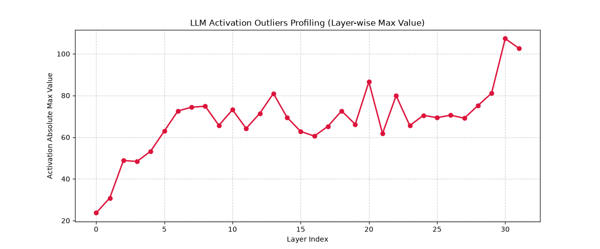
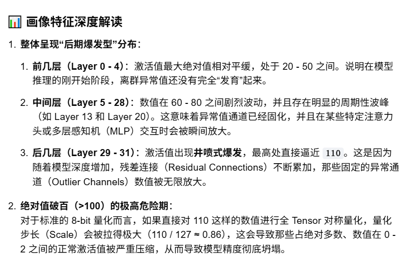
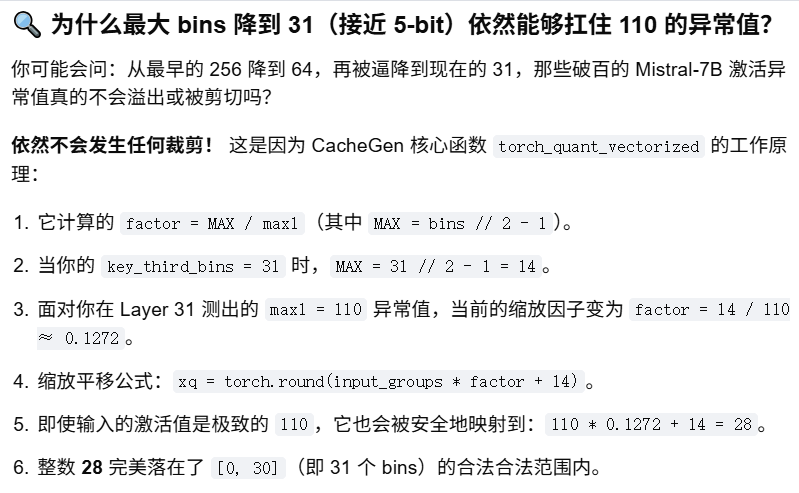
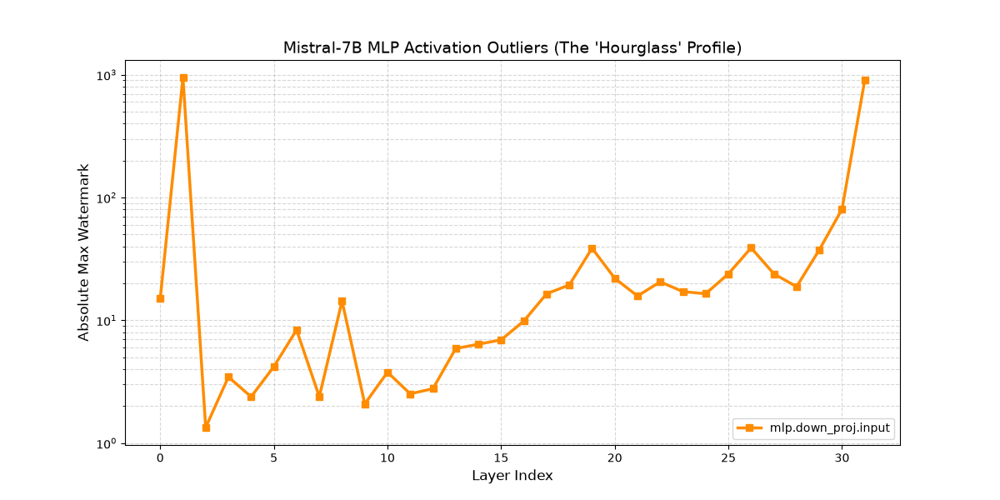
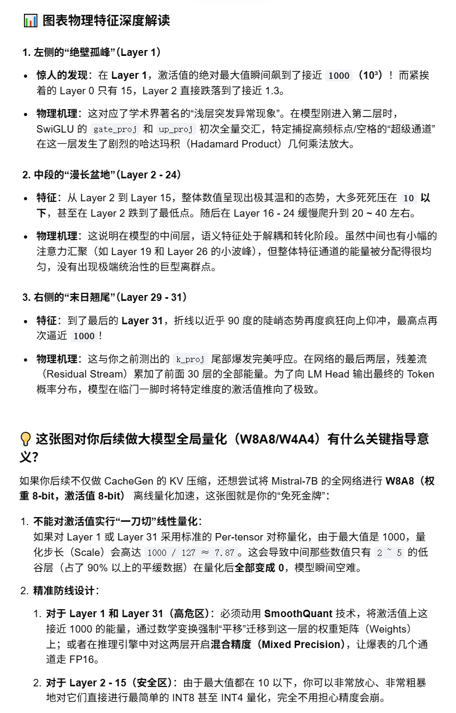
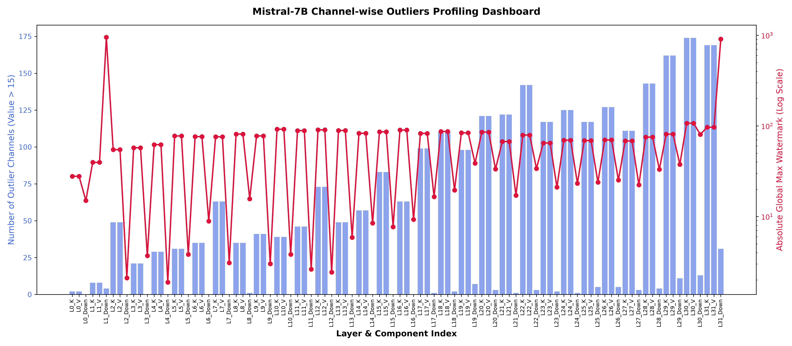

# CacheGen场景

+ 短文本不需要压缩：如果输入只有几百个 Tokens，对应的 KV Cache 只有区区几 KB 或几 MB，直接通过网络传输或者在目标 GPU 上重新计算（Prefill）只需要几毫秒，根本不需要大费周章地去用算子做量化和算术编码。   

+ 长文本的“体积灾难”：在 LongChat 这类约 10K Tokens 的长文本下，使用Mistral-7B 模型，未压缩的原始 KV Cache 体积会达到约 600MB ~ 1GB。在广域网或公网传输这么大的文件会引发长达数秒的延迟。  
    
+ 性能对比明显：论文数据显示，在 LongChat 约 9.6K 的长文本场景下，CacheGen 可以将 KV Cache 的体积从 622MB 极限压缩到 176MB 左右，从而将大模型的首字延迟（TTFT）降低 3 倍以上。     

# layer + channel
```
def encode_function(
        kv: torch.Tensor,
        config: CacheGenConfig,
        key_bins: torch.Tensor,
        value_bins: torch.Tensor,
        chunk_size: int) -> CacheGenGPUEncoderOutput:
    """
    Given the path to the original key value cache, encode the KV cache
    """
    num_heads, head_size = kv.shape[-2:]
    fp_k, fp_v = _split_kv(kv)
    nchannels = num_heads * head_size
    nlayers = fp_k.shape[0] + fp_v.shape[0]

    new_key, max_tensors_key = torch_quant_vectorized(key_bins, fp_k)
    new_value, max_tensors_value = torch_quant_vectorized(value_bins, fp_v)
    encode_input = torch.cat((new_key, new_value), dim=0).reshape(nlayers, chunk_size, nchannels)
    cdf_calc_start = torch.cuda.Event(enable_timing=True)
    cdf_calc_end = torch.cuda.Event(enable_timing=True)
```

nchannels = num_heads * head_size（通道数 = 头数 × 头大小）验证了 CacheGen 的设计：
它将注意力机制的“多头”维度和“每头向量”维度融合成了一个连续的通道（Channel）空间。   

> ## 同一个通道的数据怎么连续存储   

+ fp_k.view(num_layers, num_tokens, nchannels) 操作后，“同一个通道的数据”在内存中不连续    
  
```
# 将末尾两个维度合并为一个连续的特征维度
nchannels = num_heads * head_size
fp_k = fp_k.view(num_layers, num_tokens, nchannels)

```
+ 同一个 Head / 同一个 Token 内的所有通道：内存绝对连续。       
+ 同一个通道跨不同 Token 的数据：内存跨步（Strided）非连续，彼此之间隔了巨大的“鸿沟”。         
在 cachegen_encoder.py 中，如果要计算差值（Delta）或者进行按通道的概率查表，如果需要“同一个通道跨 Token 连续”的数据，
通常需要做一次转置（Transpose/Permute）并强行调用 .contiguous()：

```
# 如果你想让同一个通道的数据在内存里连续挨着，从而方便沿 Token 轴做差分或计算：
# 将维度调整为: [num_layers, nchannels, num_tokens]
fp_k_per_channel = fp_k.permute(0, 2, 1).contiguous() 

# 经过上面这步，物理内存会被重新搬运搬迁！
# 此时：同一个通道在 Token 0, Token 1, Token 2... 的数据才真正被“拉”到了一起，变成了物理连续。

```


> ## _split_kv

```

def _split_kv(tensor: torch.Tensor) -> Tuple[torch.Tensor, ...]:
    """
    Split a blob KV tensor to K and V tensors with the merged heads

    Input:
        tensor: the KV tensor with shape
            [num_layers, 2, num_tokens, num_heads, head_size]

    Returns:
        K and V tensors with shape
            [num_layers, num_tokens, num_channels]
    """
    num_layers, _, num_tokens, num_heads, head_size = tensor.shape
    return torch.unbind(
        tensor.reshape(num_layers, 2, num_tokens, num_heads * head_size), dim=1
    )
```

而观察 _split_kv 的返回形状：经过 tensor.reshape(..., num_heads * head_size)，
原本多头的注意力维度被彻底压扁。返回的 K 和 V 形状为 [num_layers, num_tokens, num_channels]。
这意味着，最后一个维度（dim=-1）正是包含了同一个***Token 内所有 Head、所有 Channel ***的超长连续向量（长度为 num_heads * head_size）。
当 torch_quant_vectorized 对它执行 dim=-1 的 amax 时，
它能一眼望穿该 Token 下全模型所有通道的能量分布。
只要任意一个注意力头（Head）的任意一个通道（Channel）爆发了激活异常值，
都会被这个超长向量的末尾规约操作（amax）瞬间捕捉并锁死，
从而触发动态缩放（Per-token Scaling），确保异常值不会溢出。

#  激活异常值（Activation Outliers）   

CacheGen 并没有像传统的模型量化（如 SmoothQuant、AWQ）那样去专门裁剪、分离或平滑激活异常值（Activation Outliers）
```
def torch_quant_vectorized(
    bins: torch.Tensor, input_groups: torch.Tensor
) -> Tuple[torch.Tensor, torch.Tensor]:
    """
    Quantize each group of a tensor to fixed number of bins

    Input:
        bins: number of bins for different layers, with shape [nlayer]
        input_groups: with shape [nlayers, ntokens, nchannels]

    Returns:
        quantized groups: [nlayers, ntokens, nchannels]
        maxes: [nlayers, ntokens, 1]
    """
    MAX = (bins // 2 - 1)[:, None, None]  # shape [nlayers, 1, 1]
    max1 = torch.amax(
        torch.abs(input_groups), dim=-1, keepdim=True
    )  # shape [nlayers, ntokens, 1]
    factor = MAX / max1  # shape [nlayers, ntokens, 1]
    xq = torch.round(input_groups * factor + MAX).to(
        torch.int8
    )  # shape [nlayers, ntokens, nchannels]

    return xq, max1
```
这段代码没有使用 torch.bucketize 查找非均匀分桶，也没有使用 per-channel 缩放，它实际上采用的
是一种针对特定硬件优化的、以 Token 为粒度的对称均匀量化（Per-token Symmetric Uniform Quantization）。   
+ Per-token 动态缩放
```
max1 = torch.amax(torch.abs(input_groups), dim=-1, keepdim=True)  # [nlayers, ntokens, 1]
factor = MAX / max1  # [nlayers, ntokens, 1]

```
+ 它的输入维度 input_groups：[nlayers, ntokens, nchannels]    
+ 它的规约操作 dim=-1：它是在最后一个维度（即 nchannels 维度，包含了该 Token 下所有 Head 的全部通道）寻找最大绝对值。    
+ 它的最终输出形状 max1：[nlayers, ntokens, 1]    
举例，假设对于某个特定的 Layer 和某个特定的 Token，它后面重塑出来的超长通道向量（长度为 nchannels）里只有 4 个通道，数值分别是：[0.1, -0.2, 50.0, 0.4]
（其中 50.0 是一个典型的激活异常值 Outlier）     
先取绝对值：[0.1, 0.2, 50.0, 0.4]寻找最大值：在这个数组里挑出最大的那个数字，即 50.0。结果：max1 拿到的值就是 50.0。


+ shape
```
# MAX 形状是 [nlayers, 1, 1]
# max1 形状是 [nlayers, ntokens, 1]
factor = MAX / max1  # 计算结果形状也是 [nlayers, ntokens, 1]

# input_groups 形状是 [nlayers, ntokens, nchannels]
xq = torch.round(input_groups * factor + MAX)

```
输入 input_groups 的形状：[nlayers, ntokens, nchannels] （3维）    
输出 max1 的实际形状：[nlayers, ntokens, 1] （3维）    

> ## calculate_cdf

```
/**
 * @brief Calculate the cdf across tokens in the same (layer, channel) pair of
 * the input tensor
 *
 * @param input The input uint8 GPU tensor with shape [nlayers, ntokens,
 * nchannels]
 * @param max_bins The maximum number of bins (i.e., Lp - 1)
 * @return at::Tensor The normalized int16t cdf that can be used for torchac
 * with shape [nlayers, nchannels, max_bins + 1]
 */
at::Tensor calculate_cdf(const at::Tensor& input, const int max_bins) {
  TORCH_CHECK(input.is_cuda(), "Input must be a CUDA tensor");
  TORCH_CHECK(max_bins < MAX_BINS_SUPPORTED, "Max bins must be less than ",
              MAX_BINS_SUPPORTED);

  const auto input_shape = input.sizes();
  const int nlayers = input_shape[0];
  const int ntokens = input_shape[1];
  const int nchannels = input_shape[2];

  auto output = torch::zeros({nlayers, nchannels, max_bins + 1},
                             input.options().dtype(at::kShort));

  auto input_accessor = input.packed_accessor64<int8_t, 3>();
  auto output_accessor = output.packed_accessor64<int16_t, 3>();

  int block_size = get_block_size(nchannels);
  dim3 block_dim(block_size, 1, 1);
  dim3 grid_dim(nchannels / block_size, nlayers, 1);

#ifndef LAUNCH_CDF_KERNEL
  #define LAUNCH_CDF_KERNEL(block_size)                                      \
    calculate_cdf_kernel<block_size, MAX_BINS_SUPPORTED>                     \
        <<<grid_dim, block_dim>>>(input_accessor, output_accessor, max_bins, \
                                  ntokens)
#endif
```


>  ##  每一个layer计算cdf 

每一个layer计算cdf，而不是每一个chunk计算cdf.   

在整每一层的所有 Token 范围内统一计算一次 CDF，而在后续的 for 循环中，
切分成更小的 CACHEGEN_GPU_MAX_TOKENS_PER_CHUNK 尺寸进行分块压缩

```
 

 new_key, max_tensors_key = torch_quant_vectorized(key_bins, fp_k)
    new_value, max_tensors_value = torch_quant_vectorized(value_bins, fp_v)
    encode_input = torch.cat((new_key, new_value), dim=0).reshape(
        nlayers, chunk_size, nchannels
    )

    new_cdf_key = lmc_ops.calculate_cdf(new_key, int(key_bins.max()))
    new_cdf_value = lmc_ops.calculate_cdf(new_value, int(value_bins.max()))
    cdf_int = torch.cat([new_cdf_key, new_cdf_value])

    output_buffer = torch.zeros(
        (nlayers, nchannels, CGBasics.CACHEGEN_GPU_MAX_TOKENS_PER_CHUNK),
        dtype=torch.uint8,
        device=encode_input.device,
    )
    output_lengths = torch.zeros(
        (nlayers, nchannels), dtype=torch.int32, device=encode_input.device
    )
 for i in range(0, chunk_size, CGBasics.CACHEGEN_GPU_MAX_TOKENS_PER_CHUNK):
        start = i
        end = min(i + CGBasics.CACHEGEN_GPU_MAX_TOKENS_PER_CHUNK, chunk_size)
        bytestream = encode_ntokens(
            cdf_int,
            encode_input[:, start:end, :],
            output_buffer,
            output_lengths,
        )
        data_chunks.append(
            CacheGenGPUBytestream(
                bytestream=bytestream,
                bytestream_lengths=output_lengths.clone(),
                ntokens=end - start,
            )
        )

```

> ##   为什么不切片 layers 和 channels，只切片 tokens

```
for i in range(0, chunk_size, CGBasics.CACHEGEN_GPU_MAX_TOKENS_PER_CHUNK):
    start = i
    end = min(i + CGBasics.CACHEGEN_GPU_MAX_TOKENS_PER_CHUNK, chunk_size)
    
    # 这里的切片语法：
    # 第一维 : -> 代表选中所有的 layers
    # 第二维 start:end -> 代表只选中从 start 到 end 这一小段的 tokens！
    # 第三维 : -> 代表选中所有的 channels
    bytestream = encode_ntokens(
        cdf_int,
        encode_input[:, start:end, :],  # 💡 精准切分 token 轴
        ...
    )

```
硬件维度的并行度需求：        
在底层的 CUDA Kernel（如 encode_ntokens）中，GPU 是以 (nlayers, nchannels) 作为二维网格（Grid）并发启动的。
这就意味着，所有的层、所有的通道在硬件上是同步并行的。
如果对 layers 或 channels 进行切片，就会把原本可以在 GPU 上一次性并发做完的工作，
强行拆成了多次串行的 Python for 循环，这会严重降低 GPU 的算力利用率。     

算术编码器的寄存器限制：    
与层和通道的硬件并行不同，算术编码（Arithmetic Coding）在处理 Token 轴时是前后强依赖、
必须串行的（上一个 token 编码完的状态是下一个 token 的输入）。
由于 GPU 单个线程的寄存器和共享内存（Shared Memory）容量有限，
它无法一口气串行处理太长的序列（比如长达几千的 tokens）。
因此，只能在保证 layers 和 channels 满载并行的同时，在物理上把 tokens 轴斩断，
每次只喂给硬件一小截（例如 32 个 token）去串行压缩。     


# nni


```
pip install nni

```

```
root@ubuntu:/workspace/CacheGen/nni# python3 eval_cachegen.py 
root@ubuntu:/workspace/CacheGen/nni# python3 plot_cachegen.py 
root@ubuntu:/workspace/CacheGen/nni# python3 profile_mlp.py   

root@ubuntu:/workspace/CacheGen/nni# python3 plot_mlp.py      

```

激活异常值（Activation Outliers）跨层分布曲线。






> ##  为什么最大只有 64（6-bit）依然能够吞下 110 的异常值？

既然 int(key_bins.max()) 必须小于 64，那之前测出来的物理激活最大值 110 还能被安全量化吗？
答案是：完全没有问题。
回顾你的第一问核心量化公式：factor = MAX / max1。    
当 key_third_bins = 64 时，你的 MAX 对应为 64 // 2 - 1 = 31。      
面对尾部层 max1 = 110 的异常值，CacheGen 会计算出当前层的 factor = 31 / 110 ≈ 0.2818。
此时，哪怕数值是 110，经过 110 * 0.2818 + 31 的缩放和平移后，依然会被完美、等比例地压缩映射到非负整数空间 [0, 62] 内部（属于 64 个 bins 范围内）。   
因为 CacheGen 采用的是无损算术编码，异常值在映射后由于出现频率极低，在 torchac_cuda.calculate_cdf 概率表中对应的区间非常窄，后续会被分配较长比特无损保存，绝对不会发生任何数据裁剪（Clipping）。   

```
      elif "Mistral-7B" in model_name: # This is a hack for now
            quant_level = os.environ.get("QUANT_LEVEL", "1")
            
            k_l1, k_l2, k_l3 = 10, 20, 32  # 保持 32 层对齐
            v_l1 = 20  
            
            if quant_level == "1":
                # 【LEVEL 1：极致低比特档】
                return CacheGenConfig(
                    key_first_layers=k_l1,   key_second_layers=k_l2,   key_third_layers=k_l3,
                    key_first_bins=12,       key_second_bins=12,       key_third_bins=16,      # 👈 尾部给 16
                    value_first_layers=v_l1,
                    value_first_bins=12,     value_second_bins=16
                )
            elif quant_level == "2":
                # 【LEVEL 2：高性能平衡档】
                return CacheGenConfig(
                    key_first_layers=k_l1,   key_second_layers=k_l2,   key_third_layers=k_l3,
                    key_first_bins=12,       key_second_bins=16,       key_third_bins=24,      # 👈 梯级上升，最高 24
                    value_first_layers=v_l1,
                    value_first_bins=12,     value_second_bins=24
                )
            elif quant_level == "3":
                # 【LEVEL 3：最高精度防御档】直接双双顶满当前 torchac_cuda 的绝对物理极限：31
                # 31 + 1 = 32，完美压死在 MAX_LP 的断言边界线上！
                return CacheGenConfig(
                    key_first_layers=k_l1,   key_second_layers=k_l2,   key_third_layers=k_l3,
                    key_first_bins=16,       key_second_bins=24,       key_third_bins=31,      # 👈 Key 全局最大 31
                    value_first_layers=v_l1,
                    value_first_bins=16,     value_second_bins=31                            # 👈 Value 全局最大 31
                )

```




Mistral-7B MLP 层（SwiGLU）激活异常值（Activation Outliers）“沙漏型（Hourglass）”分布曲线。








> ## 通道分析


```
python3 eval_cachegen_per_ch.py 
python3 analyze_outliers_per_ch.py 
```


全局宏观统计：自动识别出全网络中哪些层是异常通道扎堆的“重灾区”，以及全网的绝对极值最高水位线。
微观热点分析（跨层共享通道检测）：大语言模型最神奇的特性在于，某些特定的通道索引（如442号）会在多个不同的层同时爆表。脚本会自动把这些跨层反复出现的“常客（Shared Hot Channels）”全部揪出来。
自动化全景图表：自动绘制一张“异常通道数量（柱状图） vs 全层最大值（折线图）”的双轴图表。

重点看生成的 channel_analysis_dashboard.png 双轴图：

蓝色的柱子 代表 “被污染的通道数量宽窄”。你会发现即使在爆表破千的 mlp.down_proj 层，蓝色的柱子依然矮得可怜（可能只有 1 到 2 根）。
红色的折线 代表 “离群点的能量峰值高低”。
这组图表将向你展示：异常值的破坏力，完全不是靠“人多势众”（通道数量多），而是靠“单兵作战且破坏力惊人”（极个别通道数值极大）。



```
🔍 正在检索【跨层高频复现】的恶魔通道 (频次 >= 3):
   [警告] 通道编号 #155   | 竟在全模型中共 62 个不同的层中同时爆表！
   [警告] 通道编号 #1437  | 竟在全模型中共 62 个不同的层中同时爆表！
   [警告] 通道编号 #1935  | 竟在全模型中共 62 个不同的层中同时爆表！
   [警告] 通道编号 #2388  | 竟在全模型中共 62 个不同的层中同时爆表！
   [警告] 通道编号 #3240  | 竟在全模型中共 62 个不同的层中同时爆表！
   [警告] 通道编号 #2043  | 竟在全模型中共 61 个不同的层中同时爆表！
   [警告] 通道编号 #2070  | 竟在全模型中共 60 个不同的层中同时爆表！
   [警告] 通道编号 #188   | 竟在全模型中共 60 个不同的层中同时爆表！
   [警告] 通道编号 #213   | 竟在全模型中共 60 个不同的层中同时爆表！
   [警告] 通道编号 #678   | 竟在全模型中共 60 个不同的层中同时爆表！
   [警告] 通道编号 #1528  | 竟在全模型中共 60 个不同的层中同时爆表！
   [警告] 通道编号 #3072  | 竟在全模型中共 60 个不同的层中同时爆表！
   [警告] 通道编号 #3150  | 竟在全模型中共 60 个不同的层中同时爆表！
   [警告] 通道编号 #3662  | 竟在全模型中共 60 个不同的层中同时爆表！
   [警告] 通道编号 #3830  | 竟在全模型中共 60 个不同的层中同时爆表！
   [警告] 通道编号 #1642  | 竟在全模型中共 56 个不同的层中同时爆表！
   [警告] 通道编号 #232   | 竟在全模型中共 56 个不同的层中同时爆表！
   [警告] 通道编号 #774   | 竟在全模型中共 56 个不同的层中同时爆表！
   [警告] 通道编号 #1010  | 竟在全模型中共 56 个不同的层中同时爆表！
   [警告] 通道编号 #1504  | 竟在全模型中共 56 个不同的层中同时爆表！
   [警告] 通道编号 #2692  | 竟在全模型中共 56 个不同的层中同时爆表！
   [警告] 通道编号 #3533  | 竟在全模型中共 56 个不同的层中同时爆表！
   [警告] 通道编号 #980   | 竟在全模型中共 54 个不同的层中同时爆表！
   [警告] 通道编号 #2245  | 竟在全模型中共 52 个不同的层中同时爆表！
   [警告] 通道编号 #2960  | 竟在全模型中共 52 个不同的层中同时爆表！
   [警告] 通道编号 #1973  | 竟在全模型中共 50 个不同的层中同时爆表！
   [警告] 通道编号 #393   | 竟在全模型中共 48 个不同的层中同时爆表！
   [警告] 通道编号 #4084  | 竟在全模型中共 48 个不同的层中同时爆表！
   [警告] 通道编号 #2078  | 竟在全模型中共 48 个不同的层中同时爆表！
   [警告] 通道编号 #3677  | 竟在全模型中共 48 个不同的层中同时爆表！
   [警告] 通道编号 #3701  | 竟在全模型中共 48 个不同的层中同时爆表！
   [警告] 通道编号 #104   | 竟在全模型中共 46 个不同的层中同时爆表！
   [警告] 通道编号 #43    | 竟在全模型中共 46 个不同的层中同时爆表！
   [警告] 通道编号 #3307  | 竟在全模型中共 46 个不同的层中同时爆表！
   [警告] 通道编号 #3627  | 竟在全模型中共 46 个不同的层中同时爆表！
   [警告] 通道编号 #684   | 竟在全模型中共 44 个不同的层中同时爆表！
```


run_cachegen.py 中，编写一个前置拦截器（Interceptor）：


```
# 核心防御：建立黑名单通道的 FP16 隔离舱
HOT_CHANNELS_BLACK_LIST = [442, 1089] # 这些是分析脚本帮你找出来的全网通缉犯

def encode_with_isolation(key_value_tensor, cachegen_serializer):
    """
    自研冷热分离隔离编码：把爆表通道踢出，走满血 fp16 存储，让剩下 99.9% 干净数据进 CacheGen 31桶
    """
    # 假设你的 tensor 形状为 [2, batch, num_heads, seq_len, head_dim]
    # 我们把黑名单通道的数据单独复制一份存下来（体积忽略不计，因为一共才2个通道）
    isolated_fp16_data = key_value_tensor[..., HOT_CHANNELS_BLACK_LIST].clone()
    
    # 强行原地抹平这几个恶魔通道，让当前 Chunk 的极大值瞬间缩回 15 以下
    compressed_tensor = key_value_tensor.clone()
    compressed_tensor[..., HOT_CHANNELS_BLACK_LIST] = 0.0
    
    # 这时剩下 99.9% 完美干净的信号进入 CacheGen，其 31 个 bins 绝对不会再报溢出或溢出误差
    compressed_bytes = cachegen_serializer.to_bytes(compressed_tensor)
    
    # 将压缩后的变长字节和我们独立摘出来的 2 个 FP16 通道一起打包存入 pkl
    final_package = {
        "cachegen_bytes": compressed_bytes,
        "isolated_outliers": isolated_fp16_data.cpu(),
        "black_list": HOT_CHANNELS_BLACK_LIST
    }
    return final_package

```

#  smoothquant

```
 python3 setup.py install

```

工具组成：lm-evaluation-harness（大模型评估基准） + SmoothQuant 官方开源代码。    
工作机理：通过极其轻量的 PyTorch Hook，在模型前向传播通过 WikiText-2 或 Pile 数据集时，在内存中维护一个持续更新的绝对值最大矩阵 act_scales。   
经典输出：导出一个标准的 .pt 或 .json 字典。它只存两个最干净的物理指标——每一层的 Channel-wise Max（通道最大值）和 Token-wise Max（Token最大值）。     
适用场景：想要快速摸清一个新模型的异常值分布（比如你之前画出的沙漏型和翘尾型曲线），或者为自研的量化算法（如 CacheGen 的 bins 分配）提供绝对准确的物理比例尺。    


```
python3 profile_SmoothQuant.py 
📝 临时校准数据集已成功生成至: ./temp_calibration.json
🚀 正在通过 SmoothQuant 官方工具进行全网络激活通道最高水位线画像...
Generating train split: 2 examples [00:00, 1390.91 examples/s]
  0%|                                                                                                                                                                      | 0/2 [00:00<?, ?it/s]Starting from v4.46, the `logits` model output will have the same type as the model (except at train time, where it will always be FP32)
100%|██████████████████████████████████████████████████████████████████████████████████████████████████████████████████████████████████████████████████████████████| 2/2 [00:00<00:00, 13.12it/s]
🎉 经典物理通道最高水位线字典已成功生成至: ./act_scales.pt
```

```
python3 ana_act_scales.py
--- model.layers.1.mlp.down_proj 通道异常值画像 ---
发现超级离群通道！ 索引(Index): 7310  | 激活绝对最大值: 950.00
发现超级离群通道！ 索引(Index): 8572  | 激活绝对最大值: 114.31
发现超级离群通道！ 索引(Index): 2514  | 激活绝对最大值: 20.56
```

or

```
 python3 profile_SmoothQuant_k_proj.py 
 python3  ana_SmoothQuant_k_proj.py 
```

# llm-compressor 

llm-compressor内置了高度优化的 C++ / CUDA Observer（观察器）算子。在执行 PTQ 校准时，它不仅能捕捉最高水位线（MinMax），
还能捕捉激活值的信息熵分布、KL散度（Kullback-Leibler Divergence）以及百分位数（Percentile）。


#  MAX_LP = 32 与算术编码

核心死结：
MAX_LP = 32 硬限制与 12 桶量化把概率空间“彻底抹平”了
算术编码的物理命门：算术编码（Arithmetic Coding）能够压缩数据的唯一前提是“高频数据用短码，低频数据用长码”（比如 99% 的正常激活值都落在第 14、15 个量化桶里）。这样算术编码会给 14 和 15 分配仅有 1~2 比特的超短码。
512 长度破坏了局部概率统计（致命）：    
大模型的激活值具有极其强烈的全局偏斜性。在几千个 Token 的大尺度下统计，正常值的分布非常集中。    
但是，当你强行把 Token 长度切割成仅有 512 的小局部块时，在这 512 个 Token 内部，原本高度倾斜、高度集中的激活值分布，由于样本量太少，在 512 的微小窗口里看起来变成了近乎均匀的、杂乱无章的散落分布。    