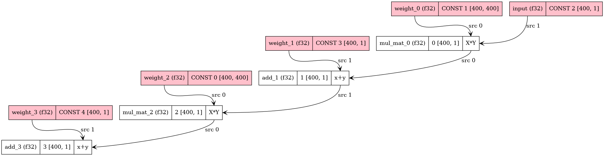

[GGML 入门：搞懂张量、内存池与计算图](https://www.laumy.tech/3147.html/ggml-%E5%85%A5%E9%97%A8%EF%BC%9A%E6%90%9E%E6%87%82%E5%BC%A0%E9%87%8F%E3%80%81%E5%86%85%E5%AD%98%E6%B1%A0%E4%B8%8E%E8%AE%A1%E7%AE%97%E5%9B%BE/)    

# qwen

```
 huggingface-cli download bartowski/Qwen_Qwen3-0.6B-GGUF --include "Qwen_Qwen3-0.6B-Q4_K_M.gguf" --local-dir ./models
```

#  llama.cpp

```
docker pull ghcr.io/ggml-org/llama.cpp:server
```

 

```
docker run -v /pytorch/qwen/models:/models -p 8080:8080 llama-cpp-connector:latest -m /models/Qwen_Qwen3-0.6B-Q4_K_M.gguf --port 8080 --host 0.0.0.0 -n 512
```

> ## arm64


```
# remove armv9 builds
sed -i '/armv9/d' "ggml/src/CMakeLists.txt"

# start docker build
            docker buildx build \
              --push \
              --platform linux/arm64 \
              --build-arg TARGETARCH=arm64 \
              --target server \
              --file .devops/cpu.Dockerfile \
              --attest type=provenance,disabled=true \
              --tag  llama-server:latest \
              .
```


```
[root@centos7 llama.cpp]# docker run -v /pytorch/qwen/models:/models -p 8080:8080 9d2f72ddb130 -m /models/Qwen_Qwen3-0.6B-Q4_K_M.gguf --port 8080 --host 0.0.0.0 -n 512
load_backend: loaded CPU backend from /app/libggml-cpu-armv8.0_1.so
warn: LLAMA_ARG_HOST environment variable is set, but will be overwritten by command line argument --host
main: n_parallel is set to auto, using n_parallel = 4 and kv_unified = true
build: 7941 (11fb327bf) with GNU 11.4.0 for Linux aarch64
system info: n_threads = 128, n_threads_batch = 128, total_threads = 128

system_info: n_threads = 128 (n_threads_batch = 128) / 128 | CPU : NEON = 1 | ARM_FMA = 1 | LLAMAFILE = 1 | OPENMP = 1 | REPACK = 1 | 

Running without SSL
```


> ## bash client
```
[root@centos7 llama.cpp]# bash ./tools/server/chat.sh
> hello qwen , how to play basketball
 Hello, Qwen. How can I help you with playing basketball?yes
 Let
```


> ## client

```
curl -X POST "http://localhost:8080/v1/chat/completions" \
     -H "Content-Type: application/json" \
     -d '{
           "model": "your-model-name",
           "messages": [
             {"role": "system", "content": "You are a helpful assistant."},
             {"role": "user", "content": "Hello, who are you?"}
           ]
         }'
```


+ llama-cpp-api-client   
```
docker run --name llama-cli -itd   --net=host --cap-add=NET_ADMIN --privileged=true -v /root/pytorch/:/workspace python:3.11.14-slim-bookworm
```

```
# install from github
pip install git+https://github.com/ubergarm/llama-cpp-api-client
```
#  单精度评测

llama.cpp提供了perplexity可执行文件来验证模型的PPL精度，这里以wikitext语料来简单测试一下千问14B的性能（通义千问可能更偏向于中文，wikitext-2多数都是英文语料）。需要先下载解压wikitext-2到本地，这里解压到了llama.cpp/wikitext-2-raw/目录下，运行一下命令：   

```
./perplexity -m models/Qwen/14B/ggml-model-Q4_0.gguf -f wikitext-2-raw/wiki.test.raw
```

# dev


```
[root@centos7 docker]# docker run --rm  --name llama.cppdev --net=host    -itd    -e UID=root    --ipc host --shm-size="32g"  --privileged   -u 0 -v /pytorch:/workspace -p 8088:8080  llamp.cpp:cpudev2 
WARNING: Published ports are discarded when using host network mode
6699a510e446d4f640b9e1e09d674dd0c60741bb4ed9ef522fe9bf617a45e44d
[root@centos7 docker]# docker exec -it llama.cppdev  bash
root@centos7:/#  
```

```
cmake -S . -B build -DCMAKE_BUILD_TYPE=Release -DGGML_NATIVE=OFF -DLLAMA_BUILD_TESTS=OFF -DGGML_CPU_ARM_ARCH=armv8-a
cmake --build build -j $(nproc)
```

```
root@centos7:/workspace/llama.cpp# ./build/bin/llama-server -m /workspace/qwen/models/  --host 0.0.0.0 --port 8080 -n 512
```


```
root@centos7:/workspace/llama.cpp# ./build/bin/llama-server -m /workspace/qwen/models/Qwen_Qwen3-0.6B-Q4_K_M.gguf  --host 0.0.0.0 --port 8080 -n 512
main: n_parallel is set to auto, using n_parallel = 4 and kv_unified = true
build: 7941 (11fb327bf) with GNU 11.4.0 for Linux aarch64
system info: n_threads = 128, n_threads_batch = 128, total_threads = 128

system_info: n_threads = 128 (n_threads_batch = 128) / 128 | CPU : NEON = 1 | ARM_FMA = 1 | LLAMAFILE = 1 | OPENMP = 1 | REPACK = 1 | 

Running without SSL
init: using 127 threads for HTTP server
start: binding port with default address family
main: loading model
srv    load_model: loading model '/workspace/qwen/models/Qwen_Qwen3-0.6B-Q4_K_M.gguf'
common_init_result: fitting params to device memory, for bugs during this step try to reproduce them with -fit off, or provide --verbose logs if the bug only occurs with -fit on
llama_params_fit_impl: no devices with dedicated memory found
llama_params_fit: successfully fit params to free device memory
llama_params_fit: fitting params to free memory took 0.54 seconds
llama_model_loader: loaded meta data with 31 key-value pairs and 311 tensors from /workspace/qwen/models/Qwen_Qwen3-0.6B-Q4_K_M.gguf (version GGUF V3 (latest))
llama_model_loader: Dumping metadata keys/values. Note: KV overrides do not apply in this output.
```

> ##  ggml-demo
```
root@centos7:/workspace/llama.cpp/ggml-demo/demo-sgemm# g++ simple-sgemm.cpp  -I /workspace/llama.cpp/ggml/include  -L /workspace/llama.cpp/build/bin/ -lggml -lggml-cpu -lggml-base -o  test
root@centos7:/workspace/llama.cpp/ggml-demo/demo-sgemm# export LD_LIBRARY_PATH="$LD_LIBRARY_PATH:/workspace/llama.cpp/build/bin"
root@centos7:/workspace/llama.cpp/ggml-demo/demo-sgemm# ./test 
Using the CPU as backend to computing...
main: compute buffer size: 0.0625 KB
Enable the cpu parallel mode, and using 66 threads  
compute: compute model in 3.88 ms
mul mat (4 x 3) (transposed result):
[ 61.00 56.00 51.00 111.00
 91.00 55.00 55.00 127.00
 43.00 30.00 29.00 65.00 ]
```

> ## spilt sched


```
sudo  docker run --rm --net=host    --gpus=all -it    -e UID=root    --ipc host --shm-size="32g"  --privileged   -u 0   -v /pytorch:/pytorch  nvcr.io/nvidia/pytorch:24.05-py3 bash
```
arm64   
```
docker run --rm  --name llama.cppdev --net=host    -itd    -e UID=root    --ipc host --shm-size="32g"  --privileged   -u 0 -v /pytorch:/workspace -p 8088:8080  llamp.cpp:cpudev2 
```

> ### cpu编译(运行coredump)   
```
#构建编译build文件
cmake -B build #（如果使用vscode中cmake插件，则此步骤可能自动被执行）
cmake --build build  -j 4
```

```
/pytorch/GGML-Tutorial#  build/bin/split_graph -h
register_backend: registered backend CPU (1 devices)
register_device: registered device CPU (Intel(R) Core(TM) i9-14900)
/pytorch/GGML-Tutorial/src/custom-model.cpp:246: GGML_ASSERT(!devices.empty() && "no gpu devices can be used!") failed
/pytorch/GGML-Tutorial/build/ggml/src/libggml-base.so(+0x5ef21)[0x7e3eac5a1f21]
```

> ###  gpu编译  

```
cmake -B build -DGGML_CUDA=ON
cmake --build build -j 12 #cuda编译较慢，尽可能选择更多core进行编译
```

```
/pytorch/GGML-Tutorial# ./build/bin/split_graph 
ggml_cuda_init: GGML_CUDA_FORCE_MMQ:    no
ggml_cuda_init: GGML_CUDA_FORCE_CUBLAS: no
ggml_cuda_init: found 1 CUDA devices:
  Device 0: NVIDIA GeForce RTX 3090, compute capability 8.6, VMM: yes
register_backend: registered backend CUDA (1 devices)
register_device: registered device CUDA0 (NVIDIA GeForce RTX 3090)
register_backend: registered backend CPU (1 devices)
register_device: registered device CPU (Intel(R) Core(TM) i9-14900)
custom_model:        CUDA0 model buffer size =     1.22 MiB
custom_model:          CPU model buffer size =     0.00 MiB
custom_model: enumerating backends
custom_model: backend_ptrs.size() = 2
custom_model: max_nodes = 65536
ggml_graph_dump_dot: dot -Tpng llama.dot -o llama.dot.png && open llama.dot.png
ggml_backend_sched_alloc_splits: failed to allocate graph, reserving (backend_ids_changed = 1)
ggml_gallocr_reserve_n: reallocating CUDA0 buffer from size 0.00 MiB to 0.00 MiB
ggml_gallocr_reserve_n: reallocating CUDA_Host buffer from size 0.00 MiB to 0.00 MiB
```

新增debug   
```

// lists of buffer types used for each layer
using buft_list_t = std::vector<std::pair<ggml_backend_dev_t, ggml_backend_buffer_type_t>>;
static  void debug_backend(std::vector<ggml_backend_ptr> & backends, std::map<ggml_backend_buffer_type_t, ggml_context *> & ctx_map) {
        //const char * dev_name = "CPU";
            auto get_ctx_for_buft = [&](ggml_backend_buffer_type_t buft) -> ggml_context * {
        auto it = ctx_map.find(buft);
        if (it == ctx_map.end()) {
#if 0
            // add a new context
            struct ggml_init_params params = {
                /*.mem_size   =*/ n_tensors*ggml_tensor_overhead(),
                /*.mem_buffer =*/ NULL,
                /*.no_alloc   =*/ true,
            };
            ggml_context * buft_ctx = ggml_init(params);
            ctx_map[buft] = buft_ctx;
            return buft_ctx;
#else
            return NULL;
#endif

        };
        return it->second;
    };
        for (auto & backend : backends) {
            auto * buft = ggml_backend_get_default_buffer_type(backend.get());
            //auto backend_type = ggml_backend_dev_type(ggml_backend_get_device(backend.get()));
            ggml_context * ctx = get_ctx_for_buft(buft);
            ggml_backend_dev_t dev = ggml_backend_buft_get_device(buft);
            //struct ggml_context * ctx = get_ctx_for_buft(ggml_backend_buffer_get_type(backend.get()));
            if(ctx){
                // skip contexts without tensors
                if (ggml_get_first_tensor(ctx) == nullptr) {
                    continue;
                }
                //ggml_backend_buffer_type_t buf_type = ggml_backend_get_default_buffer_type(backend);
                printf("!!!!!!!!!!!!!! buffer type name: %s\n", ggml_backend_buft_name(buft));
                if(NULL != dev)
                      printf("backend device %s \n",ggml_backend_dev_name(dev));
            }
        }
}
```


+ 可视化

```
 apt-get install graphviz
 sudo dot -Tpng llama.dot -o llama.dot.png
```




> ## device


 

```
 cmake -S . -B build -DGGML_CUDA=ON
  cmake --build build -j 12
```

```
./build/test-device 
GGML device examples
ggml_cuda_init: GGML_CUDA_FORCE_MMQ:    no
ggml_cuda_init: GGML_CUDA_FORCE_CUBLAS: no
ggml_cuda_init: found 1 CUDA devices:
  Device 0: NVIDIA GeForce RTX 3090, compute capability 8.6, VMM: yes
register_backend: registered backend CUDA (1 devices)
register_device: registered device CUDA0 (NVIDIA GeForce RTX 3090)
register_backend: registered backend CPU (1 devices)
register_device: registered device CPU (Intel(R) Core(TM) i9-14900)
device count: 2
device name: CUDA0
device description: NVIDIA GeForce RTX 3090
backend name: CUDA0
buffer type name: CUDA0
buffer name: CUDA0
device name: CPU
device description: Intel(R) Core(TM) i9-14900
backend name: CPU
backend type: GGML_BACKEND_DEVICE_TYPE_CPU
buffer type name: CPU
buffer name: CPU
```

> ## 多设备调度


```
ggml_context * ctx = ctx_for_buft(buft);
```

```
 ggml_backend_sched_new(model.backends.data(), model.backends.size())
```