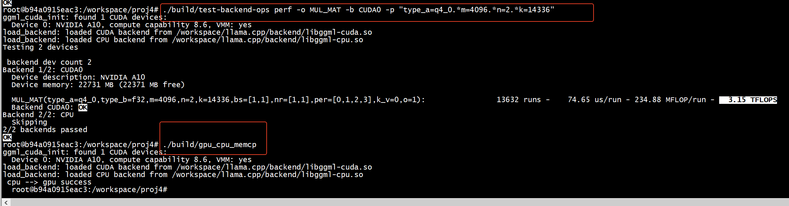
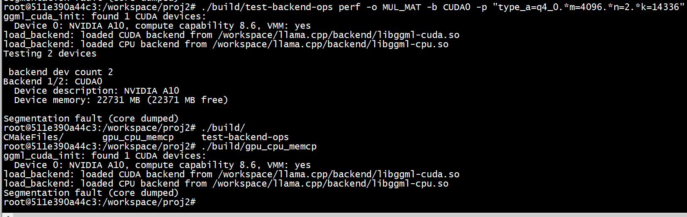

```
ubuntu@ubuntu:~$ sudo  docker run --rm  --name llama.cppdev --net=host    -itd    -e UID=root    --ipc host --shm-size="32g"  --privileged   -u 0 -v $(pwd)/pytorch:/workspace -p 8088:8080  ghcr.io/ggml-org/llama.cpp:server-cuda
WARNING: Published ports are discarded when using host network mode
255ea21835c64818c719c7790c83550210fdfbebe1892ca48d94684040f69afc
ubuntu@ubuntu:~$ sudo  docker exec -it llama.cppdev bash
root@ubuntu:/app# 
```

#  CMAKE_CUDA_ARCHITECTURES 

[查看网址：](https://developer.nvidia.com/cuda-gpus)   
```
+-----------------------------------------------------------------------------+
| NVIDIA-SMI 510.39.01    Driver Version: 510.39.01    CUDA Version: 11.6     |
|-------------------------------+----------------------+----------------------+
| GPU  Name        Persistence-M| Bus-Id        Disp.A | Volatile Uncorr. ECC |
| Fan  Temp  Perf  Pwr:Usage/Cap|         Memory-Usage | GPU-Util  Compute M. |
|                               |                      |               MIG M. |
|===============================+======================+======================|
|   0  NVIDIA A10          On   | 00000000:81:00.0 Off |                    0 |
|  0%   36C    P8     9W / 150W |      4MiB / 23028MiB |      0%      Default |
|                               |                      |                  N/A |
+-------------------------------+----------------------+----------------------+
```

```
CMAKE_CUDA_ARCHITECTURES=86
```

```
sudo docker build -t local/llama.cpp:server-cuda  --build-arg CUDA_DOCKER_ARCH=86  -f cuda.Dockerfile .
```

```
 sudo docker run -v ~/pytorch:/workspace --gpus all -it  nvcr.io/nvidia/cuda:11.6.2-devel-ubuntu20.04  bash
```

##   Ubuntu 20.04 PPA源安装 cmake > 3.16.3

 

```
wget -O - https://apt.kitware.com/keys/kitware-archive-latest.asc 2>/dev/null |  apt-key add -
apt-add-repository 'deb https://apt.kitware.com/ubuntu/ focal main'
apt-get update
apt-get install cmake
```

```
# 使用官方Ubuntu 20.04基础镜像
FROM ubuntu:20.04

# 更新软件包列表
RUN apt-get update

# 安装必要的工具，如wget和软件属性公共密钥环工具（apt-transport-https）
RUN apt-get install -y wget software-properties-common

# 添加VTK的PPA源（注意：这里使用的是Debian而非Ubuntu的PPA源）
RUN wget -q -O - https://apt.kitware.com/keys/kitware-archive-latest.asc | apt-key add -
RUN apt-add-repository "deb https://apt.kitware.com/ubuntu/ $(lsb_release -cs) main"

# 更新软件包列表以包含新的PPA源
RUN apt-get update

# 安装VTK
RUN apt-get install -y vtk7

# 清理不再需要的文件，以减少镜像大小
RUN apt-get clean && rm -rf /var/lib/apt/lists/*
```

#  docker 


```
sudo apt-get purge docker-ce docker-ce-cli containerd.io
ubuntu@ubuntu:~/pytorch/llama.cpp$ sudo rm -rf /var/lib/docker
ubuntu@ubuntu:~/pytorch/llama.cpp$ sudo rm -rf  /var/lib/containerd/
ubuntu@ubuntu:~/pytorch/llama.cpp$ sudo apt-get install docker-ce docker-ce-cli containerd.io
```

```
curl -fsSL https://nvidia.github.io/libnvidia-container/gpgkey |sudo gpg --dearmor -o /usr/share/keyrings/nvidia-container-toolkit-keyring.gpg \
&& curl -s -L https://nvidia.github.io/libnvidia-container/stable/deb/nvidia-container-toolkit.list | sed 's#deb https://#deb [signed-by=/usr/share/keyrings/nvidia-container-toolkit-keyring.gpg] https://#g' | sudo tee /etc/apt/sources.list.d/nvidia-container-toolkit.list \
&& sudo apt-get update
```

```
nvidia-ctk runtime configure --runtime=docker
 
```

```
systemctl restart docker
```

##  docker build

```
docker build -t local/llama.cpp:server-cuda --target server -f .devops/cuda.Dockerfile .
```


> ###  cuda:12.4.0-runtime-ubuntu22.04版本


先拉取nvcr.io/nvidia/cuda:12.4.0-runtime-ubuntu22.04

```
sudo docker pull nvcr.io/nvidia/cuda:12.4.0-runtime-ubuntu22.04
```

```
sudo docker run --gpus all -it nvcr.io/nvidia/cuda:12.4.0-runtime-ubuntu22.04 nvcc --version  
```

+ 采用开发版本而不是runtime，进行编译    
```
 sudo docker pull nvcr.io/nvidia/cuda:12.4.0-devel-ubuntu22.04
```


```
 sudo docker build -t local/llama.cpp:server-cuda  -f cuda.Dockerfile .
 
 [+] Building 725.5s (13/13) FINISHED                                                                                                                                              docker:default
 => [internal] load build definition from cuda.Dockerfile                                                                                                                                   0.0s
 => => transferring dockerfile: 3.13kB                                                                                                                                                      0.0s
 => [internal] load .dockerignore                                                                                                                                                           0.0s
 => => transferring context: 279B                                                                                                                                                           0.0s
 => [internal] load metadata for nvcr.io/nvidia/cuda:12.4.0-devel-ubuntu22.04                                                                                                               0.0s
 => [1/8] FROM nvcr.io/nvidia/cuda:12.4.0-devel-ubuntu22.04                                                                                                                                 0.0s
 => [internal] load build context                                                                                                                                                           0.2s
 => => transferring context: 204.83kB                                                                                                                                                       0.2s
 => [2/8] RUN apt-get update &&     apt-get install -y build-essential cmake python3 python3-pip git libssl-dev libgomp1                                                                   83.4s
 => [3/8] WORKDIR /app                                                                                                                                                                      0.0s
 => [4/8] COPY . .                                                                                                                                                                          0.9s
 => [5/8] RUN if [ "default" != "default" ]; then     export CMAKE_ARGS="-DCMAKE_CUDA_ARCHITECTURES=default";     fi &&     cmake -B build -DGGML_NATIVE=OFF -DGGML_CUDA=ON -DGGML_BACKE  622.3s 
 => [6/8] RUN mkdir -p /app/lib &&     find build -name "*.so*" -exec cp -P {} /app/lib ;                                                                                                   1.2s 
 => [7/8] RUN mkdir -p /app/full     && cp build/bin/* /app/full     && cp *.py /app/full     && cp -r gguf-py /app/full     && cp -r requirements /app/full     && cp requirements.txt /a  1.3s 
 => [8/8] RUN apt-get update     && apt-get install -y libgomp1 curl    && apt autoremove -y     && apt clean -y     && rm -rf /tmp/* /var/tmp/*     && find /var/cache/apt/archives /var  11.2s 
 => exporting to image                                                                                                                                                                      5.0s 
 => => exporting layers                                                                                                                                                                     5.0s 
 => => writing image sha256:39498e4aa3a64e09fb73d7016ad571501f49213bee3efd574e6d0bc2194eec4c                                                                                                0.0s 
 => => naming to docker.io/local/llama.cpp:server-cuda      
```

```
ubuntu@ubuntu:~$ sudo docker run --rm  --name llama.cppdev --net=host    -itd    -e UID=root    --ipc host --shm-size="32g"  --privileged   -u 0 -v $(pwd)/pytorch:/workspace -p 8088:8080  local/llama.cpp:server-cuda
WARNING: Published ports are discarded when using host network mode
6f3377238f85949b2c1389a0524469c5a109bc1157f974aa341a4dd039c53eaa
ubuntu@ubuntu:~$ sudo docker exec -it llama.cppdev bash
root@ubuntu:/app# 
```


```
sudo docker run --rm  --name llama.cpprun --net=host    -itd    -e UID=root    --ipc host --shm-size="32g"  --privileged   -u 0 -v $(pwd)/pytorch:/workspace -p 8088:8080  nvcr.io/nvidia/cuda:12.4.0-runtime-ubuntu22.04 
```


```
 export LD_LIBRARY_PATH="$LD_LIBRARY_PATH:/workspace/llama.cpp/build/bin:/workspace/llama.cpp/build/common"
```


```
root@b94a0915eac3:/workspace/proj4# ./build/test-backend-ops perf -o MUL_MAT -b CUDA0 -p "type_a=q4_0.*m=4096.*n=2.*k=14336"
ggml_cuda_init: found 1 CUDA devices:
  Device 0: NVIDIA A10, compute capability 8.6, VMM: yes
load_backend: loaded CUDA backend from /workspace/llama.cpp/backend/libggml-cuda.so
load_backend: loaded CPU backend from /workspace/llama.cpp/backend/libggml-cpu.so
Testing 2 devices

 backend dev count 2 
Backend 1/2: CUDA0
  Device description: NVIDIA A10
  Device memory: 22731 MB (22371 MB free)

  MUL_MAT(type_a=q4_0,type_b=f32,m=4096,n=2,k=14336,bs=[1,1],nr=[1,1],per=[0,1,2,3],k_v=0,o=1):                13632 runs -    74.57 us/run - 234.88 MFLOP/run -   3.15 TFLOPS
  Backend CUDA0: OK
Backend 2/2: CPU
  Skipping
2/2 backends passed
OK
```

> ###  host 11.6.2-devel-ubuntu20.04
```
 sudo docker run --gpus all -it nvcr.io/nvidia/cuda:12.4.0-runtime-ubuntu22.04 nvcc --version 
docker: Error response from daemon: failed to create task for container: failed to create shim task: OCI runtime create failed: runc create failed: unable to start container process: error during container init: error running prestart hook #0: exit status 1, stdout: , stderr: Auto-detected mode as 'legacy'
nvidia-container-cli: requirement error: unsatisfied condition: cuda>=12.4, please update your driver to a newer version, or use an earlier cuda container: unknown

Run 'docker run --help' for more information
```

```
 sudo docker run --gpus all -it nvcr.io/nvidia/cuda:12.4.0-devel-ubuntu22.04 nvcc --version 
docker: Error response from daemon: failed to create task for container: failed to create shim task: OCI runtime create failed: runc create failed: unable to start container process: error during container init: error running prestart hook #0: exit status 1, stdout: , stderr: Auto-detected mode as 'legacy'
nvidia-container-cli: requirement error: unsatisfied condition: cuda>=12.4, please update your driver to a newer version, or use an earlier cuda container: unknown

Run 'docker run --help' for more information
```

+ host nvcc
```
 nvcc --version
nvcc: NVIDIA (R) Cuda compiler driver
Copyright (c) 2005-2021 NVIDIA Corporation
Built on Fri_Dec_17_18:16:35_PST_2021
Cuda compilation tools, release 11.6, V11.6.55
Build cuda_11.6.r11.6/compiler.30794723_0
```


+ devel可以执行 nvidia-smi 、nvcc 

```
sudo docker run --gpus all -it nvcr.io/nvidia/cuda:11.6.2-devel-ubuntu20.04 nvcc --version 
```

+  runtime只能执行nvidia-smi
```
sudo docker run --gpus all -it nvcr.io/nvidia/cuda:11.6.2-runtime-ubuntu20.04 nvidia-smi 
```


```
sudo docker run --rm  --name llama.cpprun --net=host    -itd    -e UID=root    --ipc host --shm-size="32g"  --privileged   -u 0 -v $(pwd)/pytorch:/workspace -p 8088:8080
```

```
 export CMAKE_ARGS="-DCMAKE_CUDA_ARCHITECTURES=86"
 cmake -B build -DGGML_NATIVE=OFF -DGGML_CUDA=ON -DGGML_BACKEND_DL=ON -DGGML_CPU_ALL_VARIANTS=ON -DLLAMA_BUILD_TESTS=OFF ${CMAKE_ARGS} -DCMAKE_EXE_LINKER_FLAGS=-Wl,--allow-shlib-undefined .
 cmake --build build --config Release -j$(nproc)
```


关闭MAKESILENT
```
$(MAKE)  -f CMakeFiles/Makefile2 all
#$(MAKE) $(MAKESILENT) -f CMakeFiles/Makefile2 all
```

## ARM 处理器是否支持 SVE
```
In file included from /workspace/llama.cpp/ggml/src/ggml-cpu/llamafile/sgemm.cpp:52:
/workspace/llama.cpp/ggml/src/./ggml-impl.h:16:10: fatal error: arm_sve.h: No such file or directory
   16 | #include <arm_sve.h>
  
```


```
cat /proc/cpuinfo | grep sve

```
如果没有任何输出，通常意味着 CPU 不支持 SDE 或者操作系统未启用该功能。


```
-march=armv8.2-a+neon
```

> ###  禁用 SVE  

```
#ifdef __ARM_FEATURE_SVE
#include <arm_sve.h>
#endif // __ARM_FEATURE_SVE
```

关闭-DGGML_CPU_ALL_VARIANTS=ON,添加GGML_NATIVE=OFF
```

 cmake -B build -DGGML_NATIVE=OFF -DGGML_CUDA=ON -DGGML_BACKEND_DL=ON  -DLLAMA_BUILD_TESTS=OFF ${CMAKE_ARGS} -DGGML_CPU_ARM_ARCH=armv8-a  -DGGML_NATIVE=OFF   -DCMAKE_EXE_LINKER_FLAGS=-Wl,--allow-shlib-undefined .
cmake --build build --config Release -j$(nproc)
 
```

```
适用于第5代骁龙8平台的CMake配置：
cmake -DCMAKE_BUILD_TYPE=Release \  -DANDROID_ABI=arm64-v8a \  -
DANDROID_PLATFORM=android-29 \  -DCMAKE_TOOLCHAIN_FILE="$NDK_PATH/build/cmake/
android.toolchain.cmake" \  -DLLAMA_CURL=OFF \  -DGGML_CPU_KLEIDIAI=ON \  -
DGGML_SYSTEM_ARCH=ARM \  -DGGML_CPU_AARCH64=ON \  -DGGML_CPU_ARM_ARCH="armv9.2-
a+sve2+sme+dotprod+i8mm" \  -DCMAKE_C_FLAGS="-march=armv9.2-a+sve2+sme+dotprod+i8mm 
-fno-omit-frame-pointer -g"  \  -DCMAKE_CXX_FLAGS="-march=armv9.2-
a+sve2+sme+dotprod+i8mm -fno-omit-frame-pointer -g" \  -
DCMAKE_C_COMPILER_TARGET=aarch64-linux-android29 \  -
DCMAKE_CXX_COMPILER_TARGET=aarch64-linux-android29 \  -
DCMAKE_EXPORT_COMPILE_COMMANDS=ON \  -DGGML_LLAMAFILE=OFF \  .. 
```
 
```
GGML_CPU_ARM_ARCH
```

#  GGML_BACKEND_DL=ON


```
#include "ggml-backend.h"

// 加载指定目录下的所有后端
ggml_backend_load_all_from_path("/opt/ggml/backends");

// 或者通过环境变量 GGML_BACKEND_PATH 指定路径
const char* backend_path = getenv("GGML_BACKEND_PATH");
if (backend_path) {
    ggml_backend_load_all_from_path(backend_path);
}

```


```
root@b94a0915eac3:/workspace/proj4# ./build/gpu_cpu_memcp 
ggml_cuda_init: found 1 CUDA devices:
  Device 0: NVIDIA A10, compute capability 8.6, VMM: yes
load_backend: loaded CUDA backend from /workspace/llama.cpp/build/bin/libggml-cuda.so
load_backend: loaded CPU backend from /workspace/llama.cpp/build/bin/libggml-cpu.so
load_backend: failed to load /workspace/llama.cpp/build/bin: /workspace/llama.cpp/build/bin: cannot read file data: Is a directory
 cpu --> gpu success 
  root@b94a0915eac3:/workspace/proj4# 
```

+ 将libggml-cuda.so、libggml-cpu.so放到一个目录  
```
root@b94a0915eac3:/workspace/proj4# mkdir /workspace/llama.cpp/backend   
root@b94a0915eac3:/workspace/proj4# ln -sf /workspace/llama.cpp/build/bin/libggml-cuda.so  /workspace/llama.cpp/backend/libggml-cuda.so
root@b94a0915eac3:/workspace/proj4# ln -sf /workspace/llama.cpp/build/bin/libggml-cpu.so  /workspace/llama.cpp/backend/libggml-cpu.so
root@b94a0915eac3:/workspace/proj4# 
```

+ 取消unset  GGML_BACKEND_PATH
```
root@b94a0915eac3:/workspace/proj4# unset  GGML_BACKEND_PATH          
```

```                     
root@b94a0915eac3:/workspace/proj4# ./build/gpu_cpu_memcp 
ggml_cuda_init: found 1 CUDA devices:
  Device 0: NVIDIA A10, compute capability 8.6, VMM: yes
load_backend: loaded CUDA backend from /workspace/llama.cpp/backend/libggml-cuda.so
load_backend: loaded CPU backend from /workspace/llama.cpp/backend/libggml-cpu.so
 cpu --> gpu success 
  root@b94a0915eac3:/workspace/proj4# 
```




# local/llama.cpp:server-cuda


```
sudo docker run -v ~/pytorch:/workspace --gpus all -it  local/llama.cpp:server-cuda   bash
```


```
root@511e390a44c3:/workspace/proj4#  ls /app
AGENTS.md       CMakePresets.json  Makefile     build   convert_hf_to_gguf.py          cuda.Dockerfile  flake.nix  grammars  media     poetry.lock         requirements.txt  tools
AUTHORS         CODEOWNERS         README.md    ci      convert_hf_to_gguf_update.py   docs             full       include   models    pyproject.toml      scripts           ty.toml
CLAUDE.md       CONTRIBUTING.md    SECURITY.md  cmake   convert_llama_ggml_to_gguf.py  examples         ggml       lib       mypy.ini  pyrightconfig.json  src               vendor
CMakeLists.txt  LICENSE            benches      common  convert_lora_to_gguf.py        flake.lock       gguf-py    licenses  pocs      requirements        tests
root@511e390a44c3:/workspace/proj4# 
```

