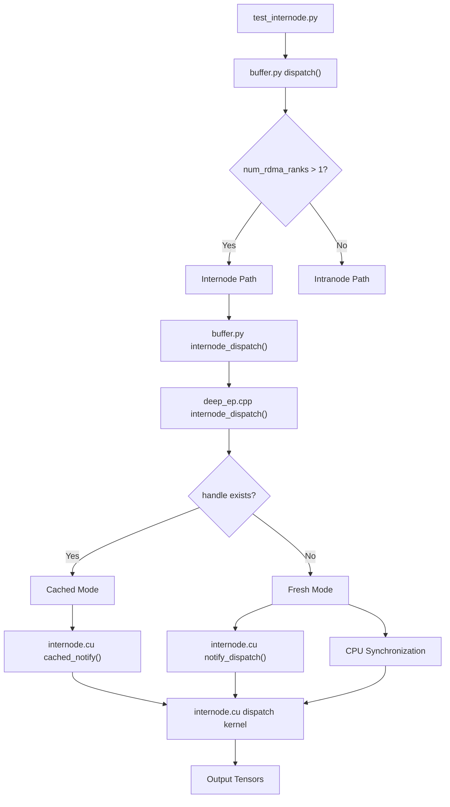
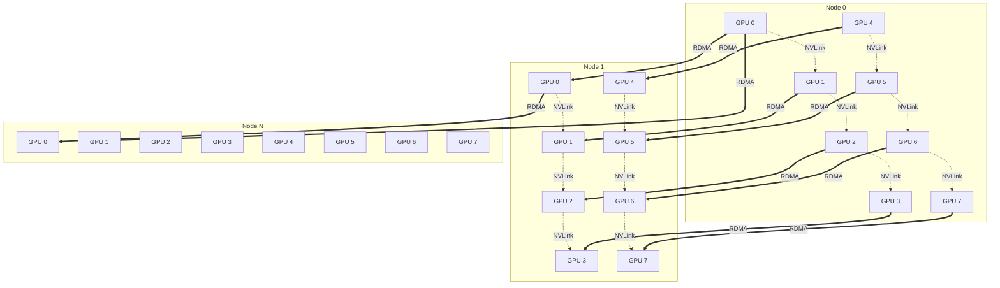
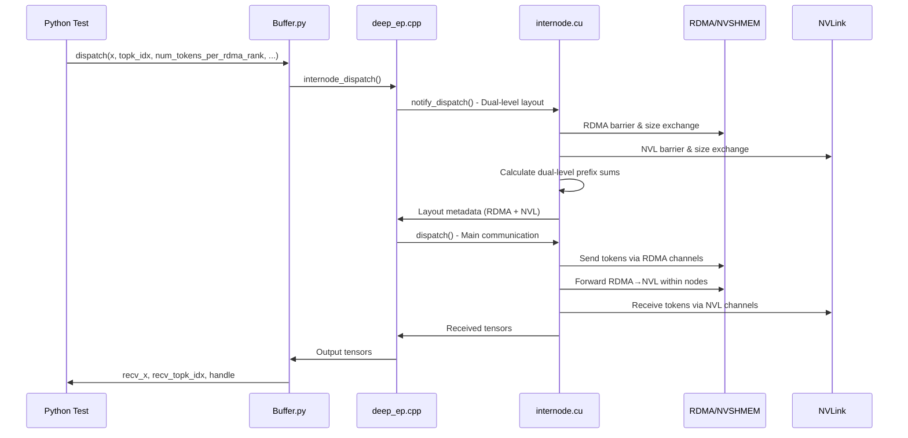
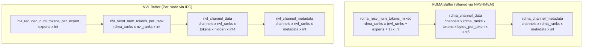
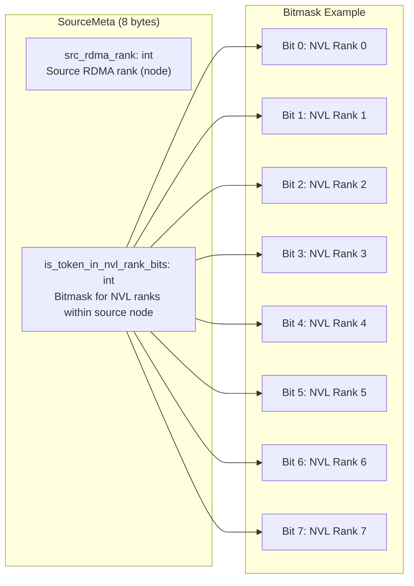
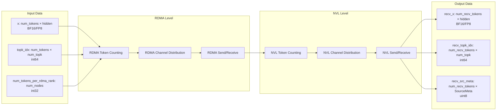
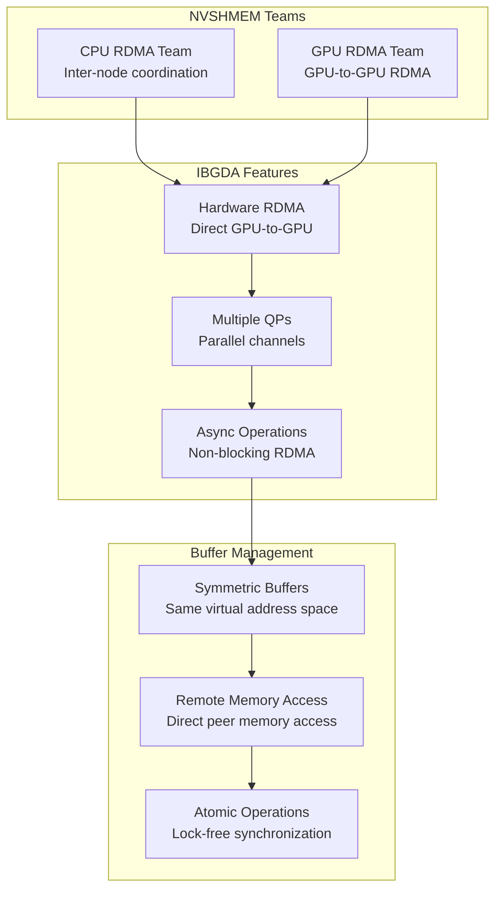
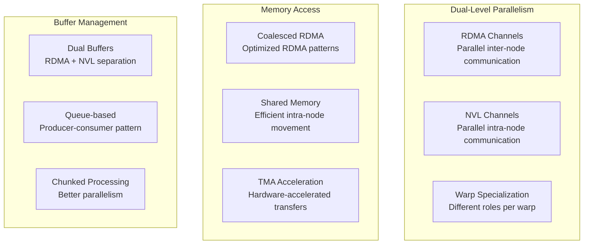
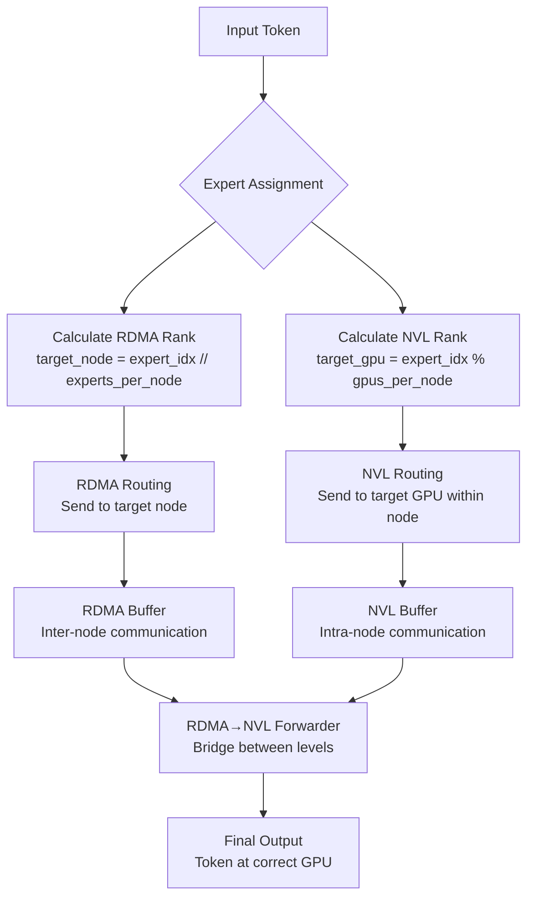

# DeepEP Internode Communication Flow

This document provides a visual representation of the internode communication flow in DeepEP, showing how tokens are dispatched and combined across multiple nodes using both RDMA and NVLink.

## Overview

Internode communication handles expert-parallel (EP) communication between GPUs across multiple nodes, using a dual-level architecture that combines RDMA for inter-node communication and NVLink for intra-node communication.

## Data Flow Architecture

## Dual-Level Communication Architecture

## Detailed Communication Sequence

## Kernel Warp Role Architecture

```mermaid
graph TB
    subgraph "SM Block (Forwarder)"
        subgraph "Warp Roles"
            W1[Warp 0: RDMA→NVL Forwarder<br/>Target Rank 0]
            W2[Warp 1: RDMA→NVL Forwarder<br/>Target Rank 1]
            W3[Warp 2: RDMA→NVL Forwarder<br/>Target Rank 2]
            W4[Warp 3: RDMA→NVL Forwarder<br/>Target Rank 3]
            W5[Warp 4: RDMA→NVL Forwarder<br/>Target Rank 4]
            W6[Warp 5: RDMA→NVL Forwarder<br/>Target Rank 5]
            W7[Warp 6: RDMA→NVL Forwarder<br/>Target Rank 6]
            W8[Warp 7: RDMA→NVL Forwarder<br/>Target Rank 7]
            W9[Warp 8: Forwarder Coordinator]
        end
    end
    
    subgraph "SM Block (RDMA Sender)"
        subgraph "Warp Roles"
            R1[Warp 0: RDMA Sender]
            R2[Warp 1: RDMA Sender]
            R3[Warp 2: RDMA Sender]
            R4[Warp 3: RDMA Sender]
            R5[Warp 4: RDMA Sender]
            R6[Warp 5: RDMA Sender]
            R7[Warp 6: RDMA Sender]
            R8[Warp 7: RDMA Sender Coordinator]
        end
    end
    
    subgraph "SM Block (NVL Receiver)"
        subgraph "Warp Roles"
            N1[Warp 0: NVL Receiver<br/>Target Rank 0]
            N2[Warp 1: NVL Receiver<br/>Target Rank 1]
            N3[Warp 2: NVL Receiver<br/>Target Rank 2]
            N4[Warp 3: NVL Receiver<br/>Target Rank 3]
            N5[Warp 4: NVL Receiver<br/>Target Rank 4]
            N6[Warp 5: NVL Receiver<br/>Target Rank 5]
            N7[Warp 6: NVL Receiver<br/>Target Rank 6]
            N8[Warp 7: NVL Receiver<br/>Target Rank 7]
        end
    end
```

## Dual-Level Buffer Layout

## SourceMeta Structure

## Communication Pipeline

## NVSHMEM IBGDA Integration

## Performance Optimizations

## Key Functions and Their Roles

| Function | Location | Purpose |
|----------|----------|---------|
| `dispatch()` | buffer.py | Python interface, routes to internode |
| `internode_dispatch()` | buffer.py | Python internode wrapper |
| `internode_dispatch()` | deep_ep.cpp | C++ interface, handles tensor allocation |
| `notify_dispatch()` | internode.cu | Dual-level layout calculation |
| `dispatch()` | internode.cu | Main dual-level communication kernel |
| `get_dispatch_layout()` | layout.cu | Token counting and distribution |

## Communication Phases

1. **RDMA Layout Phase**: Calculate inter-node token distribution
2. **NVL Layout Phase**: Calculate intra-node token distribution  
3. **Dual Barrier Phase**: Synchronize RDMA and NVL ranks
4. **RDMA Dispatch Phase**: Send tokens between nodes via RDMA
5. **RDMA→NVL Forward Phase**: Forward RDMA data to local NVL ranks
6. **NVL Receive Phase**: Collect tokens via NVLink within nodes
7. **Cleanup Phase**: Prepare dual buffers for next iteration

## Routing Logic

