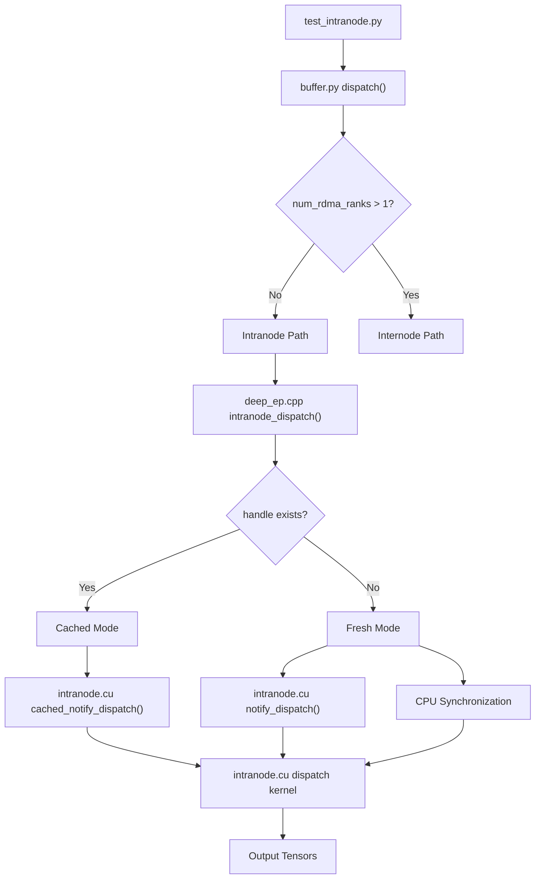
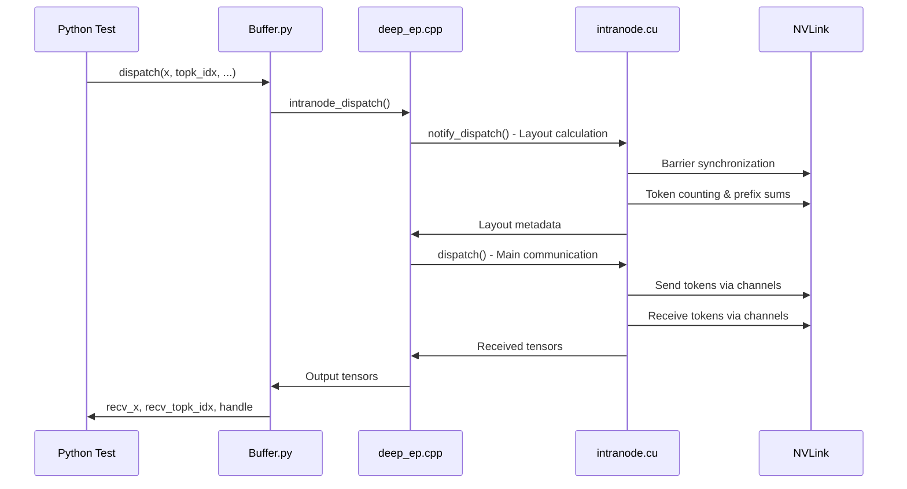
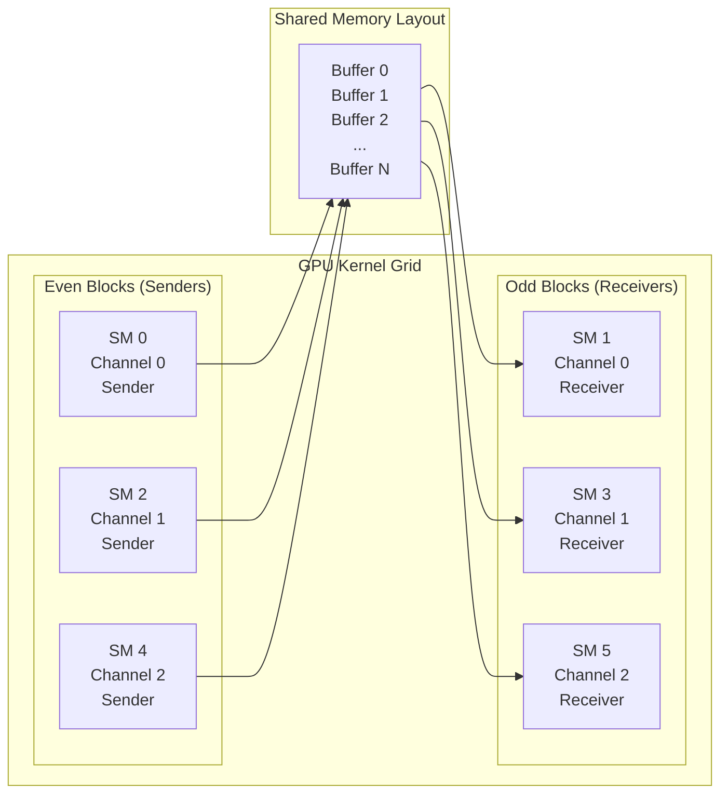
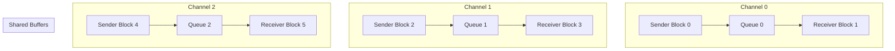
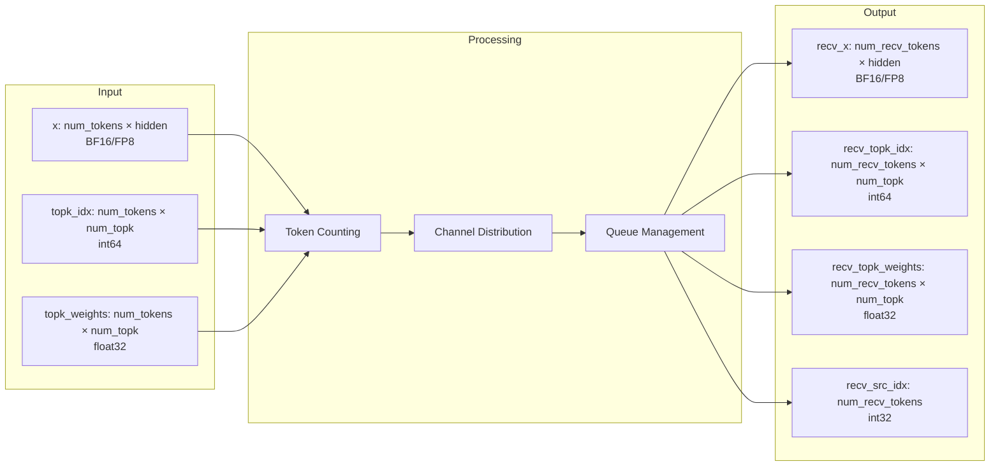
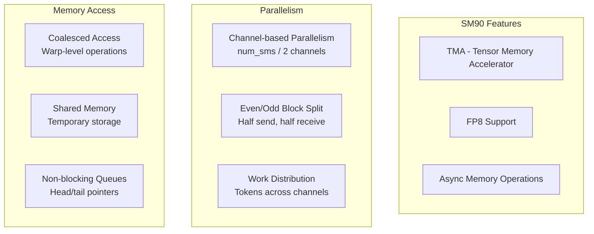

# DeepEP Intranode Communication Flow

This document provides a visual representation of the intranode communication flow in DeepEP, showing how tokens are dispatched and combined across multiple GPUs within a single node using NVLink.

## Overview

Intranode communication handles expert-parallel (EP) communication between GPUs within the same node, leveraging high-bandwidth NVLink connections for efficient token dispatch and combination.

## Data Flow Architecture

## Detailed Communication Flow

## Kernel Architecture

## Memory Layout Structure

```mermaid
graph TD
    subgraph "Per-Rank Buffer Layout"
        A[rank_prefix_matrix<br/>ranks × ranks × int] --> B[expert_prefix_matrix<br/>ranks × local_experts × int]
        B --> C[channel_start_offset<br/>channels × ranks × int]
        C --> D[channel_end_offset<br/>channels × ranks × int]
        D --> E[channel_head_idx<br/>channels × ranks × int]
        E --> F[channel_tail_idx<br/>channels × ranks × int]
        F --> G[channel_x_buffers<br/>channels × ranks × tokens × hidden × int4]
        G --> H[channel_src_idx_buffers<br/>channels × ranks × tokens × int]
        H --> I[channel_topk_idx_buffers<br/>channels × ranks × tokens × topk × int64]
        I --> J[channel_topk_weights_buffers<br/>channels × ranks × tokens × topk × float]
        J --> K[channel_x_scales_buffers<br/>channels × ranks × tokens × scales × float]
    end
```

## Channel-Based Communication Pattern

## Data Transformation Pipeline

## Performance Optimizations

## Key Functions and Their Roles

| Function | Location | Purpose |
|----------|----------|---------|
| `dispatch()` | buffer.py | Python interface, routes to intranode |
| `intranode_dispatch()` | deep_ep.cpp | C++ interface, handles tensor allocation |
| `notify_dispatch()` | intranode.cu | Layout calculation and barrier sync |
| `dispatch()` | intranode.cu | Main communication kernel |
| `get_dispatch_layout()` | layout.cu | Token counting and distribution |

## Communication Phases

1. **Layout Phase**: Calculate token distribution and routing information
2. **Barrier Phase**: Synchronize all ranks before communication
3. **Dispatch Phase**: Send tokens through NVLink channels
4. **Receive Phase**: Collect tokens and update output tensors
5. **Cleanup Phase**: Prepare buffers for next iteration
