# DeepEP Low Latency Communication Flow

This document provides a visual representation of the low latency communication flow in DeepEP, showing how tokens are dispatched and combined across multiple GPUs with minimal latency using IBGDA (InfiniBand GPU Direct Async) and specialized buffer management.

## Overview

Low latency communication is designed for scenarios requiring minimal communication latency, such as online inference or real-time applications. It uses a dual-buffer architecture with IBGDA for direct GPU-to-GPU RDMA communication, bypassing CPU involvement and reducing latency to microseconds.

## Key Features

- **IBGDA Communication**: Direct GPU-to-GPU RDMA without CPU involvement
- **Dual Buffer Architecture**: Ping-pong buffers for continuous operation
- **Hook-based Overlapping**: Separate send and receive phases for computation overlap
- **FP8 Support**: 8-bit floating point for reduced bandwidth
- **LogFMT Format**: Specialized format for weight reduction
- **Statistics Collection**: Built-in performance monitoring

## Data Flow Architecture

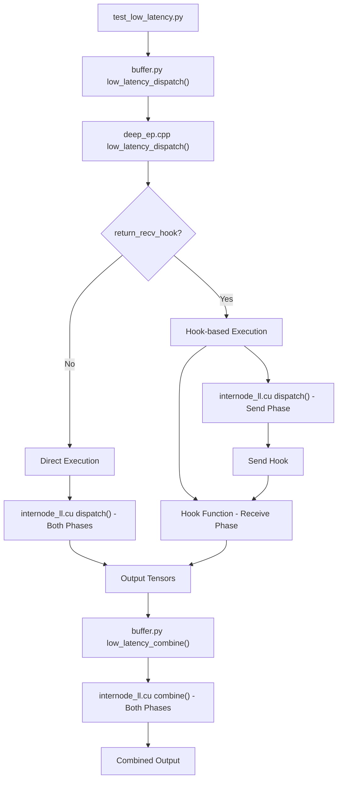

## Dual Buffer Architecture

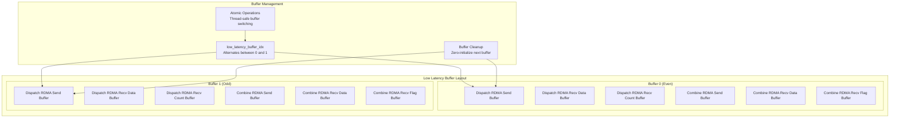

## Detailed Communication Sequence

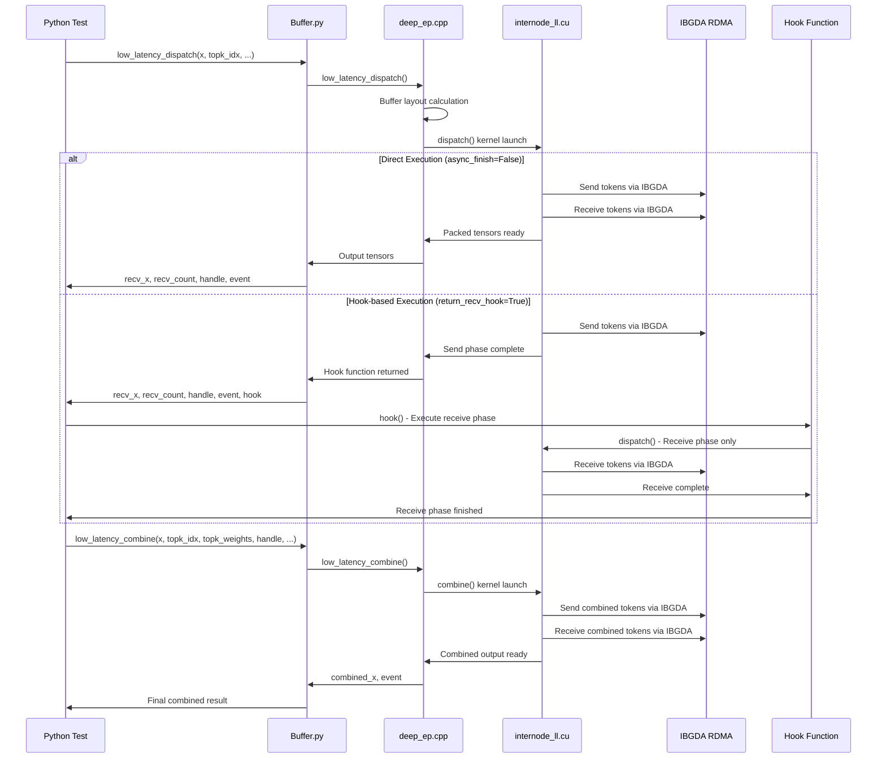

## Message Format and Layout

```mermaid
graph TB
    subgraph "Dispatch Message Format"
        A[Source Index: int4<br/>4 bytes] --> B[Reserved Fields: int4 × 3<br/>12 bytes]
        B --> C[Token Data: BF16/FP8<br/>hidden × element_size]
        C --> D[FP8 Scales: float<br/>hidden/128 × 4 bytes]
    end
    
    subgraph "Combine Message Format"
        E[LogFMT Meta: nv_bfloat162<br/>hidden/128 × 4 bytes] --> F[Token Data: BF16<br/>hidden × 2 bytes]
    end
    
    subgraph "Buffer Layout Per Expert"
        G[Expert 0 Buffer<br/>num_max_tokens × msg_size] --> H[Expert 1 Buffer<br/>num_max_tokens × msg_size]
        H --> I[Expert 2 Buffer<br/>num_max_tokens × msg_size]
        I --> J[Expert N Buffer<br/>num_max_tokens × msg_size]
    end
```

## Kernel Warp Organization

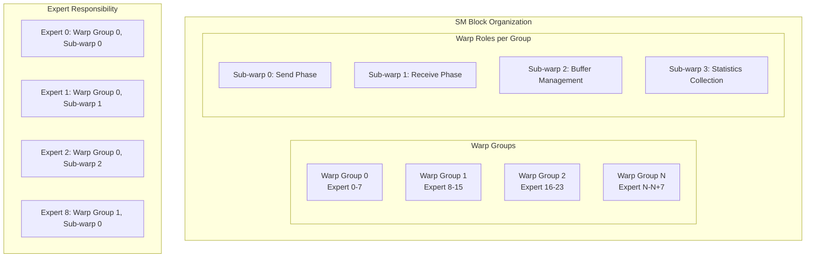

## IBGDA Communication Pattern

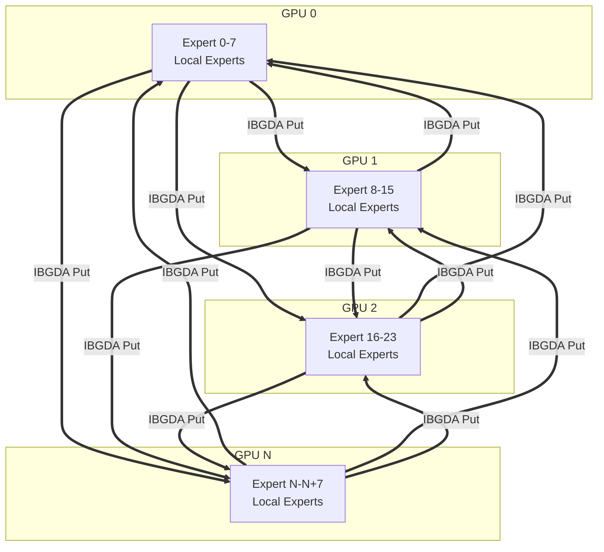

## Hook-based Overlapping

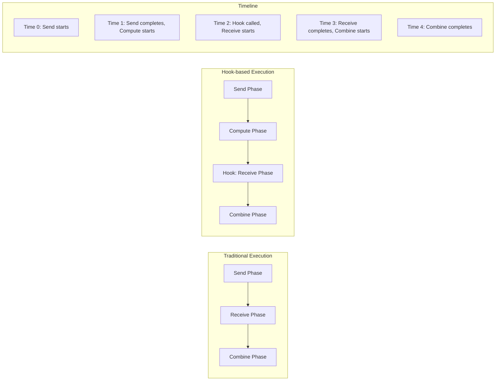

## Data Transformation Pipeline

```mermaid
graph LR
    subgraph "Input Processing"
        A[x: num_tokens × hidden<br/>BF16]
        B[topk_idx: num_tokens × num_topk<br/>int64]
        C[FP8 Casting<br/>Optional]
    end
    
    subgraph "Dispatch Phase"
        D[Expert Routing<br/>Calculate target experts]
        E[Message Packing<br/>Add metadata + scales]
        F[IBGDA Send<br/>Direct GPU-to-GPU]
        G[IBGDA Receive<br/>Collect from all ranks]
        H[Message Unpacking<br/>Extract tokens + metadata]
    end
    
    subgraph "Compute Phase"
        I[Expert Computation<br/>Simulated GEMM]
        J[Hook Execution<br/>Receive phase trigger]
    end
    
    subgraph "Combine Phase"
        K[Weight Application<br/>Apply expert weights]
        L[Message Packing<br/>Combine format]
        M[IBGDA Send<br/>Send combined results]
        N[IBGDA Receive<br/>Collect from all ranks]
        O[Reduction<br/>Sum weighted results]
    end
    
    subgraph "Output"
        P[combined_x: num_tokens × hidden<br/>BF16]
    end
    
    A --> D
    B --> D
    C --> D
    D --> E
    E --> F
    F --> G
    G --> H
    H --> I
    I --> J
    J --> K
    K --> L
    L --> M
    M --> N
    N --> O
    O --> P
```

## Performance Optimizations

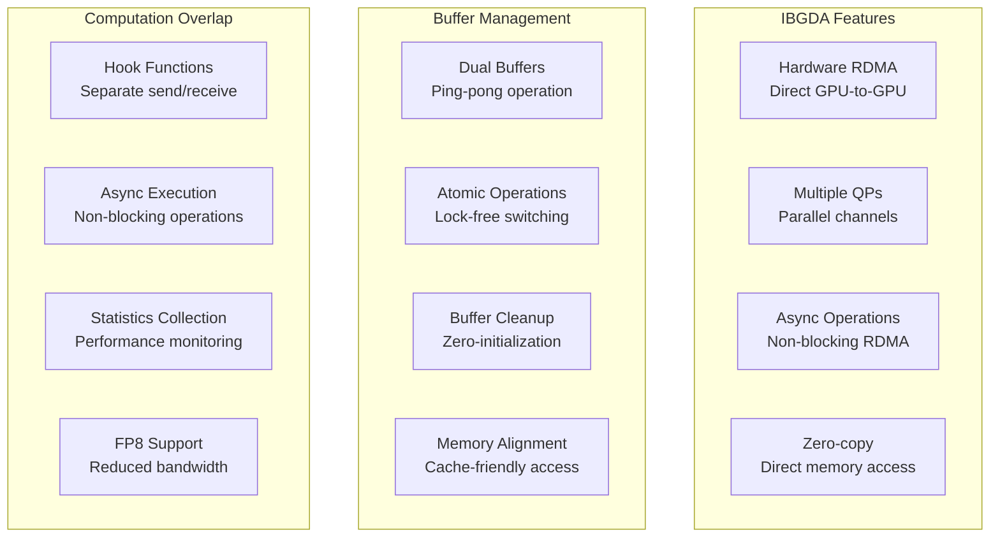

## Statistics and Monitoring

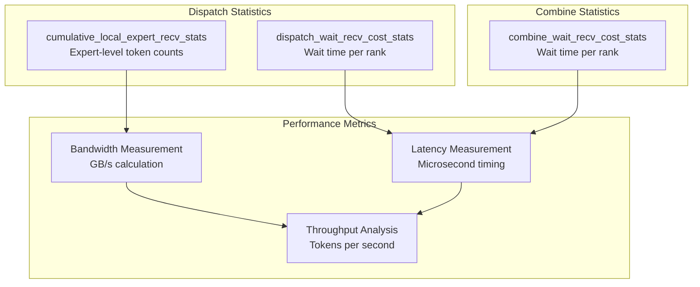

## Key Functions and Their Roles

| Function | Location | Purpose |
|----------|----------|---------|
| `low_latency_dispatch()` | buffer.py | Python interface for low latency dispatch |
| `low_latency_dispatch()` | deep_ep.cpp | C++ interface, buffer management |
| `dispatch()` | internode_ll.cu | Main low latency dispatch kernel |
| `low_latency_combine()` | buffer.py | Python interface for low latency combine |
| `low_latency_combine()` | deep_ep.cpp | C++ interface, buffer management |
| `combine()` | internode_ll.cu | Main low latency combine kernel |
| `clean_low_latency_buffer()` | buffer.py | Buffer cleanup between operations |
| `get_next_low_latency_combine_buffer()` | buffer.py | Zero-copy buffer access |

## Communication Phases

1. **Buffer Setup Phase**: Initialize dual buffers and calculate layout
2. **Dispatch Send Phase**: Send tokens via IBGDA to target experts
3. **Dispatch Receive Phase**: Receive tokens from all ranks (via hook or direct)
4. **Compute Phase**: Process tokens through expert networks (simulated)
5. **Combine Send Phase**: Send weighted results via IBGDA
6. **Combine Receive Phase**: Receive and reduce weighted results
7. **Buffer Cleanup Phase**: Prepare buffers for next iteration

## Configuration Parameters

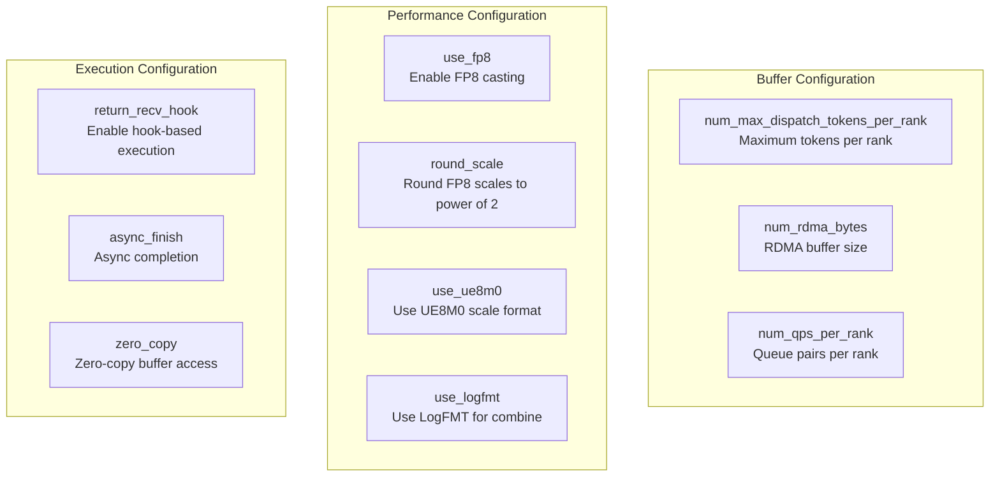

## Memory Layout Structure

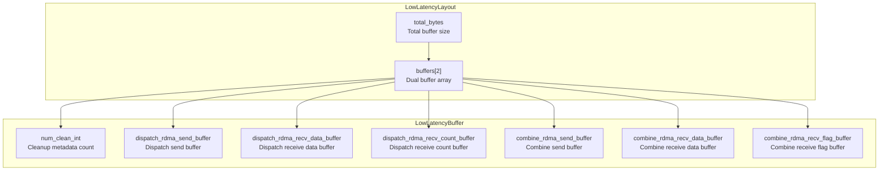

This low latency communication system enables DeepEP to achieve microsecond-level communication latency, making it suitable for real-time applications and online inference scenarios where traditional high-throughput communication would introduce unacceptable delays.
