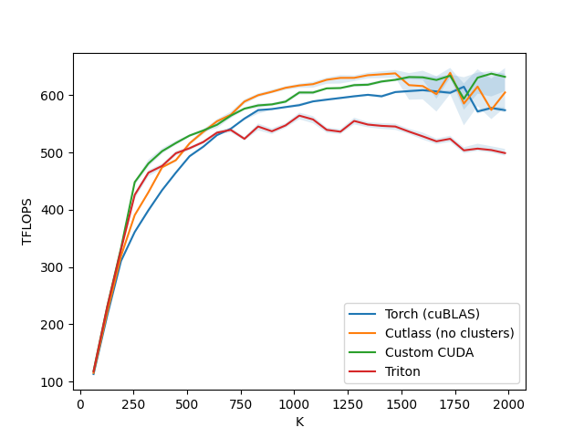
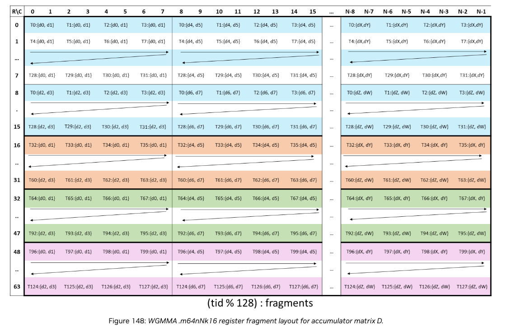
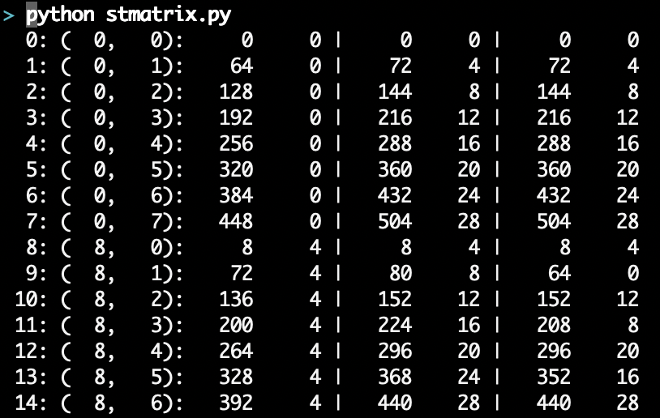
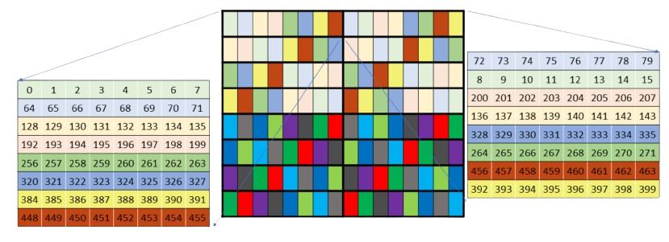
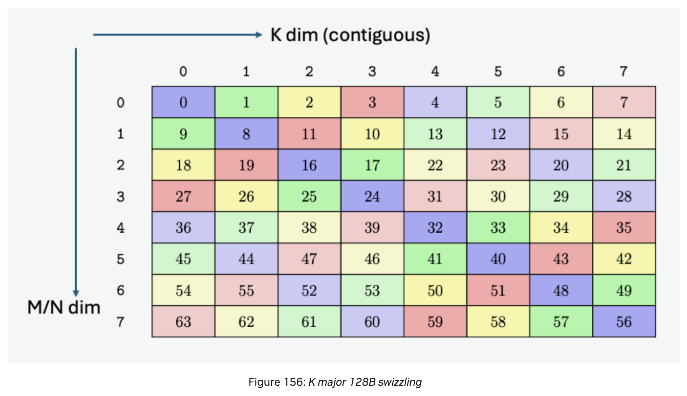

# Pingpong GEMM from scratch

I've been really excited to learn the lowest-level details of GPU matrix
multiplication recently, so I was really inspired to read Pranjal Shankhdhar's
fantastic blog post [Outperforming cuBLAS on
H100](https://cudaforfun.substack.com/p/outperforming-cublas-on-h100-a-worklog),
which implements a fast gemm from first principles in CUDA, and actually
outperforms cuBLAS.

In a similar vein, I wanted to understand the
[pingpong](https://github.com/NVIDIA/cutlass/blob/main/media/docs/efficient_gemm.md#hopper-warp-specialization)
gemm algorithm in detail.  So, I used https://github.com/pranjalssh/fast.cu as
a starting point, and wrote this kernel to see if I could match CUTLASS's
pingpong implementation myself, using hand-written CUDA.

You can run a quick check of the kernel with:
```
make gemm && ./gemm
```

And run a sweep through a bunch of different shapes with:
```
# You need a nightly build of pytorch
# pip3 install --pre torch --index-url https://download.pytorch.org/whl/nightly/cu124
TORCH_CUDA_ARCH_LIST=9.0a+PTX python setup.py develop && python benchmark.py
```

# Experimental Setup

My goal was to implement a pingpong gemm kernel that matches the performance of
an equivalent CUTLASS kernel, as a way to check that I understand all the
optimizations that go into that kernel.  Specifically I was targeting
`cutlass3x_sm90_tensorop_s64x128x16gemm_bf16_bf16_f32_void_bf16_128x128x64_1x1x1_0_tnn_align8_warpspecialized_pingpong_epi_tma`;
since I suspect some folks may not be familiar with CUTLASS's naming
conventions, I'll break down the features I'm targeting:

* A warp-specialized, pingpong "mainloop", which trades the tensor core
  pipeline between two consumer warpgroups to hide the latency of the epilogue.
  This [blog post by Less Wright and Adnan
  Hoque](https://pytorch.org/blog/cutlass-ping-pong-gemm-kernel/) is a very
  good overview of this scheduling technique; I've reproduced their explanatory
  graphic below.
* A tile size of M=128, N=128, K=64, which is the largest tile size that can be
  supported by this technique use an equivalent pipeline depth (which happens
  to be 6 stages)
* ***DISABLE*** threadblock clusters!  I'm putting this in bold and italics
  because I want to be super clear that I'm not comparing against the very best
  CUTLASS kernel.  I avoided cluster launch for a sort of lame reason; my day
  job is working on the Triton compiler, which doesn't seem to support cluster
  launch (or pingpong).  So, I wanted to focus on one thing at a time.
* use TMA to write back the results in the epilogue (which requires storing the
  matmul result from registers to shared memory before initiating the TMA
  transfer)


I focused on shapes with M = 6 * 11 * 128 = 8448 and N = 6 * 12 * 128 = 9216.
The reason for this oddly specific shape is that our kernel uses 128x128 output
tiles; the H100 has 132 SMs (which is 11 * 12), so this shape will cause the
kernel to iterate completely 36 times on each SM.  This ensures that we're
avoiding tile and wave quantization effects and focusing just on the main-loop
code quality.  From there I swept over K values from 64 to 2048.

# Results

I think I more or less succeeded.  My kernel slightly outperforms CUTLASS for
small K and large K, and slightly underperfoms at medium K, with a geomean
improvement of 2%.  Both implementations are faster than the default cuBLAS
12.4 implementation (yes, I know I should switch to 12.8), and all those are
faster than my Triton pingpong implementation.

It's ridiculously tempting to keep digging in to figure out what's going on in
the middle (and it's actually quite easy to do these experiments in CUDA!  I
tried three ideas in the course of writing this article!) but I think I've
basically hit my goal.



I also gained a much more detailed understanding of the pingpong
algorithm itself!  There are a few aspects in particular that aren't
totally obvious at first glance:

* The input pipeline reads A and B for each consumer separately, serially, but
  into the same queue.  This allows the best pipelining and load balancing, but
  requires a bit of subtlety in the barrier management.
* The output tile is a 128x128 buffer in shared memory that is used by both
  consumers.  There isn't enough space to have a separate output tile for each
  consumer, so we need to share a tile and use a mutex.  This means the mutex
  isn't just for managing contention amongst the tensor cores (as I originally
  thought) but is actually necessary for correctness.

# Walkthrough

For those interested in the details of kernel optimization, I thought I'd walk
through my general approach.  This isn't as detailed as the "Outperforming
cuBLAS" worklog, unfortunately, because (1) I didn't organize my experiments
cleanly enough, and (2) I don't have time to go back and redo them to pretend I
did 😛.  But in broad strokes I think the explanation is useful, at least as a
guide to some matmul implementation tricks:

## Stage 1: Reproducing prior work

I started with [one of the
kernels](https://github.com/pranjalssh/fast.cu/blob/main/examples/matmul/matmul_7.cuh)
from "Outperforming cuBLAS."  Specifically I used Kernel 7, which includes
using TMA for loads and WGMMA, as well as warp specialization, and large tiles
(128x256).  But it's before he added threadblock clusters (Triton doesn't
support cluster launch) and Hilbert curves for L2 locality (smart but a bit out
of codegen scope).  I didn't include TMA stores at first, since that came after
clusters; instead I started with direct use of st.global to write results to
gmem.

I implemented everything "from scratch", but following the above source as a
very detailed recipe.  Why'd I bother?  I'm a little embarrassed by this part
since it seems like a waste of time, but I think physically typing everything
out forced me to really engage with the code.  Along the way I did things like
trivial refactors or renaming variables, which kind of forces me to check the
semantics, since I can write down what I think the code is saying, but still
have a reference for whether I got it right.

For example, I actually carefully thought through how the writeback from MMA
register layout to GMEM works; the layout seems complicated but I actually got
this part right pretty quickly just by looking at the diagram and thinking real
hard.



I got to performance parity pretty quickly, although I did have one really dumb
bug, in which I mistyped the number of registers in setmaxnregs.inc and
deadlocked the kernel.  It took me an hour after the kids went to bed to figure
that one out 😬

## Stage 2: Applying pingpong

The above kernel implements a "cooperative" warp specialized kernel where two
warpgroups both work on pieces of the same 128x256 output tile.  (A subtle note
here: in the cooperative kernel, each warpgroup has its own 64xK slice of M and
a shared Kx256 slice of N, hence cooperative.  In pingpong, the two consumers
don't share any input data at all -- even if they happen to be working on
adjacent tiles!  This seems wasteful, but it is necessary to let each warpgroup
run independently and thus hide the epilogue).

I had a pretty good idea from my earlier study of how to implement pingpong, so
I burned down the following list of transformations: 
* Reduce the input tile size such that A blocks were 128x64 and B blocks were
  64x128.
* Make each consumer handle a 128x128 tile instead of 64x128.  This had mildly
  trickiness, since I needed to use two groups of m64n128k16 wgmma instructions
  instead of one group of m64n256k16, but it wasn't that bad.
* Insert ping-pong barrier to mutex the mainloop and writeback.  This was
  moderately tricky, because I had only a hand-wavy understanding of the
  mbarrier lifecycle, and I needed to really solidify that.  In particular,
  advancing the barrier by the number of K blocks (instead of by 1) is not
  trivial!
* Make both consumers share the 128x128 output tile (under mutex), so that I
  could bump the pipeline stages up to 6 for maximum latency hiding.

All this took a bit less than a day, and I had perf at about 80% of Cutlass.

## Stage 3: Optimize

I tried a few minor optimizations, like peeling the mainloop and using
`wgmma.commit_group 1` to keep the tensor core pipeline full, but those didn't
help much.  The elephant in the room was that I wasn't using the TMA for the
writeback epilogue, so I was just doing a bunch of uncoalesced stores.

Time to add TMA.

Implementing a baseline use of TMA itself was not terrible; I just re-routed my
uncoalesced global stores to a shared memory buffer, and then did a very naive
TMA copy to write to global memory.  This was pretty easy since it just moves
around rectangular tensors like normal people expect.

Perf improved some (5-10%) but that wasn't enough.  It was time to tackle bank
conflicts; `ncu` pretty clearly flagged my `st.shared` and complained about
excessive wavefronts.

First I wanted to switch from normal stores to `stmatrix`, since it knows how
to unpack the complicated wgmma register layout into something nice.  This was
actually the hardest part.


In retrospect, I think it's somewhat simpler than it sounds, but maybe it's
just because I was finally able to get it done, and my brain has been busily
purging the painful memories of getting it done.  Should I even try to explain?

In brief:
* A single stmatrix instruction knows how to store the four 8x8 submatrices for
  one warp in the above wgmma diagram.
* The matrices are stored by saving contiguous "packets"/rows of 8 elements.
* The addresses for the 8 rows of the first submatrix come from the first 8
  threads (thread 0-7); the 8 rows of the second submatrix from the next 8
  threads (8-15); and so on.  I found this to be the key; I had to stop
  thinking so hard about the relationship between where the data elements were
  and what addresses were being stored to; I just had to stop worrying, trust
  that the data was in the right registers, and instead worry about getting the
  lane-to-address mapping, and everything else worked out.

That took a really, really long time.  Especially because I was trying to get
it done while sitting on a bench at a trampoline park while my daughter was at
a friend's birthday party.

But perf was still bad.  Ugh.  Checking `ncu`, I still had a bunch of bank
conflicts.  I didn't really understand this, though; in my naive imagination
the stores of all the matrix data should be contiguous and life should be good.
Yet life was not good.  In the end I finally wrote a really simple little
python script to simulate all the stmatrix address generation and analyze it
for bank conflicts.  Sure enough; the rectangular matrix pattern means that
each warp is writing to conflicting banks.  Maybe you can guess what's going on
in this screenshot of my script (hint, the pipe separated columns are the
"naive" layout, an 8-byte padded layout, and a swizzled layout.



It was time to swizzle.

No, wait, in desperation, I went to check if Pranjal had solved this problem
for me!  Kernel 12 also uses stmatrix, and avoids bank conflicts by padding
each row with 8 extra bytes.  I could just do that!  Or I could, if the H100
had more shared memory.  Instead, I got a kernel launch failure.

It was time to face down the infamous 128B swizzle diagram.



Ok, I still don't know what the deal with that diagram was, but NVIDIA
has greatly improved it in the PTX 8.7 ISA manual:



But honestly?  The docs only help so much.  Even the description in terms of
CuTE layouts is honestly not intuitive enough for me (thought it is rigorous,
formal, and clever!).  This isn't really a knock on the docs, it's just that
it's hard to describe this kind of stuff verbally.

You know what actually made it super obvious?  Programming.  I filled a shared
memory buffer with consecutive integers -- basically the smem equivalent of
`torch.arange(64*128).bfloat16().reshape(64, 128)`, and then TMA-transferred that
to GMEM with 128B swizzling, `cudaMemcpy`ed it back to the host, and printed it
out.  This actually made it crystal clear!  I wrote the swizzle function
correctly on my first try 😄.

I finished this at about 11:00 pm on Saturday and ran a benchmark, intending to
go to bed no matter what, so I almost didn't realize that at this point I'd
actually matched CUTLASS on a decent number of shapes.  I decided to declare
victory, and create this writeup.

# Random Tips

This is by far the most complex CUDA kernel I've ever written, so I learned a few useful things along the way:
* Bind your kernel to a pytorch operator.  It makes it really easy to run
  benchmarks or feed it test data.  Although using Python adds some iteration
  overhead, so I also had a simple main.cu that ran some basic checks for me.
* Print out the contents of shared memory.  You can just call printf on the
  device.  Sometimes that gets ugly, but I found it pretty useful.
* I did a lot of debugging by writing "check patterns": arange(), eye(),
  etc. so that I could eyeball the outputs and see what had gone off the rails.
  Messed up offsets, transposition, etc. is pretty obvious when your data has
  structure, versus just being a sea of not-the-right-random-numbers
* I also wrote several simple python scripts to iterate on indexing math and
  stuff.  Even though I can print the same stuff from C++ or from kernels, if I
  just wanted to build intuition for the WGMMA register layout or something, it
  was more productive to iterate on a trivial python script than on the kernel
  itself.  I've put my scripts in the GitHub repo.
