# mscclpp Bootstrap建链过程时序图

下面的时序图展示了mscclpp中的bootstrap建链过程，特别是在单机8卡环境下的流程。

```mermaid
sequenceDiagram
    participant R0 as Rank 0 (Root)
    participant R1 as Rank 1
    participant R2 as Rank 2
    participant RN as Rank N...
    
    Note over R0,RN: 1. 初始化阶段
    
    par 各节点创建TcpBootstrap实例
        R0->>R0: 创建TcpBootstrap(rank=0, size=N)
        R1->>R1: 创建TcpBootstrap(rank=1, size=N)
        R2->>R2: 创建TcpBootstrap(rank=2, size=N)
        RN->>RN: 创建TcpBootstrap(rank=N-1, size=N)
    end
    
    Note over R0,RN: 2. UniqueId创建与分发
    
    R0->>R0: 创建UniqueId (包含root节点的IP和端口)
    R0->>R1: 广播UniqueId (通过MPI)
    R0->>R2: 广播UniqueId (通过MPI)
    R0->>RN: 广播UniqueId (通过MPI)
    
    Note over R0,RN: 3. Bootstrap初始化
    
    R0->>R0: 创建监听socket (listenSockRoot_)
    R0->>R0: 启动root线程 (bootstrapRoot)
    
    par 各节点创建监听socket
        R0->>R0: 创建监听socket (listenSock_)
        R1->>R1: 创建监听socket (listenSock_)
        R2->>R2: 创建监听socket (listenSock_)
        RN->>RN: 创建监听socket (listenSock_)
    end
    
    par 各节点连接到root节点
        R1->>R0: 连接到root节点
        R2->>R0: 连接到root节点
        RN->>R0: 连接到root节点
    end
    
    par 各节点发送自己的信息到root
        R1->>R0: 发送自己的地址信息
        R2->>R0: 发送自己的地址信息
        RN->>R0: 发送自己的地址信息
    end
    
    Note over R0,RN: 4. 环形拓扑构建
    
    R0->>R0: 收集所有节点的地址信息
    R0->>R0: 计算环形拓扑 (rank i连接到rank (i+1)%N)
    
    R0->>R1: 发送rank 2的地址信息
    R0->>R2: 发送rank 3的地址信息
    R0->>RN: 发送rank 0的地址信息
    
    par 各节点连接到下一个节点
        R0->>R1: 连接到rank 1
        R1->>R2: 连接到rank 2
        R2->>R3: 连接到rank 3
        RN->>R0: 连接到rank 0
    end
    
    Note over R0,RN: 5. 地址信息全收集
    
    par 各节点执行allGather操作
        R0->>R0: 初始化peerCommAddresses_数组
        R1->>R1: 初始化peerCommAddresses_数组
        R2->>R2: 初始化peerCommAddresses_数组
        RN->>RN: 初始化peerCommAddresses_数组
    end
    
    R0->>R1: 发送所有节点的地址信息
    R1->>R2: 发送所有节点的地址信息
    R2->>RN: 发送所有节点的地址信息
    RN->>R0: 发送所有节点的地址信息
    
    Note over R0,RN: 6. 完成初始化
    
    par 各节点完成初始化
        R0->>R0: bootstrap初始化完成
        R1->>R1: bootstrap初始化完成
        R2->>R2: bootstrap初始化完成
        RN->>RN: bootstrap初始化完成
    end
    
    Note over R0,RN: 7. 创建Communicator
    
    par 各节点创建Communicator
        R0->>R0: 创建Communicator(bootstrap)
        R1->>R1: 创建Communicator(bootstrap)
        R2->>R2: 创建Communicator(bootstrap)
        RN->>RN: 创建Communicator(bootstrap)
    end
    
    Note over R0,RN: 8. 建立点对点连接
    
    par 各节点建立点对点连接
        R0->>R1: 建立直接连接
        R0->>R2: 建立直接连接
        R0->>RN: 建立直接连接
        R1->>R2: 建立直接连接
        R1->>RN: 建立直接连接
        R2->>RN: 建立直接连接
    end
    
    Note over R0,RN: 9. 启动代理服务
    
    par 各节点启动代理服务
        R0->>R0: 启动ProxyService
        R1->>R1: 启动ProxyService
        R2->>R2: 启动ProxyService
        RN->>RN: 启动ProxyService
    end
```

## mscclpp Bootstrap建链过程详细说明

### 1. 初始化阶段
每个节点创建一个`TcpBootstrap`实例，指定自己的rank和总节点数。

### 2. UniqueId创建与分发
- Rank 0创建一个`UniqueId`，其中包含自己的IP地址和端口信息
- 通过MPI将这个UniqueId广播给所有其他节点

### 3. Bootstrap初始化
- Rank 0创建一个监听socket，并启动root线程
- 所有节点创建自己的监听socket
- 所有非root节点连接到root节点，并发送自己的地址信息

### 4. 环形拓扑构建
- Root节点收集所有节点的地址信息
- Root节点计算环形拓扑，确定每个节点应该连接到哪个节点
- Root节点将下一个节点的地址信息发送给每个节点
- 每个节点连接到环中的下一个节点

### 5. 地址信息全收集
- 所有节点初始化地址信息数组
- 通过环形拓扑执行allGather操作，使每个节点都获得所有其他节点的地址信息

### 6. 完成初始化
所有节点完成bootstrap初始化

### 7. 创建Communicator
每个节点使用bootstrap创建一个Communicator对象

### 8. 建立点对点连接
根据需要，节点之间建立直接的点对点连接

### 9. 启动代理服务
每个节点启动ProxyService，开始处理通信请求

## 性能分析

在单机8卡环境下，bootstrap过程的性能测试结果如下：
- 最小时间：3.211 ms
- 最大时间：36.594 ms
- 平均时间：7.177 ms（排除第一次运行）
- 标准差：7.289 ms

这表明在单机环境下，bootstrap过程通常能在几毫秒内完成，但偶尔会出现较长的延迟（可能是由于系统负载或网络波动导致）。
