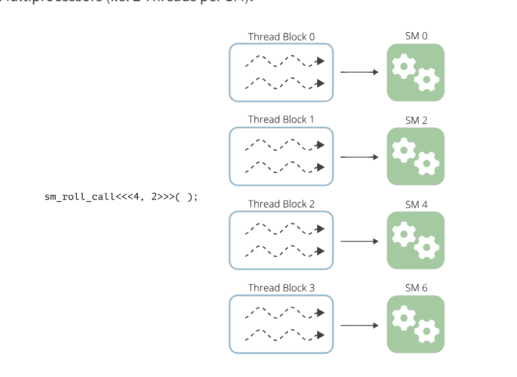

[mscclpp DeviceSyncer 真的能 sync 么?](https://blog.hidva.com/2024/12/01/mscclpp-device-syner/)


```
__device__ unsigned get_smid(void) {
  unsigned ret = 0;
  asm("mov.u32 %0, %smid;" : "=r"(ret));
  return ret;
}
```

```
./device_syncer 
device=0,maxThreadsPerMultiProcessor=1536,sharedMemPerMultiprocessor=102400,max_sm=0,num_blks=1
Do it again!10000,bad_apple=0,same_sm=0
Do it again!20000,bad_apple=0,same_sm=0
Do it again!30000,bad_apple=0,same_sm=0
Do it again!40000,bad_apple=0,same_sm=0
Do it again!50000,bad_apple=0,same_sm=0
Do it again!60000,bad_apple=0,same_sm=0
Do it again!70000,bad_apple=0,same_sm=0
Do it again!80000,bad_apple=0,same_sm=0
Do it again!90000,bad_apple=0,same_sm=0
Do it again!100000,bad_apple=0,same_sm=0
Do it again!110000,bad_apple=0,same_sm=0
Do it again!120000,bad_apple=0,same_sm=0
Do it again!130000,bad_apple=0,same_sm=0
Do it again!140000,bad_apple=0,same_sm=0
Do it again!150000,bad_apple=0,same_sm=0
Do it again!160000,bad_apple=0,same_sm=0
Do it again!170000,bad_apple=0,same_sm=0
Do it again!180000,bad_apple=0,same_sm=0
Do it again!190000,bad_apple=0,same_sm=0
Do it again!200000,bad_apple=0,same_sm=0
Do it again!210000,bad_apple=0,same_sm=0
Do it again!220000,bad_apple=0,same_sm=0
Do it again!230000,bad_apple=0,same_sm=0
Do it again!240000,bad_apple=0,same_sm=0
Do it again!250000,bad_apple=0,same_sm=0
Do it again!260000,bad_apple=0,same_sm=0
Do it again!270000,bad_apple=0,same_sm=0
Do it again!280000,bad_apple=0,same_sm=0
Do it again!290000,bad_apple=0,same_sm=0
Do it again!300000,bad_apple=0,same_sm=0
Do it again!310000,bad_apple=0,same_sm=0
^C
```


# cuda kernel

[Writing CUDA Kernels for PyTorch](https://tinkerd.net/blog/machine-learning/cuda-basics/)   

> ## sms

The kernel function below (a slight modification to the roll_call kernel from earlier) prints out the thread index as well as the identifier of the Streaming Multiprocessor on which the thread is running:   

```
__global__ void sm_roll_call() {
	const int threadIndex = threadIdx.x;
	
	uint streamingMultiprocessorId;
	asm("mov.u32 %0, %smid;" : "=r"(streamingMultiprocessorId) );
	
	printf("Thread %d running on SM %d!\n", threadIndex, streamingMultiprocessorId);
}

int main() {
	sm_roll_call<<<1, 5>>>();
	cudaDeviceSynchronize();
	return 0;
}
```
If we launch this kernel using 1 Thread Block and 5 total threads, we will see that all 5 thread run on the same SM:    
```
./cuda_kernel 
Thread 0 running on SM 0!
Thread 1 running on SM 0!
Thread 2 running on SM 0!
Thread 3 running on SM 0!
Thread 4 running on SM 0!

```

In fact, all threads in the same Thread Block will always execute on the same SM. This is more evident if we modify the main function above to use multiple Thread Blocks when launching the kernel, for example, 4 Thread Blocks with 2 Threads each:

```
int main() {
	// Launch 4 thread blocks with 2 threads per block
	sm_roll_call<<<4, 2>>>();
	cudaDeviceSynchronize();
	return 0;
}
```

```
./cuda_kernel 
Thread 0 running on SM 4!
Thread 1 running on SM 4!
Thread 0 running on SM 2!
Thread 1 running on SM 2!
Thread 0 running on SM 6!
Thread 1 running on SM 6!
Thread 0 running on SM 0!
Thread 1 running on SM 0!
```
This time, we see that a total of 8 Threads are executed across 4 different Streaming Multiprocessors (i.e. 2 Threads per SM):   

   

> ##  Warps

When a CUDA Kernel is launched, its Thread Blocks are first distributed among the GPU’s Streaming Multiprocessors (as seen in the last example); next, the threads within those Thread Blocks are scheduled and executed in batches of up to 32 called Warps.

Let’s create another version of our trusty old Roll Call kernel, this time to print the Warp ID as well as the Lane ID (the term Lane refers to the index of a thread within a particular warp, i.e. a value from 0 to 31) of each thread:   

```
#include <stdlib.h>
#include <stdio.h>
#include <cuda_runtime.h>
__global__ void warp_roll_call() {

        const int threadIndex = threadIdx.x;

        uint streamingMultiprocessorId;
        asm("mov.u32 %0, %smid;" : "=r"(streamingMultiprocessorId));

        uint warpId;
        asm volatile ("mov.u32 %0, %warpid;" : "=r"(warpId));

        uint laneId;
        asm volatile ("mov.u32 %0, %laneid;" : "=r"(laneId));

        printf("SM: %d | Warp: %d | Lane: %d | Thread %d - Here!\n", streamingMultiprocessorId, warpId, laneId, threadIndex);
}
int main() {
        warp_roll_call<<<4, 2>>>();
        //warp_roll_call<<<1, 5>>>();
        cudaDeviceSynchronize();
        return 0;
}
```


If we run this kernel, like before, with 4 Thread Blocks of 2 threads each, we will see output like the following:
```
 ./cuda_kernel3
SM: 4 | Warp: 0 | Lane: 0 | Thread 0 - Here!
SM: 4 | Warp: 0 | Lane: 1 | Thread 1 - Here!
SM: 2 | Warp: 0 | Lane: 0 | Thread 0 - Here!
SM: 2 | Warp: 0 | Lane: 1 | Thread 1 - Here!
SM: 6 | Warp: 0 | Lane: 0 | Thread 0 - Here!
SM: 6 | Warp: 0 | Lane: 1 | Thread 1 - Here!
SM: 0 | Warp: 0 | Lane: 0 | Thread 0 - Here!
SM: 0 | Warp: 0 | Lane: 1 | Thread 1 - Here!
```

 
All of the Threads are executed in a single Warp (with index 0) on each SM because the Thread Blocks are all less than 32 threads. If we run a larger Thread Block (e.g. a single Thread Block with 40 threads), we see that the execution is split into 2 Warps:

```
#include <stdlib.h>
#include <stdio.h>
#include <cuda_runtime.h>
__global__ void warp_roll_call() {

        const int threadIndex = threadIdx.x;

        uint streamingMultiprocessorId;
        asm("mov.u32 %0, %smid;" : "=r"(streamingMultiprocessorId));

        uint warpId;
        asm volatile ("mov.u32 %0, %warpid;" : "=r"(warpId));

        uint laneId;
        asm volatile ("mov.u32 %0, %laneid;" : "=r"(laneId));

        printf("SM: %d | Warp: %d | Lane: %d | Thread %d - Here!\n", streamingMultiprocessorId, warpId, laneId, threadIndex);
}
int main() {
        //warp_roll_call<<<4, 2>>>();
        //warp_roll_call<<<1, 5>>>();
        warp_roll_call<<<1, 32>>>();
        cudaDeviceSynchronize();
        return 0;
}
```

```
./cuda_kernel3
SM: 0 | Warp: 0 | Lane: 0 | Thread 0 - Here!
SM: 0 | Warp: 0 | Lane: 1 | Thread 1 - Here!
SM: 0 | Warp: 0 | Lane: 2 | Thread 2 - Here!
SM: 0 | Warp: 0 | Lane: 3 | Thread 3 - Here!
SM: 0 | Warp: 0 | Lane: 4 | Thread 4 - Here!
SM: 0 | Warp: 0 | Lane: 5 | Thread 5 - Here!
SM: 0 | Warp: 0 | Lane: 6 | Thread 6 - Here!
SM: 0 | Warp: 0 | Lane: 7 | Thread 7 - Here!
SM: 0 | Warp: 0 | Lane: 8 | Thread 8 - Here!
SM: 0 | Warp: 0 | Lane: 9 | Thread 9 - Here!
SM: 0 | Warp: 0 | Lane: 10 | Thread 10 - Here!
SM: 0 | Warp: 0 | Lane: 11 | Thread 11 - Here!
SM: 0 | Warp: 0 | Lane: 12 | Thread 12 - Here!
SM: 0 | Warp: 0 | Lane: 13 | Thread 13 - Here!
SM: 0 | Warp: 0 | Lane: 14 | Thread 14 - Here!
SM: 0 | Warp: 0 | Lane: 15 | Thread 15 - Here!
SM: 0 | Warp: 0 | Lane: 16 | Thread 16 - Here!
SM: 0 | Warp: 0 | Lane: 17 | Thread 17 - Here!
SM: 0 | Warp: 0 | Lane: 18 | Thread 18 - Here!
SM: 0 | Warp: 0 | Lane: 19 | Thread 19 - Here!
SM: 0 | Warp: 0 | Lane: 20 | Thread 20 - Here!
SM: 0 | Warp: 0 | Lane: 21 | Thread 21 - Here!
SM: 0 | Warp: 0 | Lane: 22 | Thread 22 - Here!
SM: 0 | Warp: 0 | Lane: 23 | Thread 23 - Here!
SM: 0 | Warp: 0 | Lane: 24 | Thread 24 - Here!
SM: 0 | Warp: 0 | Lane: 25 | Thread 25 - Here!
SM: 0 | Warp: 0 | Lane: 26 | Thread 26 - Here!
SM: 0 | Warp: 0 | Lane: 27 | Thread 27 - Here!
SM: 0 | Warp: 0 | Lane: 28 | Thread 28 - Here!
SM: 0 | Warp: 0 | Lane: 29 | Thread 29 - Here!
SM: 0 | Warp: 0 | Lane: 30 | Thread 30 - Here!
SM: 0 | Warp: 0 | Lane: 31 | Thread 31 - Here!
```
 