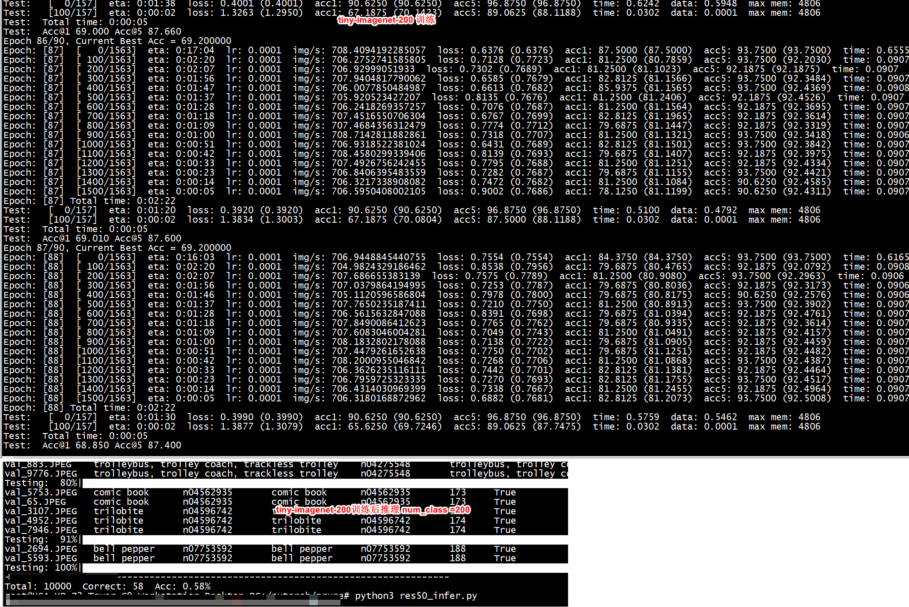

[推荐一款自动剪枝工具Torch-Pruning](https://zhuanlan.zhihu.com/p/694121198)   

[ResNet50图像分类](https://www.mindspore.cn/tutorials/application/zh-CN/r2.0/cv/resnet50.html)   
`torchslim` `mobile-yolov5-pruning-distillation`   


```
ls ~/.cache/torch/hub/checkpoints/
resnet50-0676ba61.pth
```

#  docker


```
sudo  docker run --rm --net=host    --gpus=all -it    -e UID=root    --ipc host --shm-size="32g"  --privileged   -u 0   -v /pytorch:/pytorch  nvcr.io/nvidia/pytorch:24.05-py3 bash
PYTHONPATH=$PYTHONPATH:/pytorch/prune/tinyimagenet
```
安装torch-pruning  
[https://github.com/VainF/Torch-Pruning](https://github.com/VainF/Torch-Pruning)
```
git clone https://github.com/VainF/Torch-Pruning.git
cd Torch-Pruning && pip install -e .
```
环境变量（可以忽略）   

```
export PYTHONPATH=$PYTHONPATH:/pytorch/prune/tinyimagene
```

# test1(有bug)


```
剪枝后
layer pnnx.Input not exists or registered
network graph not ready
```

+ python3 torch-pruning.py

+ py2onnx.py  
```
root@ubuntu:/pytorch/prune# ln -sf /pytorch/ResNet18_Cifar10_95.46/dataset dataset 
root@ubuntu:/pytorch/prune# python3 py2onnx.py
```

```
/pytorch/prune# python3 py2onnx.py 
data shape : torch.Size([128, 3, 32, 32])
data label: tensor([3, 8, 8])
torch.Size([128, 3, 32, 32])
[name: "output"
type {
  tensor_type {
    elem_type: 1
    shape {
      dim {
        dim_param: "batch"
      }
      dim {
        dim_param: "anchors"
      }
    }
  }
}
]
```


+ pnnx


```
pip3 install pnnx -i https://pypi.tuna.tsinghua.edu.cn/simple
```


```
root@ubuntu:/pytorch/prune/ncnnx# pnnx  ../models/res50_model.onnx 

root@ubuntu:/pytorch/prune/ncnnx# ls ../models/
res50_model.ncnn.bin    res50_model.onnx      res50_model.pnnx.onnx   res50_model.pnnxsim.onnx  res50_model_pnnx.py
res50_model.ncnn.param  res50_model.pnnx.bin  res50_model.pnnx.param  res50_model_ncnn.py
```


+  benchncnn
```
/pytorch/ncnn/build/benchmark/benchncnn 4 8 0 0 1  param=./models/res50_model.pnnx.param  shape=[227,227,3]
loop_count = 4
num_threads = 8
powersave = 0
gpu_device = 0
cooling_down = 1
layer pnnx.Input not exists or registered
network graph not ready
./models/res50_model.pnnx.param  min =    0.00  max =    0.00  avg =    0.00
```


```
/pytorch/ncnn/build/onnx2ncnn/test/build# ./bench_resnet 
total jpeg: 1000
right : 1 wrong: 999  accuracy : 0.001
```


#  成功方法

剪枝

```
python3 demo_prune.py 
mv model.onnx  ncnnx/
pnnx  ./ncnnx/model.onnx 
```
+ 剪枝前

```
/pytorch/ncnn/build/benchmark/benchncnn 4 8 0 0 1  param=/pytorch/ncnn/build/onnx2ncnn/model.ncnn.param   shape=[227,227,3]
loop_count = 4
num_threads = 8
powersave = 0
gpu_device = 0
cooling_down = 1
/pytorch/ncnn/build/onnx2ncnn/model.ncnn.param  min =   14.87  max =   15.47  avg =   15.06
```

+ 剪枝后

```
/pytorch/ncnn/build/benchmark/benchncnn 4 8 0 0 1  param=./ncnnx/model.ncnn.param  shape=[227,227,3]
loop_count = 4
num_threads = 8
powersave = 0
gpu_device = 0
cooling_down = 1
./ncnnx/model.ncnn.param  min =   13.01  max =   13.23  avg =   13.13
```


#  main_imagenet.py

+ dataset

```
 train_dir = os.path.join(args.data_path, "train")
    val_dir = os.path.join(args.data_path, "val")
    dataset, dataset_test, train_sampler, test_sampler = load_data(train_dir, val_dir, args)
```
+ data_loader
```
    data_loader = torch.utils.data.DataLoader(
        dataset,
        batch_size=args.batch_size,
        sampler=train_sampler,
        num_workers=args.workers,
        pin_memory=True,
        collate_fn=collate_fn,
    )
    data_loader_test = torch.utils.data.DataLoader(
        dataset_test, batch_size=args.batch_size, sampler=test_sampler, num_workers=args.workers, pin_memory=True
    )
```

train_sampler    
```Text
在 PyTorch 中，‌train_sampler 的作用是决定如何从数据集中采样样本的索引（即哪些样本参与训练），而不是直接处理或依赖标签（label）‌。因此，‌train_sampler 本身不需要 label‌，这是其设计上的一个关键特性。

为什么 train_sampler 不需要 label？
‌Sampler 的职责‌：train_sampler（如 RandomSampler、DistributedSampler、SubsetRandomSampler 等）仅负责生成样本的索引序列，用于 DataLoader 按顺序读取数据。
‌Label 的来源‌：标签是由 Dataset 类在 __getitem__() 方法中返回的，与采样器无关。采样器只关心“取哪个样本”，不关心“这个样本的标签是什么”。
‌解耦设计‌：PyTorch 将数据采样（Sampler）和数据内容（Dataset）分离，使得采样策略可以独立于数据内容（如是否带标签）复用。
```

+ train
```
     train_one_epoch(model, criterion, optimizer, data_loader, device, epoch, args, model_ema, scaler, regularizer, recover=recover)
        lr_scheduler.step()
        acc = evaluate(model, criterion, data_loader_test, device=device)
```

+ imagenet resnet50

```

def get_model(name: str, num_classes, pretrained=False, target_dataset='cifar', **kwargs):
    if target_dataset == "imagenet":

        model = IMAGENET_MODEL_DICT[name](pretrained=pretrained)
    elif 'cifar' in target_dataset:
        model = MODEL_DICT[name](num_classes=num_classes)
    elif target_dataset == 'modelnet40':
        model = GRAPH_MODEL_DICT[name](num_classes=num_classes)
    return model
```


```
MODEL_DICT = {
    'resnet18': models.cifar.resnet.resnet18,
    'resnet34': models.cifar.resnet.resnet34,
    'resnet50': models.cifar.resnet.resnet50,
    'resnet101': models.cifar.resnet.resnet101,
    'resnet152': models.cifar.resnet.resnet152,
```

```
IMAGENET_MODEL_DICT={
    "resnet50": models.imagenet.resnet50,
    "densenet121": models.imagenet.densenet121,
    "mobilenet_v2": models.imagenet.mobilenet_v2,
    "mobilenet_v2_w_1_4": partial( models.imagenet.mobilenet_v2,  width_mult=1.4 ),
    "googlenet": models.imagenet.googlenet,
    "inception_v3": models.imagenet.inception_v3,
    "squeezenet1_1": models.imagenet.squeezenet1_1,
    "vgg19_bn": models.imagenet.vgg19_bn,
    "vgg16_bn": models.imagenet.vgg16_bn,
    "mnasnet1_0": models.imagenet.mnasnet1_0,
    "alexnet": models.imagenet.alexnet,
    "regnet_x_1_6gf": models.imagenet.regnet_x_1_6gf,
    "resnext50_32x4d": models.imagenet.resnext50_32x4d,
    "vit_b_16": models.imagenet.vit_b_16,
}
```


如下tiny-imagenet-200采用有bug
```
python3 ./Torch-Pruning/reproduce/main_imagenet.py   --model resnet50 --epochs 90 --batch-size 64 --lr-step-size 30 --lr 0.01 --prune --method l1 --pretrained   --target-flops 2.00 --cache-dataset --print-freq 100  --data-path  tinyimagenet/torchvision/tinyimagenet/tiny-imagenet-200/ --output-dir  models
```



python dict指针
```
>>> a={}
>>> a['1th'] = 8
>>> b = a
>>> print(a)
{'1th': 8}
>>> b['2th'] = 9
>>> print(a)
{'1th': 8, '2th': 9}
>>> 
```
整数传值   
```
>>> a=3
>>> b=a
>>> b=5
>>> print(a)
3
```

+ 获取 label_to_tiny_class.json

```
python3 test_img_fold.py 
```

```
print(get_tiny_label(DATA_ROOT_DIR,84))
print(idx_to_class[84])
```

+ 执行bench_resnet_tiny 

```
:/pytorch/ncnn/build/onnx2ncnn/test# ./build/bench_resnet_tiny 
"/pytorch/prune/tinyimagenet/torchvision/tinyimagenet/tiny-imagenet-200/val/n04265275" n04265275
pattern: /pytorch/prune/tinyimagenet/torchvision/tinyimagenet/tiny-imagenet-200/val/n04265275/images/*.JPEG
total jpeg: 50
  Predicted class index is 648  class  is unkonw_class real class n04265275
```


# prune （不进行微调）  
参考demo_prune.py   

```
root@ubuntu:/pytorch/prune# python3 res50_prune_no_fine.py
root@ubuntu:/pytorch/prune# pnnx ncnn/model.onnx 
```

+ prune后推理正确率

```
root@ubuntu:/pytorch/ncnn/build/onnx2ncnn/test# ./build/bench_resnet
total jpeg: 1000
right : 588 wrong: 412  accuracy : 0.588
```

+ prune后推理时间

```
/pytorch/ncnn/build/benchmark/benchncnn 4 8 0 0 1  param=./models/model.ncnn.param  shape=[227,227,3]
loop_count = 4
num_threads = 8
powersave = 0
gpu_device = 0
cooling_down = 1
./models/model.ncnn.param  min =   10.89  max =   10.98  avg =   10.94
```

#  使用 ImageNet-v2 进行结构化剪枝

在边缘设备上对 ResNet50 进行端到端加速时，使用 ImageNet-v2 作为数据集是一个极具性价比的选择。ImageNet-v2 是为了测试模型泛化性而开发的独立测试集，包含 1000 个类别，每类 10 张图片（共 10,000 张）。 对于剪枝任务，它的主要作用是作为校准集（Calibration Set）来评估通道重要性，或者作为极轻量级的微调集。       
+ 1. 为什么用 ImageNet-v2 剪枝？
极速校准：结构化剪枝（如基于 L1 范数）通常需要通过一小部分数据来观察激活值或梯度。ImageNet-v2 的 1 万张图片远快于 ImageNet-1K 的 120 万张。    
覆盖全类别：它完整覆盖了 ResNet50 预训练时的 1000个类，确保剪枝后的模型不会在某些特定类别上出现精度崩塌。        
```
针对端到端加速的建议
V2 权重的优势：PyTorch 官方提供的 IMAGENET1K_V2 权重（Top-1 80.8%）比 V1（76.1%）精度更高。在更高起点的模型上剪枝，最终边缘端精度更好。
微调限制：由于 ImageNet-v2 数据量较少（每类仅 10 张），严禁进行长周期的全量微调，否则模型会极快地产生过拟合。建议只微调 1-2 个 Epoch，或者使用学习率极低（如 1e-5）的训练。

量化转换：剪枝后的模型导出为 ONNX 后，利用 TensorRT 开启 INT8 量化。结构化剪枝减小了计算密度，量化减小了位宽，两者叠加可实现 4-8 倍的边缘端加速。
```

+ 标签偏移 (Label Offset)：
ImageNet-v2 的文件夹是 0, 1, 2...。如果你的 PyTorch 训练时的 class_to_idx 是按 WordNet ID 排序的，那么文件夹 0 可能并不对应索引 0。       


```
pip install -U huggingface_hub
 export HF_ENDPOINT=https://hf-mirror.com
```

```
cat download.py 
from huggingface_hub import hf_hub_download

file_path = hf_hub_download(
    repo_id="vaishaal/ImageNetV2",
    filename="imagenetv2-matched-frequency.tar.gz",
    repo_type="dataset",
    local_dir="./imagenetv2"
)
print(f"download to: {file_path}")
```

```
ls imagenetv2-matched-frequency-format-val/
```
