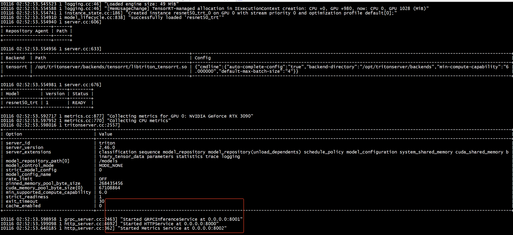

```
pip install torch-tensorrt。
```

```
docker pull nvcr.io/nvidia/pytorch:24.05-py3
docker pull nvcr.io/nvidia/tensorrt:21.11-py3
docker pull nvcr.io/nvidia/tensorrt:24.05-py3
docker pull nvcr.io/nvidia/tritonserver:24.05-py3
```

测试 tritonserver 模型服务的 QPS 通常有两种方法，一种是使用 perf_analyzer 来测试，另一种是通过 model-analyzer 来获取更为详细的模型服务启动的参数，使得模型的 QPS 达到最大。     
[使用perf_analyzer和model-analyzer测试tritonserver的模型性能超详细完整版](https://blog.csdn.net/sinat_29957455/article/details/132583942)    

# model


Specify the Model
TensorRT-RTX specification requires different model formats to convert a model successfully. The ONNX path requires that models be saved in ONNX.

We will use ResNet-50, a basic backbone vision model that can be used for various purposes. We will perform classification using a pre-trained ResNet-50 ONNX model included with the ONNX model zoo.

Download a pre-trained ResNet-50 model from the ONNX model zoo using wget and untar it.

```
wget https://download.onnxruntime.ai/onnx/models/resnet50.tar.gz
tar xzf resnet50.tar.gz
```
This will unpack a pretrained ResNet-50 .onnx file to the path resnet50/model.onnx.

ONNX models can be exported from most popular deep learning training frameworks such as PyTorch or TensorFlow. When using transformer models from Hugging Face, consider the Optimum library.

#  tensorrt


##  ##  onnx export  TensorRT with pytorch:25.03-py3(自带TensorRT)


```
 python onnx_exporter.py --save model.onnx 
mkdir -p ./model_repository/resnet50_trt/1
trtexec --onnx=model.onnx --saveEngine=./model_repository/resnet50_trt/1/model.plan --minShapes=input:1x3x224x224 --optShapes=input:1x3x224x224 --maxShapes=input:256x3x224x224 --fp16
```

```
[01/16/2026-02:47:59] [I] Total Host Walltime: 3.0017 s
[01/16/2026-02:47:59] [I] Total GPU Compute Time: 2.98781 s
[01/16/2026-02:47:59] [I] Explanations of the performance metrics are printed in the verbose logs.
[01/16/2026-02:47:59] [I] 
&&&& PASSED TensorRT.trtexec [TensorRT v100001] # trtexec --onnx=model.onnx --saveEngine=./model_repository/resnet50_trt/1/model.plan --minShapes=input:1x3x224x224 --optShapes=input:1x3x224x224 --maxShapes=input:256x3x224x224 --fp16
```

```
docker run --rm --net=host    --gpus=all -it    -e UID=root    --ipc host --shm-size="32g" --privileged   -u 0  -p 8000:8000 -p 8001:8001 -p 8002:8002 --name=triton -v $(pwd)/model_repository:/models nvcr.io/nvidia/tritonserver:24.05-py3 tritonserver --model-repository=/models
```

   


+ client 采用pytorch:24.05-py3 + pip3 install tritonclient    


```

sudo  docker run --rm --net=host    --gpus=all -it    -e UID=root    --ipc host --shm-size="32g"  --privileged   -u 0   -v /pytorch:/pytorch  nvcr.io/nvidia/pytorch:24.05-py3 bash

```

安装pip3 install tritonclient[all]时间很短
```
pip3 install tritonclient[all]
```
 
##  TensorRT with pytorch:23.08-py3(自带TensorRT)


  OnnxRuntime to  TensorRT    
 ```python
import torch
import torchvision.models as models
import argparse
import os
resnet50 = models.resnet50(pretrained=True)
dummy_input = torch.randn(1, 3, 224, 224)
resnet50 = resnet50.eval()

torch.onnx.export(resnet50,
                    dummy_input,
                    args.save,
                    export_params=True,
                    opset_version=10,
                    do_constant_folding=True,
                    input_names=['input'],
                    output_names=['output'],
                    dynamic_axes={'input': {0: 'batch_size', 2: "height", 3: 'width'},
                                'output': {0: 'batch_size'}})
  ```

 Once you have your exported onnx model, using trtexec:
 ```bash
   trtexec --onnx=model.onnx --saveEngine=model.plan --explicitBatch --minShapes=input:1x3x224x224 --optShapes=input:1x3x224x224 --maxShapes=input:256x3x224x224

  ```

  * Pay attention to use tensorrt version corresponding to the one used on Triton image, or you could use a container like below (supposing you are using Triton release 23.08)
   ```bash
  docker run -it --gpus=all -v $(pwd):/workspace nvcr.io/nvidia/pytorch:23.08-py3 /bin/bash -cx \
   "trtexec --onnx=model.onnx --saveEngine=model.plan --explicitBatch --minShapes=input:1x3x224x224 --optShapes=input:1x3x224x224 --maxShapes=input:256x3x224x224 --fp16 
  ```  
 


##    TensorRT with tensorrt:24.05-py3

```
dpkg -l | grep -i tensorrt-dev
ii  tensorrt-dev                    10.0.1.6-1+cuda12.4                         amd64        Meta package for TensorRT development libraries
```

```
sudo  docker run --rm --net=host    --gpus=all -it    -e UID=root    --ipc host --shm-size="32g" --privileged   -u 0  --name=tensorrt \
-v $(pwd)/models:/models \
nvcr.io/nvidia/tensorrt:24.05-py3  bash
```


```
/workspace/tensorrt/bin# ./trtexec --loadEngine=/models/resnet50_trt/1/model.plan    
```


+ onnx to  tensorrt   
```
/workspace/tensorrt/bin/trtexec  --onnx=resnet50/model.onnx --fp16 --saveEngine=resnet50.fp16.engine
```

```
[01/16/2026-02:16:23] [I] Total Host Walltime: 3.00104 s
[01/16/2026-02:16:23] [I] Total GPU Compute Time: 2.98803 s
[01/16/2026-02:16:23] [I] Explanations of the performance metrics are printed in the verbose logs.
[01/16/2026-02:16:23] [I] 
&&&& PASSED TensorRT.trtexec [TensorRT v100001] # /workspace/tensorrt/bin/trtexec --onnx=resnet50/model.onnx --fp16 --saveEngine=resnet50.fp16.engine
```

+ 加载resnet50.fp16.engine


```
/workspace/tensorrt/bin/trtexec  --loadEngine=resnet50.fp16.engine 
```
```
[01/16/2026-02:17:36] [I] Total Host Walltime: 3.00127 s
[01/16/2026-02:17:36] [I] Total GPU Compute Time: 2.98765 s
[01/16/2026-02:17:36] [W] * GPU compute time is unstable, with coefficient of variance = 1.92523%.
[01/16/2026-02:17:36] [W]   If not already in use, locking GPU clock frequency or adding --useSpinWait may improve the stability.
[01/16/2026-02:17:36] [I] Explanations of the performance metrics are printed in the verbose logs.
[01/16/2026-02:17:36] [I] 
&&&& PASSED TensorRT.trtexec [TensorRT v100001] # /workspace/tensorrt/bin/trtexec --loadEngine=resnet50.fp16.engine
```

# resnet18


```
root@ubuntu:/pytorch/triton# python3 export_model.py 
Downloading: "https://download.pytorch.org/models/resnet18-f37072fd.pth" to /root/.cache/torch/hub/checkpoints/resnet18-f37072fd.pth
100%|███████████████████████████████████████████████████████████████████████████████████████████████████████████████████████████████████████████████████████| 44.7M/44.7M [00:01<00:00, 41.4MB/s]
models/resnet18_pytorch/1/model.pt
root@ubuntu:/pytorch/triton# python3 export_model.py 
models/resnet18_pytorch/1/model.pt
root@ubuntu:/pytorch/triton# 
```

# server

```
sudo  docker run --rm --net=host    --gpus=all -it    -e UID=root    --ipc host --shm-size="32g" --privileged   -u 0  -p 8000:8000 -p 8001:8001 -p 8002:8002 --name=triton \
-v $(pwd)/models:/models \
nvcr.io/nvidia/tritonserver:24.05-py3 tritonserver --model-repository=/models
```


```
I0115 02:14:51.992766 1 grpc_server.cc:2463] "Started GRPCInferenceService at 0.0.0.0:8001"
I0115 02:14:51.993006 1 http_server.cc:4692] "Started HTTPService at 0.0.0.0:8000"
I0115 02:14:52.034027 1 http_server.cc:362] "Started Metrics Service at 0.0.0.0:8002"
```


# client


```
sudo  docker run --rm --net=host    --gpus=all -it    -e UID=root    --ipc host --shm-size="32g"  --privileged   -u 0   -v /pytorch:/pytorch  nvcr.io/nvidia/tritonserver:24.05-py3-sdk bash
```

采用grpc报错   
```
perf_analyzer -m resnet18_pytorch --concurrency-range 1:16 -u localhost:8001
error: failed to get model metadata: HTTP client failed: Unsupported protocol
```
+ 换成http    

```
perf_analyzer -m resnet18_pytorch --concurrency-range 1:16 -u localhost:8000
```

```
Inferences/Second vs. Client Average Batch Latency
Concurrency: 1, throughput: 879.896 infer/sec, latency 1108 usec
Concurrency: 2, throughput: 1333.64 infer/sec, latency 1470 usec
Concurrency: 3, throughput: 1325.84 infer/sec, latency 2231 usec
Concurrency: 4, throughput: 1320.5 infer/sec, latency 2995 usec
Concurrency: 5, throughput: 1320.94 infer/sec, latency 3751 usec
Concurrency: 6, throughput: 1320.32 infer/sec, latency 4509 usec
Concurrency: 7, throughput: 1318.32 infer/sec, latency 5272 usec
Concurrency: 8, throughput: 1316.55 infer/sec, latency 6039 usec
Concurrency: 9, throughput: 1319.22 infer/sec, latency 6784 usec
Concurrency: 10, throughput: 1317.85 infer/sec, latency 7549 usec
Concurrency: 11, throughput: 1315.51 infer/sec, latency 8320 usec
Concurrency: 12, throughput: 1313.88 infer/sec, latency 9090 usec
Concurrency: 13, throughput: 1314.99 infer/sec, latency 9844 usec
Concurrency: 14, throughput: 1312.72 infer/sec, latency 10621 usec
Concurrency: 15, throughput: 1311.58 infer/sec, latency 11392 usec
Concurrency: 16, throughput: 1311.23 infer/sec, latency 12158 usec
```


# tensorrt


```
 UNAVAILABLE: Internal: unable to load plan file to auto complete config: /models/resnet18_trt/1/model.plan
```

./trtexec --loadEngine=/models/resnet18_trt/1/model.plan     
```
[01/15/2026-07:20:09] [E] Error[1]: [runtime.cpp::parsePlan::455] Error Code 1: Serialization (Serialization assertion plan->header.magicTag == rt::kPLAN_MAGIC_TAG failed.Trying to load an engine created with incompatible serialization version. Check that the engine was not created using safety runtime, same OS was used and version compatibility parameters were set accordingly.)
[01/15/2026-07:20:09] [E] Engine deserialization failed
[01/15/2026-07:20:09] [E] Got invalid engine!
[01/15/2026-07:20:09] [E] Inference set up failed
&&&& FAILED TensorRT.trtexec [TensorRT v100001] # ./trtexec --loadEngine=/models/resnet18_trt/1/model.plan
```