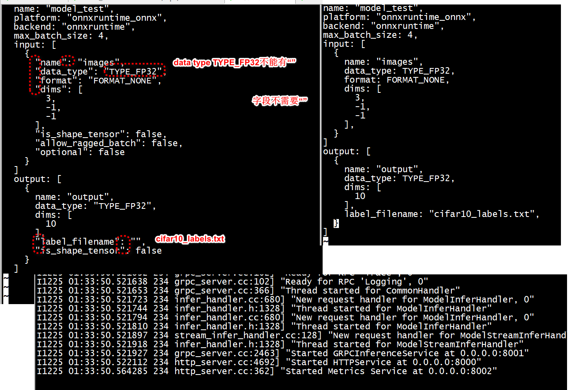

#  参考
[triton使用模型集成执行多个模型](https://github.com/ZJU-lishuang/triton_doc/blob/a08e50889132854b6bcfdb68031ca7504332f5a6/tutorials/Conceptual_Guide/Part_5-Model_Ensembles/README_zh-CN.md)
[triron-inference-server-tutorial"ensemble_model"](https://github.com/AntZot/triron-inference-server-tutorial/tree/master/simple_example)

[第三方推理框架迁移到ModelArts Standard推理自定义引擎](https://support.huaweicloud.com/intl/zh-cn/bestpractice-modelarts/modelarts_04_0277.html)   


#  config


```
root@ubuntux86:# curl localhost:8000/v2/models/model_test/config
{"name":"model_test","platform":"onnxruntime_onnx","backend":"onnxruntime","runtime":"","version_policy":{"latest":{"num_versions":1}},"max_batch_size":4,"input":[{"name":"images","data_type":"TYPE_FP32","format":"FORMAT_NONE","dims":[3,-1,-1],"is_shape_tensor":false,"allow_ragged_batch":false,"optional":false}],"output":[{"name":"output","data_type":"TYPE_FP32","dims":[10],"label_filename":"","is_shape_tensor":false}],"batch_input":[],"batch_output":[],"optimization":{"priority":"PRIORITY_DEFAULT","input_pinned_memory":{"enable":true},"output_pinned_memory":{"enable":true},"gather_kernel_buffer_threshold":0,"eager_batching":false},"dynamic_batching":{"preferred_batch_size":[4],"max_queue_delay_microseconds":0,"preserve_ordering":false,"priority_levels":0,"default_priority_level":0,"priority_queue_policy":{}},"instance_group":[{"name":"model_test","kind":"KIND_CPU","count":2,"gpus":[],"secondary_devices":[],"profile":[],"passive":false,"host_policy":""}],"default_model_filename":"model.onnx","cc_model_filenames":{},"metric_tags":{},"parameters":{},"model_warmup":[]}root@ubuntux86:# 
```

```
root@ubuntux86:# ls model_repository/model_test/
1
root@ubuntux86:# curl localhost:8000/v2/models/model_test/config | jq > model_test.json


or
curl localhost:8000/v2/models/model_test/config |  jq '.' | tee  model_test.json
```



#    batch size   

the input shape (1, 3, 225, 225), the batch size is set to 1. With input shape (8, 3, 225, 225) the batch size is set to 8.


```
root@ubuntux86:/workspace/models/resnet# python3
Python 3.8.10 (default, Mar 18 2025, 20:04:55) 
[GCC 9.4.0] on linux
Type "help", "copyright", "credits" or "license" for more information.
>>> import torch
>>> data = torch.randn(32, 1, 32, 32)
>>> data.shape
torch.Size([32, 1, 32, 32])
>>> data = data.reshape(32, -1)
>>> data.shape
torch.Size([32, 1024])
>>> 
```

```
Example: CIFAR10

transfos = transforms.Compose([torchvision.transforms.Grayscale(),transforms.ToTensor(),transforms.Normalize((0.4749), (0.2382))])
train = datasets.CIFAR10(".", train = True, download = True, transform = transfos)
test = datasets.CIFAR10(".", train = False, download = True, transform = transfos)

batches_train = torch.utils.data.DataLoader(train, batch_size=bs, shuffle=True)
batches_test = torch.utils.data.DataLoader(test, batch_size=bs, shuffle=True)
The problem now is that each batch has dimension (batchsize, 1, H, W).
```

```
def reshape_transform():
    def fn(data):
        batch_size = data.size(0)
        return data.reshape(batch_size, -1)
    return fn

transfos = transforms.Compose([torchvision.transforms.Grayscale(),transforms.ToTensor(),transforms.Normalize((0.4749), (0.2382)), reshape_transform()])
```


```
import onnx

def change_input_dim(model):
    # Use some symbolic name not used for any other dimension
    sym_batch_dim = "N"
    # or an actal value
    actual_batch_dim = 4 

    # The following code changes the first dimension of every input to be batch-dim
    # Modify as appropriate ... note that this requires all inputs to
    # have the same batch_dim 
    inputs = model.graph.input
    for input in inputs:
        # Checks omitted.This assumes that all inputs are tensors and have a shape with first dim.
        # Add checks as needed.
        dim1 = input.type.tensor_type.shape.dim[0]
        # update dim to be a symbolic value
        dim1.dim_param = sym_batch_dim
        # or update it to be an actual value:
        # dim1.dim_value = actual_batch_dim


def apply(transform, infile, outfile):
    model = onnx.load(infile)
    transform(model)
    onnx.save(model, outfile)

apply(change_input_dim, r"input-file-name, r"output-file-name")
```

## shape


```
>>> import torch
>>> data = torch.randn(1, 1, 32, 32)
>>> data.shape
torch.Size([1, 1, 32, 32])
```
+ view(3, 1, 1)
```
>>> new=data*torch.tensor([0.2023, 0.1994, 0.2010]).view(3, 1, 1)
>>> new.shape
torch.Size([1, 3, 32, 32])
>>> 
```

+ clamp
```
>>> new=torch.clamp(data, 0, 1)
>>> new.shape
torch.Size([1, 1, 32, 32])
>>> 
```
+ permute
```
>>> new=data.permute(0, 2, 3, 1)
>>> new.shape
torch.Size([1, 32, 32, 1])
>>> 
```

```
    # TODO: This is a hack to handle both [B, C, H, W] and [B, H, W, C] formats
    # Handle both [B, C, H, W] and [B, H, W, C] formats
    is_channels_first = image.shape[1] == 3  # Check if channels are in dimension 1
    train = True
    wrist = True
    if is_channels_first:
        # Convert [B, C, H, W] to [B, H, W, C] for processing
        image = image.permute(0, 2, 3, 1)
```

+ numpy  transpose(permute)

```
import numpy as np

a = np.arange(24).reshape((3, 4, 2))
# Shape of a is (3, 4, 2)

# Permute axes to (1, 0, 2)
b = np.transpose(a, (1, 0, 2))
# Shape of b is (4, 3, 2)
print(b.shape)

# Reversing the axes order (equivalent to a.T for 2D, or (2, 1, 0) for 3D)
c = np.transpose(a)
# Shape of c is (2, 4, 3)
print(c.shape)
```

# test   
```
cd conceptual-guide
mkdir ../data
```

采用tritonserver:24.07-py3否则模型加载中的cuda版本有问题


```
export TLLM_LOG_LEVEL=TRACE
tritonserver --model-repository=/models --log-verbose=1   --log-info=1 
```
 
```
or --log-verbose=3 --log-info=1 --log-warning=1 --log-error=1
```
 


```
docker run -it --shm-size=2G  --rm    -p8000:8000 -p8001:8001 -p8002:8002   -v ${PWD}:/workspace/ -v ${PWD}/model_repository:/models   --name triton-ensemble-model triton-ensemble-model:v1  /bin/bash
```

#  np.bool


```
import numpy as np
 
np.bool = np.bool_
```


# detection 数据集


```
wget http://images.cocodataset.org/val2017/000000439715.jpg -O input.jpg
```
 
```
!wget http://images.cocodataset.org/val2017/000000439715.jpg -q -O input.jpg
im = cv2.imread("./input.jpg")
plt.imshow(cv2.cvtColor(im, cv2.COLOR_BGR2RGB))
```
YOLOv8   
```
wget https://rbln-public.s3.ap-northeast-2.amazonaws.com/images/people4.jpg
```

 


#  track

+ 下载模型   

```
git lfs pull
```
+ 安装依赖    

```
pip install -r /models/tracking/1/ocsort/requirements.txt
```


```
Expected [-1,-1,-1,3], got [1,1024,4800].
```