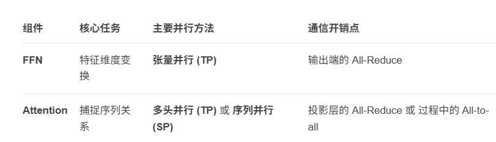
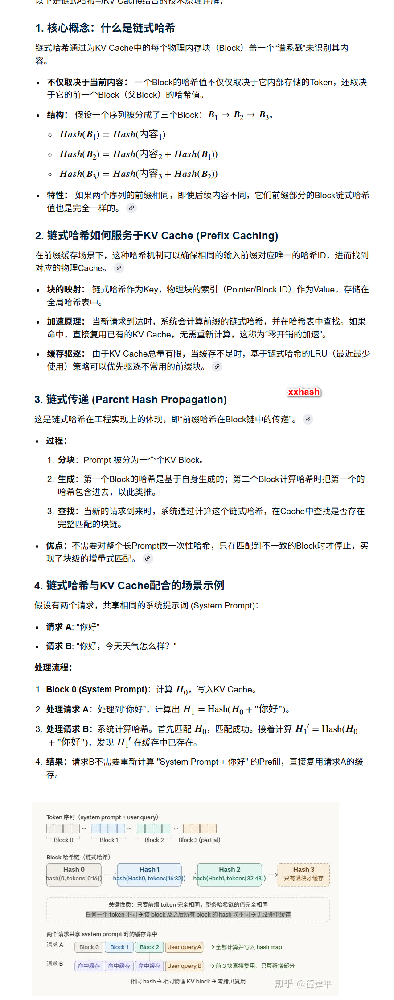
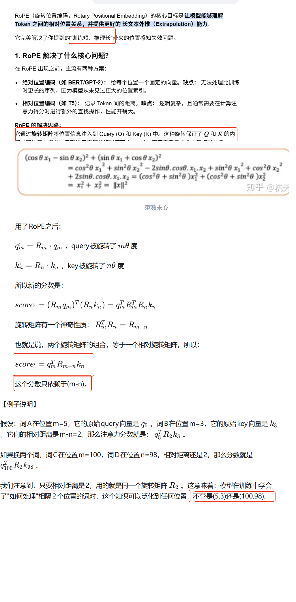
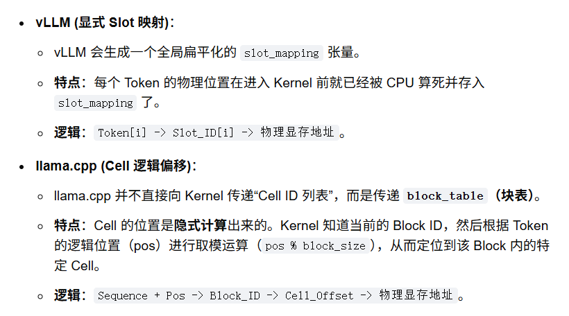
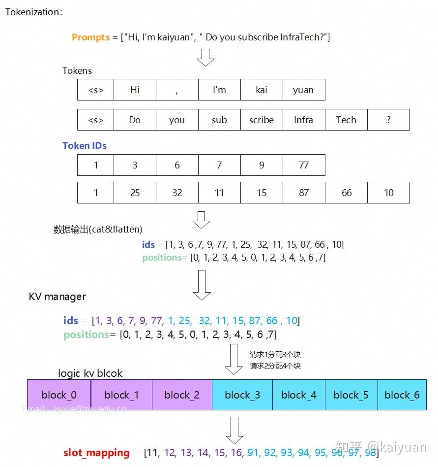
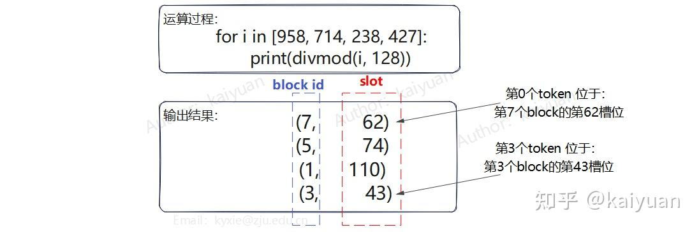
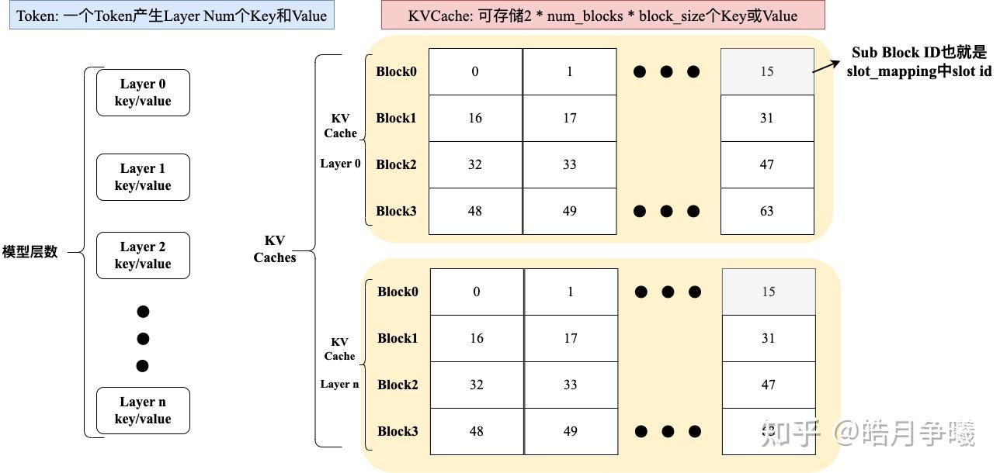
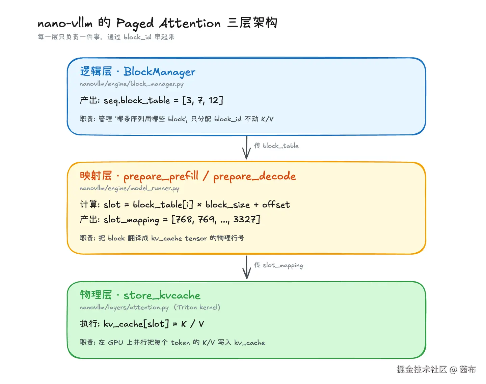

[DeepSeek专栏2：vLLM 部署指南（鲲鹏+NVIDIA）](https://www.openeuler.org/zh/blog/03-DeepSeek2/2.html)  

[vLLM Scheduler逻辑难啃？先手搓一个基础调度器](https://zhuanlan.zhihu.com/p/1988193790129902960) 

[vLLM框架：大语言模型推理的高效机制](https://www.cnblogs.com/zackstang/p/19036108)   

[大模型推理Continuous Batching技术](https://zhuanlan.zhihu.com/p/1910225311997629198)    

[Continuous Batching 与 Selective Batching 实现](https://zhuanlan.zhihu.com/p/1945666696598787814)    
[vLLM Automatic Prefix Caching (前缀缓存) 详细分析](https://zhuanlan.zhihu.com/p/2010430935833793165)       

[高效推理的核心：vLLM V1 KV cache 管理机制剖析-slot_mapping](https://zhuanlan.zhihu.com/p/1954128446398633139)   


[vLLM不知如何开始？看这篇：vLLM框架快速入门引导-slot_mapping](https://zhuanlan.zhihu.com/p/1984742841528902530)   

[三层架构：从 block_table 到物理 KV 写入](https://juejin.cn/post/7628789251623534602)   


# attention and ffn



#  cpu

```
# 1. 拉取专用于 ARM64 CPU 的 vLLM 镜像
docker pull vllm/vllm-openai-cpu:latest-arm64

# 2. 运行容器 (以运行 qwen2-7b-instruct 为例)
docker run --name vllm-cpu-server -d \
    -p 8000:8000 \
    -v /path/to/your/models:/models \
    vllm/vllm-openai-cpu:latest-arm64 \
    --model /models/Qwen2-7B-Instruct \
    --device cpu \
    --dtype float16 # 鲲鹏上通常推荐fp16或bf16以获得更好性能
```
华为昇腾（Ascend）NPU 并使用专门的 vLLM-Ascend 镜像 进行加速  


```
docker pull hub.oepkgs.net/neocopilot/deepseek_vllm:openeEuler2203-lts-sp4_cpu
```


```
docker run --name vllm-cpu-server -d \
    -p 8000:8000 \
    -v /pytorch/qwen/models/:/models \
    vllm/vllm-openai-cpu:latest-arm64 \
    --model /models/qwen2-7b-instruct \
    --device cpu \
    --dtype float16
```

```
[root@centos7 ~]# docker exec -it vllm-cpu-server bash
root@7e4bc2fa08ca:/vllm-workspace# ps -elf
F S UID         PID   PPID  C PRI  NI ADDR SZ WCHAN  STIME TTY          TIME CMD
4 R root          1      0 99  80   0 - 245305 -     07:12 ?        00:00:37 /opt/venv/bin/python3 /opt/venv/bin/vllm serve --model /models/qwen2-7b-instruct --device cpu --dtype float16
4 S root        260      0  1  80   0 -   289 do_wai 07:13 pts/0    00:00:00 bash
```


```
[root@centos7 pytorch]# docker run  --net=host    -it    -e UID=root    --ipc host --shm-size="32g" --privileged  -v /root/pytorch:/workspace -u 0  --entrypoint bash  --name=vllm-rep vllm/vllm-openai-cpu:latest-arm64
```

# gpu

[渡渡鸟docker.io/vllm/vllm-openai:v0.12.0 - 镜像下载](https://docker.aityp.com/image/docker.io/vllm/vllm-openai:v0.12.0)  
  
```
docker pull vllm/vllm-openai:latest
``` 

# vllm paged_attention_kernel 

[vLLM推理引擎教程5-PagedAttention技术](https://blog.csdn.net/benben044/article/details/155937019)

[src/attention-paged-sycl/main.cpp](https://github.com/ORNL/HeCBench/blob/23c254917a0bf8f0924cb2dcc8e08e16de2eaa1d/src/attention-paged-sycl/main.cpp)   
[Prefix Caching](https://zhuanlan.zhihu.com/p/1916181593229334390)   

[vllm-learning](https://github.com/shizhengLi/vllm-learning/blob/2a991fd9241dee2bd0a9ae45fa37d85f70f80c88/docs/%E6%A0%B8%E5%BF%83%E7%BB%84%E4%BB%B6%E5%8E%9F%E7%90%86%E5%88%86%E6%9E%90.md)   

[NanoInfer](https://github.com/tang-jiapeng/NanoInfer/tree/615a4dc76411507d98ccdf3cf704ca9023b7e472/src/model)

+ 应用场景   
Parallel Sampling 或 Beam Search    


> ## nanovllm

[管中窥豹nano-vllm（一）：从样例到主流程](https://zhuanlan.zhihu.com/p/1986582078280704324)  

```
docker run  --net=host    -it    -e UID=root    --ipc host --shm-size="32g" --privileged  -v /root/pytorch:/pytorch -u 0  --entrypoint bash  --name=vllm-rep vllm/vllm-openai-cpu:latest-arm64
```

+ server
```
[root@centos7 vllm]#  docker buildx build --platform=linux/arm64 -f docker/Dockerfile.cpu .
```
+  vllm-dev 
```
docker buildx build  --target vllm-dev -t vllm-dev  --platform=linux/arm64 -f docker/Dockerfile.cpu .
```

```
pip install torch
pip install transformers xxhash
pip install flash-attn --no-build-isolation
```


```
pip3 install xxhash
pip3 install flash-attn
pip install triton
 pip3 install tritonclient[all]
```

```
modelscope download --model Qwen/Qwen3-0.6B
```

```
root@centos7:/workspace/vllm-learning# ls ~/.cache/modelscope/hub/models/Qwen/ -al
total 0
drwxr-xr-x. 3 root root 44 Apr 28 07:59 .
drwxr-xr-x. 6 root root 68 Apr 28 07:48 ..
lrwxrwxrwx. 1 root root 52 Apr 28 07:59 Qwen3-0.6B -> /root/.cache/modelscope/hub/models/Qwen/Qwen3-0___6B
drwxr-xr-x. 2 root root  6 Apr 28 08:05 Qwen3-0___6B
```
+ gpu

```
export CUDA_VISIBLE_DEVICES=0,1,2,3
```


```
pip3 install xxhash 
```


```
docker run --name vllm-server --network host --rm   -v /pytorch/qwen/models:/model   -e OMP_NUM_THREADS=320   -e OPENBLAS_NUM_THREADS=320 -e VLLM_CPU_OMP_THREADS=320  -e MALLOC_ARENA_MAX=16 --privileged vllm-cpu:v320 --model /model//pytorch/qwen/models/Qwen3-0.6B  --served-model-name Qwen2.5-Coder:7B --dtype bfloat16   --max-model-len 8192  --max-num-seqs 32  --max-num-batched-tokens 4096  --block-size 16   --enable-prefix-caching  --host 0.0.0.0 --port 8000
```

#  deepseek_vllm:openeEuler2203-lts-sp4_cpu
```
 docker run  --net=host    -it    -e UID=root    --ipc host --shm-size="32g" --privileged  -v /root/pytorch:/workspace -u 0  --entrypoint bash  --name=vllm-rep hub.oepkgs.net/neocopilot/deepseek_vllm:openeEuler2203-lts-sp4_cpu
```

```
root@centos7 nano-vllm-cpu]# python --version
Python 3.9.9
[root@centos7 nano-vllm-cpu]# 
```

```
pip install -U transformers soxr
```

```
[root@centos7 nano-vllm-cpu]# python3 example.py 
`torch_dtype` is deprecated! Use `dtype` instead!
Generating: 100%|███████████████████████████████████████████████████████████████████████████████████████████████████████████████████| 3/3 [04:48<00:00, 96.03s/it, Prefill=6tok/s, Decode=1tok/s]


Prompt: '<|im_start|>system\nYou are a helpful assistant.<|im_end|>\n<|im_start|>user\n你是谁<|im_end|>\n<|im_start|>assistant\n'
len 219 Completion: '我是阿里云开发的一款超大规模语言模型，我叫通义千千。作为一个基于大量语言模型参数预训练和专业领域的微调（Fine- -Tune）所形成的全ati异构融合统一知识增强了跨域学习和推理推理、常识、多语言、科学、古籍、皮皮虾、悟道等多元文化和娱乐内容的知识与技能，我能够针对特定领域或具体任务进行针对性训练，从而实现更加精确和专业的内容产出，服务于(){\r\n\r\n /\\드리ちんすうけんぺいちんすうさんは誰でしょう？\n\n申し訳ありませんが、それら'


Prompt: '<|im_start|>system\nYou are a helpful assistant.<|im_end|>\n<|im_start|>user\n中国是<|im_end|>\n<|im_start|>assistant\n'
len 209 Completion: '中国的政治、经济、文化、地理位置与中国作为当今世界八大国之一、世界上经济发展表现最好的国家之一、自然资源总量  \t\n具 有绝对优势的发展中家。中国是安理会五个常任理事国，中国是世界上人熵率的重要文明古国和人类历史文化宝库之一，有着50000 多万年历史的文明性、4000000年历史的文字、中国结绳记事到今天的钟鼎彝器铭文等反映了其悠久的科学文化发展史。\n\n在经济方面，中国是世界第二大经济体，第四大外国直接投资接受地'


Prompt: '<|im_start|>system\nYou are a helpful assistant.<|im_end|>\n<|im_start|>user\n讲一个笑话，题材任意，200字<|im_end|>\n<|im_start|>assistant\n'
len 260 Completion: '当然，这里有一个轻松幽默的笑话分享给您：\n\n有天高考改革题目出来了之后，\n哥哥问他妹妹问题的答案是什么？\n妹妹想了半天想了想回了一句：“我不知道� weighted sum of likelihood weights\n哥哥一听急了，连忙说：“妹妹，我看你是是没学好啊，这不是取 阁下的均值扩散方差之后的答案喏？”\n\n这个笑话主要是在调侃学生在考试或学习过程中，对于难题的理解和解答上可能产生的焦虑和困惑， 并以幽默讽刺和玩笑的方式来描绘了这种焦虑的情绪状态，引人发笑之余也蕴含了一丝丝的社会观察色彩。<|im_end|>'
[root@centos7 nano-vllm-cpu]# 
```

#   MekayelAnik/vllm-cpu(error)

```
[root@centos7 vllm-cpu]# git remote -v
origin  https://github.com/MekayelAnik/vllm-cpu.git (fetch)
origin  https://github.com/MekayelAnik/vllm-cpu.git (push)
[root@centos7 vllm-cpu]#  docker build --build-arg VLLM_VERSION="0.18.0"  -t vllm-cpu-018-noavx512 -f docker/Dockerfile  .
```

+ venv
```
root@a3259915c307:/vllm#  export PATH="/vllm/venv/bin:$PATH"
root@a3259915c307:/vllm# python3

```


```
docker run -e VLLM_CPU_KVCACHE_SPACE=4  -e  VLLM_USE_V1=0 -d  -p 8080:8000 -v /pytorch/qwen/models/:/models -v /pytorch:/workspace --shm-size=4g  --name vllm-sch2 vllm-cpu-018-noavx512    --model /models/qwen2-7b-instruct   --host  127.0.0.1 --port 8000   --dtype float32   --enforce-eager   --distributed-executor-backend uni --kv-cache-dtype auto --enable-chunked-prefill false  --max_model_len  1024   
```

```
docker run -e VLLM_CPU_KVCACHE_SPACE=4  -e  VLLM_USE_V1=0 -d  -p 8080:8000 -v /pytorch/qwen/models/:/models -v /pytorch:/workspace --shm-size=4g  --name vllm-sch2 vllm-cpu-018-noavx512    --model /models/Qwen2___5-0___5B-Instruct   --host  127.0.0.1 --port 8000   --dtype float32   --enforce-eager   --distributed-executor-backend uni --kv-cache-dtype auto --enable-chunked-prefill false  --max_model_len  1024   
```

```
root@40c38867b8dd:/vllm# export PATH="/vllm/venv/bin:$PATH"
root@40c38867b8dd:/vllm# python3 -c 'import torch; print(torch.__version__)'
2.10.0+cpu
root@40c38867b8dd:/vllm# 
```

+ docker里面测试  
```
root@551816de4305:/vllm#   curl -sS http://localhost:8000/v1/models | jq
{
  "object": "list",
  "data": [
    {
      "id": "/models/qwen2-7b-instruct",
      "object": "model",
      "created": 1778053733,
      "owned_by": "vllm",
      "root": "/models/qwen2-7b-instruct",
      "parent": null,
      "max_model_len": 1024,
      "permission": [
        {
          "id": "modelperm-928ea6f031d5d024",
          "object": "model_permission",
          "created": 1778053733,
          "allow_create_engine": false,
          "allow_sampling": true,
          "allow_logprobs": true,
          "allow_search_indices": false,
          "allow_view": true,
          "allow_fine_tuning": false,
          "organization": "*",
          "group": null,
          "is_blocking": false
        }
      ]
    }
  ]
}
```


```
curl http://localhost:8000/v1/chat/completions \
  -H "Content-Type: application/json" \
  -d '{
    "model": "/models/qwen2-7b-instruct",
    "messages": [
      {"role": "user", "content": "San Francisco is a"}
    ]
  }'
  
  
  curl http://localhost:8000/v1/chat/completions \
  -H "Content-Type: application/json" \
  -d '{
    "model": "/models/Qwen2___5-0___5B-Instruct",
    "messages": [
      {"role": "user", "content": "San Francisco is a"}
    ]
  }'

```


```
 curl http://localhost:8000/v1/chat/completions \
  -H "Content-Type: application/json" \
  -d '{
    "model": "/models/Qwen2___5-0___5B-Instruct",
    "messages": [
      {"role": "user", "content": "hello"}
    ]
  }'

```


> ## bug   cpp_prefix.h: No such file or directory
```
(EngineCore pid=465) g++ /tmp/tmplyvgi3yh/header.hpp -D TORCH_INDUCTOR_CPP_WRAPPER -D STANDALONE_TORCH_HEADER -D C10_USING_CUSTOM_GENERATED_MACROS -D CPU_CAPABILITY_NEON -D AT_BUILD_ARM_VEC256_WITH_SLEEF -O3 -DNDEBUG -fno-trapping-math -funsafe-math-optimizations -ffinite-math-only -fno-signed-zeros -fno-math-errno -fno-finite-math-only -fno-unsafe-math-optimizations -ffp-contract=off -fexcess-precision=fast -fno-tree-loop-vectorize -march=native -fPIC -Wall -std=c++17 -Wno-unused-variable -Wno-unknown-pragmas -pedantic -fopenmp -I/root/.local/share/uv/python/cpython-3.12.13-linux-aarch64-gnu/include/python3.12 -I/vllm/venv/lib/python3.12/site-packages/torch/include -I/vllm/venv/lib/python3.12/site-packages/torch/include/torch/csrc/api/include -E -P -o /tmp/tmplyvgi3yh/header.i
(EngineCore pid=465) 
(EngineCore pid=465) Output:
(EngineCore pid=465) /tmp/tmplyvgi3yh/header.hpp:1:10: fatal error: torch/csrc/inductor/cpp_prefix.h: No such file or directory
(EngineCore pid=465)     1 | #include <torch/csrc/inductor/cpp_prefix.h>
(EngineCore pid=465)       |          ^~~~~~~~~~~~~~~~~~~~~~~~~~~~~~~~~~
(EngineCore pid=465) compilation terminated.
(EngineCore pid=465) 
(EngineCore pid=465) 
(EngineCore pid=465) Set TORCHDYNAMO_VERBOSE=1 for the internal stack trace (please do this especially if you're reporting a bug to PyTorch). For even more developer context, set TORCH_LOGS="+dynamo"
(EngineCore pid=465) 
(APIServer pid=62) INFO:     Shutting down
(APIServer pid=62) INFO:     Waiting for application shutdown.
(APIServer pid=62) INFO:     Application shutdown complete.
(APIServer pid=62) INFO:     Finished server process [62]
```
vLLM 在运行 CPU 推理时，底层会调用 torch.compile 生成高性能的 C++ 代码。生成代码后，它需要调用系统里的 g++ 并引用 cpp_prefix.h 来完成最后的编译。但 Docker 镜像为了减小体积，删除了这些 .h 文件，导致了“无米之炊”。    

```
# 查找 torch 安装路径
TORCH_PATH=$(python3 -c "import torch; print(torch.__path__[0])")

# 检查头文件是否真的缺失
ls $TORCH_PATH/include/torch/csrc/inductor/cpp_prefix.h
```

```
[root@centos7 ~]# docker exec -it vllm-sch2 bash
root@005f644d5732:/vllm# export PATH="/vllm/venv/bin:$PATH"
root@005f644d5732:/vllm# python3 -c 'import torch; print(torch.__version__)'
2.10.0+cpu
root@005f644d5732:/vllm# TORCH_PATH=$(python3 -c "import torch; print(torch.__path__[0])")
root@005f644d5732:/vllm# ls $TORCH_PATH/include/torch/csrc/inductor/cpp_prefix.h
ls: cannot access '/vllm/venv/lib/python3.12/site-packages/torch/include/torch/csrc/inductor/cpp_prefix.h': No such file or directory
```

```
root@1091f37a2ac3:/vllm# ls /vllm/venv/lib/python3.12/site-packages/torch/include/torch/
ls: cannot access '/vllm/venv/lib/python3.12/site-packages/torch/include/torch/': No such file or directory
root@1091f37a2ac3:/vllm# ls /vllm/venv/lib/python3.12/site-packages/torch/include/      
ATen
root@1091f37a2ac3:/vllm# ls /vllm/venv/lib/python3.12/site-packages/torch/       
```

+   pip3  install  torch==2.10.0 for cpu
```
curl https://bootstrap.pypa.io/get-pip.py -o get-pip.py
python3 get-pip.py
 pip3  install --force-reinstall torch==2.10.0 torchvision torchaudio --index-url https://download.pytorch.org/whl/cpu
```

```
Successfully installed MarkupSafe-3.0.3 filelock-3.25.2 fsspec-2026.2.0 jinja2-3.1.6 mpmath-1.3.0 networkx-3.6.1 numpy-2.4.3 pillow-12.1.1 setuptools-70.2.0 sympy-1.14.0 torch-2.10.0+cpu torchaudio-2.11.0+cpu torchvision-0.25.0+cpu typing-extensions-4.15.0
root@1091f37a2ac3:/vllm# ls /vllm/venv/lib/python3.12/site-packages/torch/include/torch/
csrc  custom_class.h  custom_class_detail.h  extension.h  headeronly  library.h  script.h
root@1091f37a2ac3:/vllm# 
```


```
rm -rf /var/lib/apt/lists/* 
 apt-get clean
find /vllm/venv -depth -type d -name "__pycache__"  -exec rm -vrf {}  \;
```

> ## docker安装 torch==2.10.0 for cpu
```
root@1091f37a2ac3:/vllm# ls /vllm/venv/lib/python3.12/site-packages/torch/include/torch/
csrc  custom_class.h  custom_class_detail.h  extension.h  headeronly  library.h  script.h
root@1091f37a2ac3:/vllm#  curl http://localhost:8000/v1/chat/completions \
  -H "Content-Type: application/json" \
  -d '{
    "model": "/models/Qwen2___5-0___5B-Instruct",
    "messages": [
      {"role": "user", "content": "hello"}
    ]
  }'
{"id":"chatcmpl-ba21106b1755ae07","object":"chat.completion","created":1778123830,"model":"/models/Qwen2___5-0___5B-Instruct","choices":[{"index":0,"message":{"role":"assistant","content":"Hello! How can I assist you today?","refusal":null,"annotations":null,"audio":null,"function_call":null,"tool_calls":[],"reasoning":null},"logprobs":null,"finish_reason":"stop","stop_reason":null,"token_ids":null}],"service_tier":null,"system_fingerprint":null,"usage":{"prompt_tokens":30,"total_tokens":40,"completion_tokens":10,"prompt_tokens_details":null},"prompt_logprobs":null,"prompt_token_ids":null,"kv_transfer_params":null}root@1091f37a2ac3:/vllm# 
```

```
docker run -e VLLM_CPU_KVCACHE_SPACE=4  -e  VLLM_USE_V1=0 -d  -p 8080:8000 -v /pytorch/qwen/models/:/models -v /pytorch:/workspace --shm-size=4g  --name vllm-sch2 vllm-cpu-018-noavx512:torch    --model /models/Qwen2___5-0___5B-Instruct   --host  127.0.0.1 --port 8000   --dtype float32   --enforce-eager   --distributed-executor-backend uni --kv-cache-dtype auto --enable-chunked-prefill false  --max_model_len  1024 
```

> ## Qwen/Qwen2.5-0.5B-Instruct

```
modelscope download --model Qwen/Qwen2.5-0.5B-Instruct
```

#  vllm-openai-cpu:latest-arm64-linuxarm64


+ docker 
```
docker pull swr.cn-north-4.myhuaweicloud.com/ddn-k8s/docker.io/vllm/vllm-openai-cpu:latest-arm64-linuxarm64
 docker tag  swr.cn-north-4.myhuaweicloud.com/ddn-k8s/docker.io/vllm/vllm-openai-cpu:latest-arm64-linuxarm64  vllm-openai-cpu:latest-arm64
```

```
[root@centos7 ~]# docker run -e VLLM_CPU_KVCACHE_SPACE=4  -d  -p 8000:8000 -v /pytorch/qwen/models/:/models -v /pytorch:/workspace --shm-size=4g  --name vllm-sch   vllm-openai-cpu:latest-arm64   --model /models/Qwen2___5-0___5B-Instruct   --dtype float32   --enforce-eager   --distributed-executor-backend uni --kv-cache-dtype auto   --max_model_len  1024 
```


```
root@33325e2641a8:/vllm-workspace# export PATH="/vllm/venv/bin:$PATH"
root@33325e2641a8:/vllm-workspace# python3
Python 3.12.13 (main, Mar 10 2026, 18:15:41) [Clang 21.1.4 ] on linux
Type "help", "copyright", "credits" or "license" for more information.
```

+ torch
```
 python3 -c 'import torch; print(torch.__version__)'
2.10.0+cpu
```

```
[root@centos7 ~]# docker exec -it  vllm-sch bash
root@33325e2641a8:/vllm-workspace# export PATH="/vllm/venv/bin:$PATH"
root@33325e2641a8:/vllm-workspace#  python3 -c 'import torch; print(torch.__version__)'
2.10.0+cpu
root@33325e2641a8:/vllm-workspace# TORCH_PATH=$(python3 -c "import torch; print(torch.__path__[0])")
root@33325e2641a8:/vllm-workspace# ls $TORCH_PATH/include/torch/csrc/inductor/cpp_prefix.h
/opt/venv/lib/python3.12/site-packages/torch/include/torch/csrc/inductor/cpp_prefix.h
root@33325e2641a8:/vllm-workspace# 
```


+  vllm --version
```
root@33325e2641a8:/vllm-workspace#  pip show vllm
Name: vllm
Version: 0.18.0+cpu
```

```
root@33325e2641a8:/vllm-workspace# vllm --version
INFO 05-06 09:29:07 [importing.py:68] Triton not installed or not compatible; certain GPU-related functions will not be available.
0.18.0+cpu
root@33325e2641a8:/vllm-workspace# 
```

+ 8000 port
```
(EngineCore pid=398) 
(EngineCore pid=398) INFO 05-06 08:19:28 [default_loader.py:384] Loading weights took 5.93 seconds
(EngineCore pid=398) INFO 05-06 08:19:33 [kv_cache_utils.py:1316] GPU KV cache size: 174,720 tokens
(EngineCore pid=398) INFO 05-06 08:19:33 [kv_cache_utils.py:1321] Maximum concurrency for 1,024 tokens per request: 170.62x
(EngineCore pid=398) INFO 05-06 08:19:37 [cpu_model_runner.py:73] Warming up model for the compilation...
(EngineCore pid=398) INFO 05-06 08:19:52 [cpu_model_runner.py:83] Warming up done.
(EngineCore pid=398) INFO 05-06 08:19:52 [core.py:281] init engine (profile, create kv cache, warmup model) took 19.85 seconds
(EngineCore pid=398) INFO 05-06 08:19:55 [vllm.py:754] Asynchronous scheduling is disabled.
(EngineCore pid=398) WARNING 05-06 08:19:55 [vllm.py:788] Enforce eager set, disabling torch.compile and CUDAGraphs. This is equivalent to setting -cc.mode=none -cc.cudagraph_mode=none
(EngineCore pid=398) WARNING 05-06 08:19:55 [vllm.py:799] Inductor compilation was disabled by user settings, optimizations settings that are only active during inductor compilation will be ignored.
(EngineCore pid=398) INFO 05-06 08:19:55 [compilation.py:289] Enabled custom fusions: norm_quant, act_quant
(APIServer pid=1) INFO 05-06 08:19:55 [api_server.py:576] Supported tasks: ['generate']
(APIServer pid=1) WARNING 05-06 08:19:55 [model.py:1376] Default vLLM sampling parameters have been overridden by the model's `generation_config.json`: `{'repetition_penalty': 1.1, 'temperature': 0.7, 'top_k': 20, 'top_p': 0.8}`. If this is not intended, please relaunch vLLM instance with `--generation-config vllm`.
(APIServer pid=1) INFO 05-06 08:19:55 [hf.py:320] Detected the chat template content format to be 'string'. You can set `--chat-template-content-format` to override this.
(APIServer pid=1) INFO 05-06 08:19:55 [api_server.py:580] Starting vLLM server on http://0.0.0.0:8000
```
+ test

```
[root@centos7 ~]#   curl http://localhost:8000/v1/chat/completions \
  -H "Content-Type: application/json" \
  -d '{
    "model": "/models/Qwen2___5-0___5B-Instruct",
    "messages": [
      {"role": "user", "content": "San Francisco is a"}
    ]
  }'


{"id":"chatcmpl-b0bbd290744779c6","object":"chat.completion","created":1778055639,"model":"/models/Qwen2___5-0___5B-Instruct","choices":[{"index":0,"message":{"role":"assistant","content":"San Francisco is the capital and most populous city of California, United States. It is located on the San Francisco Peninsula in the northern part of the state. The city has a diverse population with a mix of Asian, African American, Native American, Hispanic, and Pacific Islander communities. San Francisco is known for its iconic Golden Gate Bridge, which connects the city to Marin County and the San Francisco Bay Area. The city is also famous for its wine industry, including the world-renowned San Franciscoail vineyards.","refusal":null,"annotations":null,"audio":null,"function_call":null,"tool_calls":[],"reasoning":null},"logprobs":null,"finish_reason":"stop","stop_reason":null,"token_ids":null}],"service_tier":null,"system_fingerprint":null,"usage":{"prompt_tokens":33,"total_tokens":137,"completion_tokens":104,"prompt_tokens_details":null},"prompt_logprobs":null,"prompt_token_ids":null,"kv_transfer_params":null}[root@centos7 ~]# 
```

> ##  tinyllama-15M-stories

```
modelscope download --model LLM-Research/tinyllama-15M-stories
```

```
[root@centos7 nano-vllm-build]#  docker run -e VLLM_CPU_KVCACHE_SPACE=4  -d  -p 8000:8000 -v /pytorch/qwen/models/:/models -v /pytorch:/workspace --shm-size=4g  --name vllm-sch   vllm-openai-cpu:latest-arm64   --model /models/tinyllama-15M-stories   --dtype float32   --enforce-eager   --distributed-executor-backend uni --kv-cache-dtype auto   --max_model_len  256
2108abacfddc9f8c3efaf05b2dd0af4f7cdeb4a50df4190c45ad22ddcfd083df
```


# vllm

##  prefix share 

问题：多个 prompt 可能共享相同的系统提示（system prompt），重复计算浪费时间。    

解法：将 token 序列按固定大小分块，对每个块内容计算 hash。相同 hash 的块复用同一份 KV Cache，跳过重复计算。    

体现在代码中：     
1.  BlockManager.allocate() 中检查 hash 是否命中    
2. ModelRunner.prepare_prefill() 中跳过 num_cached_tokens 个 token    

`核心思想`      
将 token 序列按 block_size 切分，对每个 block 的 token 内容计算 hash（使用 xxHash）。如果两个序列有相同的前缀 tokens，它们对应的 blocks 就有相同的 hash，可以共享 KV Cache。  

> ### 链式哈希（Hash Chain）
链式哈希（Hash Chain）是用于管理KV Cache（键值缓存）以实现高效“前缀缓存”（Prefix Caching）的一种核心技术。它常用于vLLM等推理引擎中，通过为缓存块生成唯一标识，实现跨请求的KV Cache复用，从而显著降低大模型推理的延迟（特别是首token延迟）并提高吞吐量   



> ### BlockManager: 内存的分配与调度
BlockManager负责对所有Block进行统一管理。在进行初始化时，会创建一整个物理块池，并维护关键的数据结构
```python
class BlockManager:
    def __init__(self, num_blocks: int, block_size: int):
        self.block_size = block_size
        self.blocks: list[Block] = [Block(i) for i in range(num_blocks)]
        self.hash_to_block_id: dict[int, int] = dict()
        self.free_block_ids: deque[int] = deque(range(num_blocks))
        self.used_block_ids: set[int] = set()
```
- blocks: 所有存储Block的列表
- hash_to_block_id: 用于存储hash -> block_id的映射，用于快速查找具有特定内容的块
- free_block_ids和used_block_ids: 分别用于追踪哪些块是空闲的，哪些块正在被使用，从而进行高效的分配与回收

> ####  allocate: 基于hash实现前缀缓存
allocate是BlockManager的核心方法，它负责根据token_ids的hash值来分配一个合适的Block，从而实现前缀缓存
```python
def allocate(self, seq: Sequence):
    """
    Allocate blocks for a sequence.
    """
    # Make sure the it's the first time to allocate blocks
    assert not seq.block_table
    h = -1
    cache_miss = False

    # seq.num_blocks is the number of blocks needed to store the sequence,
    # this can be calcualted statically
    for i in range(seq.num_blocks):
        token_ids = seq.block(i)
        # Only compute the hash if the block is full
        h = self.compute_hash(token_ids, h) if len(token_ids) == self.block_size else -1

        block_id = self.hash_to_block_id.get(h, -1)
        if block_id == -1 or self.blocks[block_id].token_ids != token_ids:
            # Cache miss, or the block is not the same as existing one
            cache_miss = True

        if cache_miss:
            # Allocate new block if cache miss
            block_id = self.free_block_ids[0]
            block = self._allocate_block(block_id)
        else:
            seq.num_cached_tokens += self.block_size
            if block_id in self.used_block_ids:
                block = self.blocks[block_id]
                block.ref_count += 1
            else:
                # Maybe hash table has the block_id but used_block_ids is cleared
                block = self._allocate_block(block_id)

        if h != -1:
            # Update the hash value of block
            block.update(h, token_ids)
            self.hash_to_block_id[h] = block_id
        seq.block_table.append(block_id)
```
关键点：

- **前缀命中粒度是 block**。比如 prompt 是 600 个 token、block_size=256，前两个 block（512 token）可能命中缓存（num_cached_tokens += 512），第三个 block 只有 88 个 token 不参与 hash，一定 miss。所以 prompt 前 512 个 token 的 QKV 计算完全可以省掉。
- **miss 传染**：一旦某个 block miss，后面所有的 block 都 miss（即使后面有 block 是之前见过的——它不可能独立存在，因为哈希带链依赖）。
- **`token_ids != token_ids` 二次比对**：防止哈希冲突。xxhash64 冲突概率极低但非零，生产系统加这个断言是对的。


## SequenceGroup

 为什么需要SequenceGroup？
在传统的大模型推理 中，我们通常认为一个请求就是一个prompt。但在实际场景中，事情要复杂得多。比如：   
+ 并行采样（Parallel Sampling）：你给模型一个prompt，希望它生成3个不同的回复    
+  束搜索（Beam Search）：在翻译任务中，模型需要维护多个候选序列    
+ 流式生成：一边生成一边返回结果    
这些场景都有一个共同点：一个输入可能对应多个输出序列。vLLM用SequenceGroup来管理这种“一对多”的关系。       
让我用一个实际例子来说明。假设你在使用一个创意写作助手，你输入：“写一个关于AI的短故事开头”，同时设置n=3（生成3个不同版本）。在vLLM内部，这会创建一个SequenceGroup，包含：    

+ 1个输入序列（你的prompt）    
+ 3个输出序列（3个不同的故事开头）   

#   RoPE 缩放技术
Qwen3 模型在预训练中的上下文长度最长为 32,768 个 token。为了处理显著超过 32,768 个 token 的上下文长度，应应用 RoPE 缩放技术。    
YARN是一种增强模型长度外推的技术，可确保在长文本上的最佳性能。    
[为什么现在的llm大模型主要都是用RoPE位置编码而非其他？](https://www.zhihu.com/question/1821771428/answer/1968731068946441589)    

   
RoPE背后的思想是通过在高维空间中旋转词向量来编码位置信息，旋转量取决于字或token在序列中的位置。这种旋转具有一个整洁的数学性质：任何两个单词之间的相对位置可以通过一个单词的向量相对于另一个单词的旋转量来轻松计算。因此，每个单词根据其绝对位置获得旋转量，模型可以轻松计算出相对位置。    
技术解读：给定输入token和该token的位置信息，传统方法是计算绝对位置嵌入，并将其添加到token嵌入中去：      
Final Embedding = Token Embedding + Positional      Embedding而在新的方法中，在旋转位置嵌入中，给定一个token嵌入及其位置，会生成一个包含位置信息的新嵌入：     
Final Embedding = ROPE(Token Embedding, position)      

```
作者：杭天
链接：https://www.zhihu.com/question/1821771428/answer/1968731068946441589
来源：知乎
著作权归作者所有。商业转载请联系作者获得授权，非商业转载请注明出处。

import torch
from typing import Tuple

# 生成旋转矩阵
def precompute_freqs_cis(dim: int, seq_len: int, theta: float = 10000.0):
    """
    预计算复数形式的旋转因子 freqs_cis
    每个位置 m 的旋转角度为 m * theta_i
    """
    # 计算词向量元素两两分组之后，每组元素对应的旋转角度 \theta_i
    freqs = 1.0 / (theta ** (torch.arange(0, dim, 2)[: (dim // 2)].float() / dim))

    # 生成 token 序列索引 t = [0, 1, ..., seq_len-1]
    t = torch.arange(seq_len, device=freqs.device)

    # freqs.shape = [seq_len, dim//2]
    freqs = torch.outer(t, freqs).float()  # 计算 m * \theta_i

    # 计算结果是个复数向量
    # 假设 freqs = [x, y]，则 freqs_cis = [cos(x) + sin(x)i, cos(y) + sin(y)i]
    freqs_cis = torch.polar(torch.ones_like(freqs), freqs)
    return freqs_cis


# 旋转位置编码计算
def apply_rotary_emb(
    xq: torch.Tensor,
    xk: torch.Tensor,
    freqs_cis: torch.Tensor,
) -> Tuple[torch.Tensor, torch.Tensor]:
    """
    将 query 和 key 向量应用旋转位置编码
    """
    # xq.shape = [batch_size, seq_len, dim]
    # xq_.shape = [batch_size, seq_len, dim//2, 2]
    xq_ = xq.float().reshape(*xq.shape[:-1], -1, 2)
    xk_ = xk.float().reshape(*xk.shape[:-1], -1, 2)

    # 转为复数域
    xq_ = torch.view_as_complex(xq_)
    xk_ = torch.view_as_complex(xk_)

    # 应用旋转操作：复数乘法实现旋转
    # 然后将结果转回实数域
    # xq_out.shape = [batch_size, seq_len, dim]
    xq_out = torch.view_as_real(xq_ * freqs_cis).flatten(2)
    xk_out = torch.view_as_real(xk_ * freqs_cis).flatten(2)

    # 恢复原始数据类型（如 float16）
    return xq_out.type_as(xq), xk_out.type_as(xk)


# ================================
#           主函数示例
# ================================

def main():
    print("开始演示 RoPE (Rotary Position Embedding)\n")

    # 设置参数
    batch_size = 2
    seq_len = 4
    dim = 8
    theta = 10000.0

    print(f"参数设置:")
    print(f"batch_size = {batch_size}")
    print(f"seq_len    = {seq_len}")
    print(f"dim        = {dim}")
    print(f"theta      = {theta}\n")

    # 1. 创建模拟的 query 和 key 向量
    print("创建随机 query 和 key 向量...")
    xq = torch.randn(batch_size, seq_len, dim)
    xk = torch.randn(batch_size, seq_len, dim)
    print(f"xq.shape = {xq.shape}  dtype={xq.dtype}")
    print(f"xk.shape = {xk.shape}  dtype={xk.dtype}\n")

    # 2. 预计算旋转因子 freqs_cis
    print("预计算 freqs_cis...")
    freqs_cis = precompute_freqs_cis(dim=dim, seq_len=seq_len, theta=theta)
    print(f"freqs_cis.shape = {freqs_cis.shape}  dtype={freqs_cis.dtype}")
    print(f"freqs_cis.device = {freqs_cis.device}\n")

    # 3. 应用旋转位置编码
    print("应用 RoPE 到 query 和 key...")
    xq_rotated, xk_rotated = apply_rotary_emb(xq, xk, freqs_cis)
    print(f"xq_rotated.shape = {xq_rotated.shape}  dtype={xq_rotated.dtype}")
    print(f"xk_rotated.shape = {xk_rotated.shape}  dtype={xk_rotated.dtype}\n")

    # 4. 验证：形状和类型是否保持一致
    assert xq_rotated.shape == xq.shape, "输出 shape 不匹配"
    assert xk_rotated.shape == xk.shape, "输出 shape 不匹配"
    assert xq_rotated.dtype == xq.dtype, "输出 dtype 不匹配"
    assert xk_rotated.dtype == xk.dtype, "输出 dtype 不匹配"
    print("形状和类型验证通过！\n")

    # 5. 展示前几个数值（便于观察变化）
    print("查看第一个样本的第一个 token 的向量变化（前4维）:")
    print(f"原始 xq[0,0,:4]: {xq[0, 0, :4].tolist()}")
    print(f"旋转后 xq[0,0,:4]: {xq_rotated[0, 0, :4].tolist()}")

    print("\nRoPE 演示完成！")


# 运行主函数
if __name__ == "__main__":
    main()
```
运行结果：
```
开始演示 RoPE (Rotary Position Embedding)
参数设置:
batch_size = 2
seq_len    = 4
dim        = 8
theta      = 10000.0

创建随机 query 和 key 向量...
xq.shape = torch.Size([2, 4, 8])  dtype=torch.float32
xk.shape = torch.Size([2, 4, 8])  dtype=torch.float32

预计算 freqs_cis...
freqs_cis.shape = torch.Size([4, 4])  dtype=torch.complex64
freqs_cis.device = cpu

应用 RoPE 到 query 和 key...
xq_rotated.shape = torch.Size([2, 4, 8])  dtype=torch.float32
xk_rotated.shape = torch.Size([2, 4, 8])  dtype=torch.float32

形状和类型验证通过！

查看第一个样本的第一个 token 的向量变化（前4维）:
原始 xq[0,0,:4]: [0.08177565783262253, -0.9981204867362976, 0.5767455697059631, -2.0018727779388428]
旋转后 xq[0,0,:4]: [0.08177565783262253, -0.9981204867362976, 0.5767455697059631, -2.0018727779388428]

RoPE 演示完成！
````


 

#  Prefill 输入准备
 Prefill 阶段要处理多个变长序列。Flash Attention 的 varlen 接口需要把所有序列的 token 拼成一个长向量，然后用累计长度数组来区分边界。     
 
```
def prepare_prefill(self, seqs):
    input_ids = []
    positions = []
    cu_seqlens_q = [0]
    cu_seqlens_k = [0]
    max_seqlen_q = 0
    max_seqlen_k = 0
    slot_mapping = []
    block_tables = None
    
    for seq in seqs:
        seqlen = len(seq)
        # 只处理未缓存的部分
        input_ids.extend(seq[seq.num_cached_tokens:])
        positions.extend(list(range(seq.num_cached_tokens, seqlen)))
        
        seqlen_q = seqlen - seq.num_cached_tokens  # Query 长度（未缓存部分）
        seqlen_k = seqlen                          # Key 长度（完整序列）
        cu_seqlens_q.append(cu_seqlens_q[-1] + seqlen_q)
        cu_seqlens_k.append(cu_seqlens_k[-1] + seqlen_k)
        max_seqlen_q = max(seqlen_q, max_seqlen_q)
        max_seqlen_k = max(seqlen_k, max_seqlen_k)
        
        # 构造 slot_mapping：只包含要写入的槽位
        if not seq.block_table:  # warmup 时没有 block_table
            continue
        for i in range(seq.num_cached_blocks, seq.num_blocks):
            start = seq.block_table[i] * self.block_size
            if i != seq.num_blocks - 1:
                end = start + self.block_size
            else:
                end = start + seq.last_block_num_tokens
            slot_mapping.extend(list(range(start, end)))
    
    # Prefix Cache 判断
    if cu_seqlens_k[-1] > cu_seqlens_q[-1]:
        block_tables = self.prepare_block_tables(seqs)
    
    # 转换为 GPU 张量
    input_ids = torch.tensor(input_ids, dtype=torch.int64, pin_memory=True).cuda(non_blocking=True)
    positions = torch.tensor(positions, dtype=torch.int64, pin_memory=True).cuda(non_blocking=True)
    cu_seqlens_q = torch.tensor(cu_seqlens_q, dtype=torch.int32, pin_memory=True).cuda(non_blocking=True)
    cu_seqlens_k = torch.tensor(cu_seqlens_k, dtype=torch.int32, pin_memory=True).cuda(non_blocking=True)
    slot_mapping = torch.tensor(slot_mapping, dtype=torch.int32, pin_memory=True).cuda(non_blocking=True)
    
    set_context(True, cu_seqlens_q, cu_seqlens_k, max_seqlen_q, max_seqlen_k, 
                slot_mapping, None, block_tables)
    return input_ids, positions
```

cu_seqlens_q 和 cu_seqlens_k 的区别    

当 Prefix Cache 命中时，序列的一部分 token 已经有 KV Cache 了，不需要重新计算。所以 Query 只包含未缓存的部分，而 Key 包含完整序列（缓存的部分从 Cache 读取）。    

举个例子，三个序列的长度分别是 100、200、150，其中第一个序列命中了 50 个 token 的缓存：   

```
cu_seqlens_q = [0, 50, 250, 400]   # Query: 50 + 200 + 150 = 400   
cu_seqlens_k = [0, 100, 300, 450]  # Key:  100 + 200 + 150 = 450   
```

#  slot_mapping

（1）逻辑块 vs 物理块
Logical Block：每个请求的 KV Cache 在逻辑上被划分为固定大小块（如 block_size=16 tokens）；    
Physical Block：GPU 显存中预分配的物理页（大小 = block_size * num_heads * head_dim * 2，含 K 和 V）；    
Block Table：每个请求维护一个索引数组，记录其逻辑块到物理块的映射。   

虽然模型有几十层（如 Llama-3-8B 有 32 层），但 PagedAttention 确保同一个逻辑 token 在不同层中映射到相同的物理块（Block Index），但具体的槽位（Slot）在不同层对应的 KV Cache 内存地址是不同的。
  
+ PagedAttention 中，KV Cache 是按层存储的。每个 Layer 都有自己独立的物理 KV Cache 存储区域（KV Cache Block Manager）。       
逻辑层面的统一性：无论第0层还是第32层，对于同一个请求（Request），其逻辑上的Token顺序是一样的，逻辑块表（Logical Block Table）也是共享的。对于请求中的某一个位置的 Token（第 
i个 token），如果它被分配到物理块 Block ID: 100，那么这个 Token 的 Key/Value 数据将存储在所有层的 Block ID: 100 中。          
物理层面的差异化：slot_mapping 决定了逻辑Token对应到物理显存的具体位置。由于不同层之间不共享显存，同一层中的同一个Token（例如第5个token），在第1层和第2层对应的物理地址（Slot）是不同的。   

 

先看一个简单示例，从输入到slot_mapping的计算。    

   

具体计算方式：数据进行整除+取余运算，整数表示所在block id，余数表示在对应的block id里面的slot（槽位）。举个例子，假设block size=128，slot_mapping=[958, 714, 238, 427]，计算如下：


   


  
***上图 slot_mapping中的token id 对应 slot_id，隐藏了层数的对应关系也就是一个token对应的是多层的slot_id，但是每一层Layer的KVCache组织形式是一样的（如图所示Layer 0的KV Cache和Layer n的KV Cache组织形式是一样的），所以等价于一个token id对应一个slot id。***


+ 映射一致性： 只要 Token 被分配了某个 Slot，它在所有 Layer 中都占用相同的 Slot 索引。这简化了内存管理，因为不需要为每一层维护一套不同的映射表。


> ##  物理存储布局
实际的 KV Cache 是一个大张量：

```
kv_cache = torch.empty(
    2,                          # K 和 V
    num_layers,                 # 层数
    num_blocks,                 # 总块数
    block_size,                 # 每块 token 数
    num_kv_heads // tp_size,    # KV head 数（考虑张量并行）
    head_dim                    # head 维度
)
```
每层的 Attention 模块持有这个大张量对应层的切片：

```
module.k_cache = kv_cache[0, layer_id]  # shape: [num_blocks, block_size, num_kv_heads, head_dim]
module.v_cache = kv_cache[1, layer_id]
```
block_table 存的是逻辑块到物理块的映射。比如 seq.block_table = [5, 12, 3] 表示：

- 序列的第 0 个逻辑块存在物理块 5   
- 序列的第 1 个逻辑块存在物理块 12   
- 序列的第 2 个逻辑块存在物理块 3   

> ##  从 block_table 到 slot_mapping
 BlockManager——它的产出是 seq.block_table，一个逻辑块 ID 的列表。但 store_kvcache Triton kernel 不认识 block_table，它只接受物理的 slot_mapping：一个 tensor，告诉 kernel”这批 token 的 K/V 要分别写到 kv_cache 的第几行”。


> ###  Slot映射计算   

[nano-vllm](https://juejin.cn/post/7628789251623534602)    

   

在prefill阶段，prepare_prefill()方法计算slot映射，并对每个序列的每个块，计算物理Block中的slot位置   


```
slot = block_id * block_size + offset_in_block

for i in range(seq.num_cached_blocks, seq.num_blocks):
      start = seq.block_table[i] * self.block_size
      if i != seq.num_blocks - 1:
           end = start + self.block_size
      else:
           end = start + seq.last_block_num_tokens 
      slot_mapping.extend(list(range(start, end)))
```

这段代码不长，但有两个关键设计：    
1. 只遍历未 cached 的逻辑块     
range(seq.num_cached_blocks, seq.num_blocks) 是整段代码的灵魂。num_cached_blocks 是”前 N 个逻辑块已经在 cache 里了”，对这些 block 完全跳过——它们的 K/V 已经在 kv_cache 里，不需要重新写入。这就是 prefix cache 在 prepare 阶段的体现。
2. 末块特殊处理     
最后一个 block 可能没填满。比如 seq 有 430 个 token、block_size=256，那么：    

Block 0: token 0-255（满，256 个 slot）    
Block 1: token 256-429（未满，只有 174 个 slot）    

所以代码里对末块用了 seq.last_block_num_tokens 而不是 block_size。   

计算 公式  

```
slot = block_table[i] × block_size + offset
```
其中 offset 是 token 在 block 内的位置（0 到 block_size-1）。   


在decode阶段，prepare_decode()方法计算当前token的slot位置
```
slot_mapping.append(seq.block_table[-1] * self.block_size + seq.last_block_num_tokens - 1)
```

slot_mapping 的核心作用：物理地址到逻辑位置的映射，是现代高效推理引擎（ vLLM, nano-vllm）的基石。

具体来讲，由于显存是有限的，我们无法为每个序列都预留足够大的连续空间来存储其完整的KV Cache。因此，KV Cache 被切分成固定大小的“块”（Blocks），这些块可以被动态分配和回收。当一个序列的KV Cache增长时，它的数据块会被分散到物理内存的各个角落。然而，***GPU的注意力计算机制期望输入的KV Cache是按逻辑顺序（即序列中token的顺序）连续排列的***。   

slot_mapping 就像一个地址翻译表，告诉GPU：在计算注意力时，本应去第 i 个逻辑位置寻找Key/Value，但实际上，它存储在物理内存的 slot_mapping[i] 这个地址上。    

通过这种方式，我们既解决了物理内存不连续的问题，又满足了GPU计算对逻辑连续性的要求，即上面提到的PagedAttention 机制的代码与调用实现。  

  
  


