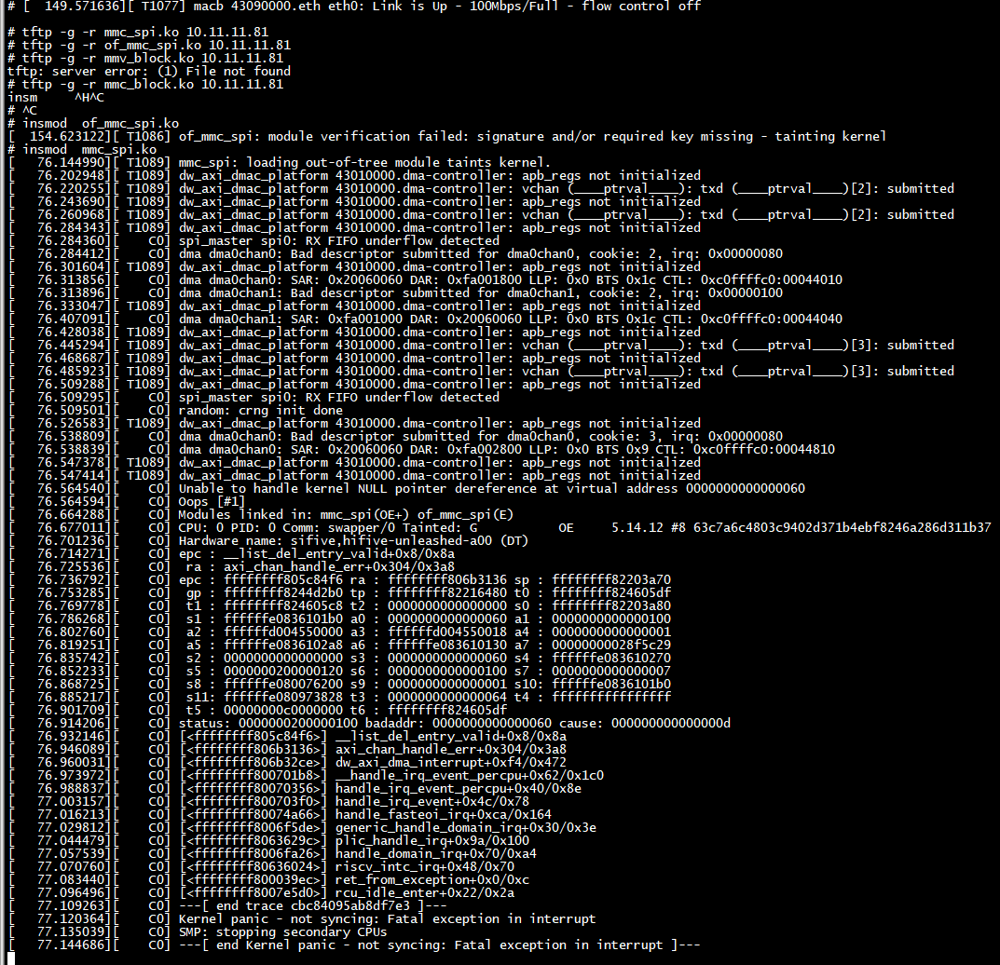
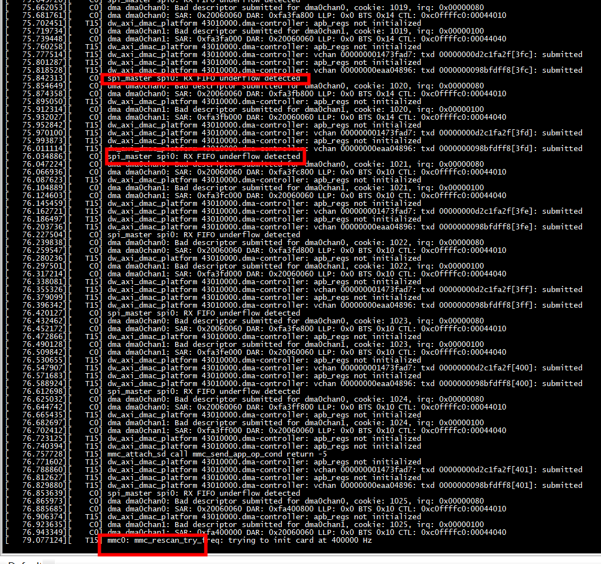
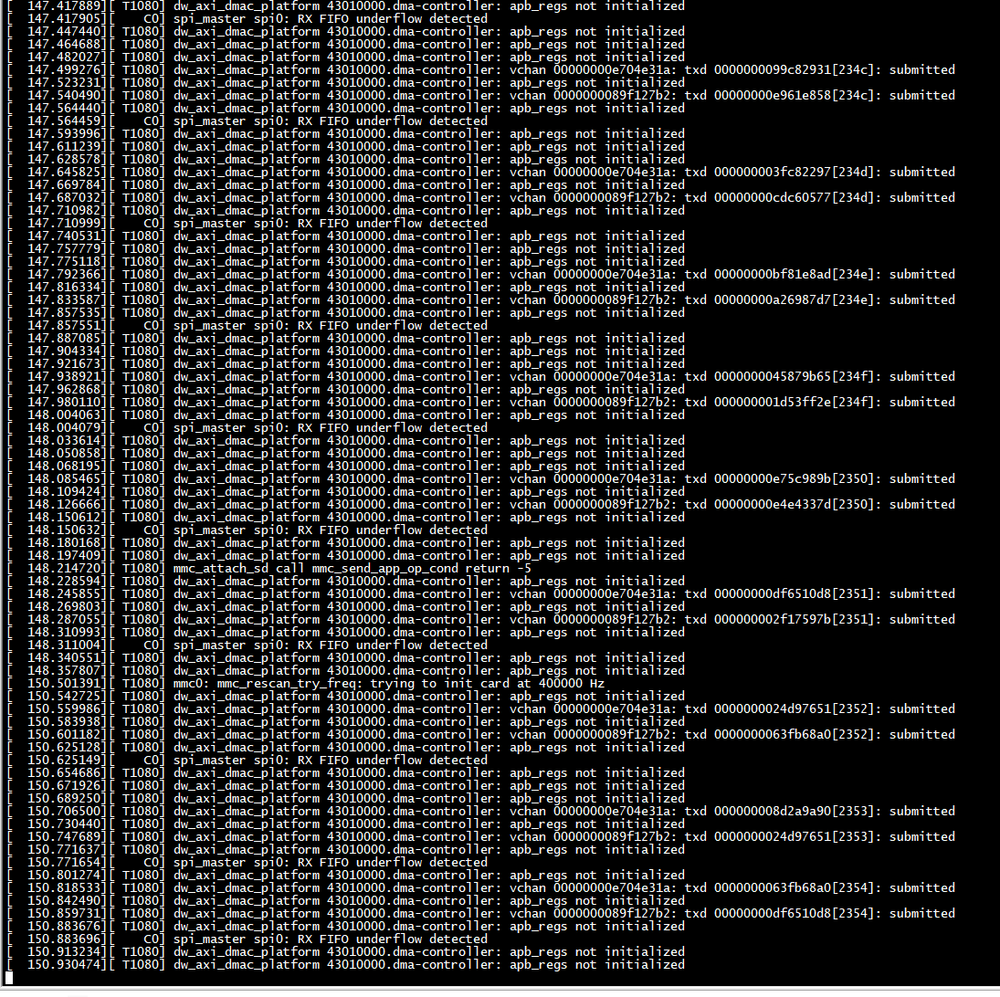
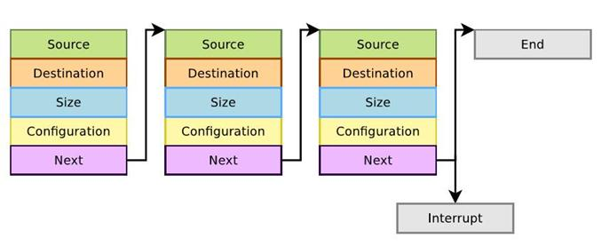
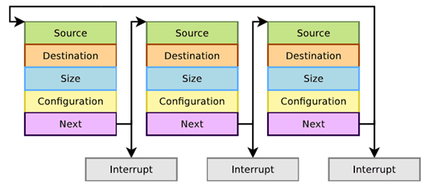
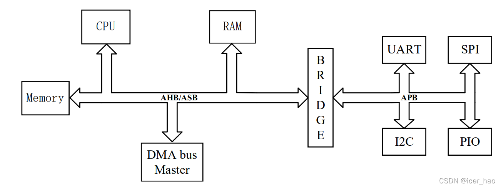

#  insmod  of_mmc_spi.ko 


***1） sd card 通过spi传输，如果不采用dma传输，dma_init失败了***
```
# dmesg | grep 'DMA init failed'
[    4.115557][    T1] dw_spi_mmio 20060000.spi: DMA init failed
# 
```
***2）sd card 通过spi传输，如果采用dma传输，dma报错***
  dmas = <&dmac0 12>,  <&dmac0 13>;
  dma-names = "tx", "rx";



***dma channel配置有问题，编号有问题，超出dma channel范围。***



##   spi_master spi0: RX FIFO underflow detected

```
int dw_spi_check_status(struct dw_spi *dws, bool raw)
{
        u32 irq_status;
        int ret = 0;

        if (raw)
                irq_status = dw_readl(dws, DW_SPI_RISR);
        else
                irq_status = dw_readl(dws, DW_SPI_ISR);

        if (irq_status & DW_SPI_INT_RXOI) {
                dev_err(&dws->master->dev, "RX FIFO overflow detected\n");
                ret = -EIO;
        }

        if (irq_status & DW_SPI_INT_RXUI) {
                dev_err(&dws->master->dev, "RX FIFO underflow detected\n");
                ret = -EIO;
        }

        if (irq_status & DW_SPI_INT_TXOI) {
                dev_err(&dws->master->dev, "TX FIFO overflow detected\n");
                ret = -EIO;
        }

        /* Generically handle the erroneous situation */
        if (ret) {
                dw_spi_reset_chip(dws);
                if (dws->master->cur_msg)
                        dws->master->cur_msg->status = ret;
        }

        return ret;
}
```

#  dw_axi_dma_interrupt
dma 中断函数dw_axi_dma_interrupt

```C
 riscv64-unknown-elf-addr2line  -f -e vmlinux 0xffffffff80c7f73a
__list_del_entry
/root/linux-5.14.12/./include/linux/list.h:132
```

```C
static noinline void axi_chan_handle_err(struct axi_dma_chan *chan, u32 status)
{
        list_del(&vd->node);

}
```

```C
static inline void __list_del_entry(struct list_head *entry)
{
        if (!__list_del_entry_valid(entry))
                return;

        __list_del(entry->prev, entry->next);
}

/**
 * list_del - deletes entry from list.
 * @entry: the element to delete from the list.
 * Note: list_empty() on entry does not return true after this, the entry is
 * in an undefined state.
 */
static inline void list_del(struct list_head *entry)
{
        __list_del_entry(entry);
        entry->next = LIST_POISON1;
        entry->prev = LIST_POISON2;
}
```

 添加调试代码
 
```C

static noinline void axi_chan_handle_err(struct axi_dma_chan *chan, u32 status)
{
        struct virt_dma_desc *vd;
        unsigned long flags;

        spin_lock_irqsave(&chan->vc.lock, flags);

        axi_chan_disable(chan);

        /* The bad descriptor currently is in the head of vc list */
        vd = vchan_next_desc(&chan->vc);
#if 1
        if (!vd)
        {
        //     dev_err(chan2dev(chan),
        //      " vd is NULL of descriptor submitted for %s, irq: 0x%08x\n",
        //      axi_chan_name(chan),  status);
             /* Try to restart the controller */
             axi_chan_start_first_queued(chan);

             spin_unlock_irqrestore(&chan->vc.lock, flags);
                                  return;
        }
        /* Remove the completed descriptor from issued list */
        list_del(&vd->node);

        //axi_chan_list_dump_lli(chan, vd_to_axi_desc(vd));

        vchan_cookie_complete(vd);

        /* Try to restart the controller */
        axi_chan_start_first_queued(chan);

        spin_unlock_irqrestore(&chan->vc.lock, flags);
#else
        /* Remove the completed descriptor from issued list */
        list_del(&vd->node);

        /* WARN about bad descriptor */
        dev_err(chan2dev(chan),
                "Bad descriptor submitted for %s, cookie: %d, irq: 0x%08x\n",
                axi_chan_name(chan), vd->tx.cookie, status);
        axi_chan_list_dump_lli(chan, vd_to_axi_desc(vd));

        vchan_cookie_complete(vd);

        /* Try to restart the controller */
        axi_chan_start_first_queued(chan);

        spin_unlock_irqrestore(&chan->vc.lock, flags);
#endif
}

```
dw-axi-dmac/dw-axi-dmac-platform.c

```
[  129.695220][ T1062] dw_axi_dmac_platform 43010000.dma-controller: apb_regs not initialized
[  129.808113][    C0] dma dma0chan1: SAR: 0xfa3b0000 DAR: 0x20060060 LLP: 0x0 BTS 0x1c CTL: 0xc0ffffc0:00044040
[  129.828730][    C0] dw_axi_dmac_platform 43010000.dma-controller: dma0chan2 2 IRQ status: 0x00000000
[  129.847714][    C0] dw_axi_dmac_platform 43010000.dma-controller: dma0chan3 3 IRQ status: 0x00000000
[  129.866698][    C0] dw_axi_dmac_platform 43010000.dma-controller: dma0chan4 4 IRQ status: 0x00000000
[  129.885682][    C0] dw_axi_dmac_platform 43010000.dma-controller: dma0chan5 5 IRQ status: 0x00000000
[  129.904835][ T1062] dw_axi_dmac_platform 43010000.dma-controller: apb_regs not initialized
[  129.922099][ T1062] dw_axi_dmac_platform 43010000.dma-controller: vchan 00000000eeafe0b4: txd 0000000030a8181a[3b3]: submitted
[  129.945877][ T1062] dw_axi_dmac_platform 43010000.dma-controller: apb_regs not initialized
[  129.963143][ T1062] dw_axi_dmac_platform 43010000.dma-controller: vchan 000000008b0ac4d2: txd 00000000ad2d1851[3b3]: submitted
[  129.986902][ T1062] dw_axi_dmac_platform 43010000.dma-controller: apb_regs not initialized
[  129.986910][    C0] spi_master spi0: RX FIFO underflow detected
[  129.986942][    C0] dw_axi_dmac_platform 43010000.dma-controller: dma0chan0 0 IRQ status: 0x00000080
[  129.986970][    C0] dma dma0chan0: Bad descriptor submitted for dma0chan0, cookie: 947, irq: 0x00000080
[  130.004163][ T1062] dw_axi_dmac_platform 43010000.dma-controller: apb_regs not initialized
[  130.016414][    C0] dma dma0chan0: SAR: 0x20060060 DAR: 0xfa3b1800 LLP: 0x0 BTS 0x9 CTL: 0xc0ffffc0:00044810
[  130.016449][    C0] dw_axi_dmac_platform 43010000.dma-controller: dma0chan1 1 IRQ status: 0x00000100
[  130.016475][    C0] dma dma0chan1: Bad descriptor submitted for dma0chan1, cookie: 947, irq: 0x00000100
[  130.035435][ T1062] dw_axi_dmac_platform 43010000.dma-controller: apb_regs not initialized
[  130.148152][    C0] dma dma0chan1: SAR: 0xfa3b1000 DAR: 0x20060060 LLP: 0x0 BTS 0x4 CTL: 0xc0ffffc0:00044140
[  130.168588][    C0] dw_axi_dmac_platform 43010000.dma-controller: dma0chan2 2 IRQ status: 0x00000000
[  130.187575][    C0] dw_axi_dmac_platform 43010000.dma-controller: dma0chan3 3 IRQ status: 0x00000000
[  130.206563][    C0] dw_axi_dmac_platform 43010000.dma-controller: dma0chan4 4 IRQ status: 0x00000000
[  130.225548][    C0] dw_axi_dmac_platform 43010000.dma-controller: dma0chan5 5 IRQ status: 0x00000000
[  130.244704][ T1062] dw_axi_dmac_platform 43010000.dma-controller: apb_regs not initialized
[  130.261970][ T1062] dw_axi_dmac_platform 43010000.dma-controller: vchan 00000000eeafe0b4: txd 0000000030a8181a[3b4]: submitted
[  130.285749][ T1062] dw_axi_dmac_platform 43010000.dma-controller: apb_regs not initialized
[  130.302998][ T1062] dw_axi_dmac_platform 43010000.dma-controller: vchan 000000008b0ac4d2: txd 00000000548fe2b8[3b4]: submitted
[  130.326774][ T1062] dw_axi_dmac_platform 43010000.dma-controller: apb_regs not initialized
[  130.326782][    C0] spi_master spi0: RX FIFO underflow detected
[  130.326815][    C0] dw_axi_dmac_platform 43010000.dma-controller: dma0chan0 0 IRQ status: 0x00000080
[  130.326843][    C0] dma dma0chan0: Bad descriptor submitted for dma0chan0, cookie: 948, irq: 0x00000080
[  130.344037][ T1062] dw_axi_dmac_platform 43010000.dma-controller: apb_regs not initialized
[  130.356289][    C0] dma dma0chan0: SAR: 0x20060060 DAR: 0xfa3b2800 LLP: 0x0 BTS 0x11 CTL: 0xc0ffffc0:00044810
[  130.356325][    C0] dw_axi_dmac_platform 43010000.dma-controller: dma0chan1 1 IRQ status: 0x00000100
[  130.356351][    C0] dma dma0chan1: Bad descriptor submitted for dma0chan1, cookie: 948, irq: 0x00000100
[  130.375310][ T1062] dw_axi_dmac_platform 43010000.dma-controller: apb_regs not initialized
[  130.488210][    C0] dma dma0chan1: SAR: 0xfa3b2000 DAR: 0x20060060 LLP: 0x0 BTS 0x8 CTL: 0xc0ffffc0:00044140
[  130.508647][    C0] dw_axi_dmac_platform 43010000.dma-controller: dma0chan2 2 IRQ status: 0x00000000
[  130.527634][    C0] dw_axi_dmac_platform 43010000.dma-controller: dma0chan3 3 IRQ status: 0x00000000
[  130.546621][    C0] dw_axi_dmac_platform 43010000.dma-controller: dma0chan4 4 IRQ status: 0x00000000
[  130.565606][    C0] dw_axi_dmac_platform 43010000.dma-controller: dma0chan5 5 IRQ status: 0x00000000
```
##   dw_axi_dmac_platform 43010000.dma-controller: vchan 00000000e704e31a: txd 00000000e75c989b[c6f]: submitted

```C
dma_cookie_t vchan_tx_submit(struct dma_async_tx_descriptor *tx)
{
        struct virt_dma_chan *vc = to_virt_chan(tx->chan);
        struct virt_dma_desc *vd = to_virt_desc(tx);
        unsigned long flags;
        dma_cookie_t cookie;

        spin_lock_irqsave(&vc->lock, flags);
        cookie = dma_cookie_assign(tx);

        list_move_tail(&vd->node, &vc->desc_submitted);
        spin_unlock_irqrestore(&vc->lock, flags);

        dev_dbg(vc->chan.device->dev, "vchan %p: txd %p[%x]: submitted\n",
                vc, vd, cookie);

        return cookie;
}
```



## apb_regs not initialized

include/linux/dmaengine.h  dmaengine_prep_slave_sg

```C
   dw_spi_dma_submit_tx -->
   dmaengine_prep_slave_sg -->
   chan->device->device_prep_slave_sg(chan, sgl, sg_len,dir, flags, NULL) -->
   dw_axi_dma_set_hw_channel -->
   dev_err(chip->dev, "apb_regs not initialized\n")
```
dw->dma.device_prep_slave_sg = dw_axi_dma_chan_prep_slave_sg

### dmaengine_prep_xxx获取传输描述符
通过device_prep_slave_sg() 或者device_prep_dma_cyclic() 或者 device_prep_dma_memcpy() 获取desc，再将回调函数指针穿给desc->callback。
device_prep_dma_memcpy()，明显是DMA内存到内存的拷贝

有些DMA支持分散集合模式，即内存中数据并非连续，这中情况可以调用通过device_prep_slave_sg函数进行传输，描述符是一个单向列表，描述了每块数据的位置和大小还有其他配置。DMA自行解析描述符的内容进行数据传输并寻找下一个链表节点。
  
如果是循环连接，则传输被叫做循环传输，需要用到device_prep_dma_cyclic()函数进行传输，例如linux下的串口驱动，它的传输buffer是一个环形缓冲区，它用DMA传输时就采用了循环传输方式。  


# linux dma

1)通过dmaengine_prep_slave_single准备好一些DMA描述符，并填充其完成回调为xxx_dma_fini_callback  
2)之后通过dmaengine_submit 把这个描述符插入队列  
3)通过dma_async_issue_pending（）发起这次DMA动作  
4) 调用wait_for_completion等dma完成  
5)DMA完成后，xxx_dma_fini_callback函数会被dmaengine驱动自动调用，执行 complete。  
 ```
  static void xxx_dma_fini_callback(void *data)
  {
         struct completion *dma_complete = data;
 
         complete(dma_complete);
  }
 
  issue_xxx_dma(...)
  {
      rx_desc = dmaengine_prep_slave_single(xxx->rx_chan,
              xxx->dst_start, t->len, DMA_DEV_TO_MEM,
              DMA_PREP_INTERRUPT | DMA_CTRL_ACK);
      rx_desc->callback = xxx_dma_fini_callback;
      rx_desc->callback_param = &xxx->rx_done;
 
      dmaengine_submit(rx_desc);
      dma_async_issue_pending(xxx->rx_chan);
      wait_for_completion
 }
 ```

# apb

APB协议全称：先进外围总线(Advanced Peripheral Bus) ，属于AMBA总线协议的一种。特点：低速总线，低功耗，接口简单，每个数据的传输均需要两个时钟周期，带宽利用率较低。在APB总线中，只有唯一一个Master，即APB Bridge, 其他的外围设备如I2C，SPI，UART均为Slave。   

基于AMBA总线的SOC系统结构如下图所示。这种SOC结构是在高速总线协议和低速总线协议的互连支持下，将工作在不同频率的各个系统模块进行整合，最终协同处理器完成运算工作。其中高速总线往往采用 AHB 或者 ASB协议，而低速总线一般使用 APB 协议，两种总线之间使用转接桥(bridge)模块完成协议转换。



# refrences

dts 参考linux/arch/riscv/boot/dts/starfive/jh7100.dtsi    
[DMA实践3：dmaengine的实验](https://lkmao.blog.csdn.net/article/details/127678694?spm=1001.2101.3001.6650.1&utm_medium=distribute.pc_relevant.none-task-blog-2%7Edefault%7ECTRLIST%7ERate-1-127678694-blog-119638771.235%5Ev28%5Epc_relevant_default_base1&depth_1-utm_source=distribute.pc_relevant.none-task-blog-2%7Edefault%7ECTRLIST%7ERate-1-127678694-blog-119638771.235%5Ev28%5Epc_relevant_default_base1&utm_relevant_index=2)     
[Linux DMA 内存拷贝与memcpy 速率比较](https://blog.csdn.net/yizhiniu_xuyw/article/details/117448662)  
[dma代码阅读：树莓派dma controller驱动代码分析](https://zhuanlan.zhihu.com/p/409606039)  
[一款DMA性能优化记录：异步传输和指定实时信号做async IO](https://www.cnblogs.com/arnoldlu/p/10219704.html)


 
 