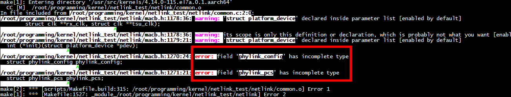
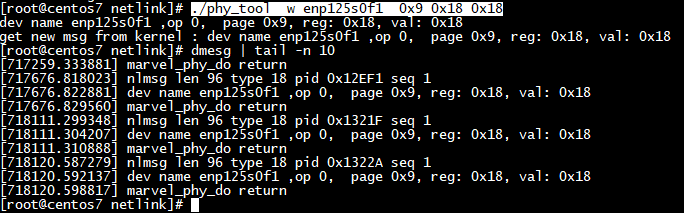
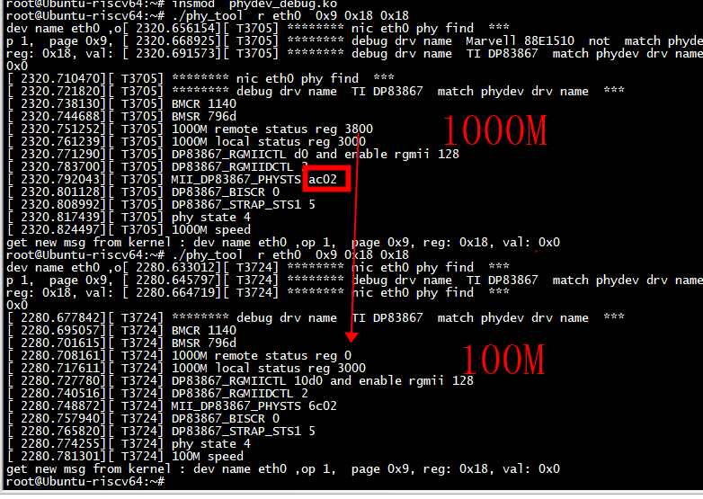

# macb->mii_bus

编译时，采用低版本如果注释macb->mii_bus之前的变量，而运行时采用高版本的macb驱动会导致coredump



```
struct macb {
        void __iomem            *regs;
        bool                    native_io;

        /* hardware IO accessors */
        u32     (*macb_reg_readl)(struct macb *bp, int offset);
        void    (*macb_reg_writel)(struct macb *bp, int offset, u32 value);

        size_t                  rx_buffer_size;

        unsigned int            rx_ring_size;
        unsigned int            tx_ring_size;

        unsigned int            num_queues;
        unsigned int            queue_mask;
        struct macb_queue       queues[MACB_MAX_QUEUES];

        spinlock_t              lock;
        struct platform_device  *pdev;
        struct clk              *pclk;
        struct clk              *hclk;
        struct clk              *tx_clk;
        struct clk              *rx_clk;
        struct clk              *tsu_clk;
        struct net_device       *dev;
        union {
                struct macb_stats       macb;
                struct gem_stats        gem;
        }                       hw_stats;

        struct macb_or_gem_ops  macbgem_ops;

        struct mii_bus          *mii_bus;
        struct phylink          *phylink;
        struct phylink_config   phylink_config;
        struct phylink_pcs      phylink_pcs;
```

# run

```C
enum PHYDEV_OP
{
             WRITE_OP=0,READ_OP=1,RESET_OP=3,SET_GMAC_OP=4
};
```

```
./phy_tool  r eth0  0x9 0x18 0x18
./phy_tool  w enp125s0f1  0x9 0x18 0x18
 reset
./phy_tool  3 eth0  0x9 0x18 0x18

```






## 1000M 正常工作

```
BMCR 1140 
BMSR 796d 
1000M remote status reg 7800 
1000M local status reg 3000 
DP83867_RGMIICTL 10d0 and enable rgmii 128 
DP83867_RGMIIDCTL 2 
MII_DP83867_PHYSTS ac02 
DP83867_BISCR 0 
DP83867_STRAP_STS1 5 
phy state 4 
1000M speed 
```

