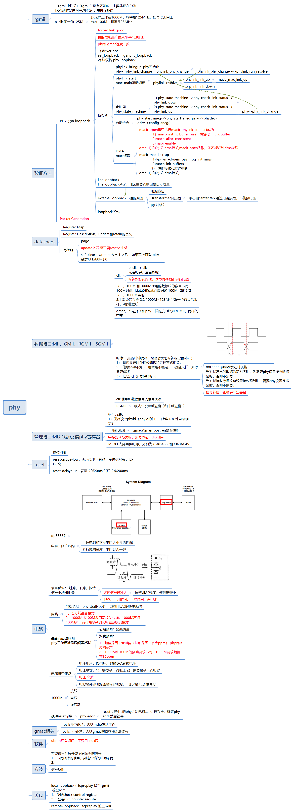

# phy 调试



# inner loopback


# external loopback


## test


# Packet generarion
报文在MAC芯片的内部PHY进行环回，再从本端口转发出去。


## test


# insmod  phydev_debug2.ko 


# debug DP83867

```
[root@riscv]:~$:echo '0x1,0x12,0x6,0x1' > eth1
[ 5614.065399][  T836] read 1, reg add 12 ,page 6, reg value 1
[ 5614.071279][  T836] ******** debug drv name  TI DP83867  match phydev drv name  *** 
[ 5614.079447][  T836] BMCR 1140 
[ 5614.082725][  T836] BMSR 7949 
[ 5614.086599][  T836] DP83867_RGMIICTL d0 
[ 5614.091603][  T836] DP83867_RGMIIDCTL 0 
[ 5614.095848][  T836] MII_DP83867_PHYSTS 1002 
[ 5614.100599][  T836] DP83867_BISCR 0 
[ 5614.104334][  T836] phy state 5 
[root@riscv]:~$:echo '0x0,0x032,0x6,0xd1' > eth1
[ 5637.625390][  T836] read 0, reg add 32 ,page 6, reg value d1
[ 5637.631355][  T836] ******** debug drv name  TI DP83867  match phydev drv name  *** 
[root@riscv]:~$:echo '0x0,0x086,0x6,0x02' > eth1
[ 5645.273789][  T836] read 0, reg add 86 ,page 6, reg value 2
[ 5645.279665][  T836] ******** debug drv name  TI DP83867  match phydev drv name  *** 
[root@riscv]:~$:echo '0x1,0x12,0x6,0x1' > eth1
[ 5653.585509][  T836] read 1, reg add 12 ,page 6, reg value 1
[ 5653.591386][  T836] ******** debug drv name  TI DP83867  match phydev drv name  *** 
[ 5653.599560][  T836] BMCR 1140 
[ 5653.602984][  T836] BMSR 7949 
[ 5653.606527][  T836] DP83867_RGMIICTL d1 
[ 5653.611356][  T836] DP83867_RGMIIDCTL 2 
[ 5653.615610][  T836] MII_DP83867_PHYSTS 1002 
[ 5653.620300][  T836] DP83867_BISCR 0 
[ 5653.624053][  T836] phy state 5 
[root@riscv]:~$:
```