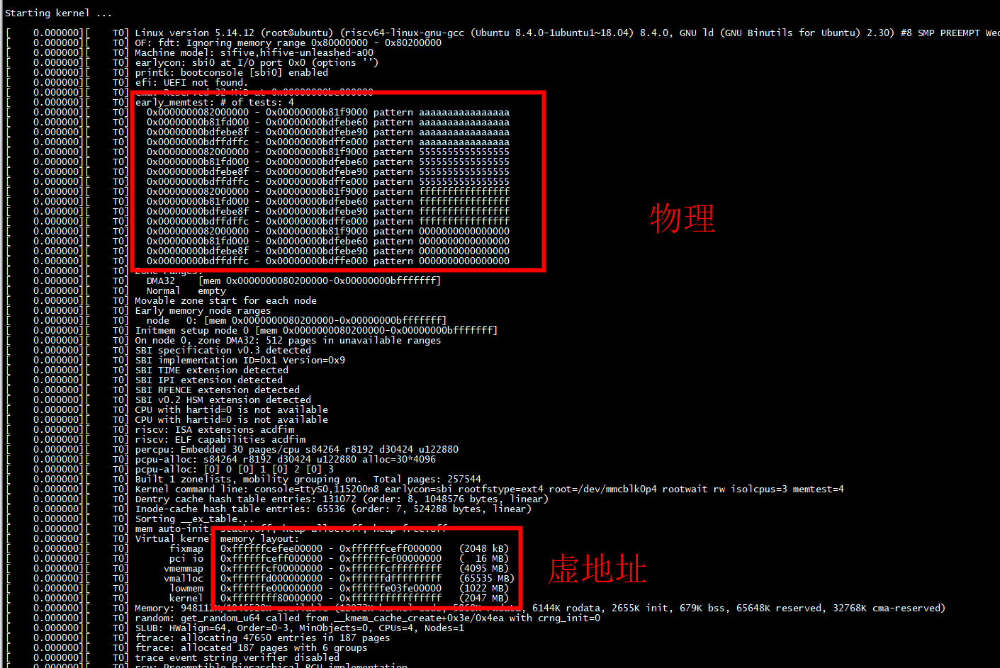
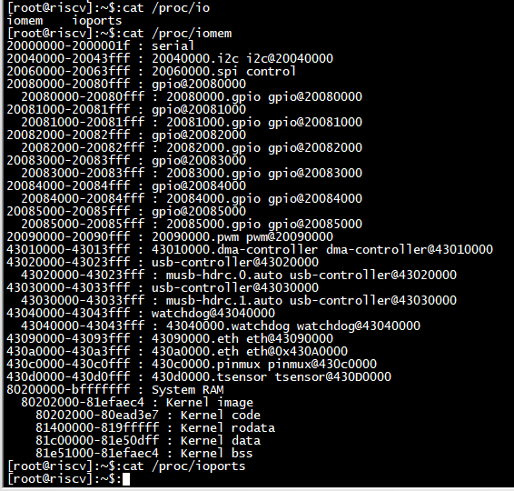
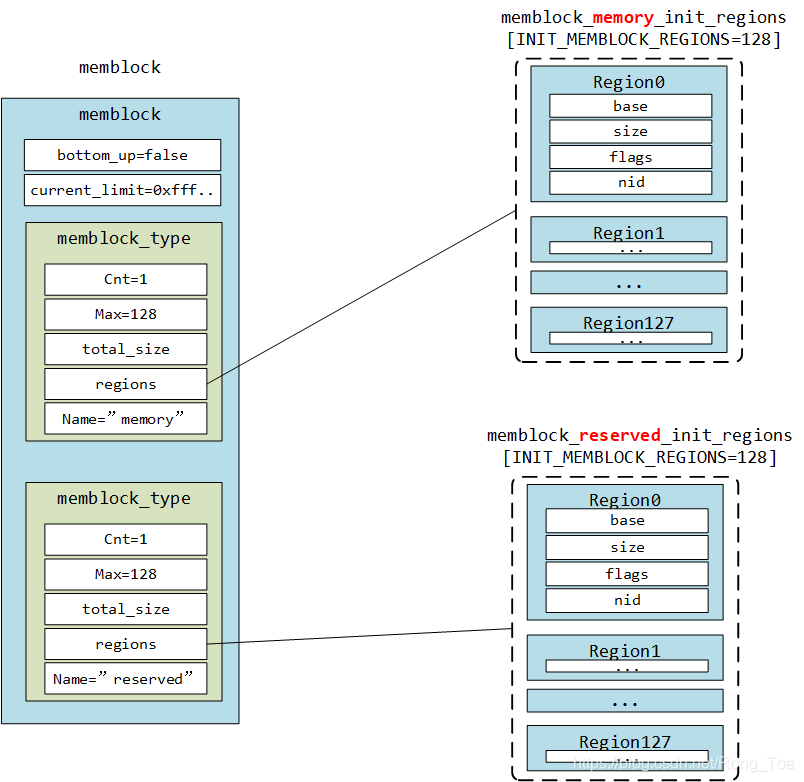
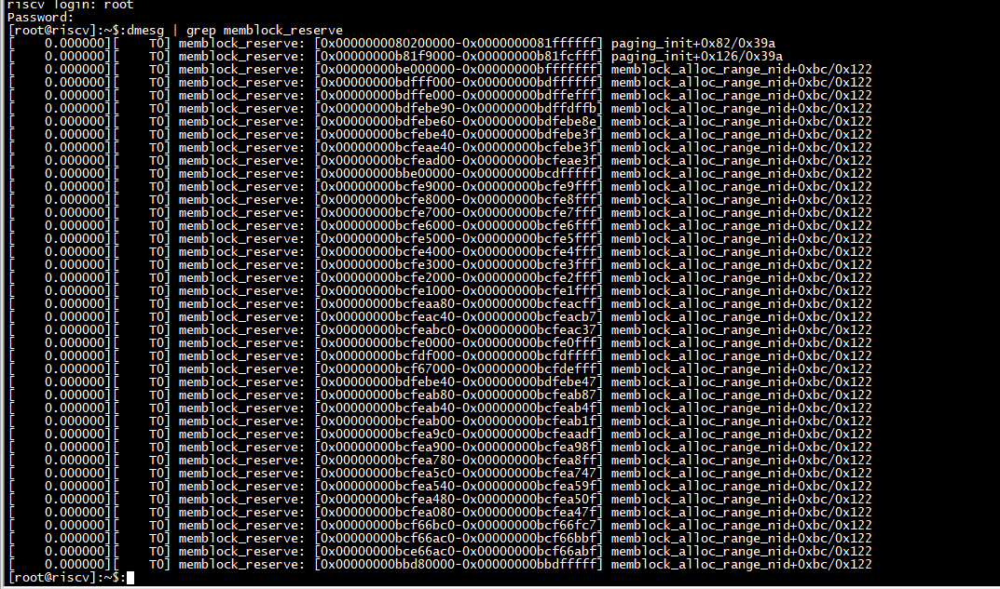

# memtest

内核配置  

```
grep CONFIG_MEMTEST .config
CONFIG_MEMTEST=y
```

设备树   

```
	memory@80000000 {
		device_type = "memory";
		reg = <0x0 0x80000000 0x0 0x40000000>;
	};
```

命令行  

```
 bootargs = "console=ttyS0,115200n8 earlycon=sbi rootfstype=ext4 root=/dev/mmcblk0p4 rootwait rw isolcpus=3 memtest=4";
```

代码  

```
setup_arch->misc_mem_init -->early_memtest
```

```


static unsigned int memtest_pattern __initdata;

static int __init parse_memtest(char *arg)
{
        int ret = 0;

        if (arg)
                ret = kstrtouint(arg, 0, &memtest_pattern);
        else
                memtest_pattern = ARRAY_SIZE(patterns);

        return ret;
}

early_param("memtest", parse_memtest);

void __init early_memtest(phys_addr_t start, phys_addr_t end)
{
        unsigned int i;
        unsigned int idx = 0;

        if (!memtest_pattern)
                return;

        pr_info("early_memtest: # of tests: %u\n", memtest_pattern);
        for (i = memtest_pattern-1; i < UINT_MAX; --i) {
                idx = i % ARRAY_SIZE(patterns);
                do_one_pass(patterns[idx], start, end);
        }
}
   
```






```
80200000-bfffffff : System RAM
  80202000-81efaec4 : Kernel image
    80202000-80ead3e7 : Kernel code
    81400000-819fffff : Kernel rodata
    81c00000-81e50dff : Kernel data
    81e51000-81efaec4 : Kernel bss
```

```
[    0.000000][    T0] early_memtest: # of tests: 4
[    0.000000][    T0]   0x0000000082000000 - 0x00000000b81f9000 pattern aaaaaaaaaaaaaaaa
[    0.000000][    T0]   0x00000000b81fd000 - 0x00000000bdfebe60 pattern aaaaaaaaaaaaaaaa
[    0.000000][    T0]   0x00000000bdfebe8f - 0x00000000bdfebe90 pattern aaaaaaaaaaaaaaaa
[    0.000000][    T0]   0x00000000bdffdffc - 0x00000000bdffe000 pattern aaaaaaaaaaaaaaaa
```

```
[    0.000000][    T0] mem auto-init: stack:off, heap alloc:off, heap free:off
[    0.000000][    T0] Virtual kernel memory layout:
[    0.000000][    T0]       fixmap : 0xffffffcefee00000 - 0xffffffceff000000   (2048 kB)
[    0.000000][    T0]       pci io : 0xffffffceff000000 - 0xffffffcf00000000   (  16 MB)
[    0.000000][    T0]      vmemmap : 0xffffffcf00000000 - 0xffffffcfffffffff   (4095 MB)
[    0.000000][    T0]      vmalloc : 0xffffffd000000000 - 0xffffffdfffffffff   (65535 MB)
[    0.000000][    T0]       lowmem : 0xffffffe000000000 - 0xffffffe03fe00000   (1022 MB)
[    0.000000][    T0]       kernel : 0xffffffff80000000 - 0xffffffffffffffff   (2047 MB)
```

## 物理地址转换为虚拟地址

***__va(start_phys_aligned)****,因为调用create_pgd_mapping建立线性映射

```
static void __init memtest(u64 pattern, phys_addr_t start_phys, phys_addr_t size)
{
        u64 *p, *start, *end;
        phys_addr_t start_bad, last_bad;
        phys_addr_t start_phys_aligned;
        const size_t incr = sizeof(pattern);

        start_phys_aligned = ALIGN(start_phys, incr);
        start = __va(start_phys_aligned);
        end = start + (size - (start_phys_aligned - start_phys)) / incr;
        start_bad = 0;
        last_bad = 0;

        for (p = start; p < end; p++)
                *p = pattern;

        for (p = start; p < end; p++, start_phys_aligned += incr) {
                if (*p == pattern)
                        continue;
                if (start_phys_aligned == last_bad + incr) {
                        last_bad += incr;
                        continue;
                }
                if (start_bad)
                        reserve_bad_mem(pattern, start_bad, last_bad + incr);
                start_bad = last_bad = start_phys_aligned;
        }
        if (start_bad)
                reserve_bad_mem(pattern, start_bad, last_bad + incr);
}
```

# min_low_pfn、max_low_pfn
zone的初始化会确定每个zone的范围（物理内存的地址范围），会计算出min_low_pfn、max_low_pfn和max_pfn这3个值。其中，min_low_pfn是内存块的开始地址的页帧号, max_low_pfn表示normal区域的结束页帧号，max_pfn是内存块的结束地址的页帧号。 

# memblock
memblock是在early boot阶段使用的memory allocator。  

memblock会从fdt获取整个物理内存的layout，并初始化内存及占用状态，管理early boot阶段的物理内存的分配和使用。  

memblock最主要的功能是对外提供了 memblock_alloc 接口，供early boot阶段的模块申请动态内存使用。  

memblock的生命周期从setup_arch开始，到mm_init结束。内存管理权会从memblock移交给buddysystem，这时如果继续使用 memblock_alloc 申请内存，会从buddy system分配，同时报出WARNING。  

memblock除了提供出内存分配接口外，还提供了内存块遍历，及debugfs的dump接口。  

   

early_memtest		// Test all free mem area  
memblock_dump_all	// Dump memblock layout to console  
memblock_free_all	// Release all free pages to buddy system  

 
## struct memblock

```
 bootargs = "console=ttyS0,115200n8 earlycon=sbi rootfstype=ext4 root=/dev/mmcblk0p4 rootwait rw isolcpus=3 memtest=4 memblock=debug";
```




总的来说，memblock 中记录的内存包含两部分：一是空闲的内存，二是被分配的内存。
memblock.memory 成员中保存了内核管理的所有物理内存信息，这部分信息通过扫描设备树获得。
memblock.reserved 中保存了已经分配出去的信息，比如内核 image、dtb、页表等占用的空间，这些 persistant 内存自然是不能释放到     buddy 子系统中的。memblock 对于移交物理内存的策略是：
对于已经分配出去的被保存在 memblock.reserved 中的内存，设置保留标志，这部分内存页面暂时不释放给 buddy 子系统，但是也并不绝对，比如对于内核镜像的后半部分，比如 .init/.exit/.data.percpu 这些段而言，在内核初始化完成之后会被释放到 buddy 子系统中。比如在内核initcall完成之后，***调用free_initmem()释放相关内存***。，***只有 memblock 期间分配的 persistant 内存才不会被释放。***

实现上，memblock内部主要有两个memory(type)数组，管理内存的分配：  

memory 系统中的全部物理内存   
reserved 被占用的物理内存（allocated or reserved）

struct memblock全局对象。  

struct memblock_type   

memblock中主要包括两个type：memory，reserved（如上所述）。  

每个type下包含一个regions串联起来的数组，每个region就是一个内存区域块。  

struct memblock_region   

一个内存block(region)，保存了这个region的start（PA）、size、flags。  

##  memblock_debug 

1) Enable memblock debug print   

cmdline传入”memblock=debug”，会在log中打印将所有memblock操作   

2) Enable bootmem test   

cmdline传入“memtest”，会在启动时遍历所有memblock free area，做读写测试  

3) Dump memblock layout from sysfs  

/sys/kernel/debug/memblock/memory	// Dump all memory regions  
/sys/kernel/debug/memblock/reserved	// Dump all reserved regions  

```
[    0.000000][    T0] memblock_reserve: [0x0000000080200000-0x0000000081ffffff] paging_init+0x82/0x39a
[    0.000000][    T0] memblock_reserve: [0x00000000b81f9000-0x00000000b81fcfff] paging_init+0x126/0x39a
[    0.000000][    T0] memblock_reserve: [0x00000000be000000-0x00000000bfffffff] memblock_alloc_range_nid+0xbc/0x122
[    0.000000][    T0] cma: Reserved 32 MiB at 0x00000000be000000
[    0.000000][    T0] memblock_phys_alloc_range: 4096 bytes align=0x1000 from=0x0000000000000000 max_addr=0x0000000000000000 alloc_pmd_fixmap+0x18/0x20
[    0.000000][    T0] memblock_reserve: [0x00000000bdfff000-0x00000000bdffffff] memblock_alloc_range_nid+0xbc/0x122
[    0.000000][    T0] memblock_phys_alloc_range: 4096 bytes align=0x1000 from=0x0000000000000000 max_addr=0x0000000000000000 alloc_pmd_fixmap+0x18/0x20
[    0.000000][    T0] memblock_reserve: [0x00000000bdffe000-0x00000000bdffefff] memblock_alloc_range_nid+0xbc/0x122
[    0.000000][    T0] memblock_alloc_try_nid: 74092 bytes align=0x8 nid=-1 from=0x0000000000000000 max_addr=0x0000000000000000 early_init_dt_alloc_memory_arch+0x2e/0x58
[    0.000000][    T0] memblock_reserve: [0x00000000bdfebe90-0x00000000bdffdffb] memblock_alloc_range_nid+0xbc/0x122
[    0.000000][    T0] memblock_alloc_try_nid: 47 bytes align=0x8 nid=-1 from=0x0000000000000000 max_addr=0x0000000000000000 early_init_dt_alloc_memory_arch+0x2e/0x58
[    0.000000][    T0] memblock_reserve: [0x00000000bdfebe60-0x00000000bdfebe8e] memblock_alloc_range_nid+0xbc/0x122
[    0.000000][    T0] early_memtest: # of tests: 4
[    0.000000][    T0]   0x0000000082000000 - 0x00000000b81f9000 pattern aaaaaaaaaaaaaaaa
[    0.000000][    T0]   0x00000000b81fd000 - 0x00000000bdfebe60 pattern aaaaaaaaaaaaaaaa
[    0.000000][    T0]   0x00000000bdfebe8f - 0x00000000bdfebe90 pattern aaaaaaaaaaaaaaaa
[    0.000000][    T0]   0x00000000bdffdffc - 0x00000000bdffe000 pattern aaaaaaaaaaaaaaaa
[    0.000000][    T0]   0x0000000082000000 - 0x00000000b81f9000 pattern 5555555555555555
[    0.000000][    T0]   0x00000000b81fd000 - 0x00000000bdfebe60 pattern 5555555555555555
[    0.000000][    T0]   0x00000000bdfebe8f - 0x00000000bdfebe90 pattern 5555555555555555
[    0.000000][    T0]   0x00000000bdffdffc - 0x00000000bdffe000 pattern 5555555555555555
[    0.000000][    T0]   0x0000000082000000 - 0x00000000b81f9000 pattern ffffffffffffffff
[    0.000000][    T0]   0x00000000b81fd000 - 0x00000000bdfebe60 pattern ffffffffffffffff
[    0.000000][    T0]   0x00000000bdfebe8f - 0x00000000bdfebe90 pattern ffffffffffffffff
[    0.000000][    T0]   0x00000000bdffdffc - 0x00000000bdffe000 pattern ffffffffffffffff
[    0.000000][    T0]   0x0000000082000000 - 0x00000000b81f9000 pattern 0000000000000000
[    0.000000][    T0]   0x00000000b81fd000 - 0x00000000bdfebe60 pattern 0000000000000000
[    0.000000][    T0]   0x00000000bdfebe8f - 0x00000000bdfebe90 pattern 0000000000000000
[    0.000000][    T0]   0x00000000bdffdffc - 0x00000000bdffe000 pattern 0000000000000000
[    0.000000][    T0] memblock_alloc_try_nid: 16777216 bytes align=0x40 nid=-1 from=0x0000000000000000 max_addr=0x0000000000000000 sparse_init+0xaa/0x2b4
[    0.000000][    T0] memblock_reserve: [0x00000000bcfebe40-0x00000000bdfebe3f] memblock_alloc_range_nid+0xbc/0x122
[    0.000000][    T0] memblock_alloc_try_nid: 4096 bytes align=0x40 nid=0 from=0x0000000000000000 max_addr=0x0000000000000000 sparse_index_alloc+0x56/0x7e
[    0.000000][    T0] memblock_reserve: [0x00000000bcfeae40-0x00000000bcfebe3f] memblock_alloc_range_nid+0xbc/0x122
[    0.000000][    T0] memblock_alloc_try_nid: 320 bytes align=0x40 nid=0 from=0x0000000000000000 max_addr=0x0000000000000000 sparse_init_nid+0x5c/0x210
[    0.000000][    T0] memblock_reserve: [0x00000000bcfead00-0x00000000bcfeae3f] memblock_alloc_range_nid+0xbc/0x122
[    0.000000][    T0] memblock_alloc_exact_nid_raw: 16777216 bytes align=0x200000 nid=0 from=0x0000000080200000 max_addr=0x0000000000000000 sparse_init_nid+0xac/0x210
[    0.000000][    T0] memblock_reserve: [0x00000000bbe00000-0x00000000bcdfffff] memblock_alloc_range_nid+0xbc/0x122
[    0.000000][    T0] memblock_alloc_try_nid_raw: 4096 bytes align=0x1000 nid=0 from=0x0000000080200000 max_addr=0x0000000000000000 __earlyonly_bootmem_alloc+0x2c/0x34
[    0.000000][    T0] memblock_reserve: [0x00000000bcfe9000-0x00000000bcfe9fff] memblock_alloc_range_nid+0xbc/0x122
[    0.000000][    T0] memblock_alloc_try_nid_raw: 4096 bytes align=0x1000 nid=0 from=0x0000000080200000 max_addr=0x0000000000000000 __earlyonly_bootmem_alloc+0x2c/0x34
[    0.000000][    T0] memblock_reserve: [0x00000000bcfe8000-0x00000000bcfe8fff] memblock_alloc_range_nid+0xbc/0x122
[    0.000000][    T0] memblock_alloc_try_nid_raw: 4096 bytes align=0x1000 nid=0 from=0x0000000080200000 max_addr=0x0000000000000000 __earlyonly_bootmem_alloc+0x2c/0x34
[    0.000000][    T0] memblock_reserve: [0x00000000bcfe7000-0x00000000bcfe7fff] memblock_alloc_range_nid+0xbc/0x122
[    0.000000][    T0] memblock_alloc_try_nid_raw: 4096 bytes align=0x1000 nid=0 from=0x0000000080200000 max_addr=0x0000000000000000 __earlyonly_bootmem_alloc+0x2c/0x34
[    0.000000][    T0] memblock_reserve: [0x00000000bcfe6000-0x00000000bcfe6fff] memblock_alloc_range_nid+0xbc/0x122
[    0.000000][    T0] memblock_alloc_try_nid_raw: 4096 bytes align=0x1000 nid=0 from=0x0000000080200000 max_addr=0x0000000000000000 __earlyonly_bootmem_alloc+0x2c/0x34
[    0.000000][    T0] memblock_reserve: [0x00000000bcfe5000-0x00000000bcfe5fff] memblock_alloc_range_nid+0xbc/0x122
[    0.000000][    T0] memblock_alloc_try_nid_raw: 4096 bytes align=0x1000 nid=0 from=0x0000000080200000 max_addr=0x0000000000000000 __earlyonly_bootmem_alloc+0x2c/0x34
[    0.000000][    T0] memblock_reserve: [0x00000000bcfe4000-0x00000000bcfe4fff] memblock_alloc_range_nid+0xbc/0x122
[    0.000000][    T0] memblock_alloc_try_nid_raw: 4096 bytes align=0x1000 nid=0 from=0x0000000080200000 max_addr=0x0000000000000000 __earlyonly_bootmem_alloc+0x2c/0x34
[    0.000000][    T0] memblock_reserve: [0x00000000bcfe3000-0x00000000bcfe3fff] memblock_alloc_range_nid+0xbc/0x122
[    0.000000][    T0] memblock_alloc_try_nid_raw: 4096 bytes align=0x1000 nid=0 from=0x0000000080200000 max_addr=0x0000000000000000 __earlyonly_bootmem_alloc+0x2c/0x34
[    0.000000][    T0] memblock_reserve: [0x00000000bcfe2000-0x00000000bcfe2fff] memblock_alloc_range_nid+0xbc/0x122
[    0.000000][    T0] memblock_alloc_try_nid_raw: 4096 bytes align=0x1000 nid=0 from=0x0000000080200000 max_addr=0x0000000000000000 __earlyonly_bootmem_alloc+0x2c/0x34
[    0.000000][    T0] memblock_reserve: [0x00000000bcfe1000-0x00000000bcfe1fff] memblock_alloc_range_nid+0xbc/0x122
[    0.000000][    T0] Zone ranges:
[    0.000000][    T0]   DMA32    [mem 0x0000000080200000-0x00000000bfffffff]
[    0.000000][    T0]   Normal   empty
[    0.000000][    T0] Movable zone start for each node
[    0.000000][    T0] Early memory node ranges
[    0.000000][    T0]   node   0: [mem 0x0000000080200000-0x00000000bfffffff]
[    0.000000][    T0] Initmem setup node 0 [mem 0x0000000080200000-0x00000000bfffffff]
[    0.000000][    T0] On node 0, zone DMA32: 512 pages in unavailable ranges
[    0.000000][    T0] MEMBLOCK configuration:
[    0.000000][    T0]  memory size = 0x000000003fe00000 reserved size = 0x0000000005e222db
[    0.000000][    T0]  memory.cnt  = 0x1
[    0.000000][    T0]  memory[0x0]     [0x0000000080200000-0x00000000bfffffff], 0x000000003fe00000 bytes flags: 0x0
[    0.000000][    T0]  reserved.cnt  = 0x8
[    0.000000][    T0]  reserved[0x0]   [0x0000000080200000-0x0000000081ffffff], 0x0000000001e00000 bytes flags: 0x0
[    0.000000][    T0]  reserved[0x1]   [0x00000000b81f9000-0x00000000b81fcfff], 0x0000000000004000 bytes flags: 0x0
[    0.000000][    T0]  reserved[0x2]   [0x00000000bbe00000-0x00000000bcdfffff], 0x0000000001000000 bytes flags: 0x0
[    0.000000][    T0]  reserved[0x3]   [0x00000000bcfe1000-0x00000000bcfe9fff], 0x0000000000009000 bytes flags: 0x0
[    0.000000][    T0]  reserved[0x4]   [0x00000000bcfead00-0x00000000bdfebe3f], 0x0000000001001140 bytes flags: 0x0
[    0.000000][    T0]  reserved[0x5]   [0x00000000bdfebe60-0x00000000bdfebe8e], 0x000000000000002f bytes flags: 0x0
[    0.000000][    T0]  reserved[0x6]   [0x00000000bdfebe90-0x00000000bdffdffb], 0x000000000001216c bytes flags: 0x0
[    0.000000][    T0]  reserved[0x7]   [0x00000000bdffe000-0x00000000bfffffff], 0x0000000002002000 bytes flags: 0x0
[    0.000000][    T0] memblock_alloc_try_nid: 640 bytes align=0x40 nid=-1 from=0x0000000000000000 max_addr=0x0000000000000000 setup_arch+0x150/0x4a4
[    0.000000][    T0] memblock_reserve: [0x00000000bcfeaa80-0x00000000bcfeacff] memblock_alloc_range_nid+0xbc/0x122
[    0.000000][    T0] memblock_free: [0x00000000bcfeaa80-0x00000000bcfeacbf] setup_arch+0x448/0x4a4
[    0.000000][    T0] SBI specification v0.3 detected
[    0.000000][    T0] SBI implementation ID=0x1 Version=0x9
[    0.000000][    T0] SBI TIME extension detected
[    0.000000][    T0] SBI IPI extension detected
[    0.000000][    T0] SBI RFENCE extension detected
[    0.000000][    T0] SBI v0.2 HSM extension detected
[    0.000000][    T0] CPU with hartid=0 is not available
[    0.000000][    T0] CPU with hartid=0 is not available
[    0.000000][    T0] riscv: ISA extensions acdfim
[    0.000000][    T0] riscv: ELF capabilities acdfim
[    0.000000][    T0] memblock_alloc_try_nid: 120 bytes align=0x40 nid=-1 from=0x0000000000000000 max_addr=0x0000000000000000 start_kernel+0x32a/0xa20
[    0.000000][    T0] memblock_reserve: [0x00000000bcfeac40-0x00000000bcfeacb7] memblock_alloc_range_nid+0xbc/0x122
[    0.000000][    T0] memblock_alloc_try_nid: 120 bytes align=0x40 nid=-1 from=0x0000000000000000 max_addr=0x0000000000000000 start_kernel+0x36a/0xa20
[    0.000000][    T0] memblock_reserve: [0x00000000bcfeabc0-0x00000000bcfeac37] memblock_alloc_range_nid+0xbc/0x122
[    0.000000][    T0] memblock_alloc_try_nid: 4096 bytes align=0x1000 nid=-1 from=0x0000000000000000 max_addr=0x0000000000000000 pcpu_embed_first_chunk+0x310/0x664
[    0.000000][    T0] memblock_reserve: [0x00000000bcfe0000-0x00000000bcfe0fff] memblock_alloc_range_nid+0xbc/0x122
[    0.000000][    T0] memblock_alloc_try_nid: 4096 bytes align=0x40 nid=-1 from=0x0000000000000000 max_addr=0x0000000000000000 pcpu_embed_first_chunk+0x468/0x664
[    0.000000][    T0] memblock_reserve: [0x00000000bcfdf000-0x00000000bcfdffff] memblock_alloc_range_nid+0xbc/0x122
[    0.000000][    T0] memblock_alloc_try_nid: 491520 bytes align=0x1000 nid=-1 from=0x0000000080200000 max_addr=0x0000000000000000 pcpu_dfl_fc_alloc+0x3e/0x4a
[    0.000000][    T0] memblock_reserve: [0x00000000bcf67000-0x00000000bcfdefff] memblock_alloc_range_nid+0xbc/0x122
[    0.000000][    T0] memblock_free: [0x00000000bcf85000-0x00000000bcf84fff] pcpu_dfl_fc_free+0x2e/0x38
[    0.000000][    T0] memblock_free: [0x00000000bcfa3000-0x00000000bcfa2fff] pcpu_dfl_fc_free+0x2e/0x38
[    0.000000][    T0] memblock_free: [0x00000000bcfc1000-0x00000000bcfc0fff] pcpu_dfl_fc_free+0x2e/0x38
[    0.000000][    T0] memblock_free: [0x00000000bcfdf000-0x00000000bcfdefff] pcpu_dfl_fc_free+0x2e/0x38
[    0.000000][    T0] percpu: Embedded 30 pages/cpu s84264 r8192 d30424 u122880
[    0.000000][    T0] memblock_alloc_try_nid: 8 bytes align=0x40 nid=-1 from=0x0000000000000000 max_addr=0x0000000000000000 pcpu_setup_first_chunk+0x36a/0x93c
[    0.000000][    T0] memblock_reserve: [0x00000000bdfebe40-0x00000000bdfebe47] memblock_alloc_range_nid+0xbc/0x122
[    0.000000][    T0] memblock_alloc_try_nid: 8 bytes align=0x40 nid=-1 from=0x0000000000000000 max_addr=0x0000000000000000 pcpu_setup_first_chunk+0x3a2/0x93c
[    0.000000][    T0] memblock_reserve: [0x00000000bcfeab80-0x00000000bcfeab87] memblock_alloc_range_nid+0xbc/0x122
[    0.000000][    T0] memblock_alloc_try_nid: 16 bytes align=0x40 nid=-1 from=0x0000000000000000 max_addr=0x0000000000000000 pcpu_setup_first_chunk+0x3de/0x93c
[    0.000000][    T0] memblock_reserve: [0x00000000bcfeab40-0x00000000bcfeab4f] memblock_alloc_range_nid+0xbc/0x122
[    0.000000][    T0] memblock_alloc_try_nid: 32 bytes align=0x40 nid=-1 from=0x0000000000000000 max_addr=0x0000000000000000 pcpu_setup_first_chunk+0x41a/0x93c
[    0.000000][    T0] memblock_reserve: [0x00000000bcfeab00-0x00000000bcfeab1f] memblock_alloc_range_nid+0xbc/0x122
[    0.000000][    T0] pcpu-alloc: s84264 r8192 d30424 u122880 alloc=30*4096
[    0.000000][    T0] pcpu-alloc: [0] 0 [0] 1 [0] 2 [0] 3 
[    0.000000][    T0] memblock_alloc_try_nid: 288 bytes align=0x40 nid=-1 from=0x0000000000000000 max_addr=0x0000000000000000 pcpu_setup_first_chunk+0x7d4/0x93c
[    0.000000][    T0] memblock_reserve: [0x00000000bcfea9c0-0x00000000bcfeaadf] memblock_alloc_range_nid+0xbc/0x122
[    0.000000][    T0] memblock_alloc_try_nid: 144 bytes align=0x40 nid=-1 from=0x0000000000000000 max_addr=0x0000000000000000 pcpu_alloc_first_chunk+0x80/0x256
[    0.000000][    T0] memblock_reserve: [0x00000000bcfea900-0x00000000bcfea98f] memblock_alloc_range_nid+0xbc/0x122
[    0.000000][    T0] memblock_alloc_try_nid: 384 bytes align=0x40 nid=-1 from=0x0000000000000000 max_addr=0x0000000000000000 pcpu_alloc_first_chunk+0xb8/0x256
[    0.000000][    T0] memblock_reserve: [0x00000000bcfea780-0x00000000bcfea8ff] memblock_alloc_range_nid+0xbc/0x122
[    0.000000][    T0] memblock_alloc_try_nid: 392 bytes align=0x40 nid=-1 from=0x0000000000000000 max_addr=0x0000000000000000 pcpu_alloc_first_chunk+0xf8/0x256
[    0.000000][    T0] memblock_reserve: [0x00000000bcfea5c0-0x00000000bcfea747] memblock_alloc_range_nid+0xbc/0x122
[    0.000000][    T0] memblock_alloc_try_nid: 96 bytes align=0x40 nid=-1 from=0x0000000000000000 max_addr=0x0000000000000000 pcpu_alloc_first_chunk+0x116/0x256
[    0.000000][    T0] memblock_reserve: [0x00000000bcfea540-0x00000000bcfea59f] memblock_alloc_range_nid+0xbc/0x122
[    0.000000][    T0] memblock_alloc_try_nid: 144 bytes align=0x40 nid=-1 from=0x0000000000000000 max_addr=0x0000000000000000 pcpu_alloc_first_chunk+0x80/0x256
[    0.000000][    T0] memblock_reserve: [0x00000000bcfea480-0x00000000bcfea50f] memblock_alloc_range_nid+0xbc/0x122
[    0.000000][    T0] memblock_alloc_try_nid: 1024 bytes align=0x40 nid=-1 from=0x0000000000000000 max_addr=0x0000000000000000 pcpu_alloc_first_chunk+0xb8/0x256
[    0.000000][    T0] memblock_reserve: [0x00000000bcfea080-0x00000000bcfea47f] memblock_alloc_range_nid+0xbc/0x122
[    0.000000][    T0] memblock_alloc_try_nid: 1032 bytes align=0x40 nid=-1 from=0x0000000000000000 max_addr=0x0000000000000000 pcpu_alloc_first_chunk+0xf8/0x256
[    0.000000][    T0] memblock_reserve: [0x00000000bcf66bc0-0x00000000bcf66fc7] memblock_alloc_range_nid+0xbc/0x122
[    0.000000][    T0] memblock_alloc_try_nid: 256 bytes align=0x40 nid=-1 from=0x0000000000000000 max_addr=0x0000000000000000 pcpu_alloc_first_chunk+0x116/0x256
[    0.000000][    T0] memblock_reserve: [0x00000000bcf66ac0-0x00000000bcf66bbf] memblock_alloc_range_nid+0xbc/0x122
[    0.000000][    T0] memblock_free: [0x00000000bcfe0000-0x00000000bcfe0fff] pcpu_free_alloc_info+0x2e/0x38
[    0.000000][    T0] memblock_free: [0x00000000bcfdf000-0x00000000bcfdffff] pcpu_embed_first_chunk+0x644/0x664
[    0.000000][    T0] Built 1 zonelists, mobility grouping on.  Total pages: 257544
[    0.000000][    T0] Kernel command line: console=ttyS0,115200n8 earlycon=sbi rootfstype=ext4 root=/dev/mmcblk0p4 rootwait rw isolcpus=3 memtest=4 memblock=debug
[    0.000000][    T0] memblock_alloc_try_nid: 1048576 bytes align=0x40 nid=-1 from=0x0000000000000000 max_addr=0x0000000000000000 alloc_large_system_hash+0x17a/0x2a6
[    0.000000][    T0] memblock_reserve: [0x00000000bce66ac0-0x00000000bcf66abf] memblock_alloc_range_nid+0xbc/0x122
[    0.000000][    T0] Dentry cache hash table entries: 131072 (order: 8, 1048576 bytes, linear)
[    0.000000][    T0] memblock_alloc_try_nid: 524288 bytes align=0x40 nid=-1 from=0x0000000000000000 max_addr=0x0000000000000000 alloc_large_system_hash+0x17a/0x2a6
[    0.000000][    T0] memblock_reserve: [0x00000000bbd80000-0x00000000bbdfffff] memblock_alloc_range_nid+0xbc/0x122
[    0.000000][    T0] Inode-cache hash table entries: 65536 (order: 7, 524288 bytes, linear)
[    0.000000][    T0] Sorting __ex_table...
[    0.000000][    T0] mem auto-init: stack:off, heap alloc:off, heap free:off
[    0.000000][    T0] Virtual kernel memory layout:
[    0.000000][    T0]       fixmap : 0xffffffcefee00000 - 0xffffffceff000000   (2048 kB)
[    0.000000][    T0]       pci io : 0xffffffceff000000 - 0xffffffcf00000000   (  16 MB)
[    0.000000][    T0]      vmemmap : 0xffffffcf00000000 - 0xffffffcfffffffff   (4095 MB)
[    0.000000][    T0]      vmalloc : 0xffffffd000000000 - 0xffffffdfffffffff   (65535 MB)
[    0.000000][    T0]       lowmem : 0xffffffe000000000 - 0xffffffe03fe00000   (1022 MB)
[    0.000000][    T0]       kernel : 0xffffffff80000000 - 0xffffffffffffffff   (2047 MB)
```

## memblock reserve区域分配



# references

[Linux内核内存管理（1）：内存块 - memblock](https://blog.csdn.net/Rong_Toa/article/details/115374734)

[Linux内存都去哪了：(1)分析memblock在启动过程中对内存的影响](https://www.cnblogs.com/arnoldlu/p/10526814.html)  

[早期内存分配器：memblock](https://chasinglulu.github.io/2019/05/28/%E6%97%A9%E6%9C%9F%E5%86%85%E5%AD%98%E5%88%86%E9%85%8D%E5%99%A8-memblock/)