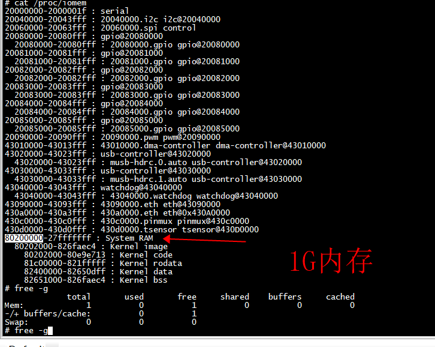
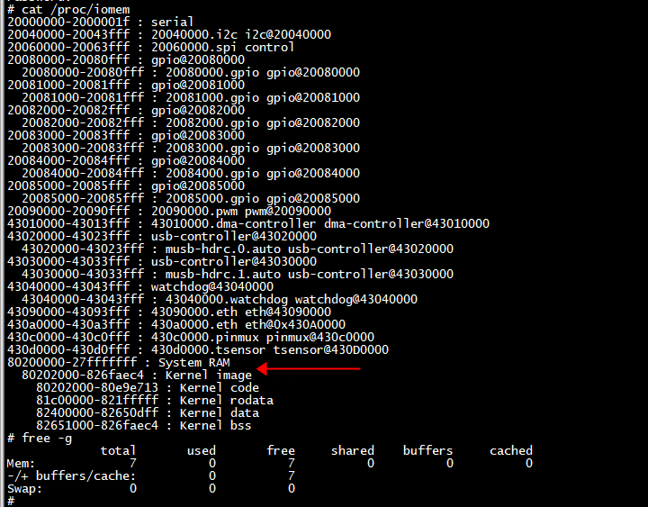
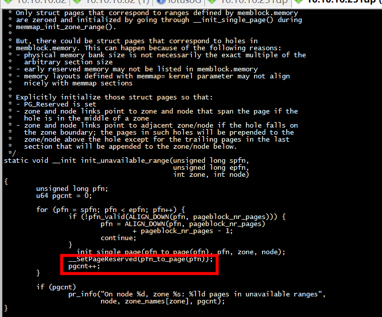
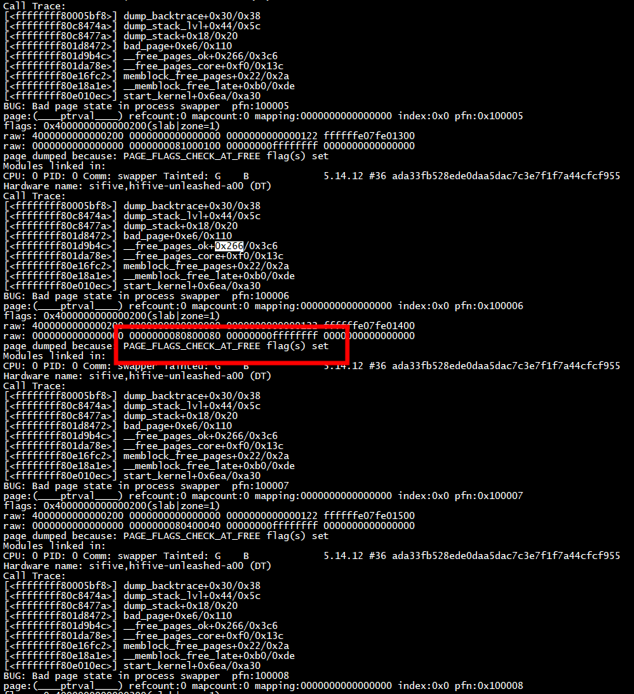

# 扩大内存

设备树   

```

          memory: memory@80000000 {
                device_type = "memory";
                reg = <0x0 0x80000000 0x2 0x00000000>;// 8G
        };
		bootargs = "console=ttyS0,115200n8 earlycon=sbi rootfstype=ext4 root=/dev/mmcblk0p4 rootwait rw isolcpus=3 memtest=1";
```

#   memblock_reserve and  no memblock_free_late

```
[    0.000000][    T0] cma: Reserved 32 MiB at 0x00000000fe000000
[    0.000000][    T0] early_memtest: # of tests: 1
[    0.000000][    T0]   0x0000000082800000 - 0x00000000b81f9000 pattern 0000000000000000
[    0.000000][    T0]   0x00000000b81fd000 - 0x00000000fdfe4e60 pattern 0000000000000000
[    0.000000][    T0]   0x00000000fdfe4e8f - 0x00000000fdfe4e90 pattern 0000000000000000
[    0.000000][    T0]   0x00000000fdff6ffc - 0x00000000fdff7000 pattern 0000000000000000
[    0.000000][    T0] Zone ranges:
[    0.000000][    T0]   DMA32    [mem 0x0000000080200000-0x00000000ffffffff]
[    0.000000][    T0]   Normal   [mem 0x0000000100000000-0x000000027fffffff]
[    0.000000][    T0] Movable zone start for each node
[    0.000000][    T0] Early memory node ranges
[    0.000000][    T0]   node   0: [mem 0x0000000080200000-0x000000027fffffff]
[    0.000000][    T0] Initmem setup node 0 [mem 0x0000000080200000-0x000000027fffffff]
```

```
>>> a=0x00000000fdff7000-0x0000000082800000
>>> a/b
1.9296531677246094
>>> 

```
2G内存,memtest的内存也只有2G

# memblock_reserve

```
static void __init setup_vm_final(void)
{
 
        pr_info("debug  setup_vm_final va %lx and pgdir size %lx \n",  FIXADDR_START, PGDIR_SIZE);
        /*  PGDIR_SIZE*8 */
        create_pgd_mapping(swapper_pg_dir, FIXADDR_START,
                           __pa_symbol(fixmap_pgd_next),
                           PGDIR_SIZE, PAGE_TABLE);
        memblock_reserve(0x100000000, 0x180000000);
  
#endif
```
setup_vm_final 调用 memblock_reserve

```
void __init mem_init(void)
{
#if 0
        memblock_free_late(0x100000000, 0x180000000);
        //memblock_phys_free(0x100000000, 0x180000000);
        //memblock_phys_free(0xc0000000, 0x180000000);
#endif

}
```
setup_vm_final 没有调用memblock_free_late把reserve的内存归还给buddy



```
>>> a=0x27fffffff-0x80200000
>>> b=1<<30
>>> a/b
7.998046874068677
>>> 

```
8G内存

#   memblock_reserve and  memblock_free_late

```
[    0.000000][    T0] cma: Reserved 32 MiB at 0x00000000fe000000
[    0.000000][    T0] debug  setup_vm_final va ffffffcefee00000 and pgdir size 40000000 
[    0.000000][    T0] early_memtest: # of tests: 1
[    0.000000][    T0]   0x0000000082800000 - 0x00000000b81f9000 pattern 0000000000000000
[    0.000000][    T0]   0x00000000b81fd000 - 0x00000000fdfe4e60 pattern 0000000000000000
[    0.000000][    T0]   0x00000000fdfe4e8f - 0x00000000fdfe4e90 pattern 0000000000000000
[    0.000000][    T0]   0x00000000fdff6ffc - 0x00000000fdff7000 pattern 0000000000000000
[    0.000000][    T0] Zone ranges:
[    0.000000][    T0]   DMA32    [mem 0x0000000080200000-0x00000000ffffffff]
[    0.000000][    T0]   Normal   [mem 0x0000000100000000-0x000000027fffffff]
[    0.000000][    T0] Movable zone start for each node
[    0.000000][    T0] Early memory node ranges
[    0.000000][    T0]   node   0: [mem 0x0000000080200000-0x000000027fffffff]
[    0.000000][    T0] Initmem setup node 0 [mem 0x0000000080200000-0x000000027fffffff]
```

```
>>> a=0x00000000fdff7000-0x0000000082800000
>>> a/b
1.9296531677246094
>>> 
```
2G内存，memtest的内存也只有2G




memblock_free_late释放后，有7G内存


##  dma 内存


```
[    0.000000][    T0] Zone ranges:
[    0.000000][    T0]   DMA32    [mem 0x0000000080200000-0x00000000ffffffff]
[    0.000000][    T0]   Normal   [mem 0x0000000100000000-0x000000027fffffff]
[    0.000000][    T0] Movable zone start for each node
[    0.000000][    T0] Early memory node ranges
[    0.000000][    T0]   node   0: [mem 0x0000000080200000-0x000000027fffffff]
[    0.000000][    T0] Initmem setup node 0 [mem 0x0000000080200000-0x000000027fffffff]
[    0.000000][    T0] On node 0, zone DMA32: 512 pages in unavailable ranges
```

 DMA32    [mem 0x0000000080200000-0x00000000ffffffff]  2G内存
```
>>> a=0x00000000ffffffff -0x0000000082800000
>>> a/b
1.9609374990686774
>>> 
```





# memblock_free_late

```
__memblock_free_late --> memblock_free_pages --> __free_pages_core --> __free_pages_ok
                         --> free_pages_prepare   -->  check_free_page
```

```
void __free_pages_core(struct page *page, unsigned int order)
{
        unsigned int nr_pages = 1 << order;
        struct page *p = page;
        unsigned int loop;

        /*
         * When initializing the memmap, __init_single_page() sets the refcount
         * of all pages to 1 ("allocated"/"not free"). We have to set the
         * refcount of all involved pages to 0.
         */
        prefetchw(p);
        for (loop = 0; loop < (nr_pages - 1); loop++, p++) {
                prefetchw(p + 1);
                __ClearPageReserved(p);
                set_page_count(p, 0);
        }
        __ClearPageReserved(p);
        set_page_count(p, 0);

        atomic_long_add(nr_pages, &page_zone(page)->managed_pages);

        /*
         * Bypass PCP and place fresh pages right to the tail, primarily
         * relevant for memory onlining.
         */
        __free_pages_ok(page, order, FPI_TO_TAIL | FPI_SKIP_KASAN_POISON);
}
```



```
page dumped because: PAGE_FLAGS_CHECK_AT_FREE flag(s) set
```

 
