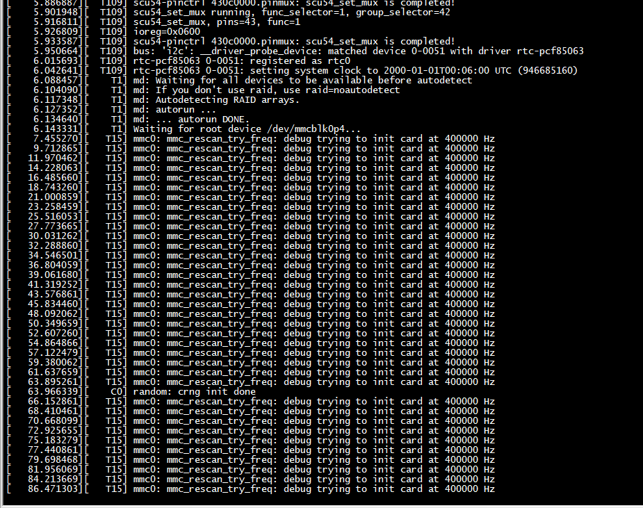
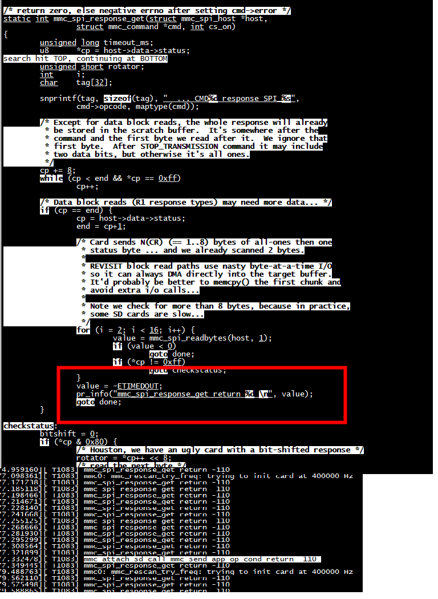
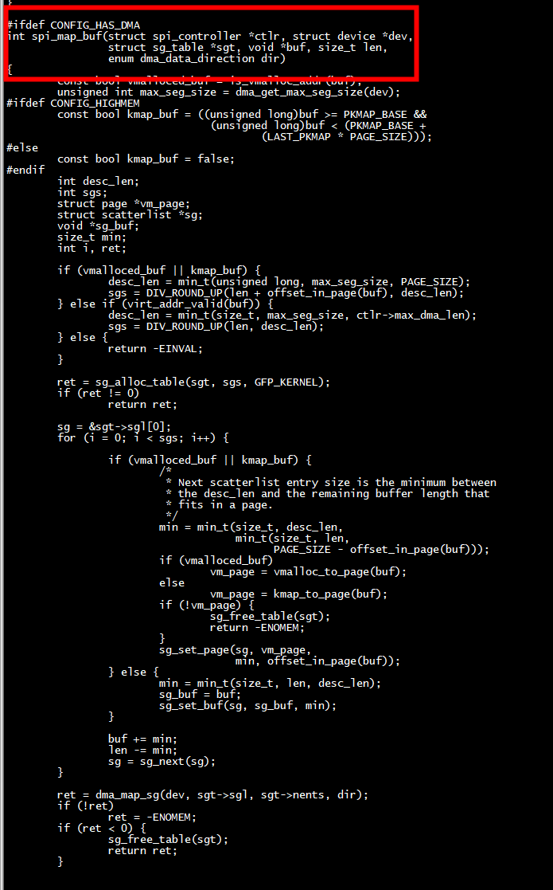
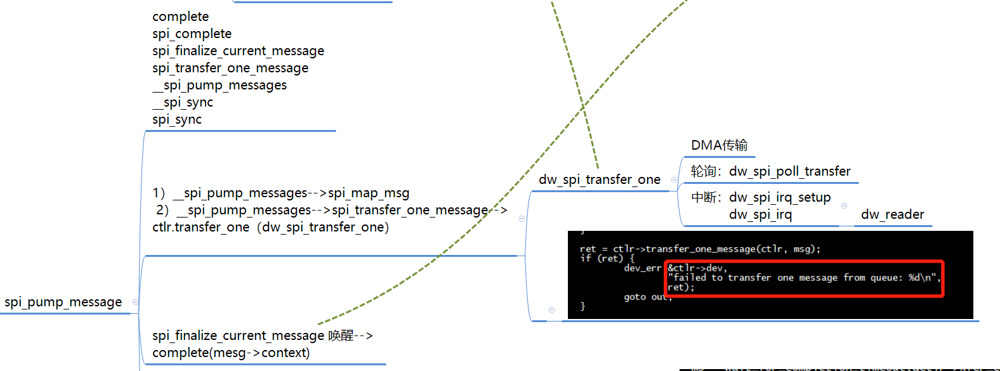
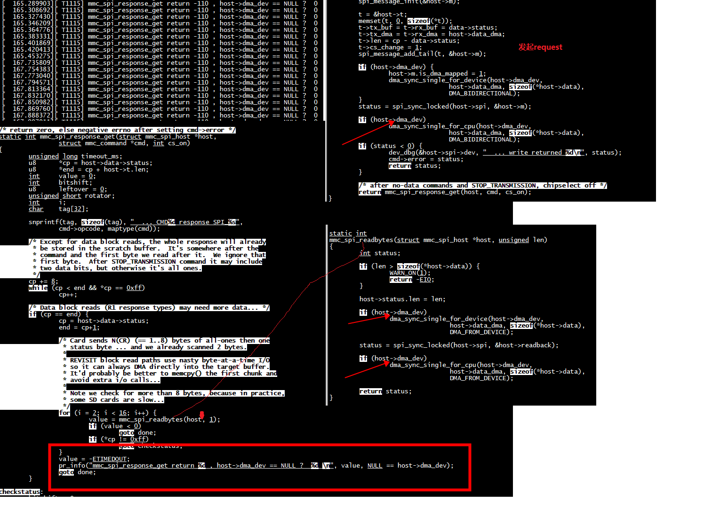
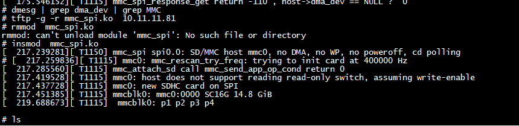

# spi0.0

```
# ls /sys/bus/spi/
devices            drivers_autoprobe  uevent
drivers            drivers_probe
# ls /sys/bus/spi/devices/
spi0.0
# 
```

## insmod  spi_test.ko 
先 insmod  spi_test.ko  后 insmod  mmc_spi.ko 

```
# insmod  spi_test.ko 
[ 1979.794262][ T1320] spi device spi0.0  found 
# insmod  mmc_spi.ko 
```

# mmc_attach_sd call mmc_send_app_op_cond return -110 



根目录挂载失败,跟踪代码原来是 mmc_attach_sd call mmc_send_app_op_cond return -110   
mmc_send_app_op_cond发送SD_APP_OP_COND命令（ACMD41）；      
mmc_send_app_op_cond(host, ocr, NULL) ocr 是指 card 內部的 Operation Condition Register     
***最终定位发现mmc_spi_response_get处理结果，发现超时了***
## [ 1906.308135][ T1272] SPI transfer return: 0, cur msg status -115 

```
pr_err("SPI transfer return: %d, cur msg status %d \n", ret,  dws->master->cur_msg->status);
```


```
 * Before that invocation, the value of message->status is undefined.
 * When the callback is issued, message->status holds either zero (to
 * indicate complete success) or a negative error code.  After that
 * callback returns, the driver which issued the transfer request may
 * deallocate the associated memory; it's no longer in use by any SPI
 * core or controller driver code.
int spi_async(struct spi_device *spi, struct spi_message *message)
```

 message->status的初始值是不确定的，但是成功返回一定是0  
 
  msg->status = -EINPROGRESS赋值
 
 ```
 static int __spi_queued_transfer(struct spi_device *spi,
                                 struct spi_message *msg,
                                 bool need_pump)
{
   
        msg->status = -EINPROGRESS;

}
 ```
 
 
 ### __mmc_start_request -->  mmc_spi_request
 ```
 static int mmc_spi_probe(struct spi_device *spi)
{
        void                    *ones;
        struct mmc_host         *mmc;
        struct mmc_spi_host     *host
		
		mmc->ops = &mmc_spi_ops;
}
 
static void __mmc_start_request(struct mmc_host *host, struct mmc_request *mrq)
{
       host->ops->request(host, mrq); //mc_spi_request
}
 static const struct mmc_host_ops mmc_spi_ops = {
        .request        = mmc_spi_request,
        .set_ios        = mmc_spi_set_ios,
        .get_ro         = mmc_gpio_get_ro,
        .get_cd         = mmc_gpio_get_cd,
}
 ```
 mmc_spi_request ---> mmc_spi_command_send ---> mmc_spi_data_do ---> spi_sync_locked --> __spi_sync   -->__spi_queued_transfer  
 
###  mmc_spi_response_get

mmc_spi_command_send ->  mmc_spi_response_get

 
 

### 分析spi 传输方式


***spi.c有和CONFIG_HAS_DMA配置相关的分支***


 spi-dw-core.c
 
 ***spi_transfer_one_message-> (ctlr->transfer_one,"dw_spi_transfer_one")***
 
 

```
static int dw_spi_transfer_one(struct spi_controller *master,
                               struct spi_device *spi,
                               struct spi_transfer *transfer)
{
        struct dw_spi *dws = spi_controller_get_devdata(master);
        struct dw_spi_cfg cfg = {
                .tmode = DW_SPI_CTRLR0_TMOD_TR,
                .dfs = transfer->bits_per_word,
                .freq = transfer->speed_hz,
        };
        int ret;

        dws->dma_mapped = 0;
        dws->n_bytes = DIV_ROUND_UP(transfer->bits_per_word, BITS_PER_BYTE);
        dws->tx = (void *)transfer->tx_buf;
        dws->tx_len = transfer->len / dws->n_bytes;
        dws->rx = transfer->rx_buf;
        dws->rx_len = dws->tx_len;

        /* Ensure the data above is visible for all CPUs */
        smp_mb();

        dw_spi_enable_chip(dws, 0);

        dw_spi_update_config(dws, spi, &cfg);

        transfer->effective_speed_hz = dws->current_freq;

        /* Check if current transfer is a DMA transaction */
        if (master->can_dma && master->can_dma(master, spi, transfer))
                dws->dma_mapped = master->cur_msg_mapped;

        /* For poll mode just disable all interrupts */
        dw_spi_mask_intr(dws, 0xff);

        if (dws->dma_mapped) {
                ret = dws->dma_ops->dma_setup(dws, transfer);
                if (ret)
                        return ret;
        }

        dw_spi_enable_chip(dws, 1);

        if (dws->dma_mapped)
                return dws->dma_ops->dma_transfer(dws, transfer);
        else if (dws->irq == IRQ_NOTCONNECTED)
                return dw_spi_poll_transfer(dws, transfer);

        dw_spi_irq_setup(dws);

        return 1;
}
```

发现dws spi controller 没有走poll 方式和dma方式，调用了dw_spi_irq_setup走了中断方式

snps,dw-apb-ssi 的probe函数没有设置controller->can_dma, ***__spi_map_msg依赖于controller->can_dma***

而且dw_spi_add_host因为dma_init失败,没有设置master->can_dma

```C
int dw_spi_add_host(struct device *dev, struct dw_spi *dws)
{
 if (dws->dma_ops && dws->dma_ops->dma_init) {
                ret = dws->dma_ops->dma_init(dev, dws);
                if (ret) {
                        dev_warn(dev, "DMA init failed\n");
                } else {
                        master->can_dma = dws->dma_ops->can_dma;
                        master->flags |= SPI_CONTROLLER_MUST_TX;
                }
        }
}

static int dw_spi_dma_init_generic(struct device *dev, struct dw_spi *dws)
{
	dws->rxchan = dma_request_slave_channel(dev, "rx");
	if (!dws->rxchan)
		return -ENODEV;

	dws->txchan = dma_request_slave_channel(dev, "tx");
	if (!dws->txchan) {
		dma_release_channel(dws->rxchan);
		dws->rxchan = NULL;
		return -ENODEV;
	}

	dws->master->dma_rx = dws->rxchan;
	dws->master->dma_tx = dws->txchan;

	init_completion(&dws->dma_completion);

	dw_spi_dma_maxburst_init(dws);

	dw_spi_dma_sg_burst_init(dws);

	return 0;
}

```

***但是dma_init失败了***
```
# dmesg | grep 'DMA init failed'
[    4.115557][    T1] dw_spi_mmio 20060000.spi: DMA init failed
# 
```

```C
static int dw_spi_pssi_init(struct platform_device *pdev,
                            struct dw_spi_mmio *dwsmmio)
{
        dw_spi_dma_setup_generic(&dwsmmio->dws);

        return 0;
}
static const struct of_device_id dw_spi_mmio_of_match[] = {
        { .compatible = "snps,dw-apb-ssi", .data = dw_spi_pssi_init}  
```

spi-rockchip.c 的probe函数设置ctlr->can_dma = rockchip_spi_can_dma;
``` C
    if (ctlr->dma_tx && ctlr->dma_rx) {
                rs->dma_addr_tx = mem->start + ROCKCHIP_SPI_TXDR;
                rs->dma_addr_rx = mem->start + ROCKCHIP_SPI_RXDR;
                ctlr->can_dma = rockchip_spi_can_dma;
        }

```

###  dw_spi_dma_transfer_one

dw_spi_dma_transfer_one直接调用 dw_spi_dma_submit_rx 提交dma请求

```C
static int dw_spi_dma_transfer_one(struct dw_spi *dws,
				   struct spi_transfer *xfer)
{
	struct scatterlist *tx_sg = NULL, *rx_sg = NULL, tx_tmp, rx_tmp;
	unsigned int tx_len = 0, rx_len = 0;
	unsigned int base, len;
	int ret;

	sg_init_table(&tx_tmp, 1);
	sg_init_table(&rx_tmp, 1);

	for (base = 0, len = 0; base < xfer->len; base += len) {
		/* Fetch next Tx DMA data chunk */
		if (!tx_len) {
			tx_sg = !tx_sg ? &xfer->tx_sg.sgl[0] : sg_next(tx_sg);
			sg_dma_address(&tx_tmp) = sg_dma_address(tx_sg);
			tx_len = sg_dma_len(tx_sg);
		}

		/* Fetch next Rx DMA data chunk */
		if (!rx_len) {
			rx_sg = !rx_sg ? &xfer->rx_sg.sgl[0] : sg_next(rx_sg);
			sg_dma_address(&rx_tmp) = sg_dma_address(rx_sg);
			rx_len = sg_dma_len(rx_sg);
		}

		len = min(tx_len, rx_len);

		sg_dma_len(&tx_tmp) = len;
		sg_dma_len(&rx_tmp) = len;

		/* Submit DMA Tx transfer */
		ret = dw_spi_dma_submit_tx(dws, &tx_tmp, 1);
		if (ret)
			break;

		/* Submit DMA Rx transfer */
		ret = dw_spi_dma_submit_rx(dws, &rx_tmp, 1);
		if (ret)
			break;

		/* Rx must be started before Tx due to SPI instinct */
		dma_async_issue_pending(dws->rxchan);

		dma_async_issue_pending(dws->txchan);

		/*
		 * Here we only need to wait for the DMA transfer to be
		 * finished since SPI controller is kept enabled during the
		 * procedure this loop implements and there is no risk to lose
		 * data left in the Tx/Rx FIFOs.
		 */
		ret = dw_spi_dma_wait(dws, len, xfer->effective_speed_hz);
		if (ret)
			break;

		reinit_completion(&dws->dma_completion);

		sg_dma_address(&tx_tmp) += len;
		sg_dma_address(&rx_tmp) += len;
		tx_len -= len;
		rx_len -= len;
	}

	dw_writel(dws, DW_SPI_DMACR, 0);

	return ret;
}

```


##  mmc_spi_command_send 采用了dma




### 取消  CONFIG_HAS_DMA配置

*1）* 取消mmc_spi.c的CONFIG_HAS_DMA配置
mmc_spi.c 

```C
#undef CONFIG_HAS_DMA
```

*2）*没有取消spi.c的CONFIG_HAS_DMA配置



成功


# spi通过dma方式读取sdcard


*1、host->data建立dma映射（host层实现)*
mmc_spi_dma_alloc实现和CONFIG_HAS_DMA配置相关

```C
static int mmc_spi_dma_alloc(struct mmc_spi_host *host)
{
        struct spi_device *spi = host->spi;
        host->data_dma = dma_map_single(dev, host->data, sizeof(*host->data),
                                        DMA_BIDIRECTIONAL);
    
        return 0;
}
      /* preallocate dma buffers */
        host->data = kmalloc(sizeof(*host->data), GFP_KERNEL);
        if (!host->data)
                goto fail_nobuf1;

        status = mmc_spi_dma_alloc(host);
        if (status)
                goto fail_dma;
```
				
*2、 构造struct spi_transfer	（host层实现)*	

```C		
struct spi_transfer {
        /* it's ok if tx_buf == rx_buf (right?)
         * for MicroWire, one buffer must be null
         * buffers must work with dma_*map_single() calls, unless
         *   spi_message.is_dma_mapped reports a pre-existing mapping
         */
        const void      *tx_buf;
        void            *rx_buf;
        unsigned        len;
        dma_addr_t      tx_dma;
        dma_addr_t      rx_dma;
 
}

mmc_spi_command_send(
       struct scratch          *data = host->data;
	   struct spi_transfer     *t;
	    t = &host->t;
        memset(t, 0, sizeof(*t));
        t->tx_buf = t->rx_buf = data->status;
        t->tx_dma = t->rx_dma = host->data_dma;
```
	   
*3、构造dma请求（spi层实现)*  
spi_map_msg-> __spi_map_msg建立xfer->rx_sg和xfer->rx_buf的dma映射  
spi_map_msg实现和CONFIG_HAS_DMA配置相关  

*4、启动dma （spi层实现)*  
struct spi_transfer传输函数：dw_spi_dma_transfer_one  	 

# dma_unmap_page_attrs
 
```C
[ 2007.187812][ T1342] status: 0000000200000120 badaddr: 0000000000000181 cause: 000000000000000d
[ 2007.205759][ T1342] [<ffffffff80087eae>] dma_unmap_page_attrs+0x24/0x110
[ 2007.219723][ T1342] [<ffffffff024fb038>] mmc_spi_dma_free+0x38/0x5c [mmc_spi]
[ 2007.236037][ T1342] [<ffffffff807e3d26>] spi_transfer_one_message+0x372/0x4a6
[ 2007.250910][ T1342] [<ffffffff807e406e>] __spi_pump_messages+0x214/0x628
[ 2007.264858][ T1342] [<ffffffff807e46da>] __spi_sync+0x22a/0x238
[ 2007.277192][ T1342] [<ffffffff807e497a>] spi_sync_locked+0x20/0x28
[ 2007.290071][ T1342] [<ffffffff024fb186>] mmc_spi_readbytes+0x48/0x70 [mmc_spi]
[ 2007.306572][ T1342] [<ffffffff024fbb9e>] mmc_spi_set_ios+0x1fe/0x330 [mmc_spi]
[ 2007.323068][ T1342] [<ffffffff80979d52>] mmc_power_up.part.26+0xec/0x190
[ 2007.337038][ T1342] [<ffffffff8097aa20>] mmc_start_host+0xb0/0xbc
[ 2007.349718][ T1342] [<ffffffff8097bd02>] mmc_add_host+0x62/0x78
[ 2007.362050][ T1342] [<ffffffff024fcc14>] mmc_spi_probe+0x2e6/0x55c [mmc_spi]
[ 2007.378172][ T1342] [<ffffffff807de846>] spi_probe+0x66/0x8a
[ 2007.389976][ T1342] [<ffffffff8076e56c>] really_probe+0xa0/0x356
[ 2007.402492][ T1342] [<ffffffff8076e8e6>] __driver_probe_device+0xc4/0x112
[ 2007.416621][ T1342] [<ffffffff8076e97e>] driver_probe_device+0x4a/0xd6
[ 2007.430222][ T1342] [<ffffffff8076eed2>] __driver_attach+0xa8/0x170
[ 2007.443283][ T1342] [<ffffffff8076c156>] bus_for_each_dev+0x6a/0xa8
[ 2007.456339][ T1342] [<ffffffff8076de3e>] driver_attach+0x2e/0x36
[ 2007.468842][ T1342] [<ffffffff8076d606>] bus_add_driver+0x16e/0x1ec
[ 2007.481900][ T1342] [<ffffffff8076f592>] driver_register+0x52/0xec
[ 2007.494779][ T1342] [<ffffffff807e0042>] __spi_register_driver+0x30/0x38
[ 2007.508726][ T1342] [<ffffffff02523030>] mmc_spi_driver_init+0x30/0x1000 [mmc_spi]
[ 2007.525953][ T1342] [<ffffffff8000284e>] do_one_initcall+0x4c/0x214
[ 2007.539013][ T1342] [<ffffffff800ab778>] do_init_module+0x62/0x242
[ 2007.551891][ T1342] [<ffffffff800adbb6>] load_module+0x20ea/0x25fa
[ 2007.564765][ T1342] [<ffffffff800ae326>] __do_sys_finit_module+0x9c/0xe8
[ 2007.578709][ T1342] [<ffffffff800ae396>] sys_finit_module+0x24/0x2c
[ 2007.591764][ T1342] [<ffffffff800039de>] ret_from_syscall+0x0/0x2
```