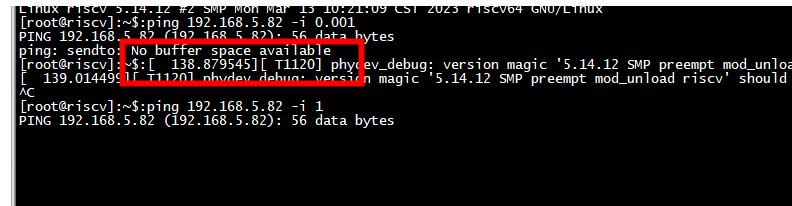
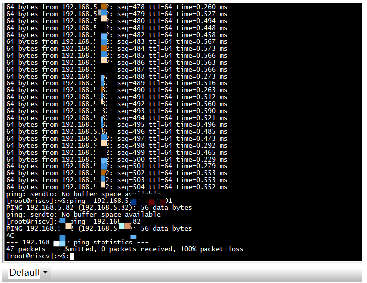
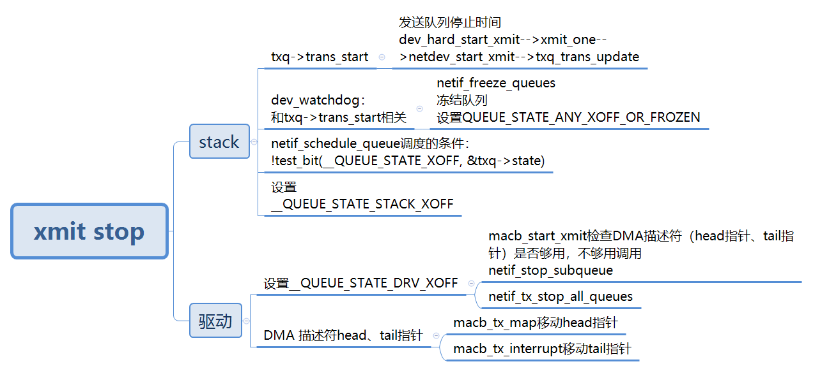
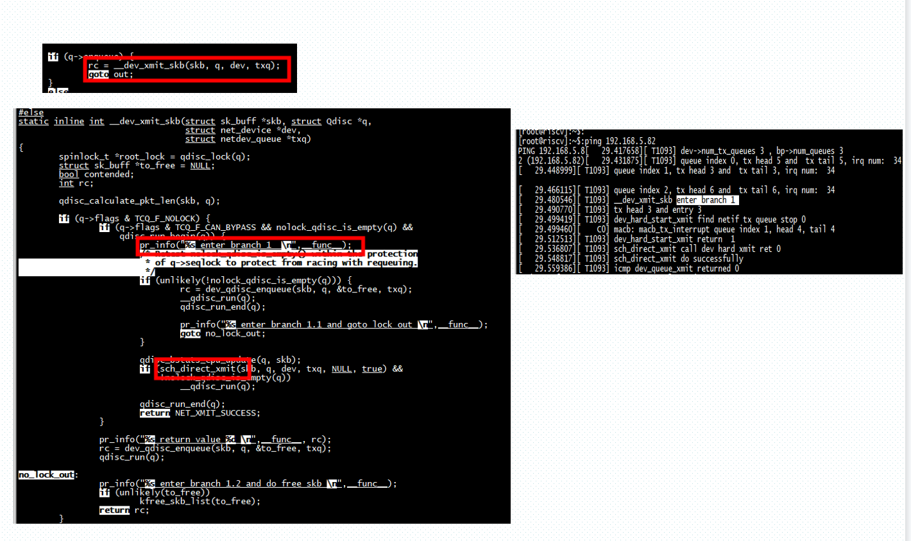
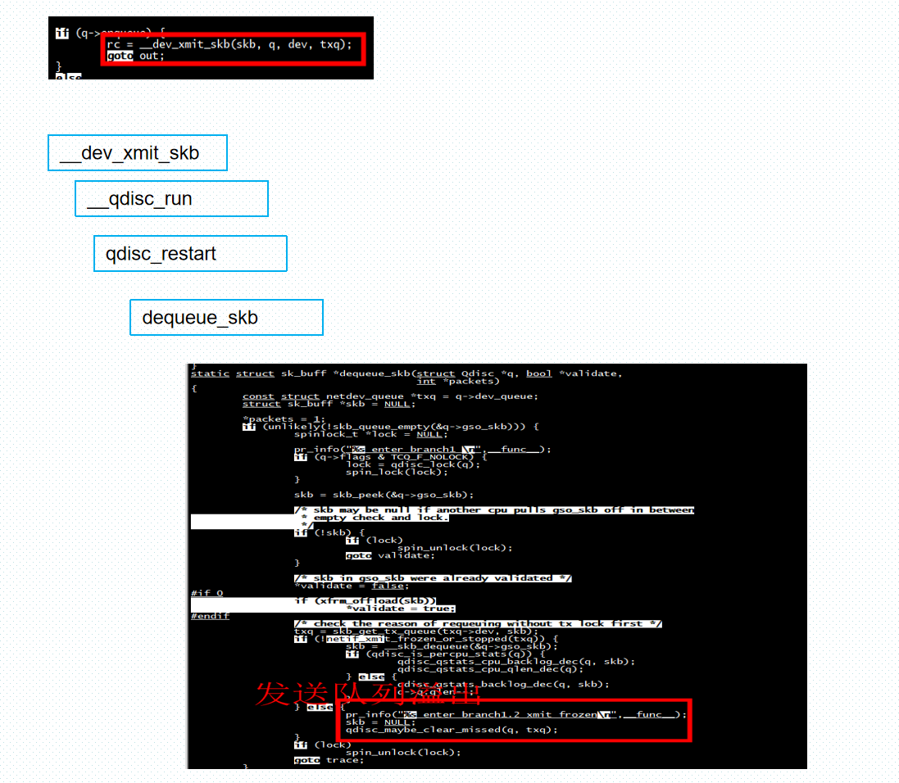

# ping  sendto no buffer space available

 
 
  
  
  # arp
  
  ```
  ip n  add  192.168.5.79 dev enp0s31f6 lladdr  9e:f1:4c:60:43:c9
  ```
  
 # 多对列
 
 ```
 static inline bool netif_is_multiqueue(const struct net_device *dev)
{
        return dev->num_tx_queues > 1;
}
static inline void netdev_for_each_tx_queue(struct net_device *dev,
                                            void (*f)(struct net_device *,
                                                      struct netdev_queue *,
                                                      void *),
                                            void *arg)
{
        unsigned int i;

        for (i = 0; i < dev->num_tx_queues; i++)
                f(dev, &dev->_tx[i], arg);
}

 ```

 num_rx_queues 是接收队列数量，在调用 register_netdev 注册网络设备的时候通过 alloc_netdev_mq函数分配。real_num_rx_queues 是当前活动的队列数量  
 
 
 
# xmit stop

 

## dev_watchdog  执行 netif_freeze_queues

```

static void dev_watchdog(struct timer_list *t)
{
        struct net_device *dev = from_timer(dev, t, watchdog_timer);
        bool release = true;

        spin_lock(&dev->tx_global_lock);
        if (!qdisc_tx_is_noop(dev)) {
                if (netif_device_present(dev) &&
                    netif_running(dev) &&
                    netif_carrier_ok(dev)) {
                        int some_queue_timedout = 0;
                        unsigned int i;
                        unsigned long trans_start;

                        for (i = 0; i < dev->num_tx_queues; i++) {
                                struct netdev_queue *txq;

                                txq = netdev_get_tx_queue(dev, i);
                                trans_start = READ_ONCE(txq->trans_start);
                                if (netif_xmit_stopped(txq) &&
                                    time_after(jiffies, (trans_start +
                                                         dev->watchdog_timeo))) {
                                        some_queue_timedout = 1;
                                        atomic_long_inc(&txq->trans_timeout);
                                        break;
                                }
                        }

                        if (unlikely(some_queue_timedout)) {
                                trace_net_dev_xmit_timeout(dev, i);
                                WARN_ONCE(1, KERN_INFO "NETDEV WATCHDOG: %s (%s): transmit queue %u timed out\n",
                                       dev->name, netdev_drivername(dev), i);
                                netif_freeze_queues(dev);//冻结
                                dev->netdev_ops->ndo_tx_timeout(dev, i);
                                netif_unfreeze_queues(dev); //解冻
                        }
                        if (!mod_timer(&dev->watchdog_timer,
                                       round_jiffies(jiffies +
                                                     dev->watchdog_timeo)))
                                release = false;
                }
        }
        spin_unlock(&dev->tx_global_lock);

        if (release)
                dev_put_track(dev, &dev->watchdog_dev_tracker);
}
```

```
eth1: <BROADCAST,MULTICAST,UP,LOWER_UP> mtu 1500 qdisc mq state UP group default qlen 1000
    link/ether 8e:d1:7f:74:c6:20 brd ff:ff:ff:ff:ff:ff
    inet 192.168.5.79/24 scope global eth1
       valid_lft forever preferred_lft forever
    inet6 fe80::8cd1:7fff:fe74:c620/64 scope link 
       valid_lft forever preferred_lft forever
```

```
static void netif_freeze_queues(struct net_device *dev)
{
        unsigned int i;
        int cpu;

        cpu = smp_processor_id();
        for (i = 0; i < dev->num_tx_queues; i++) {
                struct netdev_queue *txq = netdev_get_tx_queue(dev, i);

                /* We are the only thread of execution doing a
                 * freeze, but we have to grab the _xmit_lock in
                 * order to synchronize with threads which are in
                 * the ->hard_start_xmit() handler and already
                 * checked the frozen bit.
                 */
                __netif_tx_lock(txq, cpu);
                set_bit(__QUEUE_STATE_FROZEN, &txq->state);
                __netif_tx_unlock(txq);
        }
}

void netif_tx_lock(struct net_device *dev)
{
        spin_lock(&dev->tx_global_lock);
        netif_freeze_queues(dev);
}
```

```
static inline bool
netif_xmit_frozen_or_stopped(const struct netdev_queue *dev_queue)
{
        return dev_queue->state & QUEUE_STATE_ANY_XOFF_OR_FROZEN;
}
#define QUEUE_STATE_ANY_XOFF_OR_FROZEN (QUEUE_STATE_ANY_XOFF | \
                                        QUEUE_STATE_FROZEN)
```

```
static __always_inline void netif_tx_stop_queue(struct netdev_queue *dev_queue)
{
        set_bit(__QUEUE_STATE_DRV_XOFF, &dev_queue->state);
}


static inline bool netif_tx_queue_stopped(const struct netdev_queue *dev_queue)
{
        return test_bit(__QUEUE_STATE_DRV_XOFF, &dev_queue->state);
}
```

#   macb dma 描述符head、tail指针

##  macb_start_xmit

```
     if (CIRC_SPACE(queue->tx_head, queue->tx_tail, bp->tx_ring_size) < 1)
        {
              
                netif_stop_subqueue(dev, queue_index);
        }
```

# 正常流程

 
 
# 异常流程

发送队列被frozen

 
  
 # references
 
 [LINUX内核网络数据包发送（四）——LINUX NETDEVICE 子系统](http://kerneltravel.net/blog/2020/network_ljr14/)