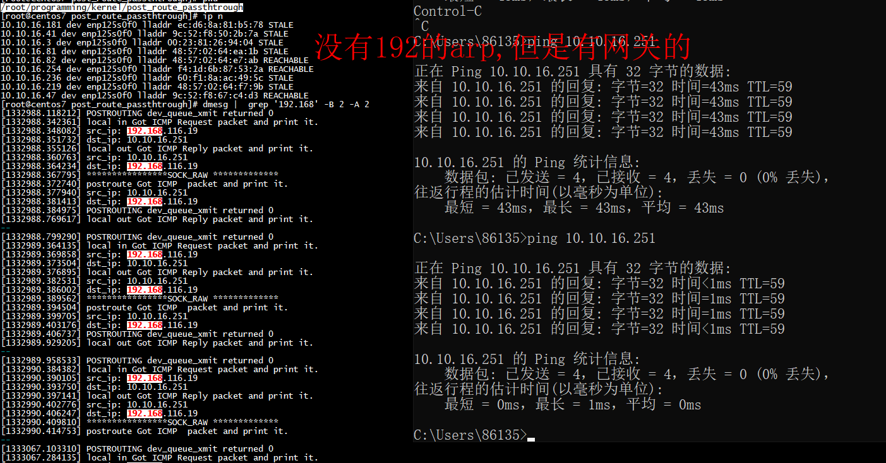

# run

***条件***
1） 有目的ip的路由  
2）  有目的ip的gw mac 或者从外部ping(从内部ping 同一个网段的ip可能没有arp项，程序没有实现动态arp解析)

```
 if (!IS_ERR(neigh)) {
                       ret = dev_hard_header(skb, dev, ntohs(skb->protocol),  neigh->ha, NULL, skb->len); 
                }
```




#  ip_finish_output2

```
static int ip_finish_output2(struct net *net, struct sock *sk, struct sk_buff *skb)
{
	struct dst_entry *dst = skb_dst(skb);
	struct rtable *rt = (struct rtable *)dst;
	struct net_device *dev = dst->dev;
	unsigned int hh_len = LL_RESERVED_SPACE(dev);
	struct neighbour *neigh;
	u32 nexthop;
......
	nexthop = (__force u32) rt_nexthop(rt, ip_hdr(skb)->daddr);
	neigh = __ipv4_neigh_lookup_noref(dev, nexthop);
	if (unlikely(!neigh))
		neigh = __neigh_create(&arp_tbl, &nexthop, dev, false);
	if (!IS_ERR(neigh)) {
		int res;
		sock_confirm_neigh(skb, neigh);
		res = neigh_output(neigh, skb);
		return res;
	}
......
}
```

***1）*** 通过ipv4_neigh_lookup_noref从arp表中找到目的ip或者网关gw的mac    
***2）*** 通过ipv4_neigh_lookup_noref从arp表中找**不**到目的ip或者网关gw的mac，则调用__neigh_create发起arp请求  
***2）*** neigh_output

```
      neigh_output -->
	      n->output(n, skb)--neigh_resolve_output -->
		  __neigh_event_send -->
```
## neigh_resolve_output
```
/* 非CONNECTED状态的慢速发送 */
int neigh_resolve_output(struct neighbour *neigh, struct sk_buff *skb)
{
    int rc = 0;

    /* 检测邻居项状态有效性 */
    if (!neigh_event_send(neigh, skb)) {
        int err;
        struct net_device *dev = neigh->dev;
        unsigned int seq;

        /* 有二层头缓存函数，则缓存之 */
        if (dev->header_ops->cache && !neigh->hh.hh_len)
            neigh_hh_init(neigh);

        /* 填充二层头 */
        do {
            __skb_pull(skb, skb_network_offset(skb));
            seq = read_seqbegin(&neigh->ha_lock);
            err = dev_hard_header(skb, dev, ntohs(skb->protocol),
                          neigh->ha, NULL, skb->len);
        } while (read_seqretry(&neigh->ha_lock, seq));

        /* 数据包发送 */
        if (err >= 0)
            rc = dev_queue_xmit(skb);
        else
            goto out_kfree_skb;
    }
out:
    return rc;
out_kfree_skb:
    rc = -EINVAL;
    kfree_skb(skb);
    goto out;
}
```


# refercences

[6 | 发送网络包（下）：如何表达我们想让合作伙伴做什么？](https://learn.archervanderwaal.com/15-%E8%B6%A3%E8%B0%88Linux%E6%93%8D%E4%BD%9C%E7%B3%BB%E7%BB%9F/09-%E6%A0%B8%E5%BF%83%E5%8E%9F%E7%90%86%E7%AF%87%EF%BC%9A%E7%AC%AC%E5%85%AB%E9%83%A8%E5%88%86%20%E7%BD%91%E7%BB%9C%E7%B3%BB%E7%BB%9F%20(7%E8%AE%B2)/46%E4%B8%A8%E5%8F%91%E9%80%81%E7%BD%91%E7%BB%9C%E5%8C%85%EF%BC%88%E4%B8%8B%EF%BC%89%EF%BC%9A%E5%A6%82%E4%BD%95%E8%A1%A8%E8%BE%BE%E6%88%91%E4%BB%AC%E6%83%B3%E8%AE%A9%E5%90%88%E4%BD%9C%E4%BC%99%E4%BC%B4%E5%81%9A%E4%BB%80%E4%B9%88%EF%BC%9F.html)