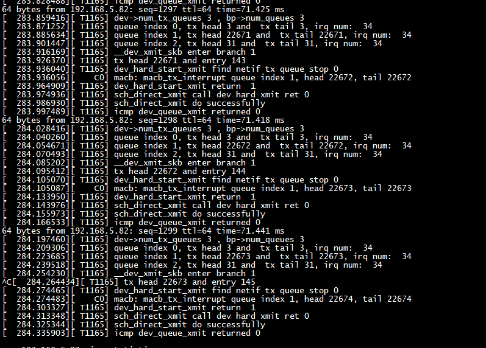

 #  support  CONFIG_NET_EGRESS CONFIG_NET_CLS_ACT
 ```
 root@ubuntu:~ /linux-5.14.12# grep CONFIG_NET_EGRESS .config
CONFIG_NET_EGRESS=y
root@ubuntu:~ /linux-5.14.12# grep  CONFIG_NET_CLS_ACT  .config
CONFIG_NET_CLS_ACT=y
root@ubuntu:~ /linux-5.14.12# 
 ```
 
 # ping_dbg
 
 ping_dbg can processes arp
 
 # icmp_dbp

 
 
 ## debug nic hardware
 
 ```
 static int dbg_hardware_queue_common_info(struct net_device *dev,unsigned int queue_index)
{

        struct macb *bp = netdev_priv(dev);
        struct macb_queue *queue = &bp->queues[queue_index];
        pr_info("queue index %u, tx head %u and  tx tail %u, irq num:  %d \n", queue_index, queue->tx_head, queue->tx_tail, queue->irq);
	return 0;
}
static int dbg_hardware_queue_info(struct net_device *dev,unsigned int queue_index)
{

        struct macb *bp = netdev_priv(dev);
        struct macb_queue *queue = &bp->queues[queue_index];
	if (CIRC_SPACE(queue->tx_head, queue->tx_tail, bp->tx_ring_size) < 1)
	{
	     pr_info("dma desc is no available, tx head %u and  tx tail %u \n", queue->tx_head, queue->tx_tail);
	}
	if(__netif_subqueue_stopped(bp->dev, queue_index))
	{
	     pr_info("netif subqueue stopped \n");
	}
	return 0;
}
static void dbg_netif_tx_queues(struct net_device *dev)
{
	unsigned int i;
        struct macb *bp = netdev_priv(dev);
	pr_info("dev->num_tx_queues %u , bp->num_queues %u \n", dev->num_tx_queues,  bp->num_queues);
	for (i = 0; i < dev->num_tx_queues; i++) {
             struct netdev_queue *txq = netdev_get_tx_queue(dev, i);
	     dbg_hardware_queue_common_info(dev, i);
	     //if(netif_xmit_frozen_or_stopped(txq))
	     //if(test_bit(QUEUE_STATE_ANY_XOFF, &txq->state))
	     // dev_queue->state & QUEUE_STATE_ANY_XOFF
	     //if(netif_xmit_stopped(txq))
	     if(test_bit(__QUEUE_STATE_DRV_XOFF, &txq->state))
	     {
		    pr_info(" netif queue %u  stopped by drv \n", i );
		    dbg_hardware_queue_info(dev, i);
	     }

	     if(test_bit(__QUEUE_STATE_STACK_XOFF, &txq->state))
	     {
		    pr_info(" netif queue %u  stopped by stack \n", i );
	     }
	     if(test_bit(__QUEUE_STATE_FROZEN, &txq->state))
	     {
		    pr_info(" netif queue %u  frozen \n", i );
#if 0
		    clear_bit(__QUEUE_STATE_FROZEN, &txq->state);
		    netif_schedule_queue(txq);
#endif
	     }
	}
}
 ```
 
 