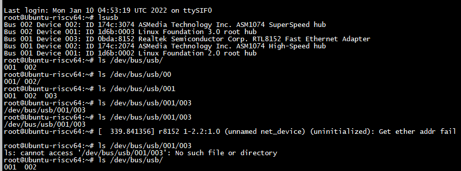
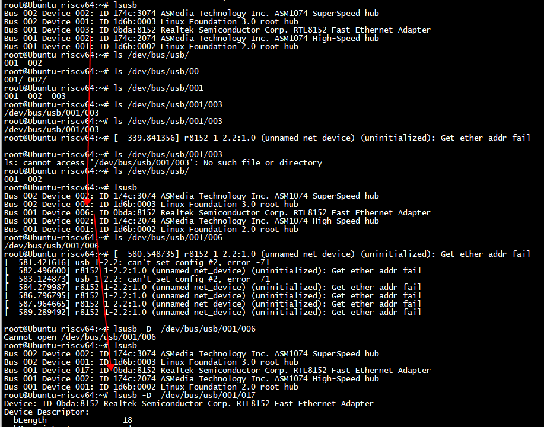

# lsusb

```
[root@riscv]:~$:lsusb
Bus 001 Device 001: ID 1d6b:0002
Bus 002 Device 001: ID 1d6b:0002
[root@riscv]:~$:
```




给usb插上网线    



"Bus 001 Device 017" 的deviceid 变了 ，"Bus 001 Device 017"

```Shell
root@Ubuntu-riscv64:~# lsusb -D  /dev/bus/usb/001/017
Device: ID 0bda:8152 Realtek Semiconductor Corp. RTL8152 Fast Ethernet Adapter
Device Descriptor:
  bLength                18
  bDescriptorType         1
  bcdUSB               2.10
  bDeviceClass            0 
  bDeviceSubClass         0 
  bDeviceProtocol         0 
  bMaxPacketSize0        64
```